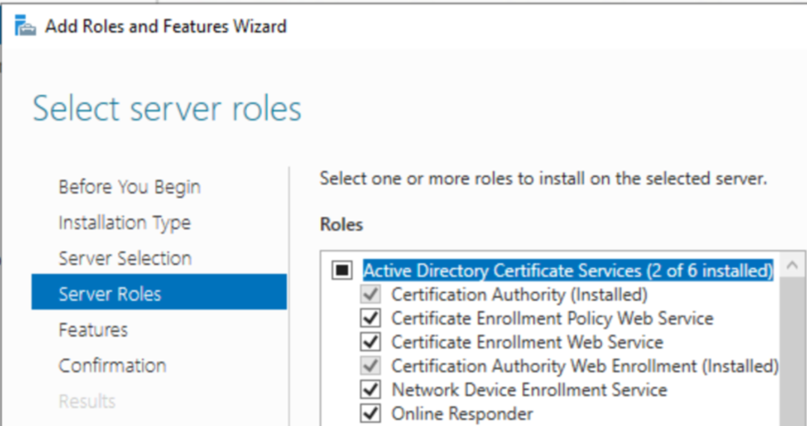
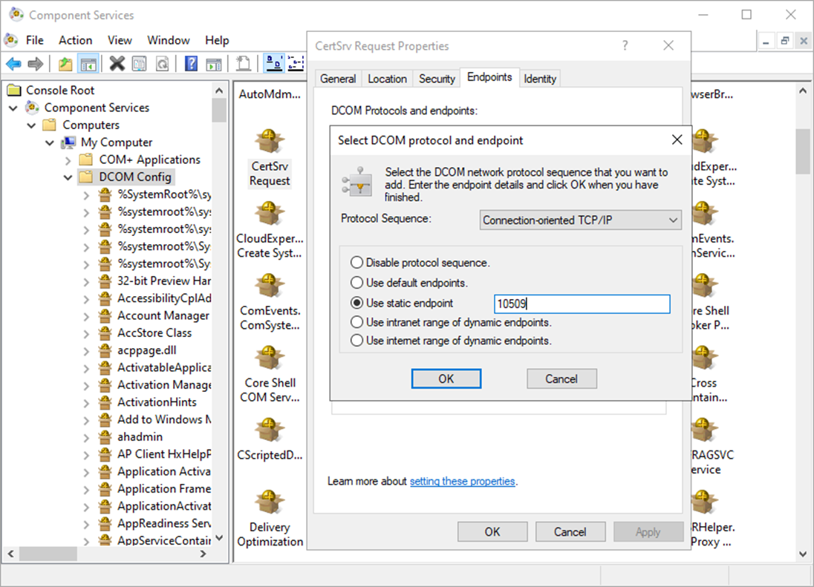
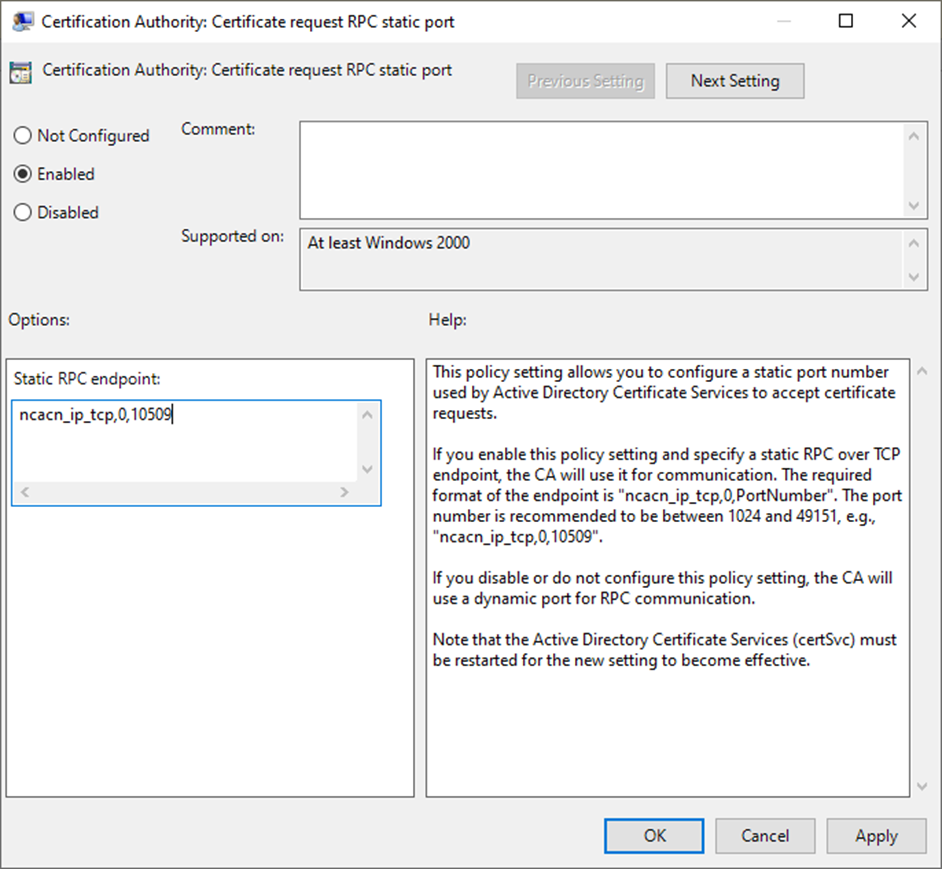

# Certification Authority Firewall

## Change History {.unnumbered}

| Date         | Version | Author                        | Description                                                                 |
|--------------|--------:|----------------|-----------------------------------------------------------------------------|
| 2025-03-26   | 0.1     | M. Grafnetter | Initial version.                                                               |

Script files referenced by this document are versioned independently:

| Script file name                | Latest version |
|---------------------------------|---------------:|
| `Set-ADCSFirewallPolicy.ps1`    |            1.0 |
| `CustomRules.Sample.ps1`        |            1.0 |
| `Undo-ADCSFirewallPolicy.bat`   |            1.0 |
| `Update-ADCSFirewallPolicy.bat` |            1.0 |

## Glossary {.unnumbered}

| Abbreviation | Explanation                                           |
|--------------|-------------------------------------------------------|
| ADCS         | [Active Directory Certificate Services]               |
| AD           | Active Directory (Domain Services)                    |
| GPO          | Group Policy Object                                   |
| PS           | [PowerShell]                                          |
| T0 / Tier 0  | Control plane of your environment – see [Admin Model] |
| PAW          | [Privileged Access Workstation]                       |
| FW           | Firewall                                              |
| ASR          | [Attack Surface Reduction]                            |
| WMI          | Windows Management Instrumentation                    |
| RPC          | [Remote Procedure Call]                               |
| DCOM         | Distributed Component Object Model                    |
| SMB          | Server Message Block                                  |
| TCP          | Transmission Control Protocol                         |
| UDP          | User Datagram Protocol                                |
| RSAT         | [Remote Server Administration Tools]                  |
| ICMP         | Internet Control Message Protocol                     |
| DHCP         | Dynamic Host Configuration Protocol                   |
| LLMNR        | [Link-Local Multicast Name Resolution]                |
| mDNS         | Multicast DNS                                         |
| OS           | Operating System                                      |
| UI           | User Interface                                        |
| MITM         | Man-in-the-middle or on-path attack                   |

[Admin Model]: https://petri.com/use-microsofts-active-directory-tier-administrative-model/
[Privileged Access Workstation]: https://learn.microsoft.com/en-us/security/privileged-access-workstations/privileged-access-devices
[Attack Surface Reduction]: https://learn.microsoft.com/en-us/microsoft-365/security/defender-endpoint/overview-attack-surface-reduction?view=o365-worldwide
[Remote Procedure Call]: https://learn.microsoft.com/en-us/windows/win32/rpc/rpc-start-page
[PowerShell]: https://learn.microsoft.com/en-us/powershell/
[Remote Server Administration Tools]: https://learn.microsoft.com/en-us/troubleshoot/windows-server/system-management-components/remote-server-administration-tools
[Link-Local Multicast Name Resolution]: https://www.rfc-editor.org/rfc/rfc4795.html

## Summary

## About the Authors

{ width=150pt align=left }

[Michael Grafnetter](https://en.linkedin.com/in/grafnetter)
is a [Microsoft MVP](https://mvp.microsoft.com/en-us/PublicProfile/5001919?fullName=Michael%20Grafnetter)
and expert on Windows security and PowerShell.
He is best known for inventing the [Shadow Credentials](https://medium.com/@NightFox007/exploiting-and-detecting-shadow-credentials-and-msds-keycredentiallink-in-active-directory-9268a587d204)
attack primitive and creating the [Directory Services Internals (DSInternals)](https://github.com/MichaelGrafnetter/DSInternals)
PowerShell module.
He is also the author of the [Delinea Weak Password Finder](https://delinea.com/resources/weak-password-finder-tool-active-directory)
(formerly Thycotic) and the [DSInternals.Passkeys](https://github.com/MichaelGrafnetter/webauthn-interop) PowerShell module.

Michael enjoys sharing his knowledge during Active Directory security assessments,
workshops, and tech talks. He presented his [security research](https://www.dsinternals.com/en/projects/)
at many international conferences, including [Black Hat Europe](https://www.blackhat.com/eu-19/speakers/Michael-Grafnetter.html),
[BSides Lisbon](https://bsideslisbon.org/2019/speakers/#michaelgrafnetterWorkshop),
[HipConf New York](https://www.youtube.com/playlist?list=PLDHg9RSgIEmMyz1eN2Je1HjTDhBjRpJP4),
[SecTor Canada](https://www.blackhat.com/sector/),
and [TROOPERS](https://troopers.de/).

{ width=150pt align=right }

[Pavel Formanek](https://en.linkedin.com/in/pavel-formanek-9861397)
is the CTO and co-founder of [Cloudi Support](https://www.cloudi.cz),
which helps customers to secure their infrastructure, both on-prem and in the cloud.
Prior to founding the company, Pavel worked many years at Microsoft as a Premier Field Engineer (PFE),
responsible for security assessments and healthchecks of the largest EMEA Microsoft customers.
He also created and delivered dozens of training sessions over the years.

## Windows PKI Ports







TODO: Registry

### CA

### NDES

### Web

## TODO

```cmd
# Disable ICertPassage RPC
certutil.exe -setreg ca\interfaceflags +IF_NORPCICERTREQUEST

# Disable remote CSRA
certutil.exe -setreg ca\interfaceflags +IF_NOREMOTEICERTADMIN

# Restart the CA
net.exe stop certsvc && net.exe start certsvc
```
