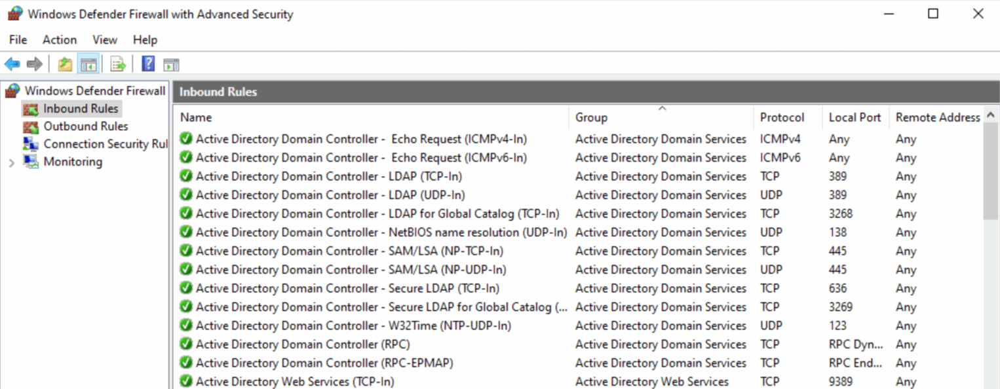

# Active Directory Firewall

## Introduction

This project aims to provide production-ready guidelines on configuring the Windows Firewall for all Active Directory-related roles.

Only the [Active Directory Domain Services (Domain Controller)](ADDS/README.md) role is currently available.

## References

### Active Directory Domain Services

- [How to configure a firewall for Active Directory domains and trusts](https://learn.microsoft.com/en-us/troubleshoot/windows-server/active-directory/config-firewall-for-ad-domains-and-trusts)
- [Service overview and network port requirements for Windows](https://learn.microsoft.com/en-us/troubleshoot/windows-server/networking/service-overview-and-network-port-requirements)

### Active Directory Certificate Services

- [Firewall Rules for Active Directory Certificate Services](https://techcommunity.microsoft.com/t5/core-infrastructure-and-security/firewall-rules-for-active-directory-certificate-services/ba-p/1128612)

### Active Directory Federation Services

- [AD FS Required Ports and Protocols](https://learn.microsoft.com/en-us/windows-server/identity/ad-fs/deployment/best-practices-securing-ad-fs#ports-required)
