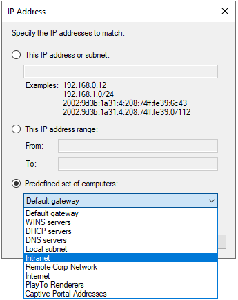

# Active Directory Firewall

## Intro


## Active Directory Domain Services

### References

- [How to configure a firewall for Active Directory domains and trusts](https://learn.microsoft.com/en-us/troubleshoot/windows-server/active-directory/config-firewall-for-ad-domains-and-trusts)
- [Service overview and network port requirements for Windows](https://learn.microsoft.com/en-us/troubleshoot/windows-server/networking/service-overview-and-network-port-requirements)

### Inbound Rules

#### Client Traffic

| <!-- -->    | <!-- --> |
|-------------|----------|
| Name        | **Active Directory Domain Controller - W32Time (NTP-UDP-In)** |
| Group       | Active Directory Domain Services |
| Protocol    | UDP |
| Port        | 123 |
| Program     | `%systemroot%\System32\svchost.exe` |
| Service     | `w32time` |
| Description | Inbound rule for the Active Directory Domain Controller service to allow NTP traffic for the Windows Time service. [UDP 123] |
| Notes       | - |

| <!-- -->    | <!-- --> |
|-------------|----------|
| Name        | **Active Directory Domain Controller (RPC-EPMAP)** |
| Group       | Active Directory Domain Services |
| Protocol    | TCP |
| Port        | 135 |
| Program     | `%systemroot%\system32\svchost.exe` |
| Service     | `rpcss` |
| Description | Inbound rule for the RPCSS service to allow RPC/TCP traffic to the Active Directory Domain Controller service. |
| Notes       | - |

| <!-- -->    | <!-- --> |
|-------------|----------|
| Name        | **Kerberos Key Distribution Center - PCR (UDP-In)** |
| Group       | Kerberos Key Distribution Center |
| Protocol    | UDP |
| Port        | 464 |
| Program     | `%systemroot%\System32\lsass.exe` |
| Description | Inbound rule for the Kerberos Key Distribution Center service to allow for password change requests. [UDP 464] |
| Notes       | - |

| <!-- -->    | <!-- --> |
|-------------|----------|
| Name        | **Kerberos Key Distribution Center - PCR (TCP-In)** |
| Group       | Kerberos Key Distribution Center |
| Protocol    | TCP |
| Port        | 464 |
| Program     | `%systemroot%\System32\lsass.exe` |
| Description | Inbound rule for the Kerberos Key Distribution Center service to allow for password change requests. [TCP 464] |
| Notes       | - |

| <!-- -->    | <!-- --> |
|-------------|----------|
| Name        | **Active Directory Domain Controller (RPC)** |
| Group       | Active Directory Domain Services |
| Protocol    | TCP |
| Port        | RPC |
| Program     | `%systemroot%\System32\lsass.exe` |
| Description | Inbound rule to allow remote RPC/TCP access to the Active Directory Domain Controller service. |
| Notes       | - |

| <!-- -->    | <!-- --> |
|-------------|----------|
| Name        | **Active Directory Domain Controller - LDAP (UDP-In)** |
| Group       | Active Directory Domain Services |
| Protocol    | UDP |
| Port        | 389 |
| Program     | `%systemroot%\System32\lsass.exe` |
| Description | Inbound rule for the Active Directory Domain Controller service to allow remote LDAP traffic. [UDP 389] |
| Notes       | - |

| <!-- -->    | <!-- --> |
|-------------|----------|
| Name        | **Active Directory Domain Controller - LDAP (TCP-In)** |
| Group       | Active Directory Domain Services |
| Protocol    | TCP |
| Port        | 389 |
| Program     | `%systemroot%\System32\lsass.exe` |
| Description | Inbound rule for the Active Directory Domain Controller service to allow remote LDAP traffic. [TCP 389] |
| Notes       | - |

| <!-- -->    | <!-- --> |
|-------------|----------|
| Name        | **Active Directory Domain Controller - Secure LDAP (TCP-In)** |
| Group       | Active Directory Domain Services |
| Protocol    | TCP |
| Port        | 636 |
| Program     | `%systemroot%\System32\lsass.exe` |
| Description | Inbound rule for the Active Directory Domain Controller service to allow remote Secure LDAP traffic. [TCP 636] |
| Notes       | - |

| <!-- -->    | <!-- --> |
|-------------|----------|
| Name        | **Active Directory Domain Controller - LDAP for Global Catalog (TCP-In)** |
| Group       | Active Directory Domain Services |
| Protocol    | TCP |
| Port        | 3268 |
| Program     | `%systemroot%\System32\lsass.exe` |
| Description | Inbound rule for the Active Directory Domain Controller service to allow remote Global Catalog traffic. [TCP 3268] |
| Notes       | - |

| <!-- -->    | <!-- --> |
|-------------|----------|
| Name        | **Active Directory Domain Controller - Secure LDAP for Global Catalog (TCP-In)** |
| Group       | Active Directory Domain Services |
| Protocol    | TCP |
| Port        | 3269 |
| Program     | `%systemroot%\System32\lsass.exe` |
| Description | Inbound rule for the Active Directory Domain Controller service to allow remote Secure Global Catalog traffic. [TCP 3269] |
| Notes       | - |

| <!-- -->    | <!-- --> |
|-------------|----------|
| Name        | **DNS (UDP, Incoming)** |
| Group       | DNS Service |
| Protocol    | UDP |
| Port        | 53 |
| Program     | `%systemroot%\System32\dns.exe` |
| Service     | `dns` |
| Description | Inbound rule to allow remote UDP access to the DNS service. |
| Notes       | - |

| <!-- -->    | <!-- --> |
|-------------|----------|
| Name        | **DNS (TCP, Incoming)** |
| Group       | DNS Service |
| Protocol    | TCP |
| Port        | 53 |
| Program     | `%systemroot%\System32\dns.exe` |
| Service     | `dns` |
| Description | Inbound rule to allow remote TCP access to the DNS service. |
| Notes       | - |

| <!-- -->    | <!-- --> |
|-------------|----------|
| Name        | **Kerberos Key Distribution Center (TCP-In)** |
| Group       | Kerberos Key Distribution Center |
| Protocol    | TCP |
| Port        | 88 |
| Program     | `%systemroot%\System32\lsass.exe` |
| Description | Inbound rule for the Kerberos Key Distribution Center service. [TCP 88] |
| Notes       | - |

| <!-- -->    | <!-- --> |
|-------------|----------|
| Name        | **Kerberos Key Distribution Center (UDP-In)** |
| Group       | Kerberos Key Distribution Center |
| Protocol    | UDP |
| Port        | 88 |
| Program     | `%systemroot%\System32\lsass.exe` |
| Description | Inbound rule for the Kerberos Key Distribution Center service. [UDP 88] |
| Notes       | - |

| <!-- -->    | <!-- --> |
|-------------|----------|
| Name        | **Active Directory Domain Controller - SAM/LSA (NP-UDP-In)** |
| Group       | Active Directory Domain Services |
| Protocol    | UDP |
| Port        | 445 |
| Program     | `System` |
| Description | Inbound rule for the Active Directory Domain Controller service to be remotely managed over Named Pipes. [UDP 445] |
| Notes       | - |

| <!-- -->    | <!-- --> |
|-------------|----------|
| Name        | **Active Directory Domain Controller - SAM/LSA (NP-TCP-In)** |
| Group       | Active Directory Domain Services |
| Protocol    | TCP |
| Port        | 445 |
| Program     | `System` |
| Description | Inbound rule for the Active Directory Domain Controller service to be remotely managed over Named Pipes. [TCP 445] |
| Notes       | - |

| <!-- -->    | <!-- --> |
|-------------|----------|
| Name        | **Active Directory Domain Controller - Echo Request (ICMPv4-In)** |
| Group       | Active Directory Domain Services |
| Protocol    | ICMPv4 |
| ICMP Type   | 8 |
| Program     | `System` |
| Description | Inbound rule for the Active Directory Domain Controller service to allow Echo requests (ping). |
| Notes       | - |

| <!-- -->    | <!-- --> |
|-------------|----------|
| Name        | **Active Directory Domain Controller - Echo Request (ICMPv6-In)** |
| Group       | Active Directory Domain Services |
| Protocol    | ICMPv6 |
| ICMP Type   | 128 |
| Program     | `System` |
| Description | Inbound rule for the Active Directory Domain Controller service to allow Echo requests (ping). |
| Notes       | - |

| <!-- -->    | <!-- --> |
|-------------|----------|
| Name        | **Active Directory Domain Controller - NetBIOS name resolution (UDP-In)** |
| Group       | Active Directory Domain Services |
| Protocol    | UDP |
| Port        | 138 |
| Program     | `System` |
| Description | Inbound rule for the Active Directory Domain Controller service to allow NetBIOS name resolution. [UDP 138] |
| Notes       | - |

| <!-- -->    | <!-- --> |
|-------------|----------|
| Name        | **Core Networking - Destination Unreachable (ICMPv6-In)** |
| Group       | Core Networking |
| Protocol    | ICMPv6 |
| ICMP Type   | 1 |
| Program     | `System` |
| Description | Destination Unreachable error messages are sent from any node that a packet traverses which is unable to forward the packet for any reason except congestion. |
| Notes       | - |

| <!-- -->    | <!-- --> |
|-------------|----------|
| Name        | **Core Networking - Destination Unreachable Fragmentation Needed (ICMPv4-In)** |
| Group       | Core Networking |
| Protocol    | ICMPv4 |
| ICMP Type   | 3:4 |
| Program     | `System` |
| Description | Destination Unreachable Fragmentation Needed error messages are sent from any node that a packet traverses which is unable to forward the packet because fragmentation was needed and the don't fragment bit was set. |
| Notes       | - |

| <!-- -->    | <!-- --> |
|-------------|----------|
| Name        | **Core Networking - Neighbor Discovery Advertisement (ICMPv6-In)** |
| Group       | Core Networking |
| Protocol    | ICMPv6 |
| ICMP Type   | 136 |
| Program     | `System` |
| Description | Neighbor Discovery Advertisement messages are sent by nodes to notify other nodes of link-layer address changes or in response to a Neighbor Discovery Solicitation request. |
| Notes       | - |

| <!-- -->    | <!-- --> |
|-------------|----------|
| Name        | **Core Networking - Neighbor Discovery Solicitation (ICMPv6-In)** |
| Group       | Core Networking |
| Protocol    | ICMPv6 |
| ICMP Type   | 135 |
| Program     | `System` |
| Description | Neighbor Discovery Solicitations are sent by nodes to discover the link-layer address of another on-link IPv6 node. |
| Notes       | - |

| <!-- -->    | <!-- --> |
|-------------|----------|
| Name        | **Core Networking - Packet Too Big (ICMPv6-In)** |
| Group       | Core Networking |
| Protocol    | ICMPv6 |
| ICMP Type   | 2 |
| Program     | `System` |
| Description | Packet Too Big error messages are sent from any node that a packet traverses which is unable to forward the packet because the packet is too large for the next link. |
| Notes       | - |

| <!-- -->    | <!-- --> |
|-------------|----------|
| Name        | **Core Networking - Parameter Problem (ICMPv6-In)** |
| Group       | Core Networking |
| Protocol    | ICMPv6 |
| ICMP Type   | 4 |
| Program     | `System` |
| Description | Parameter Problem error messages are sent by nodes as a result of incorrectly generated packets. |
| Notes       | - |

| <!-- -->    | <!-- --> |
|-------------|----------|
| Name        | **Core Networking - Time Exceeded (ICMPv6-In)** |
| Group       | Core Networking |
| Protocol    | ICMPv6 |
| ICMP Type   | 3 |
| Program     | `System` |
| Description | Time Exceeded error messages are generated from any node that a packet traverses if the Hop Limit value is decremented to zero at any point on the path. |
| Notes       | - |

#### Management Traffic

| <!-- -->    | <!-- --> |
|-------------|----------|
| Name        | **Active Directory Web Services (TCP-In)** |
| Group       | Active Directory Web Services |
| Protocol    | TCP |
| Port        | 9389 |
| Program     | `%systemroot%\ADWS\Microsoft.ActiveDirectory.WebServices.exe` |
| Service     | `adws` |
| Description | Inbound rule for the Active Directory Web Services. [TCP] |
| Notes       | - |

| <!-- -->    | <!-- --> |
|-------------|----------|
| Name        | **Windows Remote Management (HTTP-In)** |
| Group       | Windows Remote Management |
| Protocol    | TCP |
| Port        | 5985 |
| Program     | `System` |
| Description | Inbound rule for Windows Remote Management via WS-Management. [TCP 5985] |
| Notes       | - |

| <!-- -->    | <!-- --> |
|-------------|----------|
| Name        | **Windows Management Instrumentation (WMI-In)** |
| Group       | Windows Management Instrumentation (WMI) |
| Protocol    | TCP |
| Port        | Any |
| Program     | `%SystemRoot%\system32\svchost.exe` |
| Service     | `winmgmt` |
| Description | Inbound rule to allow WMI traffic for remote Windows Management Instrumentation. [TCP] |
| Notes       | - |

| <!-- -->    | <!-- --> |
|-------------|----------|
| Name        | **Remote Desktop - User Mode (UDP-In)** |
| Group       | Remote Desktop |
| Protocol    | UDP |
| Port        | 3389 |
| Program     | `%SystemRoot%\system32\svchost.exe` |
| Service     | `termservice` |
| Description | Inbound rule for the Remote Desktop service to allow RDP traffic. [UDP 3389] |
| Notes       | - |

| <!-- -->    | <!-- --> |
|-------------|----------|
| Name        | **Remote Desktop - User Mode (TCP-In)** |
| Group       | Remote Desktop |
| Protocol    | TCP |
| Port        | 3389 |
| Program     | `%SystemRoot%\system32\svchost.exe` |
| Service     | `termservice` |
| Description | Inbound rule for the Remote Desktop service to allow RDP traffic. [TCP 3389] |
| Notes       | - |

| <!-- -->    | <!-- --> |
|-------------|----------|
| Name        | **OpenSSH SSH Server (sshd)** |
| Group       | OpenSSH Server |
| Protocol    | TCP |
| Port        | 22 |
| Program     | `%SystemRoot%\system32\OpenSSH\sshd.exe` |
| Description | Inbound rule for OpenSSH SSH Server (sshd) |
| Notes       | - |

| <!-- -->    | <!-- --> |
|-------------|----------|
| Name        | **DFS Management (TCP-In)** |
| Group       | DFS Management |
| Protocol    | TCP |
| Port        | RPC |
| Program     | `%systemroot%\system32\dfsfrsHost.exe` |
| Description | Inbound rule for DFS Management to allow the DFS Management service to be remotely managed via DCOM. |
| Notes       | - |

| <!-- -->    | <!-- --> |
|-------------|----------|
| Name        | **RPC (TCP, Incoming)** |
| Group       | DNS Service |
| Protocol    | TCP |
| Port        | RPC |
| Program     | `%systemroot%\System32\dns.exe` |
| Service     | `dns` |
| Description | Inbound rule to allow remote RPC/TCP access to the DNS service. |
| Notes       | - |


| <!-- -->    | <!-- --> |
|-------------|----------|
| Name        | **Windows Backup (RPC)** |
| Group       | Windows Backup |
| Protocol    | TCP |
| Port        | RPC |
| Program     | `%systemroot%\system32\wbengine.exe` |
| Service     | `wbengine` |
| Description | Inbound rule for the Windows Backup Service to be remotely managed via RPC/TCP |
| Notes       | - |

| <!-- -->    | <!-- --> |
|-------------|----------|
| Name        | **DFS Management (TCP-In)** |
| Group       | DFS Management |
| Protocol    | TCP |
| Port        | RPC |
| Program     | `%systemroot%\system32\dfsfrsHost.exe` |
| Description | Inbound rule for DFS Management to allow the DFS Management service to be remotely managed via DCOM. |
| Notes       | - |

| <!-- -->    | <!-- --> |
|-------------|----------|
| Name        | **Performance Logs and Alerts (TCP-In)** |
| Group       | Performance Logs and Alerts |
| Protocol    | TCP |
| Port        | Any |
| Program     | `%systemroot%\system32\plasrv.exe` |
| Description | Inbound rule for Performance Logs and Alerts traffic. [TCP-In] |
| Notes       | - |

| <!-- -->    | <!-- --> |
|-------------|----------|
| Name        | **Remote Event Log Management (RPC)** |
| Group       | Remote Event Log Management |
| Protocol    | TCP |
| Port        | RPC |
| Program     | `%SystemRoot%\system32\svchost.exe` |
| Service     | `Eventlog` |
| Description | Inbound rule for the local Event Log service to be remotely managed via RPC/TCP. |
| Notes       | - |

| <!-- -->    | <!-- --> |
|-------------|----------|
| Name        | **Remote Scheduled Tasks Management (RPC)** |
| Group       | Remote Scheduled Tasks Management |
| Protocol    | TCP |
| Port        | RPC |
| Program     | `%SystemRoot%\system32\svchost.exe` |
| Service     | `schedule` |
| Description | Inbound rule for the Task Scheduler service to be remotely managed via RPC/TCP. |
| Notes       | - |

| <!-- -->    | <!-- --> |
|-------------|----------|
| Name        | **Remote Service Management (RPC)** |
| Group       | Remote Service Management |
| Protocol    | TCP |
| Port        | RPC |
| Program     | `%SystemRoot%\system32\services.exe` |
| Description | Inbound rule for the local Service Control Manager to be remotely managed via RPC/TCP. |
| Notes       | - |

| <!-- -->    | <!-- --> |
|-------------|----------|
| Name        | **Remote Volume Management - Virtual Disk Service (RPC)** |
| Group       | Remote Volume Management |
| Protocol    | TCP |
| Port        | RPC |
| Program     | `%SystemRoot%\system32\vds.exe` |
| Service     | `vds` |
| Description | Inbound rule for the Remote Volume Management - Virtual Disk Service to be remotely managed via RPC/TCP. |
| Notes       | - |

| <!-- -->    | <!-- --> |
|-------------|----------|
| Name        | **Remote Volume Management - Virtual Disk Service Loader (RPC)** |
| Group       | Remote Volume Management |
| Protocol    | TCP |
| Port        | RPC |
| Program     | `%SystemRoot%\system32\vdsldr.exe` |
| Description | Inbound rule for the Remote Volume Management - Virtual Disk Service Loader to be remotely managed via RPC/TCP. |
| Notes       | - |

#### DC Replication Traffic

| <!-- -->    | <!-- --> |
|-------------|----------|
| Name        | **DFS Replication (RPC-In)** |
| Group       | DFS Replication |
| Protocol    | TCP |
| Port        | RPC |
| Program     | `%SystemRoot%\system32\dfsrs.exe` |
| Service     | `Dfsr` |
| Description | Inbound rule to allow DFS Replication RPC traffic. |
| Notes       | - |

| <!-- -->    | <!-- --> |
|-------------|----------|
| Name        | **File Replication (RPC)** |
| Group       | File Replication |
| Protocol    | TCP |
| Port        | RPC |
| Program     | `%SystemRoot%\system32\NTFRS.exe` |
| Service     | `NTFRS` |
| Description | Inbound rule to allow File Replication RPC traffic. |
| Notes       | - |

### Outbound Rules

| <!-- -->    | <!-- --> |
|-------------|----------|
| Name        | **Active Directory Domain Controller -  Echo Request (ICMPv4-Out)** |
| Group       | Active Directory Domain Services |
| Protocol    | ICMPv4 |
| ICMP Type   | 8 |
| Program     | `System` |
| Description | Outbound rule for the Active Directory Domain Controller service to allow Echo requests (ping). |
| Notes       | - |

| <!-- -->    | <!-- --> |
|-------------|----------|
| Name        | **Active Directory Domain Controller -  Echo Request (ICMPv6-Out)** |
| Group       | Active Directory Domain Services |
| Protocol    | ICMPv6 |
| ICMP Type   | 128 |
| Program     | `System` |

| Description | Outbound rule for the Active Directory Domain Controller service to allow Echo requests (ping). |
| Notes       | - |

| <!-- -->    | <!-- --> |
|-------------|----------|
| Name        | **Active Directory Domain Controller (TCP-Out)** |
| Group       | Active Directory Domain Services |
| Protocol    | TCP |
| Port        | Any |
| Program     | `%systemroot%\System32\lsass.exe` |
| Description | Outbound rule for the Active Directory Domain Controller service. [TCP] |
| Notes       | - |

| <!-- -->    | <!-- --> |
|-------------|----------|
| Name        | **Active Directory Domain Controller (UDP-Out)** |
| Group       | Active Directory Domain Services |
| Protocol    | UDP |
| Port        | Any |
| Program     | `%systemroot%\System32\lsass.exe` |
| Description | Outbound rule for the Active Directory Domain Controller service. [UDP] |
| Notes       | - |

| <!-- -->    | <!-- --> |
|-------------|----------|
| Name        | **Active Directory Web Services (TCP-Out)** |
| Group       | Active Directory Web Services |
| Protocol    | TCP |
| Port        | Any |
| Program     | `%systemroot%\ADWS\Microsoft.ActiveDirectory.WebServices.exe` |
| Service     | `adws` |
| Description | Outbound rule for the Active Directory Web Services. [TCP] |
| Notes       | - |

| <!-- -->    | <!-- --> |
|-------------|----------|
| Name        | **Core Networking - DNS (UDP-Out)** |
| Group       | Core Networking |
| Protocol    | UDP |
| Port        | 53 |
| Program     | `%SystemRoot%\system32\svchost.exe` |
| Service     | `dnscache` |
| Description | Outbound rule to allow DNS requests. DNS responses based on requests that matched this rule will be permitted regardless of source address.  This behavior is classified as loose source mapping. [LSM] [UDP 53] |
| Notes       | - |

| <!-- -->    | <!-- --> |
|-------------|----------|
| Name        | **Core Networking - Group Policy (NP-Out)** |
| Group       | Core Networking |
| Protocol    | TCP |
| Port        | 445 |
| Program     | `System` |
| Description | Core Networking - Group Policy (NP-Out) |
| Notes       | - |

| <!-- -->    | <!-- --> |
|-------------|----------|
| Name        | **Core Networking - Group Policy (TCP-Out)** |
| Group       | Core Networking |
| Protocol    | TCP |
| Port        | Any |
| Program     | `%SystemRoot%\system32\svchost.exe` |
| Service     | `gpsvc` |
| Description | Outbound rule to allow remote RPC traffic for Group Policy updates. [TCP] |
| Notes       | - |

| <!-- -->    | <!-- --> |
|-------------|----------|
| Name        | **Core Networking - Neighbor Discovery Advertisement (ICMPv6-Out)** |
| Group       | Core Networking |
| Protocol    | ICMPv6 |
| ICMP Type   | 136 |
| Program     | `System` |
| Description | Neighbor Discovery Advertisement messages are sent by nodes to notify other nodes of link-layer address changes or in response to a Neighbor Discovery Solicitation request. |
| Notes       | - |

| <!-- -->    | <!-- --> |
|-------------|----------|
| Name        | **Core Networking - Neighbor Discovery Solicitation (ICMPv6-Out)** |
| Group       | Core Networking |
| Protocol    | ICMPv6 |
| ICMP Type   | 135 |
| Program     | `System` |
| Description | Neighbor Discovery Solicitations are sent by nodes to discover the link-layer address of another on-link IPv6 node. |
| Notes       | - |

| <!-- -->    | <!-- --> |
|-------------|----------|
| Name        | **Core Networking - Packet Too Big (ICMPv6-Out)** |
| Group       | Core Networking |
| Protocol    | ICMPv6 |
| ICMP Type   | 2 |
| Program     | `System` |
| Description | Packet Too Big error messages are sent from any node that a packet traverses which is unable to forward the packet because the packet is too large for the next link. |
| Notes       | - |

| <!-- -->    | <!-- --> |
|-------------|----------|
| Name        | **Core Networking - Parameter Problem (ICMPv6-Out)** |
| Group       | Core Networking |
| Protocol    | ICMPv6 |
| ICMP Type   | 4 |
| Program     | `System` |
| Description | Parameter Problem error messages are sent by nodes as a result of incorrectly generated packets. |
| Notes       | - |

| <!-- -->    | <!-- --> |
|-------------|----------|
| Name        | **Core Networking - Time Exceeded (ICMPv6-Out)** |
| Group       | Core Networking |
| Protocol    | ICMPv6 |
| ICMP Type   | 3 |
| Program     | `System` |
| Description | Time Exceeded error messages are generated from any node that a packet traverses if the Hop Limit value is decremented to zero at any point on the path. |
| Notes       | - |

| <!-- -->    | <!-- --> |
|-------------|----------|
| Name        | **All Outgoing (TCP)** |
| Group       | DNS Service |
| Protocol    | TCP |
| Port        | Any |
| Program     | `%systemroot%\System32\dns.exe` |
| Service     | `dns` |
| Description | Outbound rule to allow all TCP traffic from the DNS service. |
| Notes       | - |

| <!-- -->    | <!-- --> |
|-------------|----------|
| Name        | **All Outgoing (UDP)** |
| Group       | DNS Service |
| Protocol    | UDP |
| Port        | Any |
| Program     | `%systemroot%\System32\dns.exe` |
| Service     | `dns` |
| Description | Outbound rule to allow all UDP traffic from the DNS service. |
| Notes       | - |

| <!-- -->    | <!-- --> |
|-------------|----------|
| Name        | **File and Printer Sharing (NB-Datagram-Out)** |
| Group       | File and Printer Sharing |
| Protocol    | UDP |
| Port        | 138 |
| Program     | `System` |
| Description | Outbound rule for File and Printer Sharing to allow NetBIOS Datagram transmission and reception. [UDP 138] |
| Notes       | - |

| <!-- -->    | <!-- --> |
|-------------|----------|
| Name        | **File and Printer Sharing (NB-Name-Out)** |
| Group       | File and Printer Sharing |
| Protocol    | UDP |
| Port        | 137 |
| Program     | `System` |
| Description | Outbound rule for File and Printer Sharing to allow NetBIOS Name Resolution. [UDP 137] |
| Notes       | - |

| <!-- -->    | <!-- --> |
|-------------|----------|
| Name        | **File and Printer Sharing (NB-Session-Out)** |
| Group       | File and Printer Sharing |
| Protocol    | TCP |
| Port        | 139 |
| Program     | `System` |
| Description | Outbound rule for File and Printer Sharing to allow NetBIOS Session Service connections. [TCP 139] |
| Notes       | - |

| <!-- -->    | <!-- --> |
|-------------|----------|
| Name        | **Windows Management Instrumentation (WMI-Out)** |
| Group       | Windows Management Instrumentation (WMI) |
| Protocol    | TCP |
| Port        | Any |
| Program     | `%SystemRoot%\system32\svchost.exe` |
| Service     | `winmgmt` |
| Description | Outbound rule to allow WMI traffic for remote Windows Management Instrumentation. [TCP] |
| Notes       | - |

| <!-- -->    | <!-- --> |
|-------------|----------|
| Name        | **iSCSI Service (TCP-Out)** |
| Group       | iSCSI Service |
| Protocol    | TCP |
| Port        | Any |
| Program     | `%SystemRoot%\system32\svchost.exe` |
| Service     | `Msiscsi` |
| Description | Outbound rule for the iSCSI Service to allow communications with an iSCSI server or device. [TCP] |
| Notes       | - |

### Issues

#### Services with User Impersonation

- Windows Update (wuauserv)
- Cryptographic Services (CryptSvc)
- Microsoft Account Sign-in Assistant (wlidsvc)
- Background Intelligent Transfer Service(BITS)

#### Dynamic Keywords

https://learn.microsoft.com/en-us/windows/security/operating-system-security/network-security/windows-firewall/dynamic-keywords

#### taskhostw.exe


#### Azure Arc

PowerShell, msiexec


Any process


#### Predefined Address Sets



- Internet
- Intranet
- DNS Servers

#### Proxy


#### Log File Not Created


```bat
netsh advfirewall set allprofiles logging filename "%systemroot%\system32\logfiles\firewall\pfirewall.log"
```

### Static RPC Ports

- [How to restrict Active Directory RPC traffic to a specific port](https://learn.microsoft.com/en-us/troubleshoot/windows-server/active-directory/restrict-ad-rpc-traffic-to-specific-port)
- [Configuring DFSR to a Static Port - The rest of the story](https://techcommunity.microsoft.com/t5/ask-the-directory-services-team/configuring-dfsr-to-a-static-port-the-rest-of-the-story/ba-p/396746)
- [Setting Up a Fixed Port for WMI](https://learn.microsoft.com/en-us/windows/win32/wmisdk/setting-up-a-fixed-port-for-wmi)

### RPC Filters 

#### References

- [MSRPC-To-ATT&CK](https://github.com/jsecurity101/MSRPC-to-ATTACK)
- [A Definitive Guide to the Remote Procedure Call (RPC) Filter](https://www.akamai.com/blog/security/guide-rpc-filter#using)
- [server22_rpc_servers_scrape.csv](https://github.com/akamai/akamai-security-research/blob/main/rpc_toolkit/rpc_interface_lists/server22_rpc_servers_scrape.csv)

## Active Directory Certificate Services

- [Firewall Rules for Active Directory Certificate Services](https://techcommunity.microsoft.com/t5/core-infrastructure-and-security/firewall-rules-for-active-directory-certificate-services/ba-p/1128612)

## Active Directory Federation Services

- [AD FS Required Ports and Protocols](https://learn.microsoft.com/en-us/windows-server/identity/ad-fs/deployment/best-practices-securing-ad-fs#ports-required)
